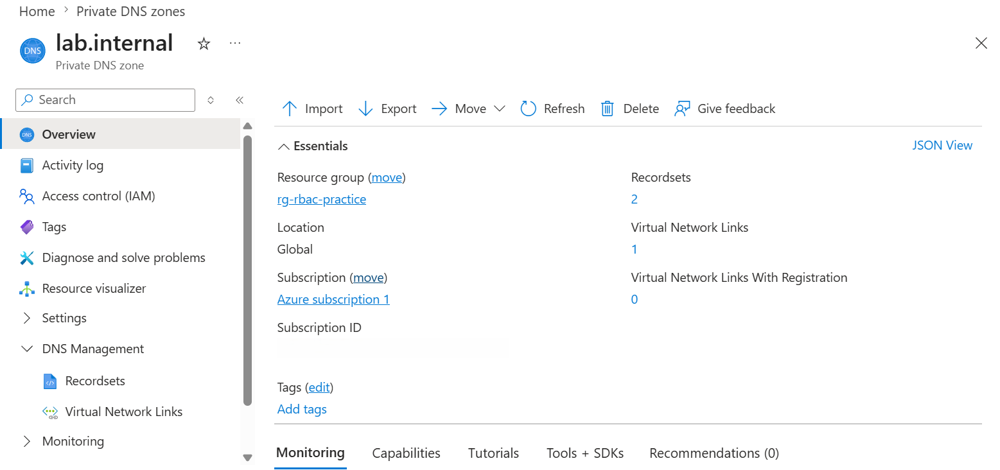
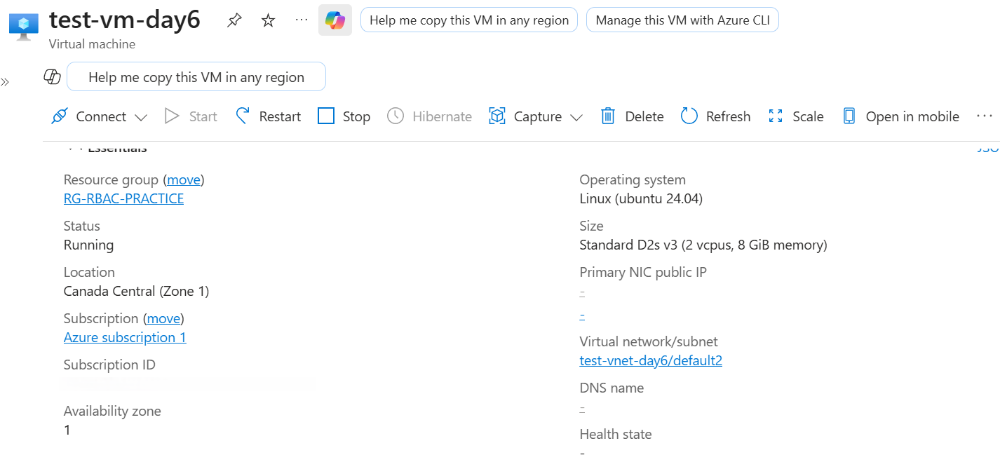
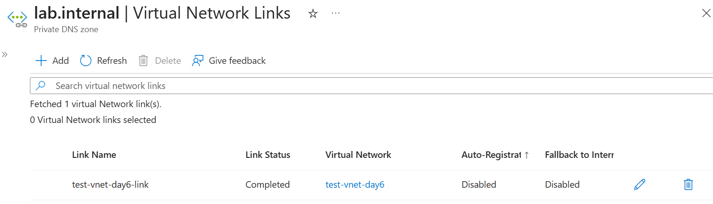
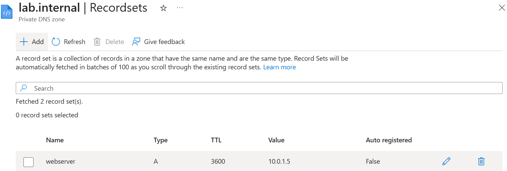
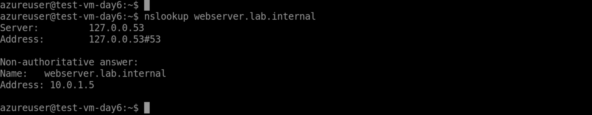
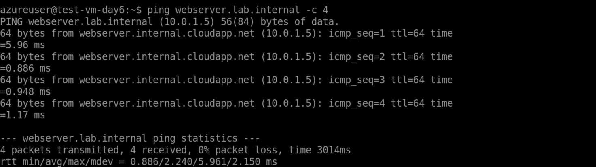
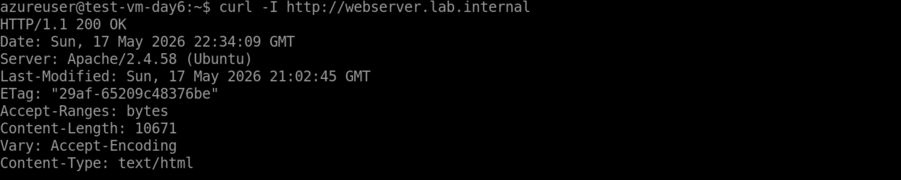

# 📘 Day 06 — Azure Private DNS & Internal Name Resolution

## 🔍 Overview
In this challenge, I implemented internal name resolution using Azure Private DNS Zones. I configured a custom DNS zone, linked it to a virtual network (Auto-registration disabled), created a manual A record, and validated DNS, network, and application connectivity end-to-end.

This demonstrates how internal Azure services securely discover and communicate with each other.

---

## 🧰 Tools & Diagnostics Used
- Azure Portal (configuration)
- Azure Virtual Machines (Linux)
- Azure Private DNS Zones
- SSH (remote access)
- nslookup (DNS testing)
- ping (network validation)
- curl (application layer validation)

---

## 🧪 Steps Completed
This setup simulates an internal service discovery scenario where a VM resolves and connects to an internal web server using private DNS.

### 1. Create the Private DNS Zone (lab.internal)
Created a Private DNS Zone named **lab.internal** to host internal DNS records.

### 2. Deploy test-vm-day6 for validation
Deployed a Linux VM named **test-vm-day6** inside the VNet to validate DNS, connectivity, and HTTP response.

### 3. Create the VNet Link (Auto-registration Disabled)
Linked the VNet to the DNS zone using **test-vnet-day6-link** with Auto-registration **disabled** to maintain manual control.

### 4. Create the A Record (webserver → 10.0.1.5)
Manually created an **A** record named **webserver** pointing to **10.0.1.5**.

### 5. Validate DNS Resolution (nslookup)
Confirmed **webserver.lab.internal → 10.0.1.5** resolved correctly.

### 6. Validate Connectivity (ping)
Verified network connectivity with **0% packet loss**.

### 7. Validate HTTP Response (curl -I)
Confirmed the webserver returned **HTTP/1.1 200 OK**.

---

## 🔄 Before & After Comparison

### Before
- No Private DNS Zone existed  
- No custom DNS integration in the VNet  
- `webserver.lab.internal` did not resolve  
- Relied only on Azure default DNS  

### After
- Private DNS Zone created and linked to VNet  
- Manual DNS records fully controlled  
- VM successfully resolved and accessed webserver  
- Internal DNS became consistent and predictable  

---

## ✔️ Validation Summary

### DNS Layer
- `nslookup` returned correct IP (10.0.1.5)

### Network Layer
- `ping` showed 0% packet loss

### Application Layer
- `curl -I` returned **HTTP/1.1 200 OK**

---

## 🛠 Troubleshooting Insights

### DNS Resolution Issues
Missing A records or incorrect VNet linking can prevent resolution.  
Azure uses the internal DNS resolver **168.63.129.16**, so proper linking is critical.

### Connectivity Problems
If DNS works but connectivity fails, check NSGs, routing, or subnet configuration.

### Webserver Issues
If DNS and network succeed but HTTP fails, verify the webserver is running and ports are open.

### Outcome
Validated each layer (DNS → Network → Application) to ensure reliable internal name resolution.

---

## 🌐 Why This Matters
Private DNS Zones are essential for:

- Internal APIs and microservices  
- Hybrid networking  
- Service discovery  
- Secure internal-only applications  

They underpin service-to-service communication and are critical for troubleshooting and governance in cloud environments.

---

## 🎓 What I Learned
- Private DNS Zones require proper VNet linking to function correctly  
- Validating DNS, network, and application layers prevents misdiagnosis  
- Azure’s internal DNS resolver (168.63.129.16) is key to name resolution  
- Structured troubleshooting improves reliability and speed  

---

## 📸 Screenshots

  
  
  
  
  
  


---

## 📜 Commands Used
```bash
nslookup webserver.lab.internal
ping webserver.lab.internal -c 4
curl -I http://webserver.lab.internal
```

---

## 🧩 Sample Output

```text
nslookup
Name: webserver.lab.internal
Address: 10.0.1.5

ping summary
4 packets transmitted, 4 received, 0% packet loss

curl -I
HTTP/1.1 200 OK
Server: Apache/2.4.58 (Ubuntu)
Content-Type: text/html
```

---

## 🔑 Key Takeaway
Private DNS Zones enable secure, reliable internal name resolution, and disabling auto-registration provides full control over DNS records.
