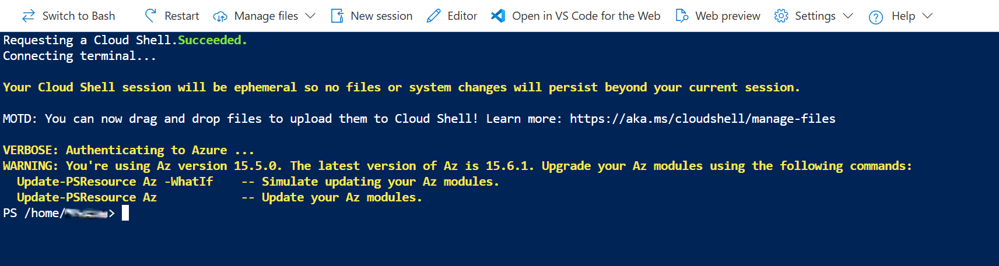
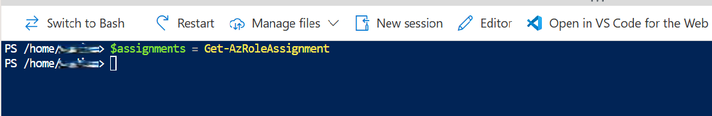
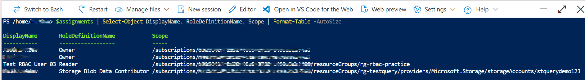
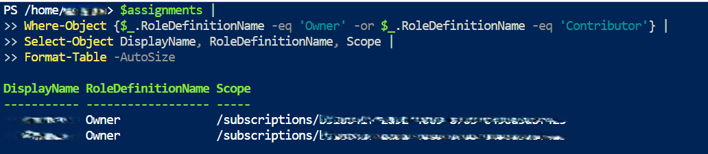
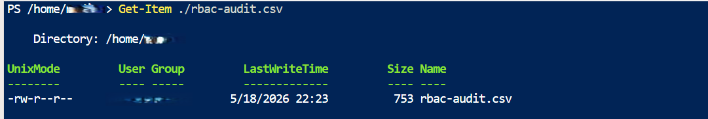
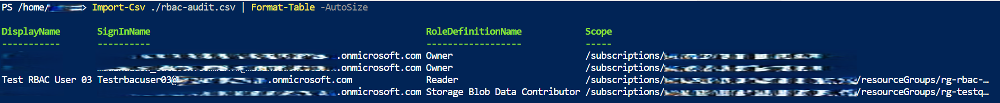

# 🚀 Day 07 — Azure RBAC Audit Using PowerShell  
**Azure 100 Days of Cloud Challenge — Ali Aden**

---

## 📌 Overview  
Today’s task focused on performing a full Azure RBAC audit using PowerShell in Cloud Shell.  

This simulates a real-world security workflow used to identify high-privilege accounts, validate access, and generate audit reports for governance.

---

## 🛠 Tools Used  
- Azure Cloud Shell (PowerShell)  
- Azure PowerShell Az Module  
- Azure RBAC (Role-Based Access Control)  
- CSV export for reporting  

---

## 🧩 Steps Completed  

### 1. Open Cloud Shell  
Connected to Azure Cloud Shell and confirmed PowerShell environment.

### 2. Collect RBAC Assignments  
Stored all RBAC assignments in a variable.

### 3. Display Full RBAC Table  
Displayed DisplayName, RoleDefinitionName, and Scope.

### 4. Filter High-Privilege Roles  
Filtered results for **Owner** and **Contributor** roles.

### 5. Export to CSV  
Exported full dataset to `rbac-audit.csv` and verified output.

---

## 🔄 Before & After  

### Before  
- No visibility into access  
- No audit output  
- No automation  
- No filtering of high-privilege roles  

### After  
- Full RBAC dataset collected  
- High-privilege roles identified  
- CSV audit report created  
- Repeatable PowerShell workflow built  

---

## ✅ Validation  

- RBAC assignments successfully retrieved  
- Table output displayed correctly  
- High-privilege roles filtered  
- CSV file created with data  
- CSV preview confirmed correct structure  

---

## 🧠 Skills Demonstrated  
- Azure RBAC auditing  
- PowerShell automation (Az module)  
- Access control and privilege analysis  
- Filtering and querying Azure data  
- CSV export for reporting and governance  

---

## 🛠 Troubleshooting  

### No Output After Variable Assignment  
Expected behaviour — data stored in variable only.

### Empty CSV File  
Ensure `$assignments` contains data before exporting.

### Sensitive Data Exposure  
Blur subscription IDs, emails, and user identifiers in screenshots.

---

## 🔐 Why This Matters  

RBAC auditing is critical for:

- Identifying excessive permissions  
- Enforcing least privilege  
- Supporting compliance and governance  
- Reducing security risks  

This is a core task for Azure administrators and security engineers.

---

## 🧠 What I Learned  
- How to audit RBAC using PowerShell  
- How to filter high-privilege roles  
- How to export and validate audit data  
- How to document a security workflow  

---

## 📸 Screenshots  

  
  
  
  
  
  

---

## 💻 Commands Used  

### Collect RBAC Assignments
```powershell
$assignments = Get-AzRoleAssignment
```

### Display Full RBAC Table
```powershell
$assignments |
Select-Object DisplayName, RoleDefinitionName, Scope |
Format-Table -AutoSize
```

### Filter Owner & Contributor
```powershell
$assignments |
Where-Object {$_.RoleDefinitionName -eq 'Owner' -or $_.RoleDefinitionName -eq 'Contributor'} |
Select-Object DisplayName, RoleDefinitionName, Scope |
Format-Table -AutoSize
```

### Export to CSV
```powershell
$assignments |
Select-Object DisplayName, SignInName, RoleDefinitionName, Scope |
Export-Csv -Path ./rbac-audit.csv -NoTypeInformation
```

### Validate CSV
```powershell
Get-Item ./rbac-audit.csv
Import-Csv ./rbac-audit.csv | Format-Table -AutoSize
```

---

## 📄 Sample Output (Sanitised)

```text
DisplayName     RoleDefinitionName   Scope
------------    -------------------  -----------------------------------------
<blurred>       Owner                /subscriptions/<blurred>
<blurred>       Contributor          /subscriptions/<blurred>/resourceGroups/<blurred>
```

---

## 🎯 Key Takeaway  
RBAC auditing is a critical Azure security task — and PowerShell enables fast, repeatable, and scalable audits.
