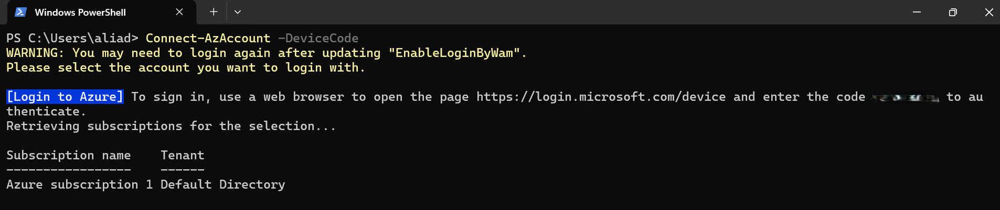
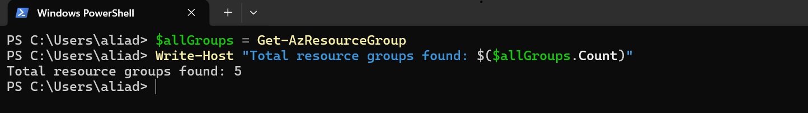
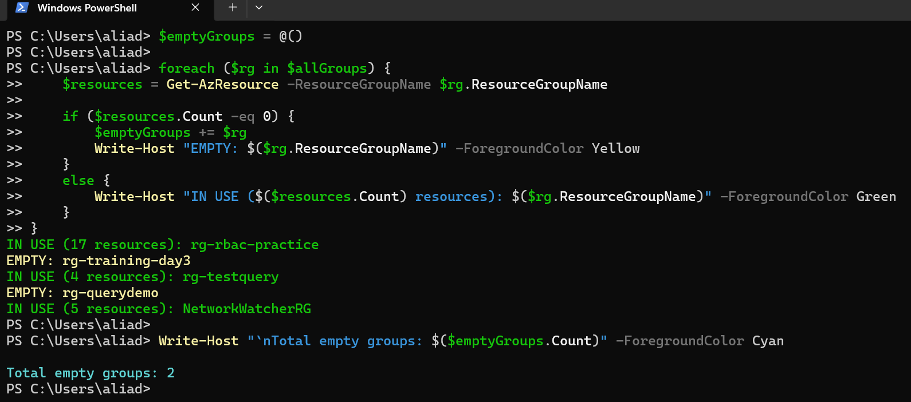
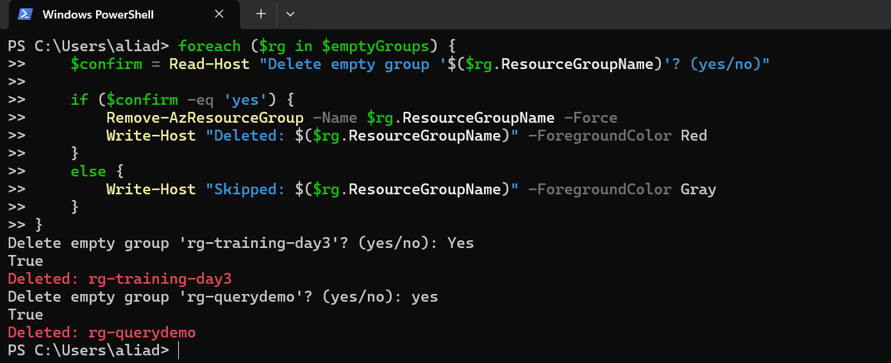
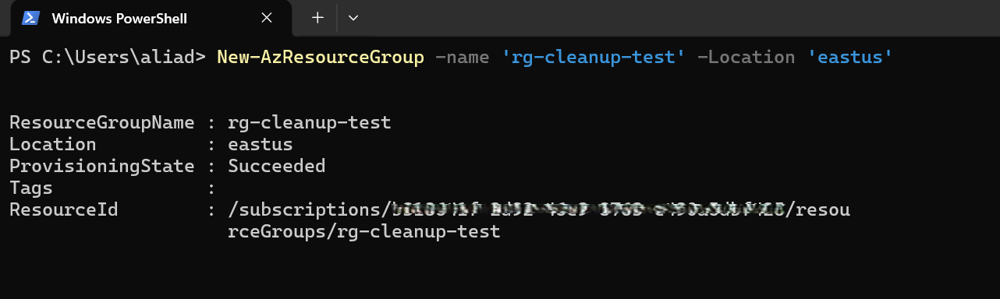
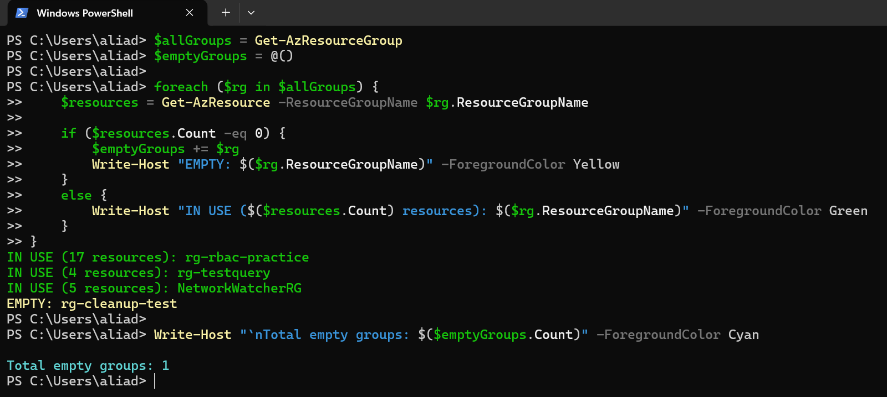
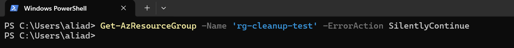

# 📘 Day 08 — Azure Resource Group Cleanup Automation

**Azure 100 Days of Cloud Challenge — Ali Aden**

---

## 📌 Overview  
In this challenge, I automated the detection and **controlled cleanup** of empty Azure Resource Groups using PowerShell.  
This mirrors real-world cloud governance tasks where unused resources must be identified and safely removed.

---

## 🛠 Tools Used  
- Azure PowerShell  
- Azure Resource Manager (ARM)  
- Azure Portal (for verification)  
- PowerShell scripting  

---

## 🧩 Steps Completed  
This setup simulates a real-world scenario where unused resource groups accumulate and require **safe, controlled cleanup in production environments**.

### 1. Connected to Azure  
Authenticated using device code login to access my subscription securely.

### 2. Retrieved All Resource Groups  
Used `Get-AzResourceGroup` to list all RGs and understand the environment.

### 3. Identified Empty vs In-Use Resource Groups  
Looped through each RG and checked for resources using `Get-AzResource`.

### 4. Deleted Confirmed Empty Resource Groups  
Used a confirmation prompt to ensure safe deletion of unused RGs.

### 5. Created a Test Resource Group  
Added a temporary RG (`rg-cleanup-test`) to validate the script logic.

### 6. Detected the Test RG as Empty  
Re-ran the audit loop to confirm the script correctly identified the new RG as empty.

### 7. Validated Deletion  
Confirmed the test RG was removed successfully using a silent lookup.

---

## 🔄 Before & After  

### Before  
- No visibility into unused RGs  
- Manual cleanup required  
- Higher risk of deleting active RGs  
- No automation or governance workflow  

### After  
- Automated detection of empty RGs  
- Safe deletion workflow with confirmation  
- Cleaner subscription hygiene  
- Repeatable script for future use  

---

## ✅ Validation  

- Empty RGs detected correctly  
- Confirmation prompts worked  
- Test RG identified as empty  
- Final validation returned no output (RG deleted)  

---

## 🧠 Skills Demonstrated  
- Azure PowerShell automation  
- Azure resource lifecycle management  
- ARM resource discovery  
- Safe deletion workflows  
- Scripting logic and loops  

---

## 🛠 Troubleshooting  

### Authentication Issues  
Resolved by re-running `Connect-AzAccount -DeviceCode`.

### Resource Count Not Updating  
Fixed by refreshing `$allGroups` and `$emptyGroups` after creating the test RG.

---

## 🔐 Why This Matters  

- Prevents cloud sprawl  
- Reduces unnecessary costs  
- Improves governance and subscription hygiene  
- Ensures safe, controlled deletion of unused resources  
- Prevents accidental deletion of active resources through validation logic  

This is the type of automation companies expect cloud engineers to build.

---

## 🧠 What I Learned  
- How to automate RG discovery  
- How to safely delete Azure resources  
- How to validate cleanup operations  
- How to structure repeatable PowerShell workflows  

---

## 📸 Screenshots  

  
  
  
  
  
  
  

---

## 💻 Commands Used  

### Connect to Azure
```powershell
Connect-AzAccount -DeviceCode
```

### Retrieve All Resource Groups
```powershell
$allGroups = Get-AzResourceGroup
Write-Host "Total resource groups found: $($allGroups.Count)"
```

### Detect Empty Resource Groups
```powershell
$emptyGroups = @()

foreach ($rg in $allGroups) {
    $resources = Get-AzResource -ResourceGroupName $rg.ResourceGroupName

    if ($resources.Count -eq 0) {
        $emptyGroups += $rg
        Write-Host "EMPTY: $($rg.ResourceGroupName)" -ForegroundColor Yellow
    }
    else {
        Write-Host "IN USE ($($resources.Count) resources): $($rg.ResourceGroupName)" -ForegroundColor Green
    }
}

Write-Host "`nTotal empty groups: $($emptyGroups.Count)" -ForegroundColor Cyan
```

### Delete Empty Resource Groups (With Confirmation)
```powershell
foreach ($rg in $emptyGroups) {
    $confirm = Read-Host "Delete empty group '$($rg.ResourceGroupName)'? (yes/no)"

    if ($confirm -eq 'yes') {
        Remove-AzResourceGroup -Name $rg.ResourceGroupName -Force
        Write-Host "Deleted: $($rg.ResourceGroupName)" -ForegroundColor Red
    }
    else {
        Write-Host "Skipped: $($rg.ResourceGroupName)" -ForegroundColor Gray
    }
}
```

### Create Test Resource Group
```powershell
New-AzResourceGroup -Name 'rg-cleanup-test' -Location 'eastus'
```

### Validate Deletion
```powershell
Get-AzResourceGroup -Name 'rg-cleanup-test' -ErrorAction SilentlyContinue
```

---

## 📄 Sample Output (Sanitised)

```text
IN USE (17 resources): rg-rbac-practice
EMPTY: rg-cleanup-test

Total empty groups: 1

PS C:\> Get-AzResourceGroup -Name 'rg-cleanup-test' -ErrorAction SilentlyContinue
# (no output — RG deleted)
```

---

## 🎯 Key Takeaway  
Automating cloud hygiene tasks like empty RG cleanup improves governance, reduces costs, and keeps Azure environments clean and production-ready.
