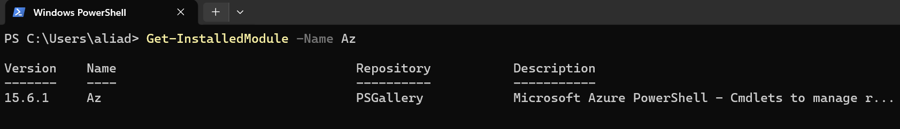
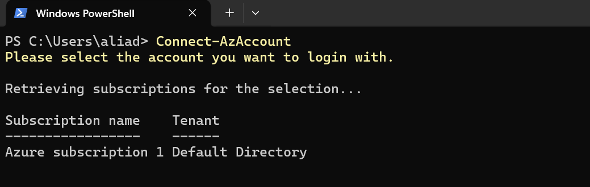
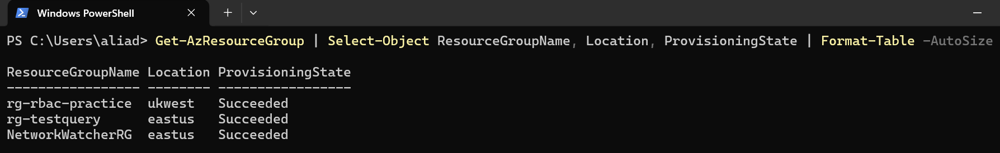
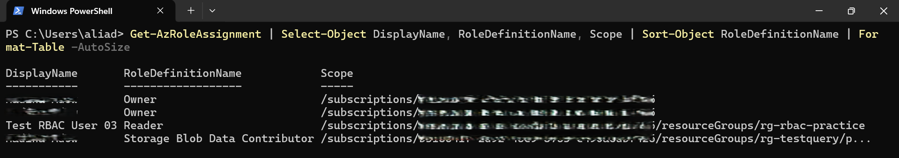
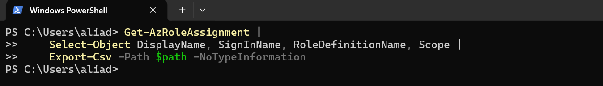
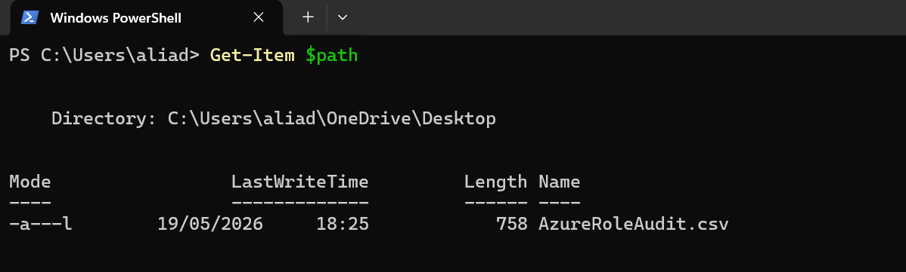
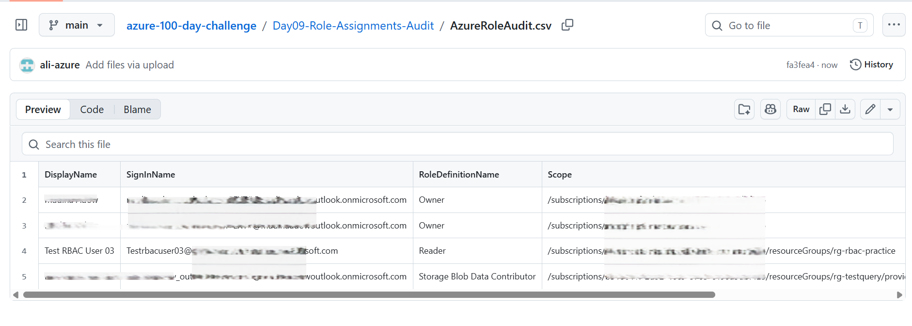

# 📘 Day 09 — Azure Role Assignments Audit (RBAC)

**Azure 100 Days of Cloud Challenge — Ali Aden**

---

## 📌 Overview  
Today I performed a full audit of Azure Role Assignments using RBAC.  
The objective was to identify who has access, what permissions they have, and at which scope — a critical task for cloud security and governance.

This workflow uses PowerShell to query Azure RBAC via the Azure Resource Manager API and exports results for governance analysis.

---

## 🛠 Tools Used  
- Azure Portal  
- Azure Cloud Shell  
- PowerShell  
- Azure RBAC (Role-Based Access Control)

---

## 🧩 Steps Completed  
This setup simulates a real-world access governance audit.

### 1. Accessed IAM (Access Control)  
Reviewed role assignments at the subscription level.

### 2. Queried Role Assignments  
Used PowerShell to retrieve all RBAC assignments across the environment.

### 3. Filtered Relevant Fields  
Selected DisplayName, SignInName, RoleDefinitionName, and Scope for clarity.

### 4. Exported Audit to CSV  
Saved the results to a CSV file for reporting and compliance.

### 5. Verified Export  
Confirmed the CSV file exists and contains valid data.

---

## 🔄 Before & After  

### Before  
- No clear visibility of access permissions  
- Potential risk of over-permissioned accounts  
- No exportable audit trail  

### After  
- Full RBAC audit exported  
- Clear mapping of identities → roles → scopes  
- Evidence file created for governance and compliance  

---

## ✅ Validation  

- CSV exported successfully  
- File verified using `Get-Item`  
- Data includes all required RBAC fields  
- Output reviewed for accuracy  

---

## 🧠 Skills Demonstrated  
- Azure RBAC auditing  
- PowerShell data filtering and export  
- Access governance best practices  
- Security documentation and reporting  
- Real-world cloud administration workflow  

---

## 🛠 Troubleshooting  

### Desktop Path Error  
PowerShell couldn’t find the Desktop path.  
**Fix:** Used `[Environment]::GetFolderPath("Desktop")` to retrieve the correct path.

### OneDrive Sync Confusion  
Local and cloud folders were inconsistent.  
**Fix:** Exported directly to Desktop to avoid sync issues.

---

## 🔐 Why This Matters  

- Enforces least-privilege access  
- Helps detect misconfigurations and privilege creep  
- Provides an audit trail for compliance  
- Strengthens overall cloud security posture  

RBAC audits are a core security control used to detect privilege escalation, enforce least privilege, and support compliance reviews.

---

## ⚠️ Risk Considerations  

- Overprivileged accounts (Owner/Contributor) increase attack surface  
- Privilege creep can occur if access is not regularly reviewed  
- Misconfigured RBAC can allow unintended access to sensitive resources  
- Lack of audit visibility weakens incident response capabilities  

---

## 🧠 What I Learned  
RBAC auditing provides critical visibility into access control within Azure environments.  
Understanding role scope and assignment structure is essential for enforcing least privilege and maintaining a secure cloud posture.  
Exporting and reviewing RBAC data enables consistent governance, auditing, and compliance validation.

---

## 🔄 Next Steps / Automation  

- Schedule recurring RBAC audits using Azure Automation  
- Integrate results into Log Analytics or Microsoft Sentinel  
- Trigger alerts for high-privilege role assignments  
- Enforce governance using Azure Policy or scripted controls  

---

## 📸 Screenshots  

  
  
  
  
  
  
  

---

## 💻 Commands Used  

### List all role assignments
```powershell
Get-AzRoleAssignment
```

### Select key RBAC fields
```powershell
Get-AzRoleAssignment |
    Select-Object DisplayName, SignInName, RoleDefinitionName, Scope
```

### Export to CSV
```powershell
$path = "C:\Users\aliad\OneDrive\Desktop\AzureRoleAudit.csv"

Get-AzRoleAssignment |
    Select-Object DisplayName, SignInName, RoleDefinitionName, Scope |
    Export-Csv -Path $path -NoTypeInformation
```

### Verify file exists
```powershell
Get-Item $path
```

---

## 📄 Sample Output (Sanitised)

```text
DisplayName     SignInName        RoleDefinitionName   Scope
-----------     ----------        -------------------   -----
<redacted>      <redacted>        Reader                /subscriptions/<redacted>
<redacted>      <redacted>        Owner                 /subscriptions/<redacted>
```

---

## 🎯 Key Takeaway  
A complete RBAC audit provides full visibility into access permissions and is a foundational capability for enforcing security, governance, and compliance in Azure environments.
