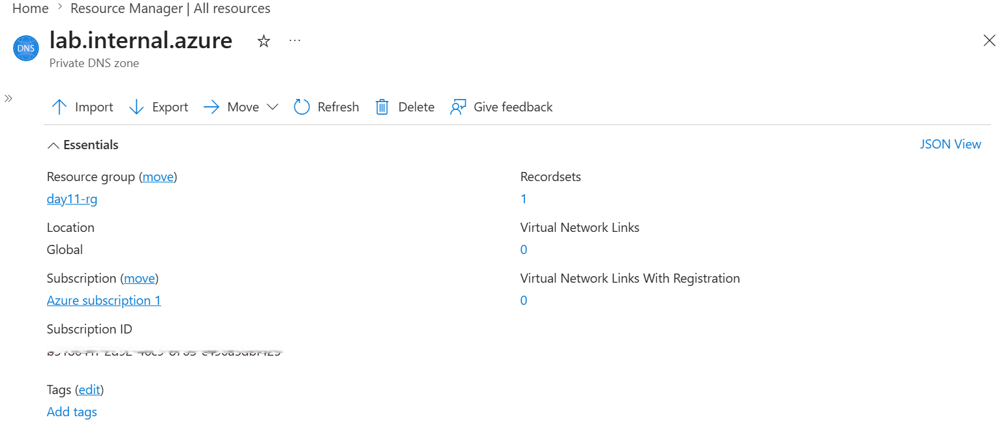
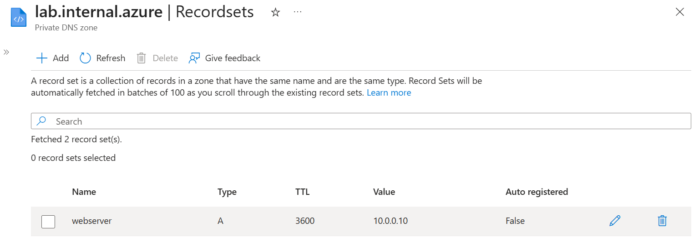
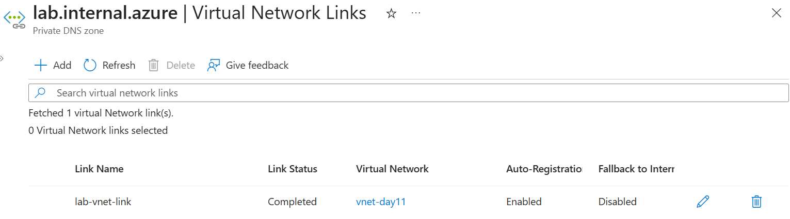
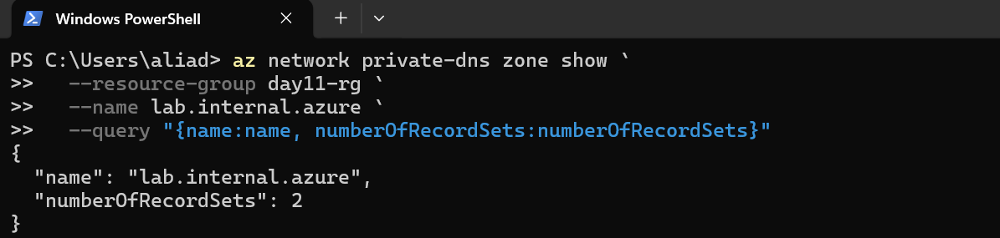
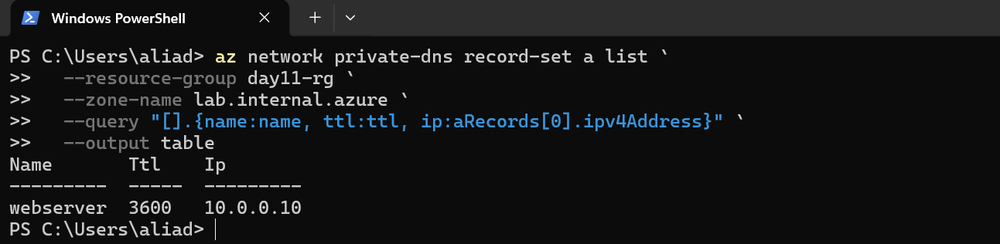
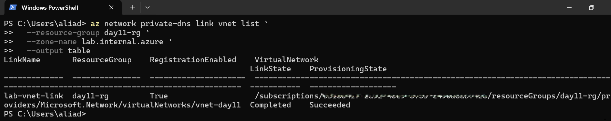
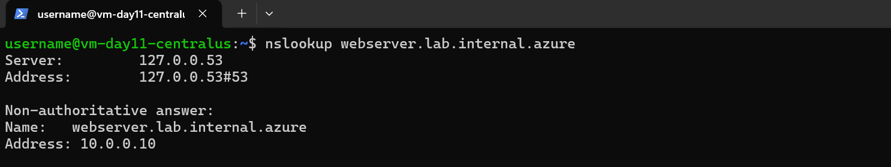

# 📘 Day 11 — Private DNS Zones & Cross-Region Name Resolution

**Azure 100 Days of Cloud Challenge — Ali Aden**

---

## 📌 Overview  
Today I implemented Azure Private DNS Zones and configured cross-region name resolution between VNets.  
This simulates how organisations enable secure internal service discovery without exposing resources to the public internet.

---

## 🛠 Tools Used  
- Azure Portal  
- Azure CLI (via Cloud Shell)  
- Azure Private DNS Zones  
- Virtual Networks & VNet Links  
- Linux VM (Ubuntu 24.04)  
- `nslookup` for DNS validation  

---

## 🧩 Steps Completed  
This setup simulates cross-region internal service discovery using private DNS.

### 1. Created a Private DNS Zone  
Configured `lab.internal.azure` to host internal DNS records.

### 2. Created an A-Record  
Mapped `webserver` → `10.0.0.10` (Canada Central VM).

### 3. Linked the Canada Central VNet  
Enabled auto-registration for dynamic DNS entries.

### 4. Deployed a Temporary VM (Central US)  
Used as a validation point for cross-region DNS resolution.

### 5. Validated DNS Resolution  
Confirmed `webserver.lab.internal.azure` resolved correctly using `nslookup`.

### 6. Cleaned Up Resources  
Removed VM, NIC, Public IP, Disk, and VNet link to maintain a clean environment.

---

## 🧩 Architecture (Simplified)

```
Canada Central VNet (Webserver: 10.0.0.10)
            │
            │ (Private DNS Zone Link)
            ▼
     Private DNS Zone (lab.internal.azure)
            ▲
            │
Central US VNet (Test VM → nslookup)
```

---

## 🔄 Before & After  

### Before  
- No internal DNS zone  
- No cross-region hostname resolution  
- Services accessed via IP only  
- Higher operational complexity  

### After  
- Private DNS Zone deployed  
- Cross-region name resolution working  
- Services accessible via hostname  
- Improved security and maintainability  

---

## ✅ Validation  

- A-record exists (`webserver → 10.0.0.10`)  
- VNet link active and healthy  
- DNS zone operational  
- `nslookup` returns correct IP from remote region  
- Temporary resources successfully removed  

---

## 🧠 Skills Demonstrated  
- Azure Private DNS configuration  
- Cross-region networking concepts  
- DNS validation and troubleshooting  
- Azure CLI usage  
- Secure internal architecture design  
- Resource lifecycle management  

---

## 🛠 Troubleshooting  

### SSH Login Failed  
**Cause:** Incorrect username  
**Fix:** Reset credentials and reconnect

### VNet Deletion Failed  
**Cause:** Attached NIC / VNet link  
**Fix:** Delete dependencies before VNet

### DNS Zone Deletion Failed  
**Cause:** Existing VNet link  
**Fix:** Remove link before deletion

---

## 🔐 Why This Matters  

- Enables secure internal service communication  
- Eliminates reliance on public DNS  
- Improves consistency using hostnames instead of IPs  
- Supports scalable multi-region architectures  

Private DNS is a core component of modern cloud networking.

---

## ⚠️ Risk Considerations  

- Missing VNet links → DNS resolution failures  
- Misconfigured auto-registration → inconsistent records  
- Poor naming standards → operational confusion  
- Dependency issues → failed resource cleanup  

---

## 🧠 What I Learned  
Private DNS Zones enable secure, scalable service discovery across regions.  
Correct VNet linking and validation are critical for consistent DNS behaviour.  
Troubleshooting requires checking DNS, network, and resource dependencies together.

---

## 📸 Screenshots  

### 1️⃣ Private DNS Zone — Created  


### 2️⃣ A‑Record — webserver → 10.0.0.10  


### 3️⃣ VNet Link — Canada Central  


### 4️⃣ Azure CLI — DNS Zone Summary  


### 5️⃣ Azure CLI — A‑Record Table  


### 6️⃣ Azure CLI — VNet Link Table  


### 7️⃣ nslookup — DNS Resolution Test  



---

## 💻 Commands Used  

### Show DNS Zone
```bash
az network private-dns zone show \
  --resource-group day11-rg \
  --name lab.internal.azure \
  --query "{name:name, numberOfRecordSets:numberOfRecordSets}"
```

### List A-Records
```bash
az network private-dns record-set a list \
  --resource-group day11-rg \
  --zone-name lab.internal.azure \
  --query "[].{name:name, ttl:ttl, ip:aRecords[0].ipv4Address}" \
  --output table
```

### List VNet Links
```bash
az network private-dns link vnet list \
  --resource-group day11-rg \
  --zone-name lab.internal.azure \
  --output table
```

---

## 📄 Sample Output (Sanitised)

```text
Name       Ttl   Ip
---------- ----- ----------
webserver  3600  10.0.0.10
```

---

## 🎯 Key Takeaway  
Private DNS Zones enable secure, reliable cross-region name resolution — a foundational building block for enterprise cloud networking.
