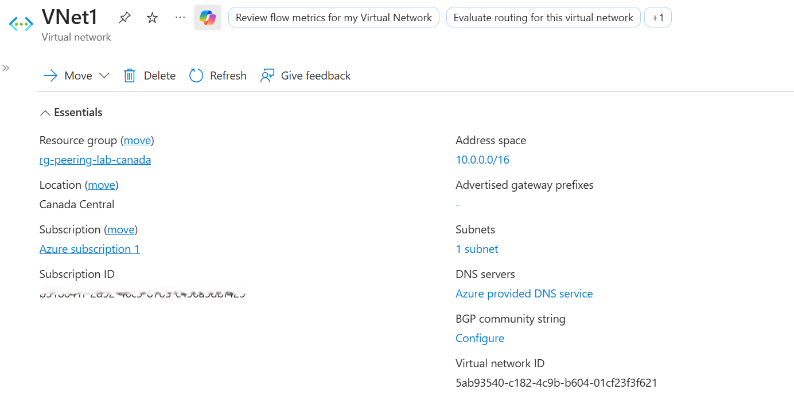
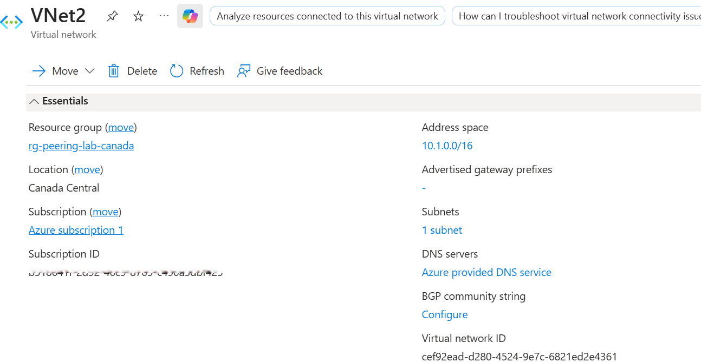
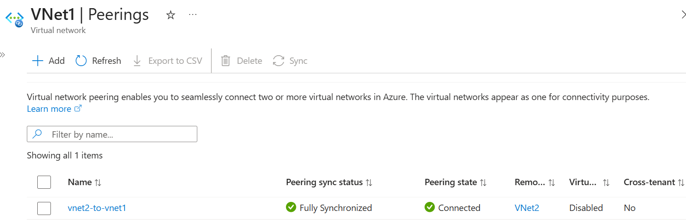
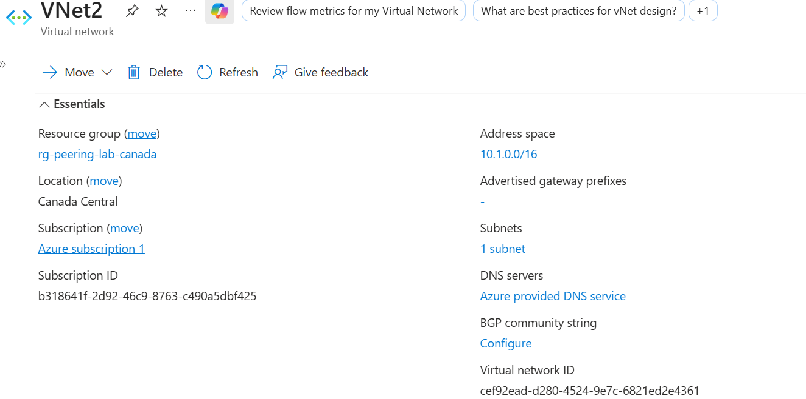
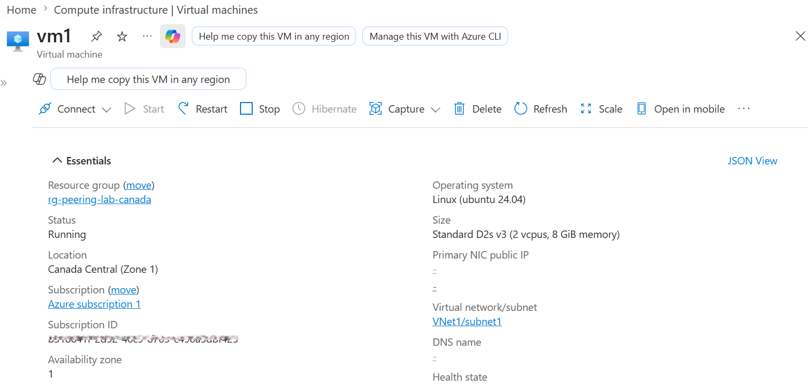
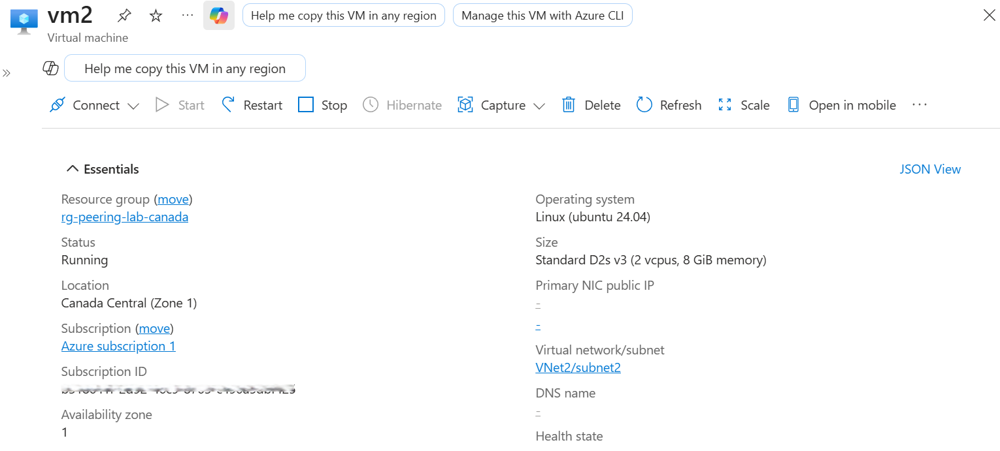
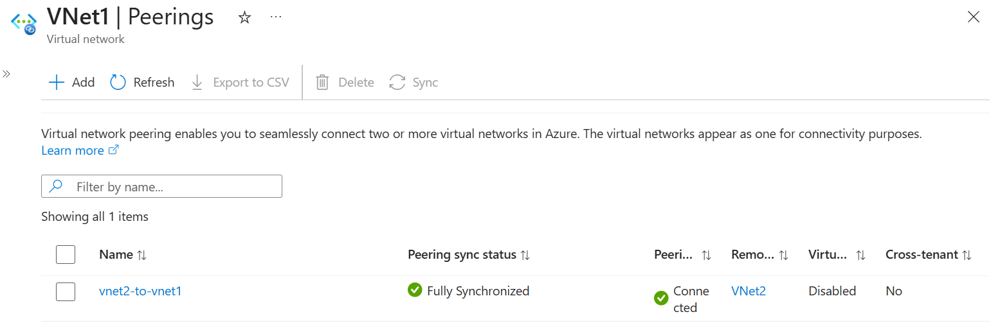

# 📘 Day 11 — VNet Peering: Connect Two Virtual Networks

**Azure 100 Days of Cloud Challenge — Ali Aden**

---

## 📌 Overview  
Today I built two Azure Virtual Networks, peered them together, deployed virtual machines in each network, and validated end-to-end private connectivity.  

This simulates how enterprises connect isolated environments securely without exposing traffic to the public internet.

---

## 🛠 Tools Used  
- Azure Portal  
- Azure CLI (Cloud Shell)  
- Virtual Networks (VNet)  
- VNet Peering  
- Virtual Machines (VMs)  
- Azure Bastion  
- Network Diagnostics (Ping)

---

## 🧩 Steps Completed  
This setup demonstrates real-world cross-network communication in Azure.

### 1. Created VNet1  
Configured address space **10.0.0.0/16** with subnet **10.0.1.0/24**.

### 2. Created VNet2  
Configured address space **10.1.0.0/16** with subnet **10.1.1.0/24**.

### 3. Created Peering (VNet1 → VNet2)  
Established outbound peering from VNet1.

### 4. Verified Peering (VNet2 → VNet1)  
Confirmed bidirectional peering was **Connected** and **Fully Synchronized**.

### 5. Deployed VM1 in VNet1  
Created a VM to act as a test source.

### 6. Deployed VM2 in VNet2  
Created a VM to act as the destination.

### 7. Connected via Bastion  
Used Azure Bastion for secure access without exposing public IPs.

### 8. Tested Connectivity (VM1 → VM2)  
Pinged VM2 private IP — **successful**.

### 9. Tested Connectivity (VM2 → VM1)  
Pinged VM1 private IP — **successful**.

### 10. Final Verification  
Confirmed peering remained stable and connected after testing.

---

## 🔄 Before & After  

### Before  
- VNets isolated  
- No communication between networks  
- No shared workloads  

### After  
- VNets privately connected  
- VMs communicate via private IPs  
- Traffic flows securely over Azure backbone  
- Multi-VNet architecture established  

---

## ✅ Validation  

- Peering status: **Connected**  
- Sync status: **Fully Synchronized**  
- VM1 → VM2 ping: **Success**  
- VM2 → VM1 ping: **Success**  

---

## 🧠 Skills Demonstrated  
- Azure Virtual Network design  
- VNet Peering configuration  
- Cross-network VM deployment  
- Secure access using Bastion  
- Network validation and troubleshooting  
- Cloud networking fundamentals  

---

## 🛠 Troubleshooting  

### Ping Not Working  
Enabled ICMP in VM firewall settings.

### Peering Not Showing Connected  
Refreshed Azure Portal (status delay).

### Incorrect Deployment  
Verified both VMs were deployed to correct VNets/subnets.

---

## 🔐 Why This Matters  

- **Security:** Traffic stays private (no public exposure)  
- **Architecture:** Enables hub-and-spoke and multi-tier designs  
- **Operations:** Supports scalable, multi-network environments  
- **Real-world relevance:** Core enterprise networking pattern  

---

## 🧠 What I Learned  
- How VNet Peering enables private communication between networks  
- Why peering is non-transitive  
- How to validate connectivity using real VM traffic  
- The importance of private IP communication in cloud environments  

---

## 📸 Screenshots  

  
  
  
  
  
  
  
  
  

---

## 💻 Commands Used  

### Check VNet Peering Status
```bash
az network vnet peering list \
  --resource-group rg-peering-lab \
  --vnet-name VNet1 \
  --output table

---

## 📄 Sample Output 
Name              PeeringState   RemoteVNet
----------------  -------------  -----------
vnet1-to-vnet2    Connected      VNet2

---

## 🎯 Key Takeaway
VNet Peering enables secure, private communication between networks — a fundamental building block for enterprise Azure architectures.
