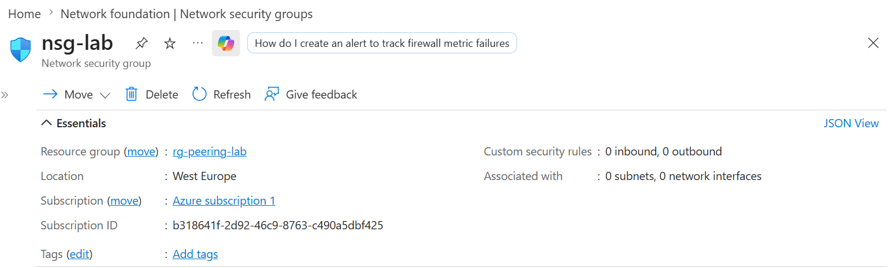
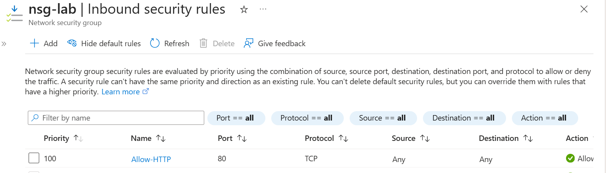
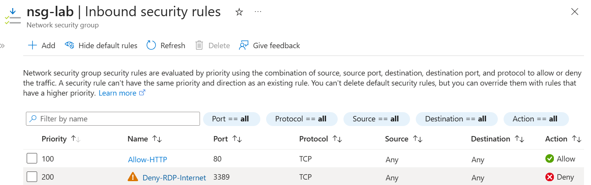
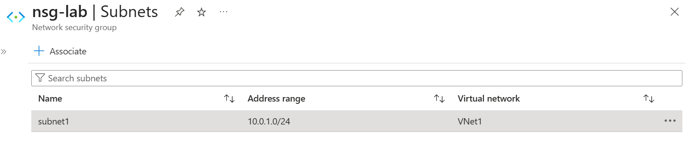
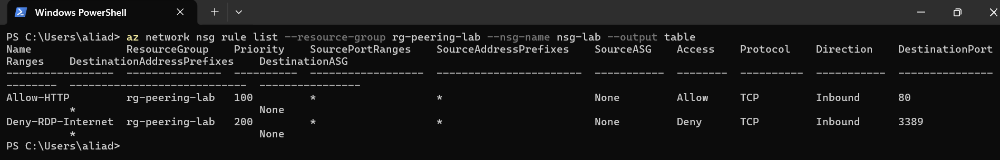

# 📘 Day 12 — NSG Rules: Design and Test Inbound & Outbound Traffic Flow

**Azure 100 Days of Cloud Challenge — Ali Aden**

---

## 📌 Overview  
Today I implemented a Network Security Group (NSG), configured custom inbound rules, associated it to a subnet, and validated rule behaviour using Azure CLI.  
This reflects real-world cloud security practices where NSGs act as a primary layer of traffic control for Azure workloads.

---

## 🛠 Tools Used  
- Azure Portal  
- Azure Cloud Shell  
- Azure CLI  
- Network Security Groups (NSG)  
- Virtual Networks & Subnets  

---

## 🧩 Steps Completed  
This setup simulates how organisations control and validate network traffic at the subnet level.

### 1. Created the NSG  
Deployed **nsg-lab** within **rg-peering-lab** to act as a subnet-level firewall.

### 2. Added Inbound Rule — Allow HTTP  
Configured a rule allowing inbound TCP traffic on port **80** with priority **100**.

### 3. Added Inbound Rule — Deny RDP from Internet  
Created a rule blocking inbound RDP (port **3389**) with priority **200**.

### 4. Associated NSG to Subnet  
Linked the NSG to **subnet1** in **VNet1**, enforcing all defined rules.

### 5. Verified Rules via Azure CLI  
Used CLI commands to validate rule priority, ordering, and default rule presence.

---

## 🔄 Before & After  

### Before  
- No traffic filtering at subnet level  
- No explicit allow/deny rules  
- RDP access not controlled  
- Limited visibility into traffic flow  

### After  
- NSG applied to subnet  
- HTTP traffic explicitly allowed  
- RDP from internet blocked  
- Rule priority and evaluation confirmed  

---

## ✅ Validation  

- **Allow-HTTP** rule present at priority 100  
- **Deny-RDP-Internet** rule present at priority 200  
- Default Azure NSG rules visible  
- NSG successfully associated with correct subnet  

---

## 🧠 Skills Demonstrated  
- NSG rule creation and management  
- Understanding rule priority and evaluation logic  
- Subnet-level network security design  
- Azure CLI validation and inspection  
- Practical cloud security implementation  

---

## 🛠 Troubleshooting  

### CLI Errors in PowerShell  
PowerShell does not support `\` line continuation.  
**Fix:** Run commands on a single line.

### Rule Not Appearing  
NSG blade did not update immediately.  
**Fix:** Refresh the Azure Portal.

---

## 🔐 Why This Matters  

- **Security:** Enforces least-privilege network access  
- **Governance:** Standardises traffic control across environments  
- **Operations:** Simplifies troubleshooting and traffic validation  

NSGs are a foundational component of Azure network security and are used in virtually all production environments.

---

## 🧠 What I Learned  
- NSG rule priority determines traffic flow  
- How to allow and deny traffic at the subnet level  
- How to validate rules using Azure CLI  
- The importance of default NSG rules in evaluation  

---

## 📸 Screenshots  

  
  
  
  
  

---

## 💻 Commands Used  

### List NSG Rules
```powershell
az network nsg rule list --resource-group rg-peering-lab --nsg-name nsg-lab --output table

---

## 📄 Sample Output (Sanitised)

```text
Name               Priority    Access    Protocol    Direction    DestinationPortRanges
-----------------  ---------   -------   ---------   ----------   ----------------------
Allow-HTTP         100         Allow     TCP         Inbound      80
Deny-RDP-Internet  200         Deny      TCP         Inbound      3389
```

---

## 🎯 Key Takeaway  
NSG rule priority is critical — Azure evaluates rules from lowest to highest priority, and the first match determines whether traffic is allowed or denied.

