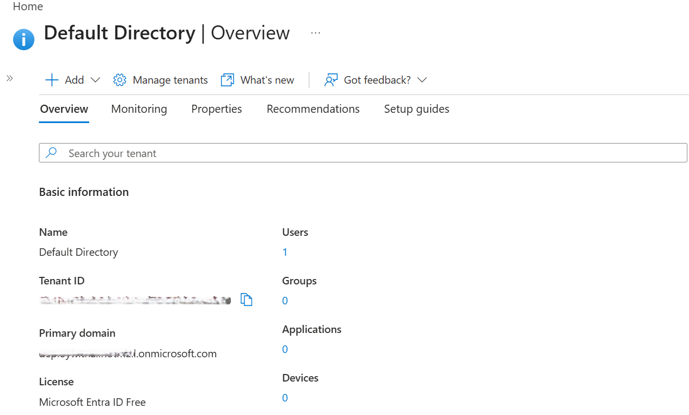
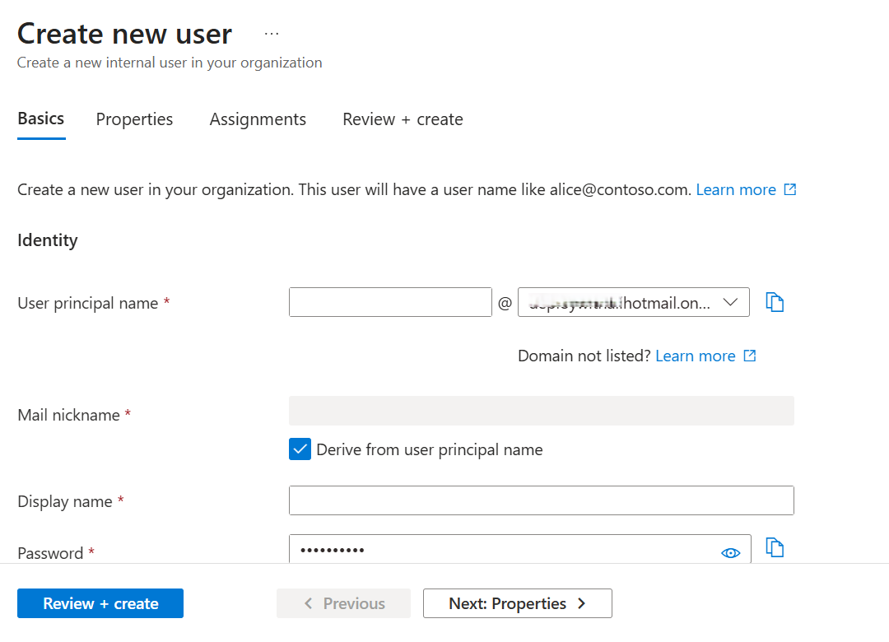
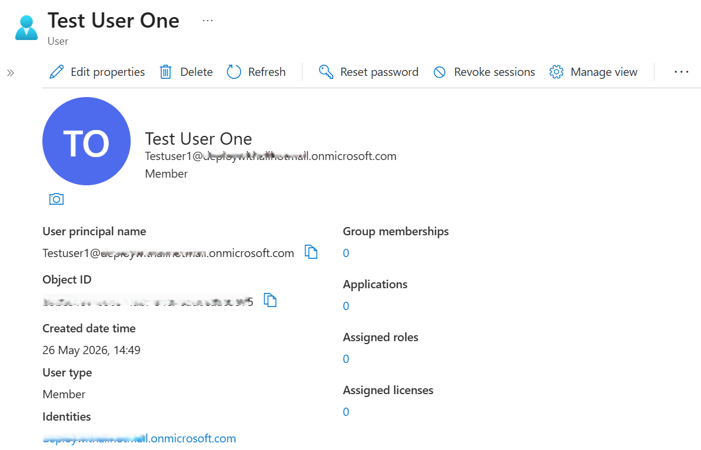
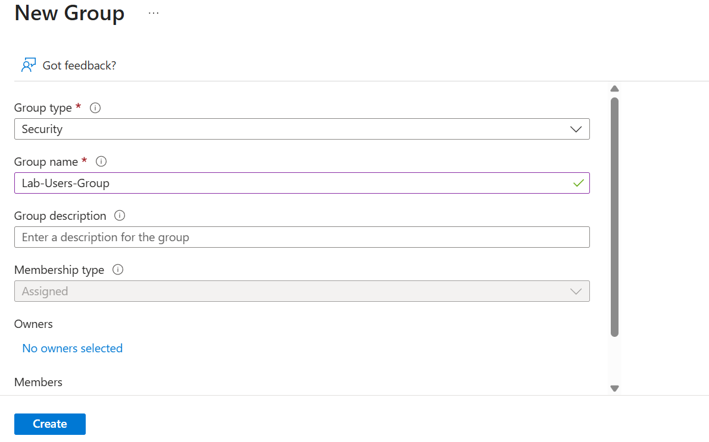
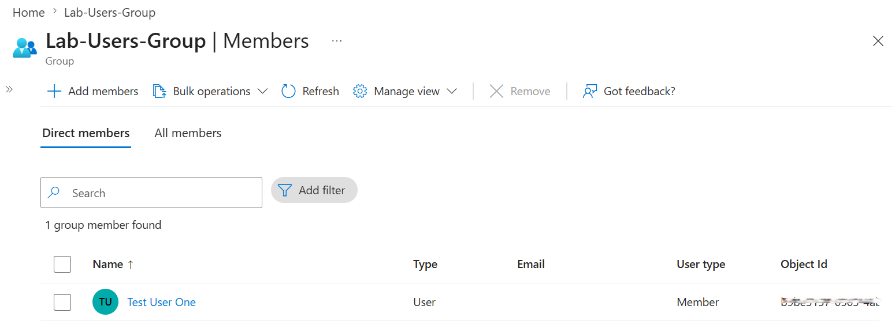
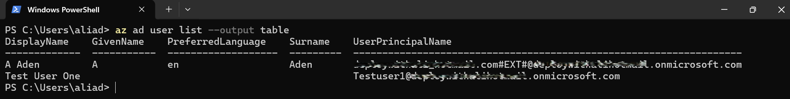
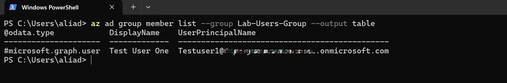

# 📘 Day 13 — Microsoft Entra ID: Users & Groups

**Azure 100 Days of Cloud Challenge — Ali Aden**

---

## 📌 Overview

Today I created a new user and a security group in Microsoft Entra ID, then added the user to the group.

This simulates a real-world identity lifecycle workflow used for onboarding, access governance, and group-based access management.

---

## 🛠 Tools Used

- Azure Portal
- Azure CLI (run inside PowerShell terminal)
- Microsoft Entra ID

---

## 🧩 Steps Completed

This setup simulates enterprise identity onboarding and group-based access management.

### 1. Created a New User

Created a test identity (**Test User One**) to represent a standard user account.

### 2. Created a Security Group

Created **Lab-Users-Group** with Assigned membership.

### 3. Added User to Group

Added the user to the group to establish identity membership.

### 4. Validated via Azure CLI (PowerShell)

Used CLI commands inside PowerShell to confirm:

- User exists
- Group exists
- Membership is correct

### 5. Reviewed Identity Relationships

Validated the identity flow:

**Entra ID → User → Group**

---

## 🏗️ Architecture Diagram

```text
              Microsoft Entra ID
                       │
                       ▼

                Test User One

                       │
                       ▼

               Lab-Users-Group

             User Added to Group
```

---

## 🔄 Before & After

### Before

- No user identity existed
- No group for access control
- No membership relationships
- No validation performed

### After

- User successfully created
- Security group created
- User added to group
- CLI validation confirms setup

---

## ✅ Validation

- User visible in `az ad user list`
- Group visible in `az ad group list`
- Membership confirmed via CLI
- Azure Portal reflects correct configuration

---

## 🧠 Skills Demonstrated

- Identity lifecycle management (Entra ID)
- Group-based access control (RBAC foundation)
- Azure CLI usage within PowerShell
- Identity validation and troubleshooting
- Cloud onboarding workflow simulation

---

## 🛠 Troubleshooting

### User Not Appearing in CLI

Re-authenticated using:

```powershell
az login
```

### Group Membership Not Updating

Refreshed Azure Portal and re-ran CLI command.

---

## 🔐 Why This Matters

- **Security:** Proper identity structure prevents misconfigured access
- **Governance:** Group-based access simplifies auditing
- **Scalability:** Easier to manage permissions across teams

Identity is the foundation of all Azure access control.

---

## 🧠 What I Learned

- How to create and manage users in Entra ID
- How groups simplify access management
- How to validate identity objects using Azure CLI
- Why identity structure is critical before assigning permissions

---

## 📸 Screenshots















---

## 💻 Commands Used

### List All Users

```powershell
az ad user list --output table
```

### List Group Members

```powershell
az ad group member list --group Lab-Users-Group --output table
```

---

## 📄 Sample Output (Sanitised)

```text
DisplayName        UserPrincipalName
-----------------  ----------------------------------------------
Test User One      Testuser1@deploywithalihotmail.onmicrosoft.com
```

---

## 🎯 Key Takeaway

Identity is the foundation of cloud security — users and groups must be structured correctly before any RBAC or resource access can be assigned.
