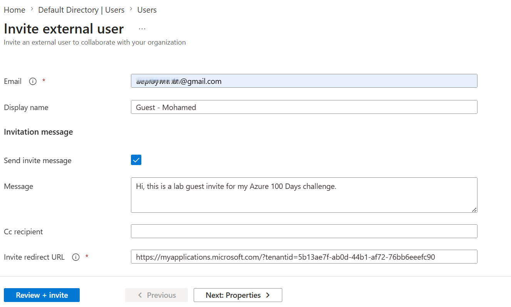
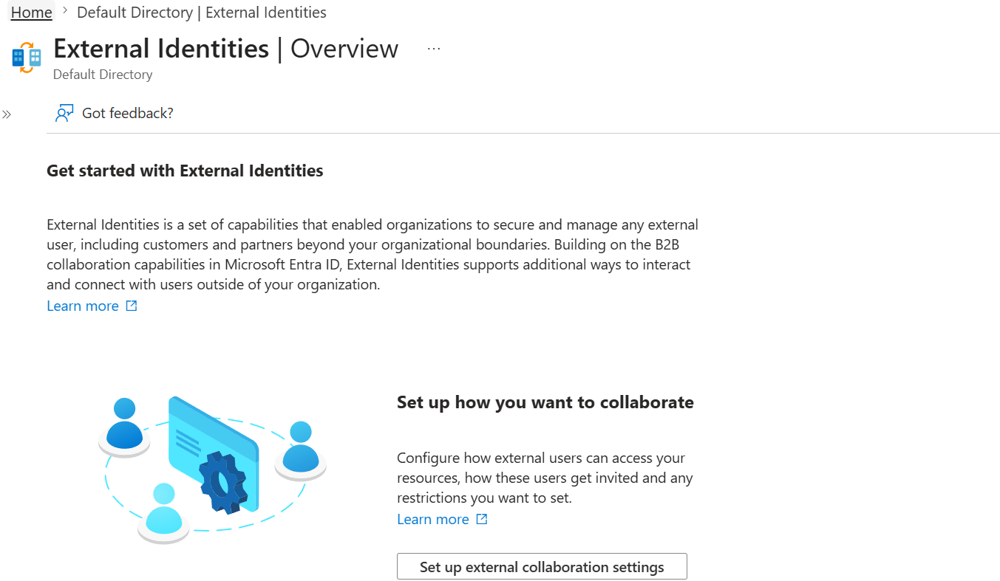
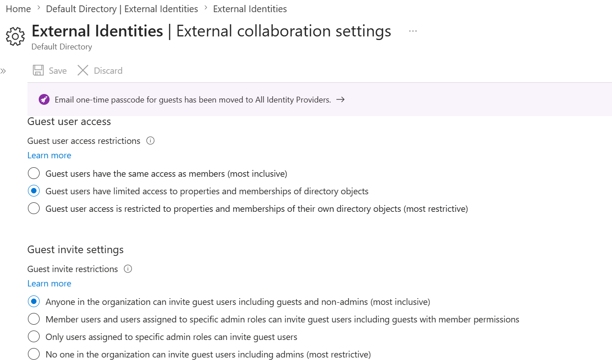
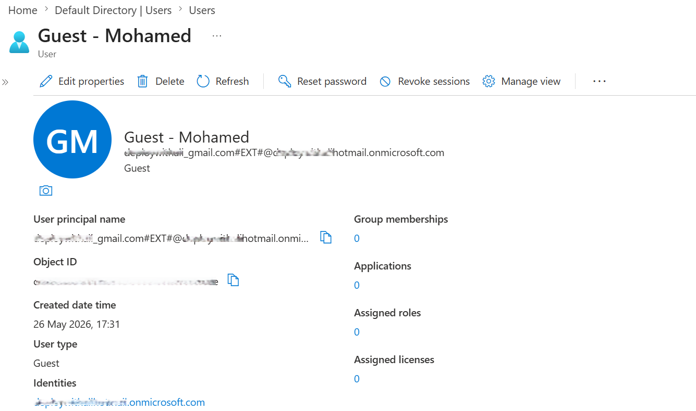
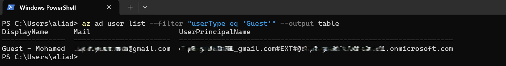

# 📘 Day 14 — Configure Guest User Access & External Collaboration Settings

**Azure 100 Days of Cloud Challenge — Ali Aden**

---

## 📌 Overview

Today I invited an external guest user into my Microsoft Entra ID tenant and reviewed the External Collaboration Settings that control guest access.

This simulates real-world scenarios where organisations onboard external partners, contractors, or suppliers while maintaining strict access control and governance.

---

## 🛠 Tools Used

- Azure Portal
- Azure CLI (run inside Local PowerShell)
- Microsoft Entra ID (External Identities, Users)

---

## 🧩 Steps Completed

This setup simulates secure onboarding of external users into an organisation's identity system.

### 1. Invited External Guest User

Sent an invitation to an external email address.

### 2. Reviewed External Collaboration Settings

Accessed tenant-wide settings controlling who can invite guests and how guest access is managed.

### 3. Checked Collaboration Restrictions

Verified guest permissions and domain restrictions.

### 4. Reviewed Guest User Profile

Confirmed the guest account appears with:

- **User Type = Guest**
- Username contains **#EXT#**

### 5. Validated via Azure CLI (Local PowerShell)

Queried guest users using Azure CLI from a local PowerShell terminal.

---

## 🧩 Architecture Diagram

```text
                External User
              (example@gmail.com)
                         │
                         │ Invitation
                         ▼

          Microsoft Entra ID Tenant
                         │
                         ▼

              Guest Account Created
      (example_gmail.com#EXT#@tenant)

                         │
                         ▼

      External Collaboration Settings
                         │
                         ▼

              Access Restrictions
         (Permissions & Governance)

                         │
                         ▼

              Azure Resources
           (Controlled Access)
```

This diagram shows how an external identity is invited into Microsoft Entra ID, converted into a Guest account, governed by External Collaboration Settings, and then granted controlled access to organisational resources.

---

## 🔄 Before & After

### Before

- No guest users in the tenant
- No visibility into collaboration restrictions
- No validation of external identities
- No CLI verification

### After

- Guest user successfully invited
- External collaboration settings reviewed
- Guest access restrictions confirmed
- CLI validation confirms guest classification

---

## ✅ Validation

- Guest appears in Entra ID Users list
- User Type = **Guest**
- Username contains **#EXT#**
- External Collaboration Settings load correctly
- Azure CLI output returns the guest user

---

## 🧠 Skills Demonstrated

- Microsoft Entra ID identity management
- External (B2B) collaboration configuration
- Azure CLI filtering and validation
- Identity governance fundamentals
- Secure onboarding workflows
- Guest access management

---

## 🛠 Troubleshooting

### Guest Not Appearing

**Issue:** Invitation not accepted yet.

**Fix:** Resend the invitation or check the recipient's spam folder.

### CLI Returns No Results

**Issue:** Logged into the incorrect tenant.

**Fix:**

```powershell
az login
```

Then select the correct tenant and re-run the command.

---

## 🔐 Why This Matters

- **Security:** Controls what external users can access
- **Governance:** Centralised control over guest invitations
- **Operations:** External collaboration is a common administrative task
- **Compliance:** Helps organisations manage third-party access securely

Proper guest configuration is critical to maintaining a secure cloud environment.

---

## 🧠 What I Learned

- How guest identities are created and managed in Microsoft Entra ID
- How tenant-wide collaboration settings control external access
- How to validate guest users using Azure CLI
- Why least-privilege access is essential for external identities

---

## 📸 Screenshots











---

## 💻 Commands Used

### List Guest Users

```powershell
az ad user list --filter "userType eq 'Guest'" --output table
```

---

## 📄 Sample Output

```text
DisplayName      Mail                     UserPrincipalName
---------------  -----------------------  ---------------------------------------------------------
Guest - Mohamed  example@gmail.com        example_gmail.com#EXT#@tenantname.onmicrosoft.com
```

---

## 🎯 Key Takeaway

Guest access is powerful but must be tightly controlled. Secure collaboration starts with proper identity configuration, governance, and least-privilege access management.
