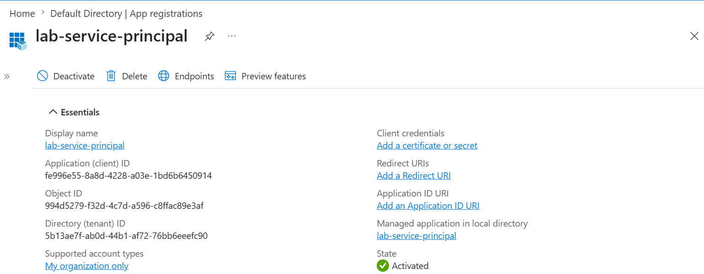
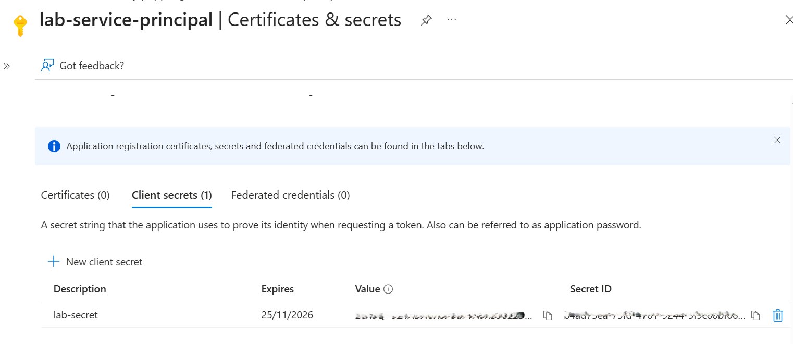
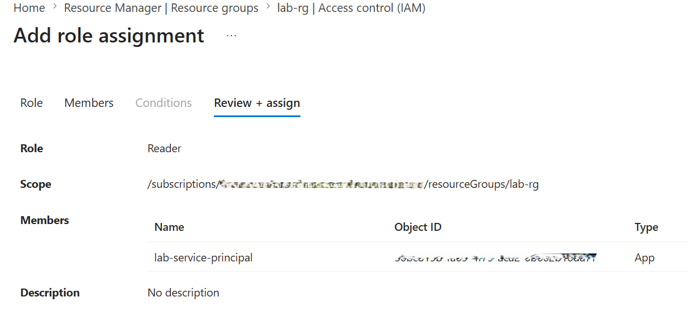
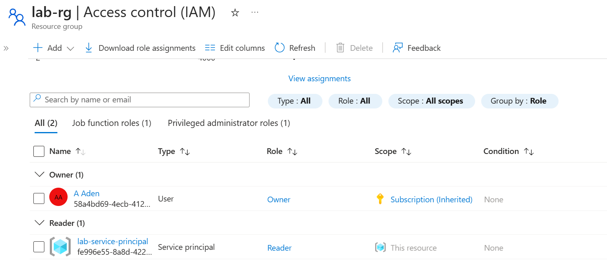
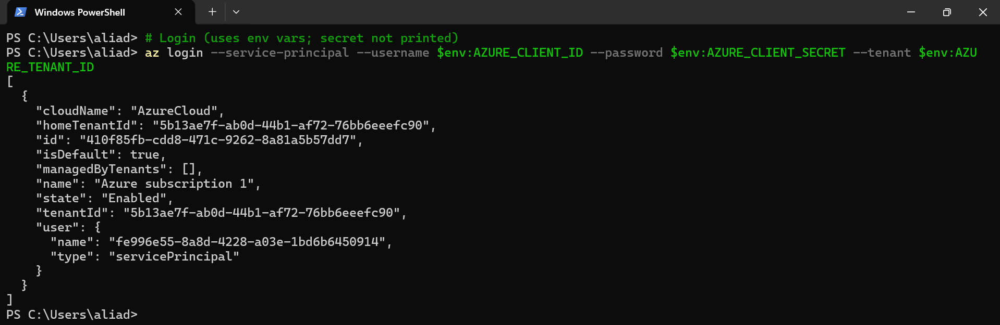
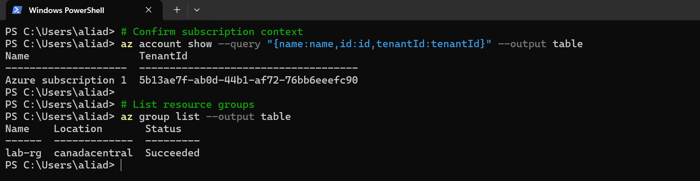
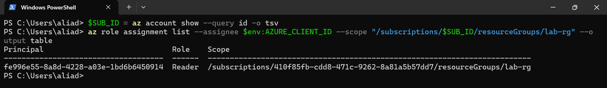

# 📘 Day 15 — Authenticate & Verify Service Principal Access (RBAC)

**Azure 100 Days of Cloud Challenge — Ali Aden**

---

## 📌 Overview

Today I validated Azure Service Principal authentication and RBAC permissions using Azure CLI. The objective was to confirm that a Service Principal could authenticate non-interactively, access Azure resources, and operate only within the permissions granted through Role-Based Access Control (RBAC).

This simulates real-world automation scenarios where applications, scripts, and CI/CD pipelines require secure access to Azure resources without using user accounts.

---

## 🛠 Tools Used

* Azure CLI
* Azure Portal
* Microsoft Entra ID (App Registrations)
* Azure RBAC
* Azure Resource Manager (ARM)
* PowerShell Terminal

---

## 🧩 Steps Completed

This setup simulates how organisations securely authenticate automation accounts and enforce least-privilege access.

### 1. Created and Reviewed the App Registration

Reviewed the application registration and collected the required authentication details:

* Application (Client) ID
* Tenant ID
* Client Secret

### 2. Assigned RBAC Permissions

Assigned the **Reader** role to the Service Principal at the **lab-rg** resource group scope.

### 3. Authenticated Using the Service Principal

Used `az login --service-principal` to authenticate non-interactively with Azure.

### 4. Verified Subscription Context

Executed `az account show` to confirm access to the correct subscription and tenant.

### 5. Validated Resource Group Access

Used Azure CLI commands to confirm the Service Principal could view resources within the assigned scope.

### 6. Verified RBAC Assignment

Confirmed the Reader role assignment using Azure CLI and validated the scope was limited to the target resource group.

---

## 🧩 Architecture Diagram

```text
+---------------------------+
| Microsoft Entra ID        |
| App Registration          |
| Service Principal         |
+------------+--------------+
             |
             | Authentication
             v
+---------------------------+
| Azure CLI                |
| az login --service-principal
+------------+--------------+
             |
             | RBAC (Reader)
             v
+---------------------------+
| Resource Group: lab-rg   |
| Read-Only Access         |
+---------------------------+
```

---

## 🔄 Before & After

### Before

* No automation identity configured
* No RBAC validation performed
* No non-interactive authentication tested
* Access permissions not verified

### After

* Service Principal authenticated successfully
* Reader permissions validated
* Resource Group access confirmed
* RBAC scope verified
* Secure automation workflow documented

---

## ✅ Validation

* Service Principal authenticated successfully
* Subscription context verified
* Resource groups listed successfully
* Reader role assignment confirmed
* Resource Group scope validated
* RBAC permissions matched expected access level

---

## 🧠 Skills Demonstrated

* Service Principal authentication
* Azure RBAC validation
* Azure CLI administration
* Resource Group scoped permissions
* Identity and access management (IAM)
* Security-focused troubleshooting
* Least-privilege access verification

---

## 🛠 Troubleshooting

### Authentication Failed

Incorrect Client ID, Tenant ID, or Client Secret will cause login failures.

**Fix:** Verify credentials and regenerate the Client Secret if required.

### No Resources Returned

The Service Principal may not have sufficient permissions.

**Fix:** Review RBAC assignments and confirm the correct scope.

### Role Assignment Not Visible

RBAC changes may take a few minutes to propagate.

**Fix:** Wait briefly and rerun the validation commands.

---

## 🔐 Why This Matters

* **Security:** Eliminates the need to use personal accounts for automation.
* **Governance:** Permissions can be scoped and audited centrally.
* **Operations:** Enables secure automation for scripts, applications, and CI/CD pipelines.
* **Compliance:** Supports least-privilege access principles.

Service Principals are a foundational component of secure cloud operations.

---

## 🧠 What I Learned

* How Service Principals authenticate using application credentials
* How Azure RBAC controls access at different scopes
* How to verify permissions using Azure CLI
* Why least-privilege access is critical for automation

---

## 📸 Screenshots















---

## 💻 Commands Used

### Authenticate Using Service Principal

```powershell
az login --service-principal `
  --username <APP_ID> `
  --password <CLIENT_SECRET> `
  --tenant <TENANT_ID>
```

### Verify Subscription Context

```powershell
az account show `
  --query "{name:name,id:id,tenantId:tenantId}" `
  --output table
```

### List Resource Groups

```powershell
az group list --output table
```

### View Resource Group Details

```powershell
az group show --name lab-rg --output json
```

### Verify RBAC Assignment

```powershell
$SUB_ID = az account show --query id -o tsv

az role assignment list `
  --assignee <APP_ID> `
  --scope "/subscriptions/$SUB_ID/resourceGroups/lab-rg" `
  --output table
```

---

## 📄 Sample Output

```text
Name    Location       Status
------  -------------  ---------
lab-rg  canadacentral  Succeeded
```

---

## 🎯 Key Takeaway

Service Principals are the foundation of secure Azure automation. Combining non-interactive authentication with least-privilege RBAC ensures scripts, applications, and pipelines only have the access they genuinely require.

