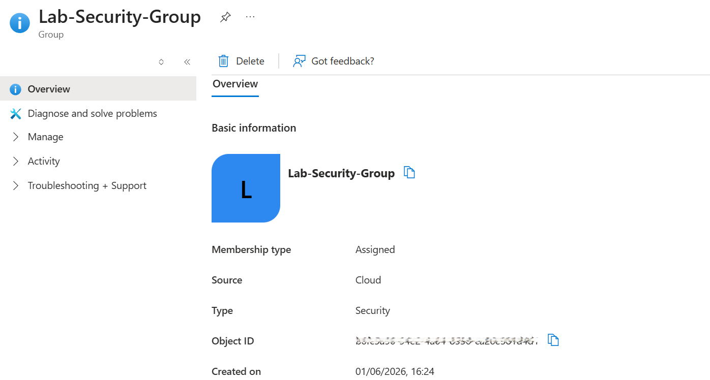
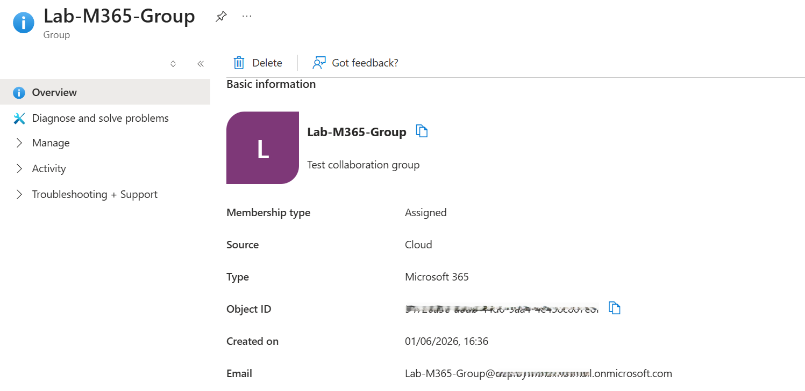
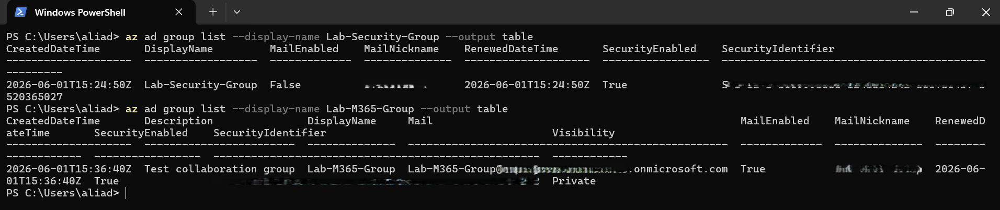

# 📘 Day 16 — Manage Group Types: Security vs Microsoft 365 Groups

**Azure 100 Days of Cloud Challenge — Ali Aden**

---

## 📌 Overview

Today I created and compared two different group types in Microsoft Entra ID: a **Security Group** and a **Microsoft 365 Group**. I validated their properties using Azure CLI and explored how each group type is used for access management, collaboration, and governance in real-world environments.

---

## 🛠 Tools Used

- Azure Portal
- Microsoft Entra ID
- Azure CLI (Local PowerShell)
- PowerShell Terminal

---

## 🧩 Steps Completed

This lab simulates how organisations manage access control and collaboration using different group types.

### 1. Created a Security Group
Created a Security Group with **Assigned** membership for access control and RBAC scenarios.

### 2. Created a Microsoft 365 Group
Created a Microsoft 365 Group with **Assigned** membership to enable collaboration services.

### 3. Reviewed Security Group Properties
Confirmed the Security Group has no email address and is designed for permissions and access management.

### 4. Reviewed Microsoft 365 Group Properties
Confirmed the Microsoft 365 Group includes collaboration capabilities such as email, SharePoint, and Teams integration.

### 5. Validated Both Groups Using Azure CLI
Used Azure CLI commands from local PowerShell to verify group properties and compare their capabilities.

---

## 🏗️ Architecture Diagram

```text
                    Microsoft Entra ID
                            │
         ┌──────────────────┴──────────────────┐
         │                                     │
         ▼                                     ▼

  Security Group                    Microsoft 365 Group
  ──────────────                    ───────────────────
  • Access Control                  • Collaboration
  • RBAC Compatible                 • Email Enabled
  • Security Focus                  • SharePoint
  • No Mailbox                      • Teams Integration

         │                                     │
         ▼                                     ▼

 Azure Resources                    Users & Collaboration
 (Permissions/RBAC)                 (Communication & Sharing)
```

---

## 🔄 Before & After

### Before
- No groups existed in the tenant
- No RBAC-ready group available
- No collaboration-enabled group configured
- No CLI validation performed

### After
- Security Group created successfully
- Microsoft 365 Group created successfully
- Group capabilities compared and validated
- Azure CLI confirmed functional differences

---

## ✅ Validation

- Security Group shows **MailEnabled = False**
- Microsoft 365 Group shows **MailEnabled = True**
- Security Group supports RBAC assignments
- Microsoft 365 Group includes collaboration services
- Azure CLI returned correct group properties

---

## 🧠 Skills Demonstrated

- Microsoft Entra ID administration
- Identity and access management
- Group-based governance
- Azure CLI querying and validation
- Understanding RBAC fundamentals
- Cloud identity architecture concepts

---

## 🛠 Troubleshooting

### Azure CLI Not Authenticated
**Issue:** Commands returned authentication errors.

**Fix:**
```powershell
az login
```

### Wrong Group Type Selected
**Issue:** Group created with incorrect configuration.

**Fix:** Delete and recreate the group using the correct type.

### Email Address Not Appearing
**Issue:** Microsoft 365 Group email was not immediately visible.

**Fix:** Wait a few minutes for Microsoft Entra ID replication and refresh the portal.

---

## 🔐 Why This Matters

- Security Groups are used to manage permissions and RBAC assignments.
- Microsoft 365 Groups enable collaboration through email, Teams, and SharePoint.
- Understanding the differences helps prevent governance and access control mistakes.
- Group selection directly affects security, administration, and user productivity.

---

## 🧠 What I Learned

- The differences between Security Groups and Microsoft 365 Groups
- When to use each group type in real-world environments
- How group types affect access control and collaboration
- How to validate group properties using Azure CLI
- The relationship between identity management and governance

---

## 📸 Screenshots







---

## 💻 Commands Used

### Display Security Group

```powershell
az ad group list --display-name Lab-Security-Group --output table
```

### Display Microsoft 365 Group

```powershell
az ad group list --display-name Lab-M365-Group --output table
```

---

## 📄 Sample Output

```text
DisplayName         MailEnabled    SecurityEnabled
------------------  -----------    ----------------
Lab-Security-Group  False          True

DisplayName         MailEnabled    Mail
------------------  -----------    -----------------------------------------
Lab-M365-Group      True           Lab-M365-Group@<tenant>.onmicrosoft.com
```

---

## 🎯 Key Takeaway

Security Groups are designed for access control and RBAC, while Microsoft 365 Groups are designed for collaboration. Understanding when to use each is a fundamental skill for Azure and Microsoft Entra ID administrators.

