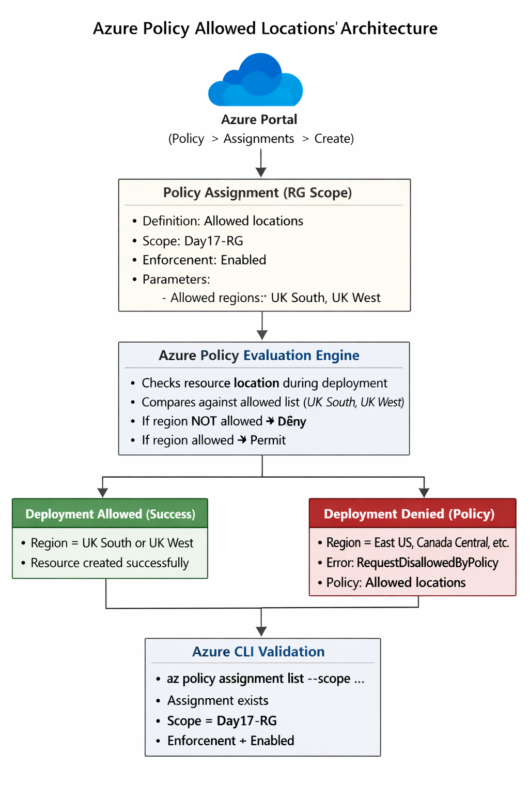
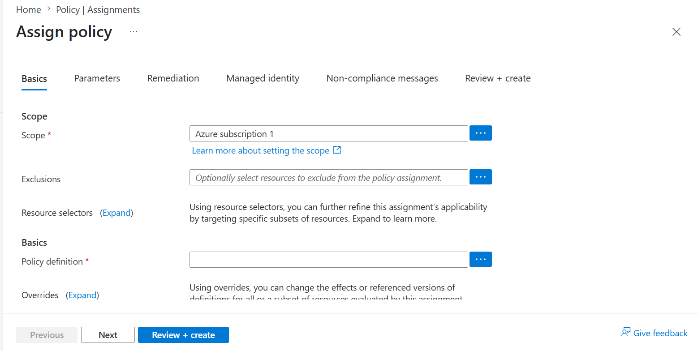
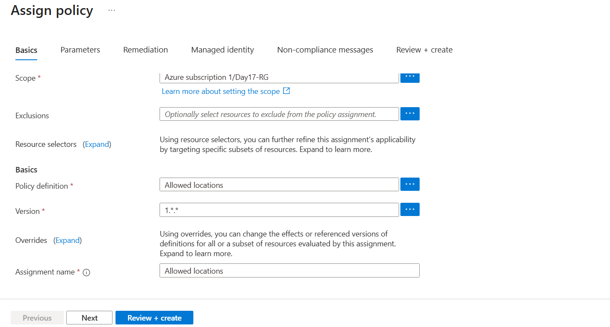
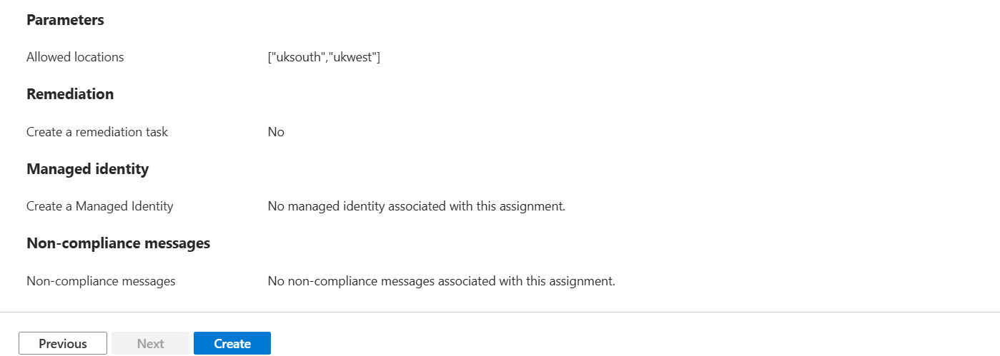
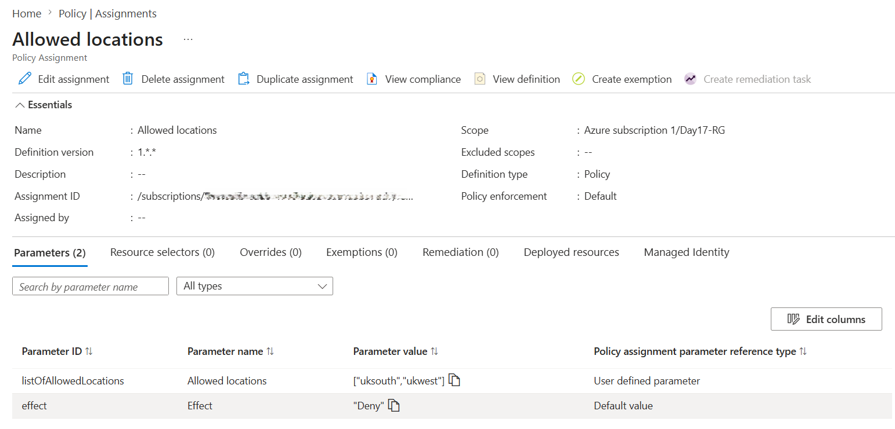
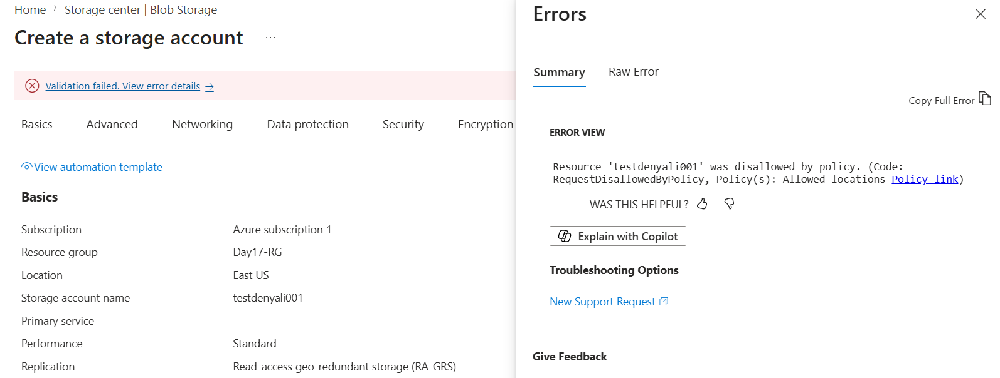
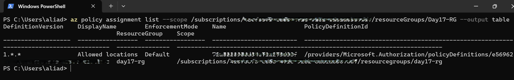

# 📘 Day 17 — Azure Policy: Allowed Locations

**Azure 100 Days of Cloud Challenge — Ali Aden**

---

## 📌 Overview

Today I implemented an Azure Policy to restrict resource deployments to approved regions. The policy allows deployments only in **UK South** and **UK West**, while denying resources deployed to other regions. I validated the policy using both the Azure Portal and Azure CLI.

---

## 🛠 Tools Used

- Azure Portal
- Azure Policy
- Azure Resource Groups
- Azure Storage Accounts
- Azure CLI (Windows PowerShell)

---

## 🧩 Steps Completed

This lab simulates how organisations enforce governance and compliance requirements through Azure Policy.

### 1. Created a Policy Assignment

Selected the built-in **Allowed locations** policy and assigned it to **Day17-RG**.

### 2. Configured Allowed Regions

Specified **UK South** and **UK West** as the only approved deployment locations.

### 3. Enabled Policy Enforcement

Configured the policy effect as **Deny** to block non-compliant deployments.

### 4. Tested a Non-Compliant Deployment

Attempted to deploy a Storage Account in **East US**.

### 5. Confirmed Policy Enforcement

Deployment failed as expected because the selected region was not allowed.

### 6. Validated Using Azure CLI

Used Azure CLI in Windows PowerShell to verify the policy assignment and enforcement status.

---

## 🏗️ Architecture Diagram



This diagram shows how the Allowed Locations policy is assigned, evaluated by Azure Policy, and enforced during resource deployment. Resources deployed in approved regions are allowed, while deployments in non-approved regions are denied and return a policy violation error.

---

## 🔄 Before & After

### Before

- No regional deployment restrictions
- Resources could be created in any Azure region
- No governance enforcement at resource group level

### After

- Deployments restricted to approved UK regions
- Non-compliant deployments automatically denied
- Governance controls enforced consistently
- Policy assignment visible and auditable

---

## ✅ Validation

- Policy assignment created successfully
- Allowed regions configured correctly
- Enforcement mode enabled
- East US deployment denied
- Azure CLI confirmed assignment at resource group scope

---

## 🧠 Skills Demonstrated

- Azure Policy configuration
- Governance and compliance controls
- Resource Group scoped assignments
- Policy enforcement and validation
- Azure CLI administration
- Cloud governance fundamentals

---

## 🛠 Troubleshooting

### Resource Group Creation Was Not Blocked

**Cause:** The Allowed Locations policy evaluates resources, not Resource Groups.

**Fix:** Tested using a Storage Account deployment instead.

### Storage Account Deployment Failed Before Policy Evaluation

**Cause:** Storage account name was already in use.

**Fix:** Created a globally unique storage account name.

### Policy Assignment Not Visible in CLI

**Cause:** Command was executed at the wrong scope.

**Fix:** Queried the policy assignment using the Resource Group scope.

---

## 🔐 Why This Matters

- Supports data residency and compliance requirements
- Prevents deployments in unauthorised regions
- Helps enforce governance standards across environments
- Provides centralised control over resource placement

This is a common governance control used in enterprise Azure environments.

---

## 🧠 What I Learned

- How Azure Policy evaluates resource deployments
- How to restrict deployments to approved regions
- The difference between policy assignment and enforcement
- How to validate policy assignments using Azure CLI
- Why governance controls are important in cloud environments

---

## 📸 Screenshots













---

## 💻 Commands Used

### Log in to Azure

```powershell
az login
```

### View Policy Assignments

```powershell
az policy assignment list --scope /subscriptions/<subscription-id>/resourceGroups/Day17-RG --output table
```

---

## 📄 Sample Output

```text
DisplayName        EnforcementMode
-----------------  ---------------
Allowed locations  Default
```

---

## 🎯 Key Takeaway

Azure Policy provides a powerful governance mechanism that can automatically enforce deployment standards, prevent non-compliant resources from being created, and help organisations maintain consistent cloud governance at scale.
