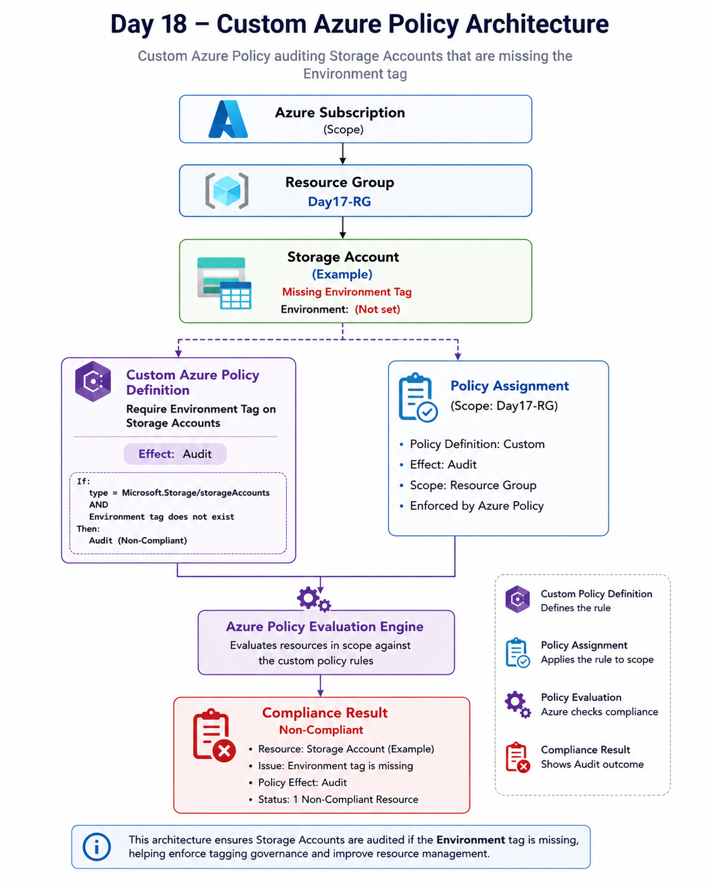
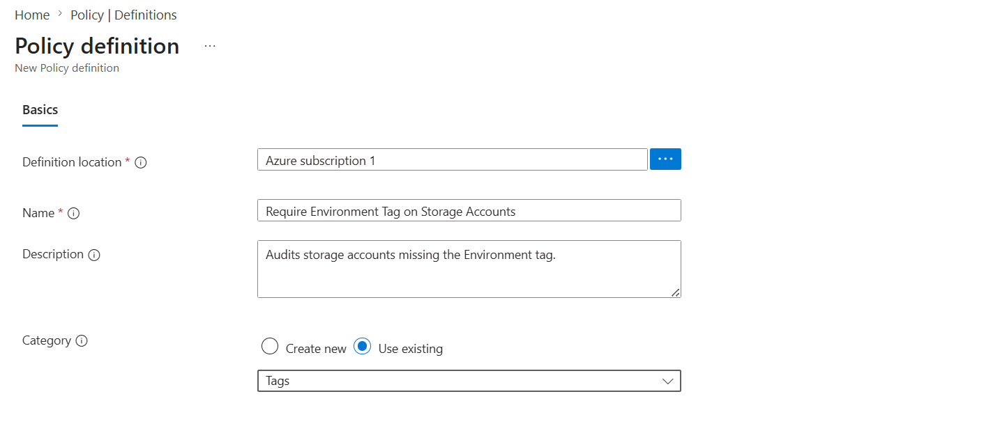
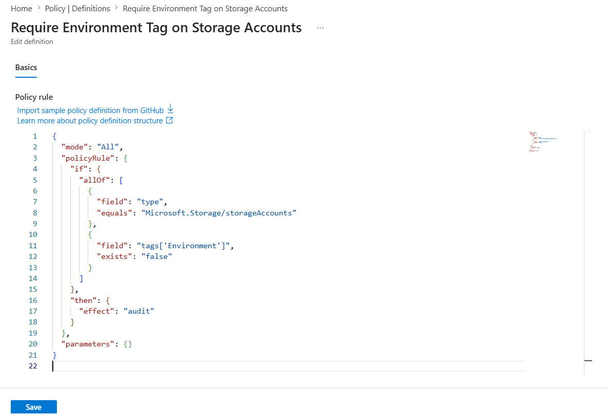
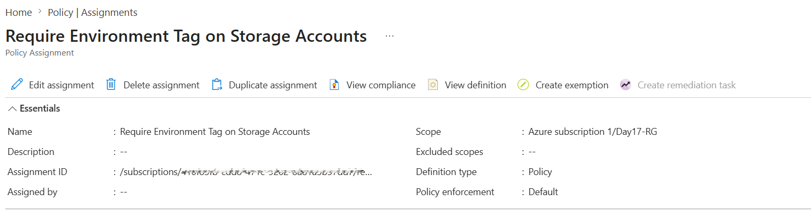
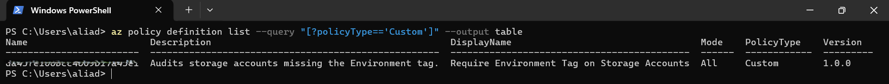
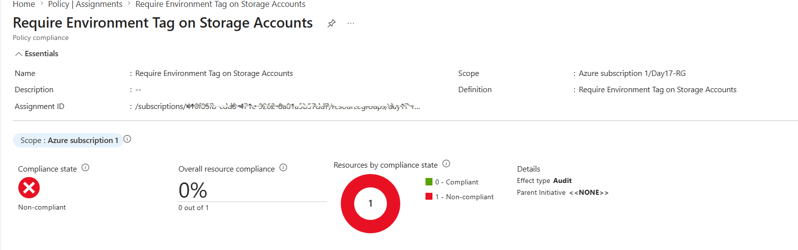

# 📘 Day 18 — Custom Azure Policy: Require Environment Tag on Storage Accounts

**Azure 100 Days of Cloud Challenge — Ali Aden**

---

## 📌 Overview

Today’s challenge focused on Azure Governance using **Custom Azure Policies**.

I created a custom policy that audits Storage Accounts missing the **Environment** tag, assigned it to a Resource Group, validated it using Azure CLI, and confirmed compliance results in the Azure Portal.

---

## 🛠 Tools Used

- Azure Portal
- Azure Policy
- Azure CLI (Local PowerShell)
- Azure Resource Manager (ARM)
- JSON Policy Definitions

---

## 🧩 Steps Completed

### 1. Created a Custom Azure Policy Definition

Built a custom policy using JSON to evaluate Storage Account tags.

### 2. Added the Policy Rule

Configured the policy to audit Storage Accounts that do not contain an **Environment** tag.

### 3. Saved and Validated the Policy

Validated the JSON structure and successfully created the custom policy definition.

### 4. Assigned the Policy

Assigned the policy to **Day17-RG** for compliance evaluation.

### 5. Verified the Policy via Azure CLI

Confirmed the policy appears as a **Custom** policy definition.

### 6. Reviewed Compliance Results

Azure Policy evaluated the Storage Account and flagged it as **Non-compliant** because the required tag was missing.

### 7. Documented Governance Workflow

Captured evidence of policy creation, assignment, validation, and compliance results.

---

## 🏗️ Architecture Diagram



This diagram shows how a custom Azure Policy evaluates Storage Accounts within a Resource Group and audits resources that do not meet tagging requirements.

---

## 🔄 Before & After

### Before

- Storage Account had no Environment tag
- No tagging governance in place
- No compliance monitoring
- Missing visibility into tagging standards

### After

- Custom Azure Policy created
- Policy assigned to Resource Group scope
- Missing tags automatically detected
- Non-compliant resources clearly identified
- Governance controls enforced consistently

---

## ✅ Validation

- Policy definition created successfully
- Policy assignment completed successfully
- Azure CLI confirmed:
  - `PolicyType = Custom`
- Compliance dashboard showed:
  - 1 resource evaluated
  - 1 non-compliant resource
  - Effect = Audit

---

## 🧠 Skills Demonstrated

- Azure Policy creation and management
- Custom policy authoring using JSON
- Governance and compliance enforcement
- Resource tagging strategy
- Azure CLI validation
- Policy assignment and scope management
- Compliance monitoring and reporting

---

## 🛠 Troubleshooting

### JSON Validation Error

**Issue:**

```text
Could not find member 'if'
```

**Fix:**

Wrapped the logic inside `policyRule` and added the required `mode` property.

### Case Sensitivity Error

**Issue:**

```text
allof
```

**Fix:**

Changed to:

```json
allOf
```

### Definition Type Confusion

**Issue:**

Assignment page showed:

```text
Definition type: Policy
```

**Fix:**

This is expected behaviour. Custom classification is visible under **Policy Definitions**, where `PolicyType = Custom`.

---

## 🔐 Why This Matters

Tagging is critical for effective cloud governance because it enables:

- Cost management and chargeback reporting
- Resource ownership tracking
- Automation and lifecycle management
- Compliance and governance controls
- Consistent resource organisation

Custom Azure Policies help enforce these standards automatically and reduce manual oversight.

---

## 🧠 What I Learned

- How to build and structure a custom Azure Policy
- How Azure evaluates compliance
- How to validate policies using Azure CLI
- The difference between `PolicyType` and `DefinitionType`
- How tagging governance works at scale

---

## 📸 Screenshots











---

## 💻 Commands Used

### List Custom Policies

```powershell
az policy definition list --query "[?policyType=='Custom']" --output table
```

---

## 📄 Sample Output

```text
Name                      Description                                           DisplayName                                  Mode    PolicyType    Version
------------------------  ----------------------------------------------------  -------------------------------------------  ------  ------------  ---------
da43fe106bcc4609b17a43e1  Audits storage accounts missing the Environment tag.  Require Environment Tag on Storage Accounts  All     Custom        1.0.0
```

---

## 🎯 Key Takeaway

Azure Policies turn governance into automation by continuously evaluating resources against organisational standards. Custom policies provide a scalable way to enforce compliance, improve consistency, and reduce manual oversight across Azure environments.
