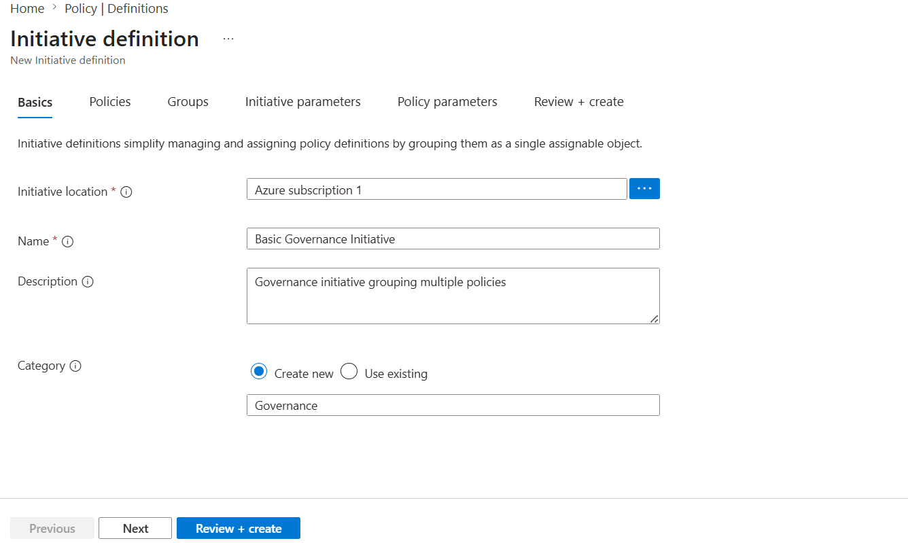
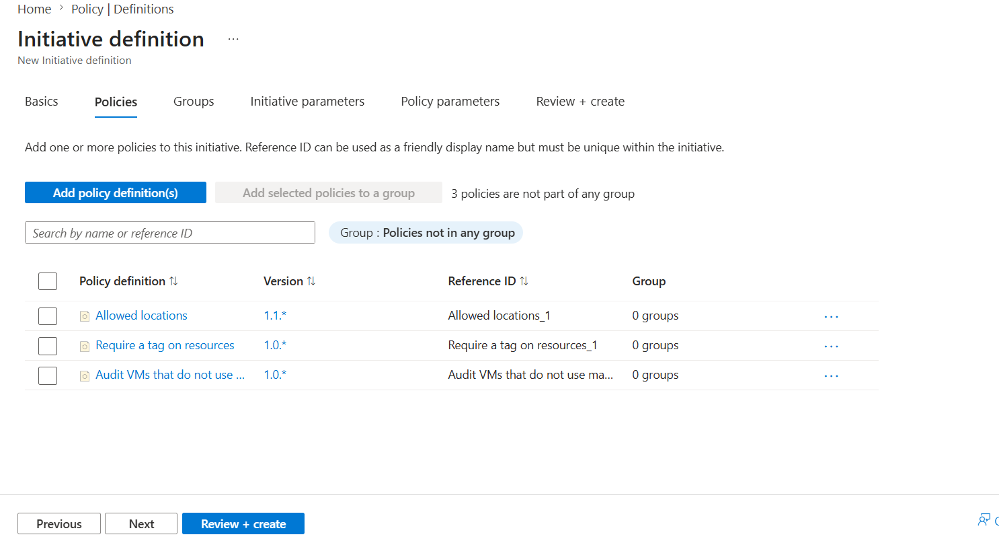
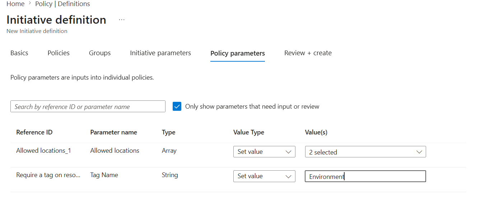
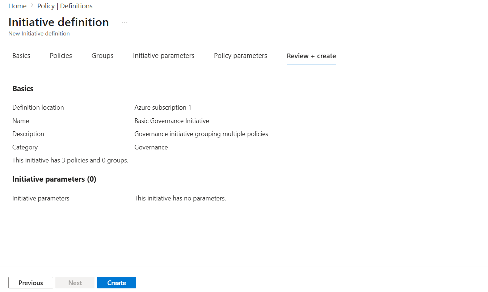
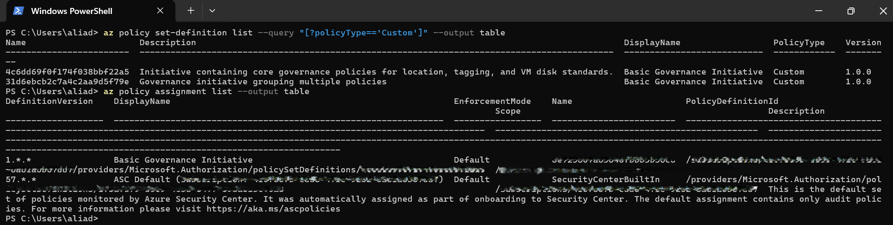
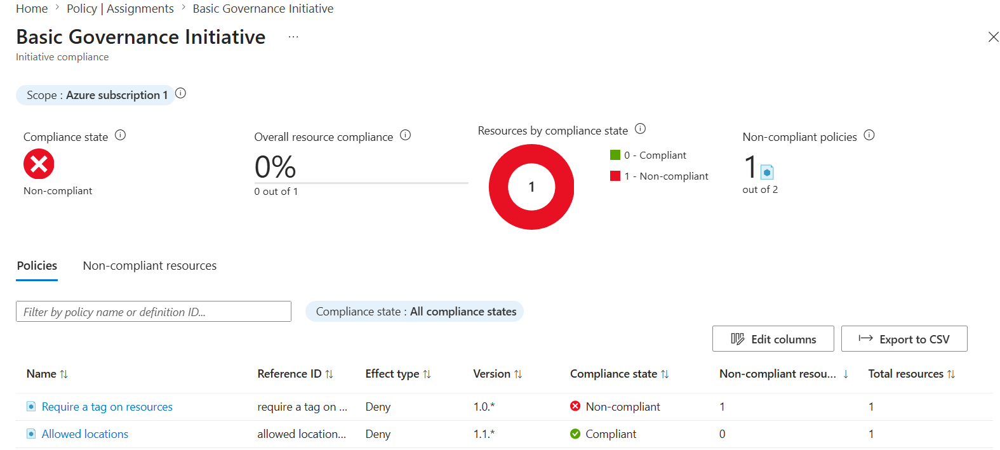
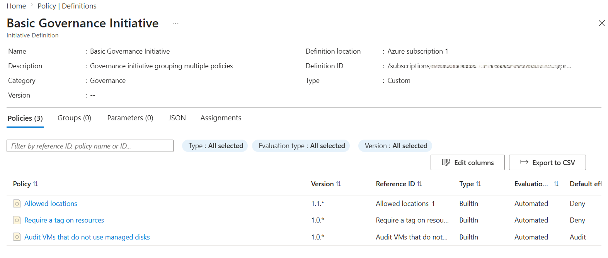

# 📘 Day 19 — Azure Policy Initiative: Basic Governance Controls

**Azure 100 Days of Cloud Challenge — Ali Aden**

---

## 📌 Overview

Today I created a custom Azure Policy Initiative to enforce multiple governance controls through a single assignment. The initiative combines policies for allowed locations, mandatory tagging, and auditing virtual machines without managed disks. I assigned the initiative, configured parameters, validated it using Azure CLI, and reviewed compliance results.

---

## 🛠 Tools Used

- Azure Portal
- Azure Policy
- Azure CLI (Local PowerShell)
- Azure Resource Manager (ARM)

---

## 🧩 Steps Completed

### 1. Created the Initiative Definition
Created a new custom Policy Initiative and configured the basic settings.

### 2. Added Governance Policies
Included three policies within the initiative:

- Allowed Locations
- Required Tag
- Audit VMs Without Managed Disks

### 3. Saved the Initiative
Validated and saved the initiative definition.

### 4. Assigned the Initiative
Assigned the initiative at the subscription scope and configured the required parameters.

### 5. Validated Using Azure CLI
Confirmed the initiative exists and is assigned correctly.

### 6. Reviewed Compliance Results
Checked compliance results for all included policies.

### 7. Verified Final Configuration
Confirmed the initiative definition and assignment settings were correct.

---

## 🏗️ Architecture Diagram

```text
                    Azure Subscription
                             │
                             ▼

                 Policy Initiative
         "Basic Governance Initiative"

                             │
                             ▼

                 Initiative Assignment
                  (Subscription Scope)

                             │
       ┌─────────────────────┼─────────────────────┐
       │                     │                     │
       ▼                     ▼                     ▼

Allowed Locations     Required Tag      Audit VMs Without
      Policy             Policy           Managed Disks

       │                     │                     │
       └─────────────────────┼─────────────────────┘
                             ▼

               Azure Policy Evaluation

                             ▼

                  Compliance Results

        Allowed Locations      → Compliant
        Require a Tag          → Non-Compliant

        Overall Compliance     → 0%
```

---

## 🔄 Before & After

### Before

- No governance controls applied
- No tagging enforcement
- No location restrictions
- No VM disk auditing
- No centralised policy management

### After

- Policy Initiative created and assigned
- Allowed locations enforced
- Required tag policy active
- VM auditing enabled
- Compliance reporting available
- Centralised governance management established

---

## ✅ Validation

- Initiative definition created successfully
- Initiative assignment confirmed
- Azure CLI returned initiative information
- Compliance results visible in Azure Portal
- All three policies evaluated correctly

---

## 🧠 Skills Demonstrated

- Azure Policy Initiative creation
- Governance and compliance design
- Policy assignment and parameter management
- Azure CLI validation and auditing
- Understanding policy effects (Audit and Deny)
- Subscription-level governance controls

---

## 🛠 Troubleshooting

### Missing Tag Parameters

**Issue:** Initiative assignment required additional tag parameters.

**Fix:** Configured the required parameter values during assignment.

### Compliance Results Not Updating

**Issue:** Compliance state did not refresh immediately.

**Fix:** Waited for Azure Policy evaluation cycle and refreshed the Compliance blade.

### CLI Output Not Matching Portal

**Issue:** Assignment scope confusion.

**Fix:** Verified the initiative assignment scope before running validation commands.

---

## 🔐 Why This Matters

Governance is essential for controlling cloud sprawl, enforcing organisational standards, and maintaining compliance.

Policy Initiatives allow multiple governance controls to be managed through a single assignment, making governance more scalable, consistent, and easier to administer across large environments.

---

## 🧠 What I Learned

- How to group multiple policies into a single initiative
- How initiative assignments simplify governance
- How Azure evaluates compliance across multiple policies
- How to validate initiatives using Azure CLI
- How centralised governance improves consistency and compliance

---

## 📸 Screenshots















---

## 💻 Commands Used

### List Custom Policy Initiatives

```powershell
az policy set-definition list --query "[?policyType=='Custom']" --output table
```

### View Policy Assignments

```powershell
az policy assignment list --output table
```

---

## 📄 Sample Output

```text
Name                      DisplayName                  PolicyType
------------------------  ---------------------------  ----------
4c6dd69f0f174f038bbf22a5  Basic Governance Initiative  Custom
31d6ebcb2c7a4c2aa9d5f79e  Basic Governance Initiative  Custom
```

---

## 🎯 Key Takeaway

Policy Initiatives allow multiple governance controls to be managed and enforced through a single assignment, making compliance easier to implement, monitor, and scale across Azure environments.
