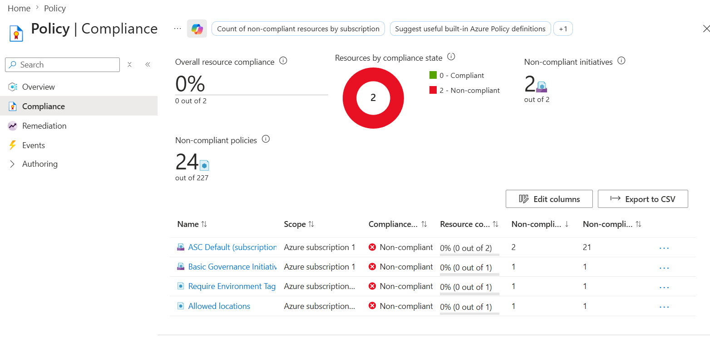
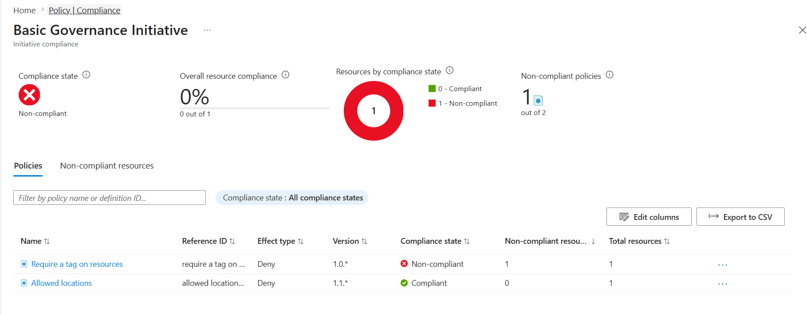
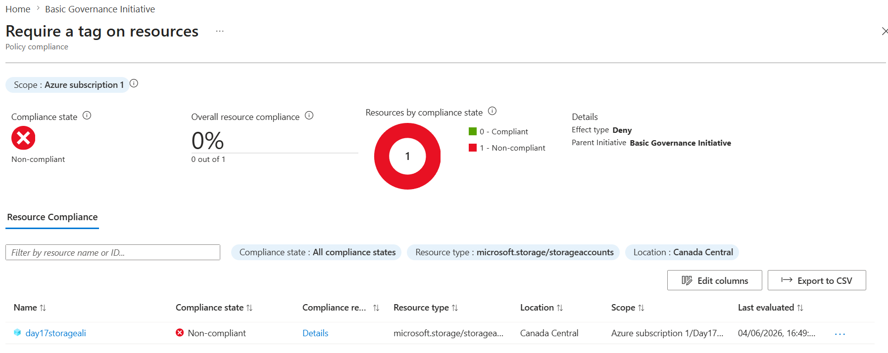
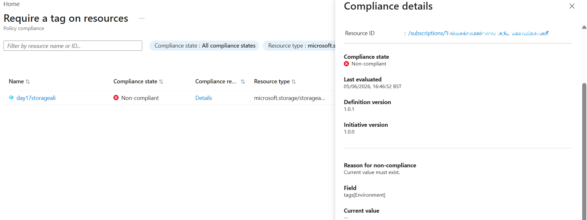
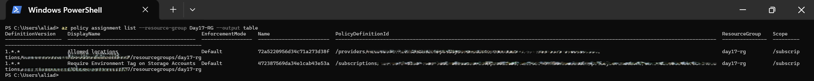

# 📘 Day 20 — Review Policy Compliance Reports & Non-Compliant Resources

**Azure 100 Days of Cloud Challenge — Ali Aden**

---

## 📌 Overview

Today I reviewed Azure Policy compliance reports to understand how Azure evaluates resources against assigned governance policies. I investigated non-compliant resources, identified the reason for policy violations, and validated policy assignments using Azure CLI.

This exercise builds on the governance controls implemented in previous challenges and demonstrates how Azure administrators monitor and investigate compliance issues.

---

## 🛠 Tools Used

* Azure Portal
* Azure Policy
* Azure Policy Compliance Dashboard
* Azure CLI (Windows PowerShell)

---

## 🧩 Steps Completed

This lab simulates how Azure administrators review governance compliance and investigate policy violations.

### 1. Opened the Compliance Dashboard

Accessed the Azure Policy Compliance dashboard to review the overall compliance state of assigned policies and initiatives.

### 2. Reviewed Policy Initiative Compliance

Opened the **Basic Governance Initiative** and examined the compliance status of individual policies.

### 3. Identified a Non-Compliant Resource

Investigated policy evaluation results and located a Storage Account that was failing a policy requirement.

### 4. Analysed the Policy Violation

Reviewed the compliance details and identified the exact reason for the policy failure.

### 5. Validated Policy Assignments Using Azure CLI

Used Azure CLI in Windows PowerShell to confirm the policy assignments applied to the Resource Group.

---

## 🏗️ Architecture Diagram

```text
                 Basic Governance Initiative
                                │
                                ▼

                  Azure Policy Evaluation

                                │
                                ▼

                   Storage Account Resource

                                │
                                ▼

                  Environment Tag Validation

                                │
                  ┌─────────────┴─────────────┐
                  │                           │
                  ▼                           ▼

             Tag Exists                Tag Missing

             Compliant               Non-Compliant

                  │                           │
                  └─────────────┬─────────────┘
                                ▼

                   Compliance Dashboard

                                │
                                ▼

                 Portal & CLI Validation
```

---

## 🔄 Before & After

### Before

* No visibility into policy compliance status
* Non-compliant resources not identified
* Policy violations not investigated
* No CLI validation performed

### After

* Compliance dashboard reviewed
* Policy initiative compliance analysed
* Non-compliant resource identified
* Root cause of policy violation confirmed
* CLI validation completed

---

## ✅ Validation

* Compliance dashboard displayed policy results
* Policy initiative compliance reviewed successfully
* Non-compliant Storage Account identified
* Missing Environment tag confirmed as the cause
* Azure CLI returned policy assignment information

---

## 🧠 Skills Demonstrated

* Azure Policy compliance monitoring
* Governance reporting and analysis
* Non-compliant resource investigation
* Root cause analysis
* Azure CLI validation
* Cloud governance operations

---

## 🛠 Troubleshooting

### Compliance Results Not Updating

**Cause:** Azure Policy evaluations had not completed yet.

**Fix:** Triggered a policy evaluation scan and refreshed the Compliance dashboard.

### Resource Appeared Non-Compliant

**Cause:** Required Environment tag was missing from the Storage Account.

**Fix:** Reviewed policy evaluation details to identify the missing tag requirement.

### CLI Output Did Not Return Expected Results

**Cause:** Initial query format did not match the returned policy state data.

**Fix:** Used policy assignment commands to validate the applied governance controls.

---

## 🔐 Why This Matters

* Helps organisations measure governance compliance
* Identifies resources that violate policy requirements
* Supports audit and compliance reporting
* Enables administrators to investigate and remediate issues quickly

Monitoring compliance is just as important as creating policies because governance controls must be continuously validated and maintained.

---

## 🧠 What I Learned

* How Azure Policy measures compliance
* How to investigate non-compliant resources
* How to identify the root cause of policy violations
* How policy initiatives aggregate multiple governance controls
* How to validate policy assignments using Azure CLI

---

## 📸 Screenshots











---

## 💻 Commands Used

### View Policy Assignments

```powershell
az policy assignment list --resource-group Day17-RG --output table
```

### Trigger Policy Evaluation Scan

```powershell
az policy state trigger-scan --resource-group Day17-RG
```

---

## 📄 Sample Output

```text
DisplayName
-------------------------------------------
Allowed locations
Require Environment Tag on Storage Accounts
```

---

## 🎯 Key Takeaway

Creating policies is only the first step in governance. Azure administrators must also monitor compliance, investigate non-compliant resources, understand why policy violations occur, and validate governance controls through both the Azure Portal and Azure CLI.

