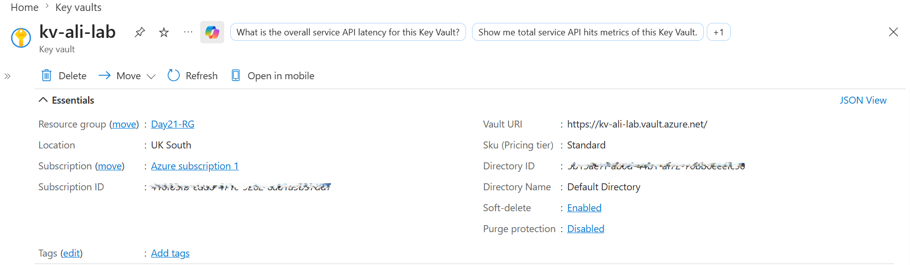
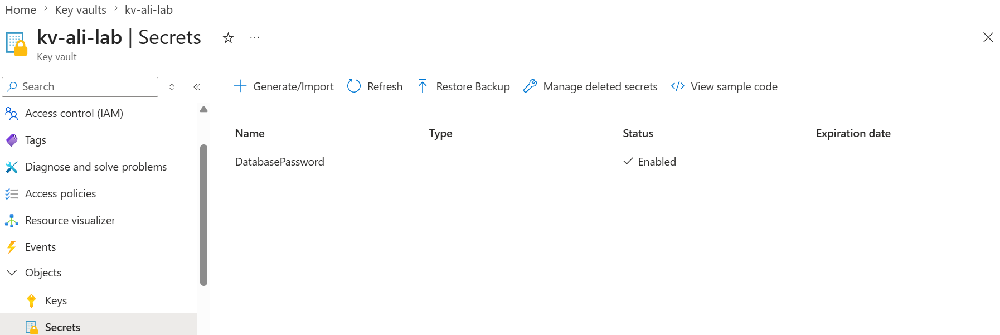
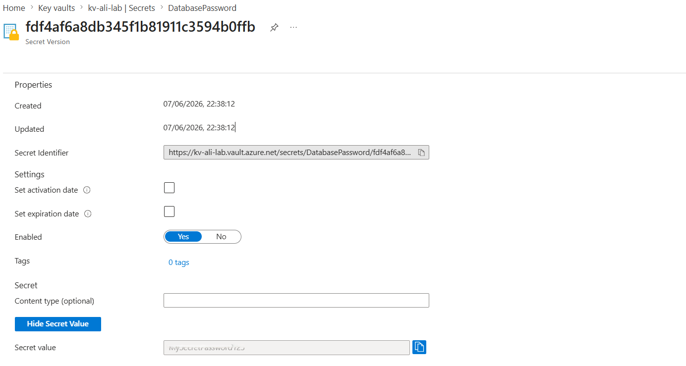
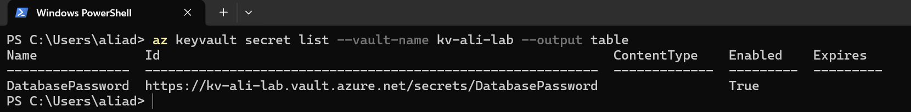
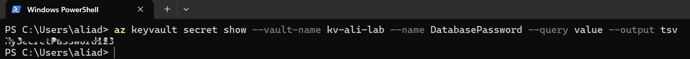

# 📘 Day 21 — Azure Key Vault: Store and Retrieve Secrets

**Azure 100 Days of Cloud Challenge — Ali Aden**

---

## 📌 Overview

Today I created an Azure Key Vault and stored my first secret securely. I then retrieved the secret using both the Azure Portal and Azure CLI to understand how Azure Key Vault protects sensitive information such as passwords, API keys, and connection strings.

This exercise demonstrates how organisations securely manage credentials without storing them directly in application code or configuration files.

---

## 🛠 Tools Used

* Azure Portal
* Azure Key Vault
* Azure RBAC
* Azure CLI (Windows PowerShell)

---

## 🧩 Steps Completed

This lab simulates secure credential management using Azure Key Vault.

### 1. Created an Azure Key Vault

Deployed a new Key Vault in Azure using the Standard pricing tier and UK South region.

### 2. Configured Access Permissions

Assigned the Key Vault Administrator role using Azure RBAC to allow secret management operations.

### 3. Created a Secret

Stored a secret named **DatabasePassword** inside the Key Vault.

### 4. Retrieved the Secret in the Azure Portal

Opened the secret version and verified that the stored value could be retrieved successfully.

### 5. Retrieved the Secret Using Azure CLI

Used Azure CLI in Windows PowerShell to list available secrets and retrieve the secret value programmatically.

### 6. Reviewed the Vault URI

Located the Vault URI used by applications and services to securely access Key Vault resources.

---

## 🏗️ Architecture Diagram

```text
                      Application / User
                               │
                               ▼

                      Azure Key Vault

                               │
                 ┌─────────────┴─────────────┐
                 │                           │
                 ▼                           ▼

          Store Secret                Retrieve Secret

                 │                           │
                 └─────────────┬─────────────┘
                               ▼

                     DatabasePassword

                               │
                               ▼

                  Portal & CLI Access
```

---

## 🔄 Before & After

### Before

* No secure secret storage
* Credentials could be stored in scripts or applications
* No centralised secret management
* No audit trail for secret access

### After

* Azure Key Vault deployed successfully
* Secret stored securely
* Secret retrieved through Portal and CLI
* Vault URI available for application integration
* Access controlled through Azure RBAC

---

## ✅ Validation

* Key Vault deployed successfully
* DatabasePassword secret created
* Secret value retrieved in Azure Portal
* Azure CLI listed secrets successfully
* Azure CLI retrieved secret value successfully
* Vault URI confirmed on the Key Vault overview page

---

## 🧠 Skills Demonstrated

* Azure Key Vault deployment
* Secret management
* Azure RBAC permissions
* Secure credential storage
* Azure CLI administration
* Cloud security fundamentals

---

## 🛠 Troubleshooting

### Key Vault Deployment Blocked by Azure Policy

**Cause:** Existing governance policies required resources to meet specific compliance requirements.

**Fix:** Reviewed policy configuration and adjusted deployment settings before creating the Key Vault.

### Unable to Create Secrets

**Cause:** Azure RBAC permissions had not been assigned to the user account.

**Fix:** Assigned the **Key Vault Administrator** role and waited for permissions to propagate.

### Secret Access Denied

**Cause:** RBAC permissions were not yet active.

**Fix:** Allowed Azure several minutes to apply the new role assignment before retrying.

---

## 🔐 Why This Matters

* Prevents sensitive credentials from being stored in source code
* Provides centralised secret management
* Supports secure application authentication
* Improves auditability and governance
* Reduces the risk of credential exposure

Azure Key Vault is a foundational security service used across Azure environments to protect sensitive information.

---

## 🧠 What I Learned

* How Azure Key Vault securely stores secrets
* How Azure RBAC controls access to Key Vault resources
* How to retrieve secrets through the Azure Portal
* How applications can access secrets using the Vault URI
* How to use Azure CLI to manage and retrieve secrets

---

## 📸 Screenshots











---

## 💻 Commands Used

### List Secrets

```powershell
az keyvault secret list --vault-name kv-ali-lab --output table
```

### Retrieve Secret Value

```powershell
az keyvault secret show --vault-name kv-ali-lab --name DatabasePassword --query value --output tsv
```

---

## 📄 Sample Output

```text
Name
----------------
DatabasePassword
```

---

## 🎯 Key Takeaway

Azure Key Vault provides a secure and centralised way to store and manage sensitive information. Instead of embedding passwords or connection strings directly into code, applications can retrieve secrets securely from Key Vault, reducing security risks and supporting enterprise-grade credential management.

