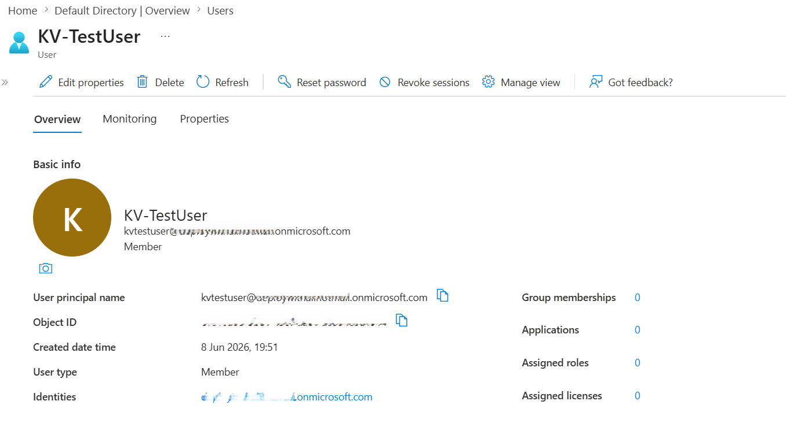
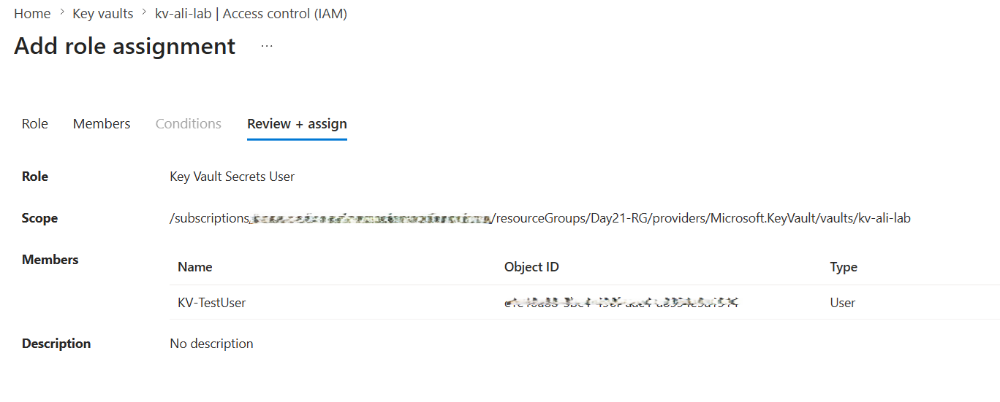
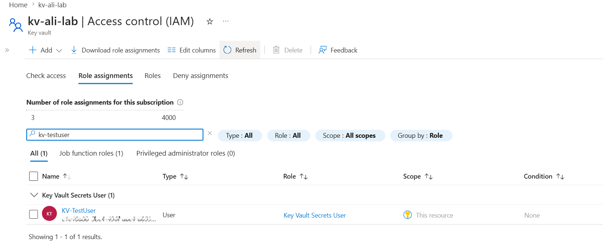
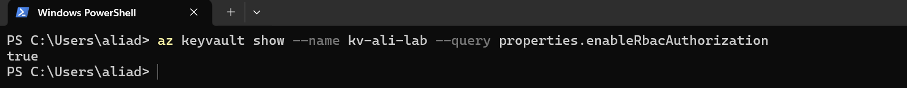
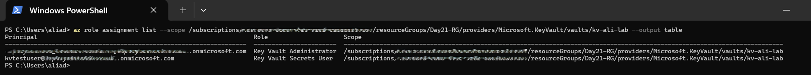

# 📘 Day 22 — Configure Key Vault Access Policies and RBAC

**Azure 100 Days of Cloud Challenge — Ali Aden**

---

## 📌 Overview

Today I configured and validated Azure Key Vault access using Azure Role-Based Access Control (RBAC). I created a dedicated Microsoft Entra ID test user, assigned the **Key Vault Secrets User** role, and verified role assignments using both the Azure Portal and Azure CLI.

This lab demonstrates how Azure RBAC can be used to securely control access to secrets stored in Azure Key Vault while enforcing the principle of least privilege.

---

## 🛠 Tools Used

* Azure Portal
* Azure Key Vault
* Microsoft Entra ID
* Azure RBAC
* Azure CLI (Windows PowerShell)

---

## 🧩 Steps Completed

This setup simulates secure access management for Azure Key Vault resources.

### 1. Created a Test User

Created a dedicated Microsoft Entra ID user named **KV-TestUser** to simulate a separate identity for RBAC testing.

### 2. Reviewed Key Vault Permission Model

Confirmed that **Azure RBAC** was enabled as the active permission model for the Key Vault.

### 3. Assigned Key Vault Secrets User Role

Assigned the **Key Vault Secrets User** role to **KV-TestUser** through the Key Vault IAM blade.

### 4. Verified Role Assignment

Confirmed the role assignment was successfully applied through the Azure Portal.

### 5. Validated RBAC Configuration via Azure CLI

Used Azure CLI to confirm:

* RBAC is enabled
* Role assignments exist
* Permissions are applied correctly

---

## 🏗️ Architecture Diagram

```text
                   Microsoft Entra ID

                           │
                           ▼

                      KV-TestUser

                           │

         Key Vault Secrets User (RBAC Role)

                           │
                           ▼

                    Azure Key Vault

                           │
                  ┌────────┴────────┐
                  │                 │
                  ▼                 ▼

             Read Secrets     List Secrets

                  │
                  ▼

             Secret Access
```

This diagram shows how Azure RBAC controls access to Azure Key Vault by assigning built-in roles to identities. The Key Vault Secrets User role provides read-only access to secrets, while administrative permissions remain restricted to the Key Vault Administrator role.

---

## 🔄 Before & After

### Before

* No dedicated test user existed
* No RBAC role assignment for Key Vault access
* Secret access permissions not validated
* No CLI verification performed

### After

* Test user successfully created
* Key Vault Secrets User role assigned
* RBAC permission model validated
* Role assignments confirmed through CLI
* Access management documented and verified

---

## ✅ Validation

* Azure RBAC confirmed as the active permission model
* KV-TestUser successfully created
* Key Vault Secrets User role assigned
* IAM shows the correct role assignment
* Azure CLI confirms RBAC is enabled
* Azure CLI lists Key Vault role assignments successfully

---

## 🧠 Skills Demonstrated

* Azure Key Vault access management
* Azure RBAC role assignment
* Microsoft Entra ID user administration
* Identity and access governance
* Azure CLI validation
* Principle of least privilege

---

## 🛠 Troubleshooting

### Key Vault Access Permissions

Reviewed existing Key Vault role assignments to ensure the correct RBAC roles were applied before assigning access to the test user.

### Role Assignment Validation

Used Azure CLI to verify RBAC configuration and confirm role assignments had propagated successfully.

---

## 🔐 Why This Matters

* Protects sensitive information stored in Azure Key Vault
* Prevents excessive permissions being granted to users
* Supports least privilege access control
* Simplifies centralized permission management
* Improves governance and auditing capabilities

Azure RBAC is Microsoft's recommended approach for managing access to Azure Key Vault resources.

---

## 🧠 What I Learned

* The difference between Key Vault RBAC and legacy Access Policies
* How Azure RBAC controls access to Key Vault resources
* How to assign built-in Key Vault roles
* How to validate RBAC configuration using Azure CLI
* Why least privilege access is important for cloud security

---

## 📸 Screenshots











---

## 💻 Commands Used

### Verify RBAC is Enabled

```powershell
az keyvault show --name kv-ali-lab --query properties.enableRbacAuthorization
```

### List Key Vault Role Assignments

```powershell
az role assignment list --scope /subscriptions/<subscription-id>/resourceGroups/Day21-RG/providers/Microsoft.KeyVault/vaults/kv-ali-lab --output table
```

---

## 📄 Sample Output (Sanitised)

```text
Principal        Role
---------------  -----------------------
Administrator    Key Vault Administrator
KV-TestUser      Key Vault Secrets User
```

---

## 🎯 Key Takeaway

Azure RBAC provides centralized and scalable access control for Azure Key Vault. By assigning specific roles such as **Key Vault Secrets User**, organizations can enforce least privilege access and ensure sensitive secrets remain protected while still being available to authorized users.

