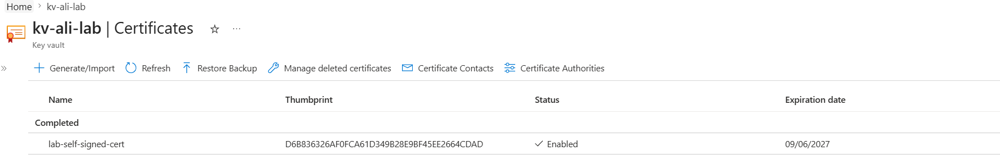
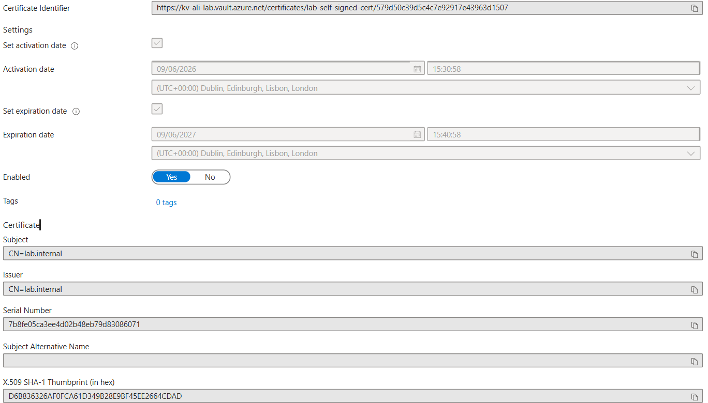
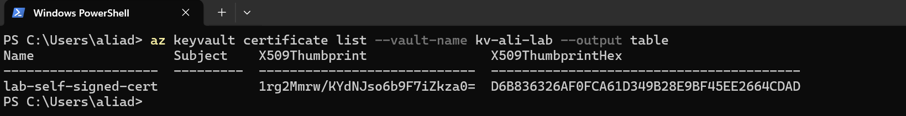
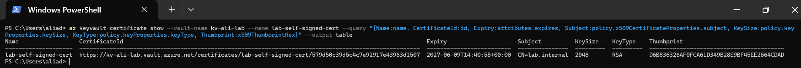

# 📘 Day 23 — Store and Retrieve Certificates in Azure Key Vault

**Azure 100 Days of Cloud Challenge — Ali Aden**

---

## 📌 Overview

Today I generated a self-signed certificate within Azure Key Vault, reviewed its properties, downloaded it in PFX format, and validated its configuration using Azure CLI.

This challenge demonstrates how Azure Key Vault securely manages certificates, private keys, and certificate lifecycle operations while providing centralized certificate management for cloud applications and services.

---

## 🛠 Tools Used

* Azure Portal
* Azure Key Vault
* Azure CLI (Windows PowerShell)
* Self-Signed Certificates

---

## 🧩 Steps Completed

This setup demonstrates how Azure Key Vault can generate, store, and manage certificates securely.

### 1. Created a Self-Signed Certificate

Generated a new self-signed certificate named **lab-self-signed-cert** within Azure Key Vault using the subject **CN=lab.internal**.

### 2. Reviewed Certificate Properties

Reviewed the certificate details including:

* Certificate Identifier URI
* Activation Date
* Expiry Date
* Subject Name
* Certificate Thumbprint

### 3. Downloaded the Certificate

Downloaded the certificate in PFX format from Azure Key Vault for testing purposes.

### 4. Validated the Certificate via Azure CLI

Used Azure CLI to:

* List certificates stored in the vault
* Retrieve certificate details
* Review key certificate properties
* Validate certificate lifecycle information

---

## 🏗️ Architecture Diagram

```text
                     Azure Key Vault
                        kv-ali-lab

                             │
                             ▼

                 Self-Signed Certificate
                 lab-self-signed-cert

                             │

            ┌────────────────┴───────────────┐
            │                                │
            ▼                                ▼

      Azure Portal                     Azure CLI

            │                                │

            ▼                                ▼

 Certificate Details            Certificate Validation

            │                                │

            └──────────────┬─────────────────┘
                           │
                           ▼

                Thumbprint • Expiry Date
                Subject • Certificate URI
```

This diagram shows how Azure Key Vault centrally manages certificates while allowing administrators to review and validate certificate information through both the Azure Portal and Azure CLI.

---

## 🔄 Before & After

### Before

* No certificates existed within the Key Vault
* No certificate lifecycle information was available
* No certificate validation had been performed
* No certificate had been downloaded

### After

* Self-signed certificate successfully created
* Certificate properties reviewed and documented
* Certificate downloaded in PFX format
* Certificate validated through Azure CLI
* Certificate lifecycle information confirmed

---

## ✅ Validation

* Self-signed certificate created successfully
* Certificate appears in Azure Key Vault
* Certificate thumbprint visible
* Certificate identifier URI available
* Certificate expiry date confirmed
* PFX certificate downloaded successfully
* Azure CLI validation completed successfully

---

## 🧠 Skills Demonstrated

* Azure Key Vault certificate management
* Certificate lifecycle management
* Self-signed certificate generation
* Azure CLI validation
* Certificate property analysis
* Secure certificate storage

---

## 🛠 Troubleshooting

### Certificate Download

When downloading the certificate, Windows automatically launched the Certificate Import Wizard. The downloaded PFX file was successfully saved to the local Downloads folder and the import wizard was cancelled as importing the certificate was not required for this challenge.

### CLI Output Formatting

The default certificate details command returned a large Base64 encoded certificate value which made validation difficult. A filtered Azure CLI query was used to display only the most relevant certificate information.

---

## 🔐 Why This Matters

* Certificates are used for authentication, encryption, and secure communications
* Azure Key Vault centralizes certificate management
* Certificate expiry tracking helps prevent service outages
* Private keys remain protected within Key Vault
* Certificate lifecycle operations can be automated

Organizations rely on certificate management to secure applications, APIs, and cloud services across their environments.

---

## 🧠 What I Learned

* How to generate self-signed certificates in Azure Key Vault
* How Azure Key Vault stores certificate metadata and private keys
* How certificate thumbprints uniquely identify certificates
* How to retrieve certificate information using Azure CLI
* Why certificate lifecycle management is important for cloud security

---

## 📸 Screenshots









---

## 💻 Commands Used

### List Certificates

```powershell
az keyvault certificate list --vault-name kv-ali-lab --output table
```

### View Certificate Details

```powershell
az keyvault certificate show --vault-name kv-ali-lab --name lab-self-signed-cert
```

### Display Key Certificate Information

```powershell
az keyvault certificate show --vault-name kv-ali-lab --name lab-self-signed-cert --query "{Name:name, CertificateId:id, Expiry:attributes.expires, Subject:policy.x509CertificateProperties.subject, KeySize:policy.keyProperties.keySize, KeyType:policy.keyProperties.keyType, Thumbprint:x509ThumbprintHex}" --output table
```

---

## 📄 Sample Output (Sanitised)

```text
Name                  CertificateId                           Expiry                     Subject
--------------------  --------------------------------------  -------------------------  ---------------
lab-self-signed-cert  https://kv-ali-lab.vault.azure.net/...  2027-06-09T14:40:58+00:00 CN=lab.internal
```

---

## 🎯 Key Takeaway

Azure Key Vault simplifies certificate management by securely generating, storing, tracking, and validating certificates in a centralized location. By using Key Vault, organizations can reduce the risk of certificate-related outages, improve security, and better manage certificate lifecycle operations across cloud environments. 

