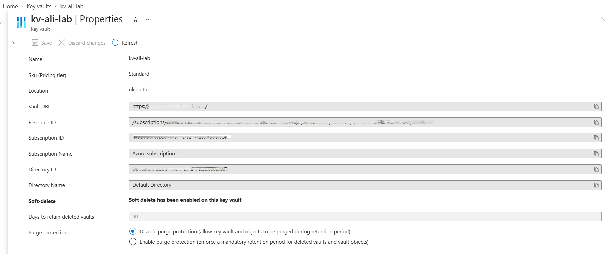
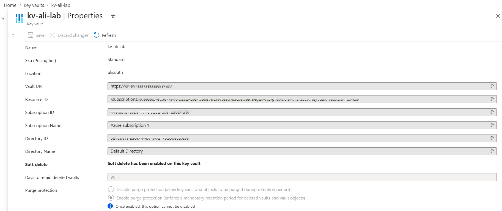
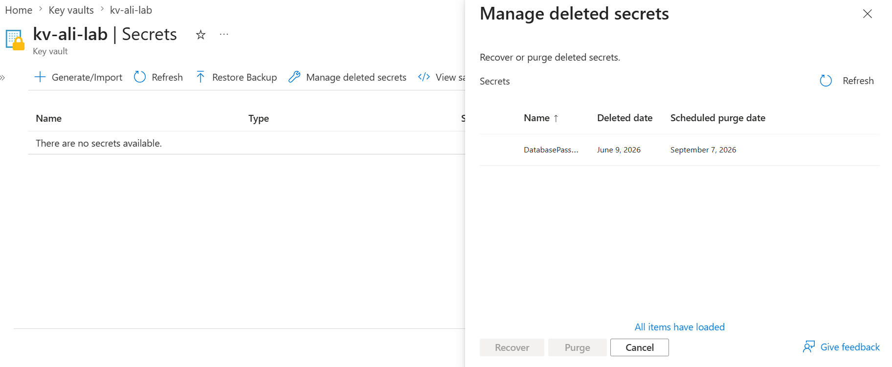
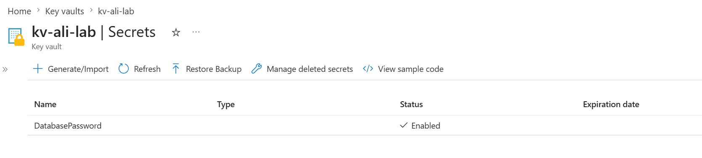

# 📘 Day 24 — Enable Soft Delete and Purge Protection on Key Vault

**Azure 100 Days of Cloud Challenge — Ali Aden**

---

## 📌 Overview

Today I enabled **Purge Protection** on Azure Key Vault and tested the **Soft Delete** recovery process using an existing secret. I deleted the `DatabasePassword` secret, verified it was moved to the deleted secrets container, reviewed the scheduled purge date, and successfully recovered it.

This challenge demonstrates how Azure Key Vault protects critical secrets from accidental deletion, malicious actions, and insider threats by combining Soft Delete and Purge Protection.

---

## 🛠 Tools Used

* Azure Portal
* Azure Key Vault
* Azure RBAC
* Azure CLI (Windows PowerShell)

---

## 🧩 Steps Completed

This setup demonstrates how Azure Key Vault protects secrets from permanent deletion.

### 1. Reviewed Key Vault Protection Settings

Verified that:

* Soft Delete was already enabled
* Retention period was configured for 90 days
* Purge Protection was not yet enabled

### 2. Enabled Purge Protection

Enabled Purge Protection within the Key Vault properties blade.

This ensures that deleted secrets cannot be permanently removed during the retention period, even by administrators.

### 3. Tested Soft Delete

Deleted the existing `DatabasePassword` secret from Azure Key Vault.

The secret immediately disappeared from the active secrets list and was moved into the deleted secrets container.

### 4. Verified Deleted Secret Recovery

Opened the deleted secrets container and confirmed:

* Secret name was visible
* Deletion date was recorded
* Scheduled purge date was automatically generated

### 5. Recovered the Secret

Recovered the deleted secret and confirmed it reappeared in the active secrets list without requiring recreation.

### 6. Validated via Azure CLI

Executed Azure CLI commands to review deleted secrets and confirm the recovery process completed successfully.

---

## 🏗️ Architecture Diagram

```text
                    Azure Key Vault
                       kv-ali-lab

                             │
                             ▼

                    DatabasePassword
                       (Active)

                             │
                        Delete Secret
                             ▼

                  Soft Delete Protection

                             │
                             ▼

                 Deleted Secrets Container

                             │
                Retained for 90 Days

                             │
                             ▼

                    Purge Protection

      Prevents Permanent Deletion During
             Retention Period

                             │
                             ▼

                     Recover Secret

                             │
                             ▼

                    DatabasePassword
                       (Restored)
```

This diagram shows how Soft Delete moves deleted secrets into a recoverable state while Purge Protection prevents permanent removal during the retention period.

---

## 🔄 Before & After

### Before

* Soft Delete enabled
* Purge Protection disabled
* Secret stored in active secrets list
* No deletion recovery tested

### After

* Purge Protection enabled
* Secret successfully deleted
* Secret moved to deleted secrets container
* Scheduled purge date generated
* Secret successfully recovered
* Recovery process validated

---

## ✅ Validation

* Soft Delete confirmed as enabled
* Retention period confirmed as 90 days
* Purge Protection enabled successfully
* DatabasePassword secret deleted successfully
* Deleted secret appeared in deleted secrets container
* Scheduled purge date displayed
* Secret recovered successfully
* Secret restored to active secrets list

---

## 🧠 Skills Demonstrated

* Azure Key Vault administration
* Soft Delete configuration
* Purge Protection configuration
* Secret lifecycle management
* Secret recovery operations
* Azure security best practices
* Data protection and recovery

---

## 🛠 Troubleshooting

### Purge Protection Warning

Azure displays a warning when enabling Purge Protection because the setting cannot be disabled after activation. This is intentional and designed to prevent administrators from bypassing retention controls.

### Deleted Secret Recovery

After deletion, the secret no longer appeared in the active secrets list. Recovery was performed through the deleted secrets container, restoring the secret without requiring recreation.

### CLI Validation

After recovering the secret, the deleted secrets container was empty when queried through Azure CLI. This behaviour is expected because the secret had already been restored.

---

## 🔐 Why This Matters

* Protects against accidental secret deletion
* Protects against malicious insider actions
* Supports business continuity and disaster recovery
* Prevents permanent deletion during the retention period
* Reduces the risk of application outages caused by missing secrets

Soft Delete and Purge Protection are critical safeguards for protecting sensitive data stored within Azure Key Vault.

---

## 🧠 What I Learned

* How Soft Delete protects Key Vault secrets from permanent deletion
* How Purge Protection strengthens recovery safeguards
* How deleted secrets are retained during the recovery window
* How to recover deleted secrets through Azure Portal
* Why Purge Protection cannot be disabled once enabled
* How Azure Key Vault supports secure data recovery operations

---

## 📸 Screenshots









---

## 💻 Commands Used

### List Deleted Secrets

```powershell
az keyvault secret list-deleted --vault-name kv-ali-lab --output table
```

---

## 📄 Sample Output (Sanitised)

```text
Deleted Secrets
---------------
DatabasePassword
```

---

## 🎯 Key Takeaway

Soft Delete and Purge Protection provide essential safeguards for Azure Key Vault by ensuring deleted secrets remain recoverable and cannot be permanently removed during the retention period. Together, these features help protect critical credentials from accidental deletion, malicious activity, and operational mistakes.
