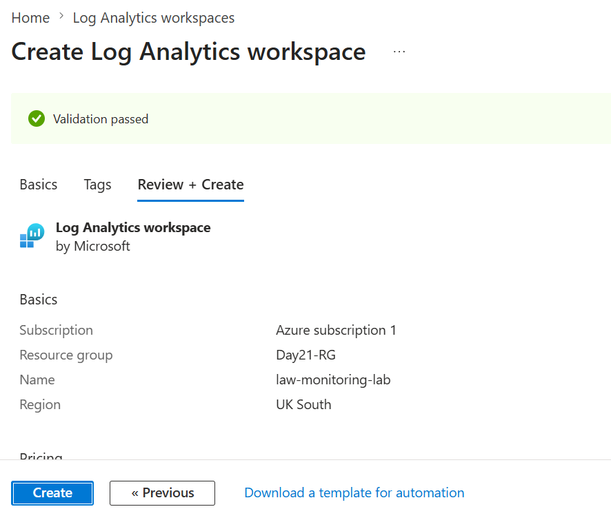
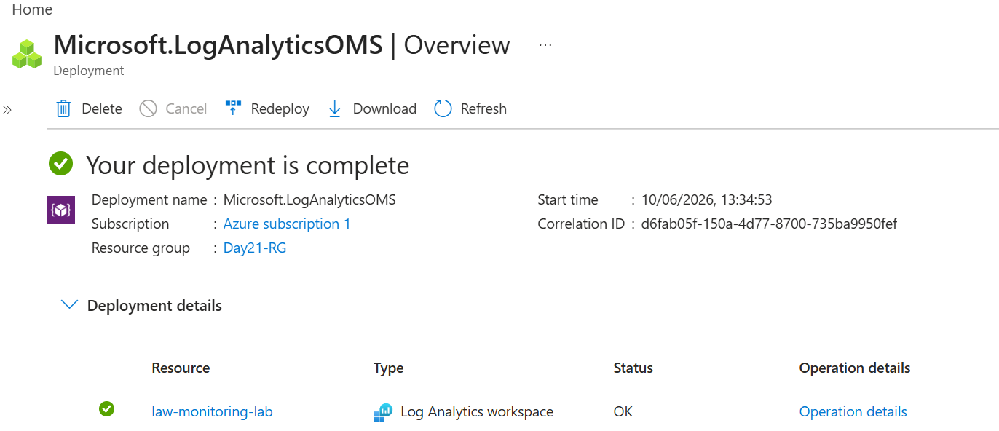
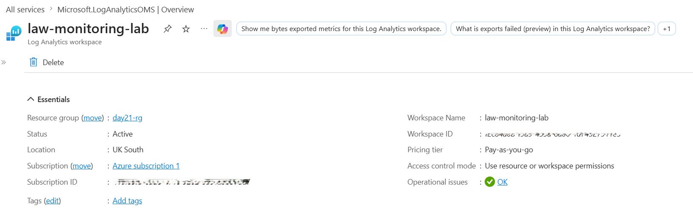
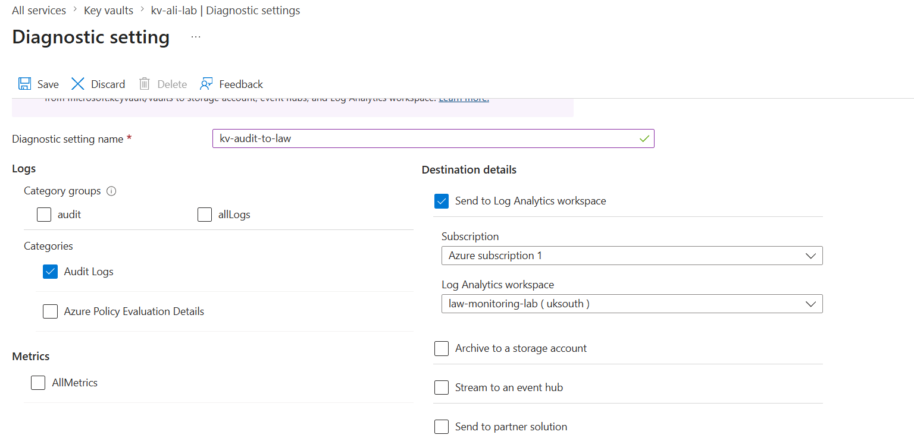
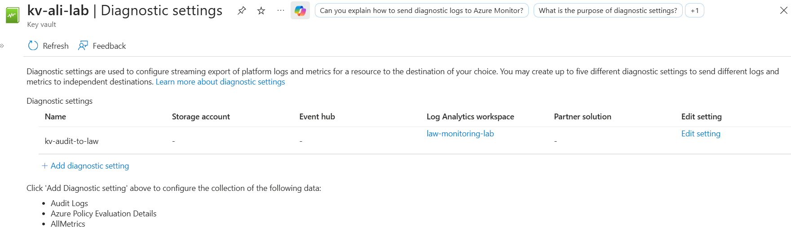
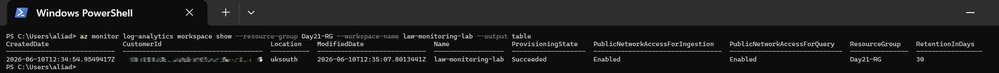
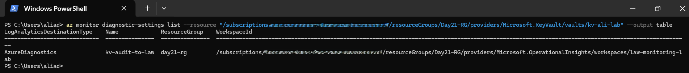
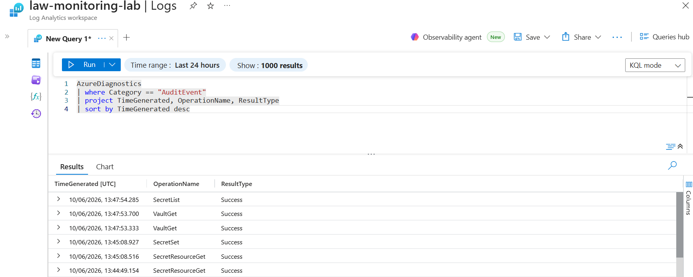

# 📘 Day 25 — Create a Log Analytics Workspace and Connect Resources

**Azure 100 Days of Cloud Challenge — Ali Aden**

---

## 📌 Overview

Today I deployed an Azure Log Analytics Workspace and connected Azure Key Vault audit logs using Diagnostic Settings. I configured centralized log collection, validated the connection using Azure CLI, and successfully queried audit events using Kusto Query Language (KQL).

This challenge demonstrates how Azure Monitor and Log Analytics provide a centralized platform for collecting, storing, and analyzing logs from Azure resources.

---

## 🛠 Tools Used

* Azure Portal
* Azure Monitor
* Log Analytics Workspace
* Azure Key Vault
* Diagnostic Settings
* Azure CLI (Windows PowerShell)
* Kusto Query Language (KQL)

---

## 🧩 Steps Completed

### 1. Created a Log Analytics Workspace

Created a new Log Analytics Workspace named **law-monitoring-lab** in the existing resource group.

### 2. Reviewed Workspace Configuration

Verified workspace deployment and reviewed key properties including:

* Workspace Name
* Workspace ID
* Location
* Retention Period
* Pricing Tier

### 3. Connected Azure Key Vault

Opened the existing Key Vault (**kv-ali-lab**) and configured a Diagnostic Setting to send audit logs to the Log Analytics Workspace.

Diagnostic Setting:

```text
kv-audit-to-law
```

### 4. Enabled Audit Log Collection

Configured the following log category:

```text
Audit Logs
```

Destination:

```text
Log Analytics Workspace
```

### 5. Validated Workspace Using Azure CLI

Verified the Log Analytics Workspace deployment using Azure CLI.

### 6. Validated Diagnostic Settings Using Azure CLI

Confirmed that Key Vault diagnostic settings were successfully connected to the Log Analytics Workspace.

### 7. Tested Log Ingestion

Generated Key Vault activity and confirmed audit events were successfully collected and stored in Log Analytics.

### 8. Queried Audit Events Using KQL

Executed KQL queries against the AzureDiagnostics table and successfully returned Key Vault audit events.

Returned events included:

* SecretSet
* SecretList
* SecretResourceGet
* VaultGet

---

## 🏗️ Architecture Diagram

```text
                     Azure Key Vault
                       (kv-ali-lab)

                             │
                             │ Audit Logs
                             ▼

                   Diagnostic Setting
                   (kv-audit-to-law)

                             │
                             │ Forward Logs
                             ▼

                Log Analytics Workspace
                 (law-monitoring-lab)

                             │
                             │ Query Logs
                             ▼

                      KQL Queries

                             │
                             ▼

                Audit Events Returned

        ┌─────────────────────────────────┐
        │ SecretSet                       │
        │ SecretList                      │
        │ SecretResourceGet               │
        │ VaultGet                        │
        └─────────────────────────────────┘

                             │
                             ▼

         Monitoring • Investigation • Alerting
```

This architecture demonstrates how Azure Key Vault audit logs are forwarded through Diagnostic Settings into a centralized Log Analytics Workspace where they can be queried, analyzed, and used for monitoring and security investigations.

---

## 🔄 Before & After

### Before

* No centralized log collection configured
* Key Vault audit events not being collected
* No Log Analytics Workspace deployed
* No visibility into Key Vault activity
* No KQL queries available

### After

* Log Analytics Workspace successfully deployed
* Key Vault connected through Diagnostic Settings
* Audit logs centralized in Azure Monitor
* Azure CLI validation completed
* KQL queries successfully executed
* Audit events returned and verified

---

## ✅ Validation

### Portal Validation

* Log Analytics Workspace status shows **Active**
* Key Vault diagnostic setting configured successfully
* Workspace connected as the audit log destination

### Azure CLI Validation

Verified Log Analytics Workspace:

```powershell
az monitor log-analytics workspace show --resource-group Day21-RG --workspace-name law-monitoring-lab --output table
```

Verified Diagnostic Settings:

```powershell
az monitor diagnostic-settings list --resource "/subscriptions/<subscription-id>/resourceGroups/Day21-RG/providers/Microsoft.KeyVault/vaults/kv-ali-lab" --output table
```

### KQL Validation

Executed query:

```kusto
AzureDiagnostics
| where Category == "AuditEvent"
| project TimeGenerated, OperationName, ResultType
| sort by TimeGenerated desc
```

Results successfully returned:

```text
SecretSet
SecretList
SecretResourceGet
VaultGet
```

This confirmed successful end-to-end log ingestion from Azure Key Vault to Log Analytics Workspace.

---

## 🧠 Skills Demonstrated

* Azure Monitor configuration
* Log Analytics Workspace deployment
* Azure Diagnostic Settings
* Centralized log management
* Azure CLI validation
* Kusto Query Language (KQL)
* Security monitoring
* Audit log analysis

---

## 🛠 Troubleshooting

### Diagnostic Setting Configuration

Verified that Audit Logs were selected and that the destination workspace was correctly configured before saving the diagnostic setting.

### Log Ingestion Delay

Observed that log ingestion is not immediate. Waiting several minutes after generating Key Vault activity allowed audit events to appear within Log Analytics.

### Query Validation

Used KQL queries to confirm audit events were successfully stored and searchable within the AzureDiagnostics table.

---

## 🔐 Why This Matters

* Centralizes logs from Azure resources
* Provides visibility into resource activity
* Supports security monitoring and investigations
* Enables alerting and automation
* Creates an audit trail for compliance requirements
* Forms the foundation for SIEM and advanced monitoring solutions

Without centralized logging, identifying operational issues and security incidents becomes significantly more difficult.

---

## 🧠 What I Learned

* How Log Analytics Workspaces collect Azure resource logs
* How Diagnostic Settings forward logs to Azure Monitor
* How Azure Key Vault audit events are recorded
* How to validate monitoring configurations using Azure CLI
* How to query logs using Kusto Query Language (KQL)
* The importance of centralized logging for security and operations

---

## 📸 Screenshots

















---

## 💻 Commands Used

### Verify Log Analytics Workspace

```powershell
az monitor log-analytics workspace show --resource-group Day21-RG --workspace-name law-monitoring-lab --output table
```

### Retrieve Key Vault Resource ID

```powershell
az resource show --resource-group Day21-RG --name kv-ali-lab --resource-type Microsoft.KeyVault/vaults --query id --output tsv
```

### Verify Diagnostic Settings

```powershell
az monitor diagnostic-settings list --resource "/subscriptions/<subscription-id>/resourceGroups/Day21-RG/providers/Microsoft.KeyVault/vaults/kv-ali-lab" --output table
```

### Query Audit Events

```kusto
AzureDiagnostics
| where Category == "AuditEvent"
| project TimeGenerated, OperationName, ResultType
| sort by TimeGenerated desc
```

---

## 🎯 Key Takeaway

Azure Log Analytics Workspace provides a centralized platform for collecting, storing, and analyzing logs from Azure resources. By connecting Azure Key Vault through Diagnostic Settings and validating audit events using KQL, organizations gain visibility into resource activity, improve security monitoring, and establish a foundation for operational and compliance reporting.
