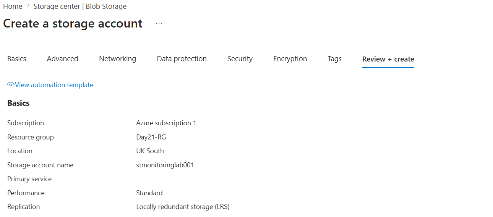
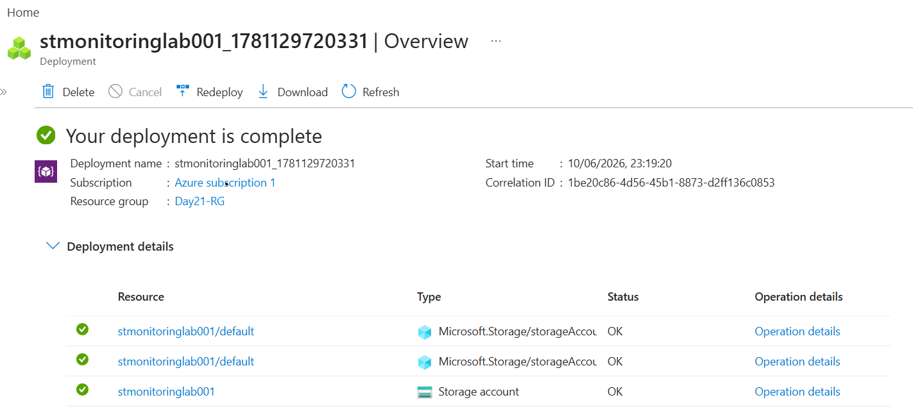
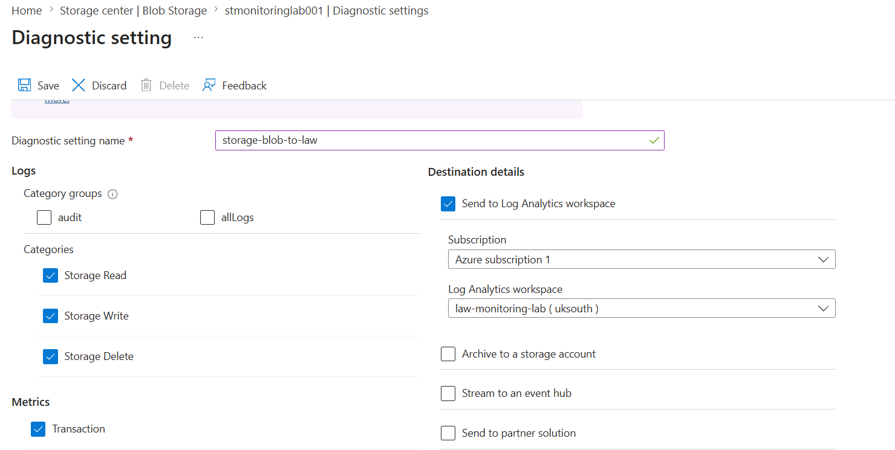
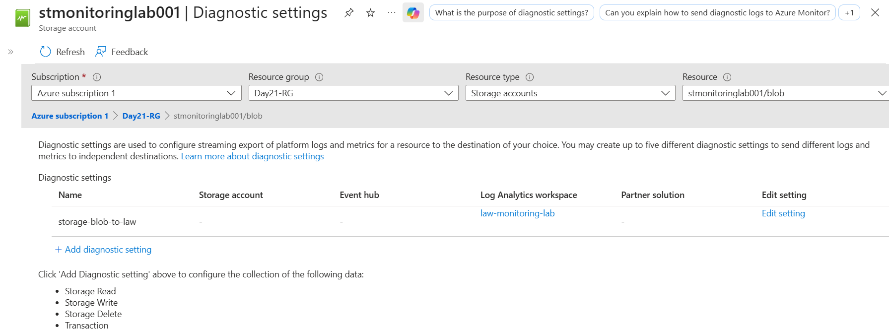
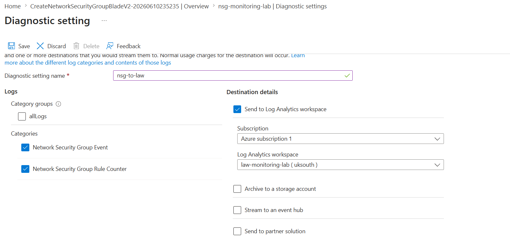
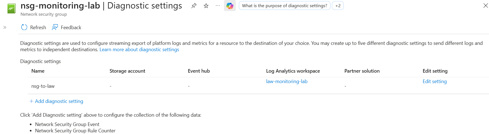
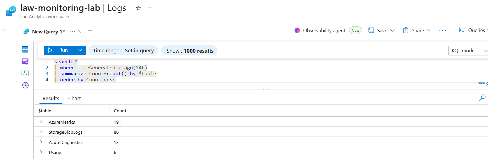
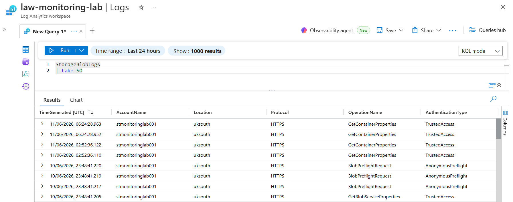
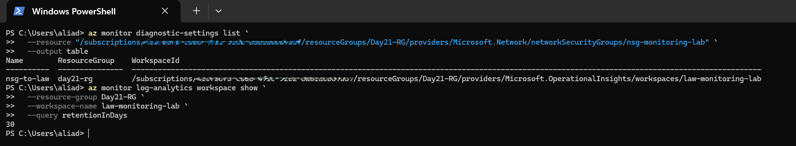

# 📘 Day 26 — Configure Diagnostic Settings to Send Logs to Log Analytics

**Azure 100 Days of Cloud Challenge — Ali Aden**

---

## 📌 Overview

Today I configured Azure Diagnostic Settings on multiple Azure resources and connected them to a centralized Log Analytics Workspace. I enabled logging for Azure Storage and Network Security Groups (NSGs), validated log ingestion using Kusto Query Language (KQL), and verified monitoring configurations using Azure CLI.

This challenge demonstrates how Azure Diagnostic Settings act as the connection point between Azure resources and Azure Monitor, allowing logs and metrics from multiple services to be collected, stored, and analyzed in a single location.

---

## 🛠 Tools Used

* Azure Portal
* Azure Monitor
* Log Analytics Workspace
* Azure Storage Account
* Azure Key Vault
* Network Security Group (NSG)
* Diagnostic Settings
* Azure CLI (Windows PowerShell)
* Kusto Query Language (KQL)

---

## 🧩 Steps Completed

### 1. Created a Storage Account

Created a dedicated Storage Account named **stmonitoringlab001** for monitoring and diagnostic logging.

### 2. Configured Storage Account Diagnostic Settings

Configured Diagnostic Settings on the Blob Service and enabled:

* Storage Read
* Storage Write
* Storage Delete

Destination:

```text
law-monitoring-lab
```

### 3. Created a Network Security Group

Created a new Network Security Group named:

```text
nsg-monitoring-lab
```

### 4. Configured NSG Diagnostic Settings

Configured Diagnostic Settings and enabled:

* Network Security Group Event
* Network Security Group Rule Counter

Destination:

```text
law-monitoring-lab
```

### 5. Validated Log Analytics Tables

Used KQL queries to identify log tables actively receiving data from connected resources.

### 6. Generated and Verified Storage Logs

Performed storage operations including:

* Upload
* Download
* Delete

Confirmed that Storage Account activity was successfully ingested into Log Analytics.

### 7. Validated Configuration Using Azure CLI

Verified:

* NSG Diagnostic Settings
* Log Analytics Workspace retention period

---

## 🏗️ Architecture Diagram

```text
                    Azure Key Vault
                       (kv-ali-lab)

                             │
                             │ AuditEvent Logs
                             ▼

                   Diagnostic Setting
                    (kv-audit-to-law)

                             │
                             ▼

                Log Analytics Workspace
                   (law-monitoring-lab)

                 ▲                    ▲
                 │                    │

    Diagnostic Setting        Diagnostic Setting
   (storage-blob-to-law)         (nsg-to-law)

                 ▲                    ▲
                 │                    │

         Storage Account     Network Security Group
        (stmonitoringlab001)  (nsg-monitoring-lab)

                             │
                             ▼

                        KQL Queries

                             │
                             ▼

      AzureDiagnostics • StorageBlobLogs • AzureMetrics
```

This architecture demonstrates how Azure resources use Diagnostic Settings to forward logs and metrics into a centralized Log Analytics Workspace where they can be queried, monitored, and analyzed.

---

## 🔄 Before & After

### Before

* Only Key Vault logs were connected to Log Analytics
* No Storage Account logging configured
* No NSG logging configured
* Limited visibility across Azure resources
* No centralized monitoring across multiple services

### After

* Storage Account logs connected to Log Analytics
* NSG logs connected to Log Analytics
* Multiple Azure resources forwarding telemetry
* StorageBlobLogs table receiving data
* AzureDiagnostics table receiving data
* Centralized monitoring platform established

---

## ✅ Validation

### Portal Validation

* Storage Account Diagnostic Settings configured successfully
* NSG Diagnostic Settings configured successfully
* All resources connected to **law-monitoring-lab**

### KQL Validation

Validated active log tables:

```kusto
search *
| where TimeGenerated > ago(24h)
| summarize Count=count() by $table
| order by Count desc
```

Returned tables included:

```text
AzureMetrics
StorageBlobLogs
AzureDiagnostics
Usage
```

Validated Storage Account logs:

```kusto
StorageBlobLogs
| take 50
```

Returned Storage operations including:

```text
GetContainerProperties
BlobPreflightRequest
GetBlobServiceProperties
```

### Azure CLI Validation

Verified NSG Diagnostic Settings:

```powershell
az monitor diagnostic-settings list --resource "/subscriptions/<subscription-id>/resourceGroups/Day21-RG/providers/Microsoft.Network/networkSecurityGroups/nsg-monitoring-lab" --output table
```

Verified Log Analytics retention period:

```powershell
az monitor log-analytics workspace show --resource-group Day21-RG --workspace-name law-monitoring-lab --query retentionInDays
```

Result:

```text
30
```

---

## 🧠 Skills Demonstrated

* Azure Monitor
* Log Analytics Workspace
* Azure Diagnostic Settings
* Azure Storage Monitoring
* Network Security Monitoring
* Kusto Query Language (KQL)
* Azure CLI Validation
* Centralized Logging
* Operational Monitoring
* Security Monitoring

---

## 🛠 Troubleshooting

### Storage Logs Not Appearing in AzureDiagnostics

Initially, Storage Account logs did not appear within the AzureDiagnostics table.

Investigation revealed that Azure Storage writes logs to:

```text
StorageBlobLogs
```

rather than:

```text
AzureDiagnostics
```

Using table discovery queries helped identify the correct destination table.

### Log Ingestion Delay

Observed a delay between generating Storage Account activity and log availability within Log Analytics. Waiting for ingestion to complete and generating additional storage activity successfully resolved the issue.

---

## 🔐 Why This Matters

* Centralizes monitoring across Azure resources
* Provides visibility into storage activity
* Enables network traffic monitoring
* Improves security investigations
* Supports operational troubleshooting
* Creates a foundation for alerting and automation

Without Diagnostic Settings, Azure resources generate logs but do not automatically forward them to a centralized monitoring platform.

---

## 🧠 What I Learned

* How Diagnostic Settings forward logs to Log Analytics
* How Azure Storage logs are stored in StorageBlobLogs
* How NSG events can be collected centrally
* How to identify active log tables using KQL
* How to validate monitoring configurations using Azure CLI
* The importance of centralized monitoring in Azure environments

---

## 📸 Screenshots



















---

## 💻 Commands Used

### Validate Active Log Tables

```kusto
search *
| where TimeGenerated > ago(24h)
| summarize Count=count() by $table
| order by Count desc
```

### Validate Storage Logs

```kusto
StorageBlobLogs
| take 50
```

### Verify NSG Diagnostic Settings

```powershell
az monitor diagnostic-settings list --resource "/subscriptions/<subscription-id>/resourceGroups/Day21-RG/providers/Microsoft.Network/networkSecurityGroups/nsg-monitoring-lab" --output table
```

### Verify Log Analytics Retention

```powershell
az monitor log-analytics workspace show --resource-group Day21-RG --workspace-name law-monitoring-lab --query retentionInDays
```

---

## 🎯 Key Takeaway

Diagnostic Settings are the mechanism that connects Azure resources to Azure Monitor. By configuring Storage Accounts and Network Security Groups to send logs to a centralized Log Analytics Workspace, I expanded monitoring visibility across multiple Azure services and validated end-to-end log collection using KQL and Azure CLI.
