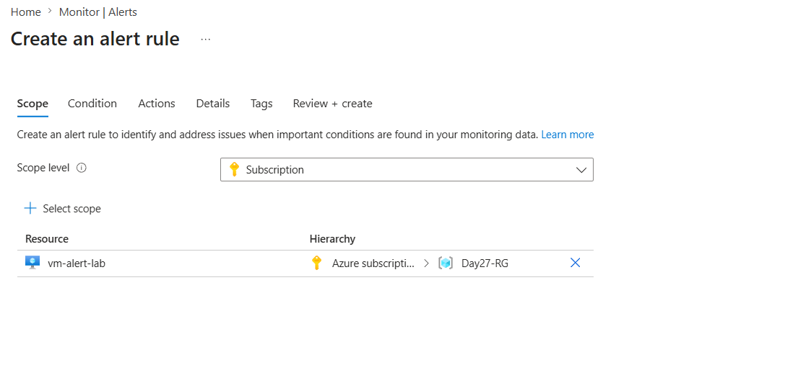
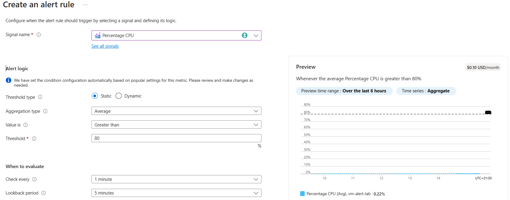
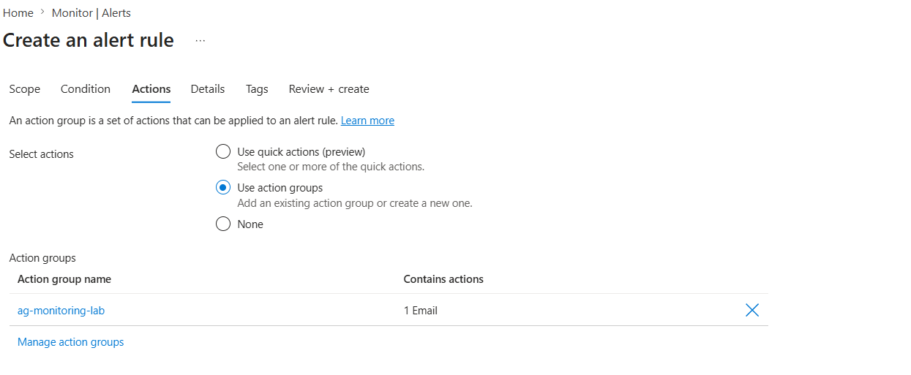
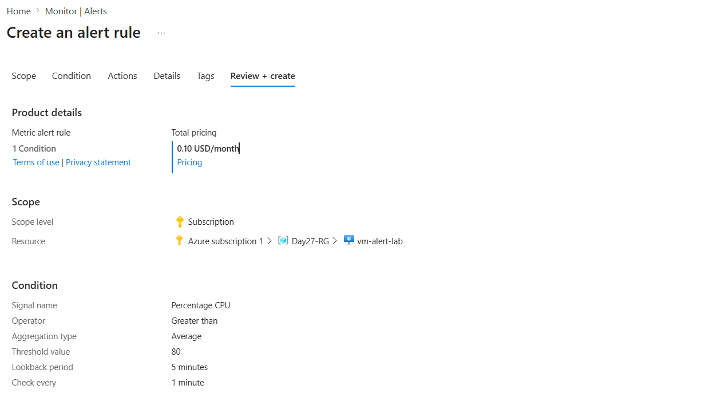
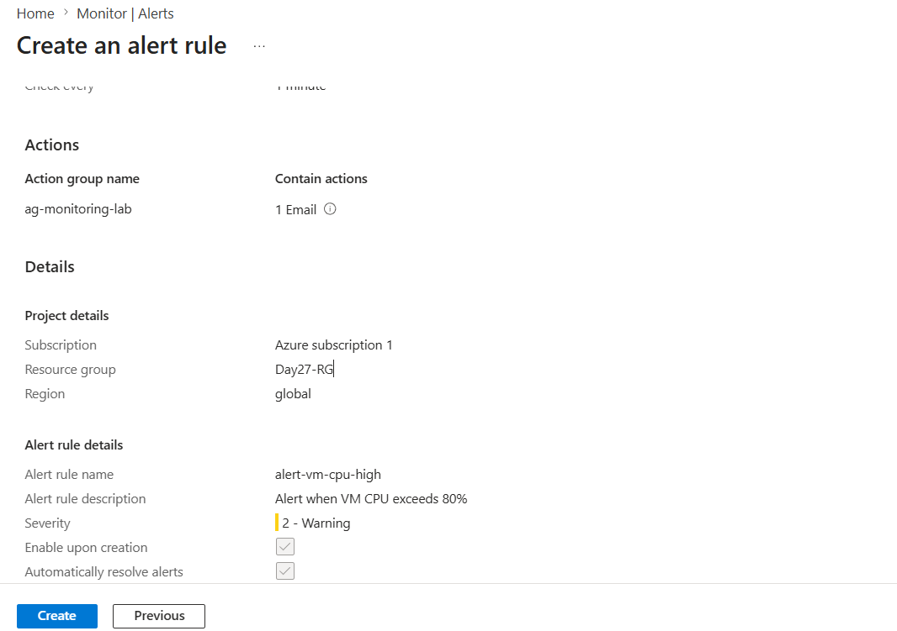
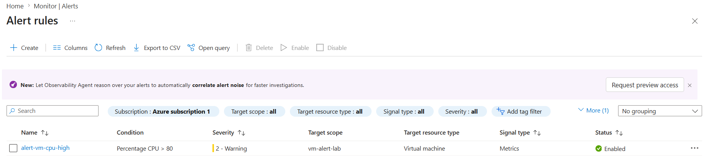
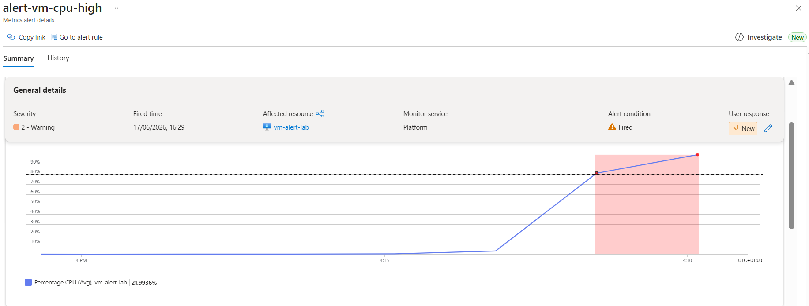

# Day 27 — Configure Azure Monitor Alerts for VM CPU Monitoring

**Azure 100 Days of Cloud Challenge — Ali Aden**

## Overview

Today I configured Azure Monitor metric alerts to monitor CPU utilization on an Azure Virtual Machine. I created a CPU-based alert rule, configured an Action Group to send email notifications, generated CPU load using Linux commands, and successfully validated end-to-end alerting functionality.

This challenge demonstrates how Azure Monitor Alerts provide proactive monitoring by detecting resource conditions and automatically notifying administrators when thresholds are exceeded.

---

## Tools Used

* Azure Portal
* Azure Monitor
* Azure Virtual Machine (Ubuntu 24.04 LTS)
* Azure Monitor Alerts
* Action Groups
* Azure Bastion
* Linux Terminal
* Stress Utility
* Email Notifications

---

## Steps Completed

### 1. Created an Azure Virtual Machine

Created an Ubuntu 24.04 LTS Virtual Machine named:

```text
vm-alert-lab
```

Supporting resources automatically created:

```text
vm-alert-lab-vnet
vm-alert-lab-nsg
vm-alert-lab-ip
```

---

### 2. Configured a CPU Metric Alert Rule

Created an Azure Monitor metric alert using the following settings:

* Signal: Percentage CPU
* Aggregation Type: Average
* Operator: Greater than
* Threshold: 80%
* Check Every: 1 minute
* Lookback Period: 5 minutes

---

### 3. Created an Action Group

Created an Action Group named:

```text
ag-monitoring-lab
```

Configured action:

* Email notification

This Action Group enables Azure Monitor to notify administrators when the alert condition is triggered.

---

### 4. Configured Alert Rule Details

Configured the alert rule with:

```text
Alert Rule Name:
alert-vm-cpu-high
```

Description:

```text
Alert when VM CPU exceeds 80%
```

Severity:

```text
Severity 2 – Warning
```

---

### 5. Generated CPU Load

Connected to the VM using Azure Bastion and generated CPU load using Linux commands.

Verified available CPU cores:

```bash
nproc
```

Result:

```text
2
```

Installed the stress utility:

```bash
sudo apt update
sudo apt install stress -y
```

Generated CPU load:

```bash
stress --cpu 2 --timeout 300
```

---

### 6. Validated Alert Triggering

After CPU utilization exceeded the configured threshold:

* Azure Monitor alert entered the **Fired** state
* Alert details displayed the CPU threshold breach
* The configured Action Group sent an email notification
* Alert history recorded the triggered event successfully

---

## Architecture Diagram

```text
                Azure Virtual Machine
                    (vm-alert-lab)

                           │
                    CPU Utilization
                           │
                           ▼

                Azure Monitor Metrics
                 (Percentage CPU)

                           │
                           ▼

                 Azure Monitor Alert
                 (alert-vm-cpu-high)

                           │
               Threshold: > 80%
                           │
                           ▼

                    Action Group
                 (ag-monitoring-lab)

                           │
                           ▼

                  Email Notification

                           │
                           ▼

                   Administrator
```

This architecture demonstrates how Azure Monitor continuously evaluates VM metrics and automatically triggers notifications when defined thresholds are exceeded.

---

## Before & After

### Before

* No proactive monitoring configured
* CPU spikes went undetected
* No automated notifications
* Manual monitoring required

### After

* VM CPU monitored continuously
* Alert triggered automatically above 80%
* Email notifications delivered successfully
* Monitoring and alerting automated

---

## Validation

### Portal Validation

Validated that:

* Alert rule was created successfully
* Alert state changed to **Fired**
* CPU exceeded the configured threshold
* Action Group executed successfully

### Email Validation

Confirmed receipt of Azure Monitor email notification:

```text
Azure: Activated Severity: 2 alert-vm-cpu-high
```

### Alert Validation

Verified:

* Severity: 2 – Warning
* Alert Condition: Fired
* Affected Resource: vm-alert-lab
* Metric: Percentage CPU
* Threshold: 80%

---

## Skills Demonstrated

* Azure Monitor
* Azure Monitor Alerts
* Action Groups
* Virtual Machine Monitoring
* Metric-Based Alerting
* Azure Bastion
* Linux Administration
* Performance Monitoring
* Incident Response
* Cloud Monitoring

---

## Troubleshooting

### CPU Threshold Not Triggering

Initially, CPU utilization remained below the alert threshold.

This was resolved by:

* Installing the Linux `stress` utility
* Running load generation across all available CPU cores
* Allowing Azure Monitor sufficient time to evaluate metrics

### Alert Evaluation Delay

Azure Monitor evaluates metrics on a schedule rather than instantly.

Waiting several minutes allowed the alert to transition to the **Fired** state and send email notifications successfully.

---

## Why This Matters

* Enables proactive monitoring
* Detects performance issues automatically
* Reduces response time during incidents
* Automates operational notifications
* Improves infrastructure reliability
* Forms the foundation for automated remediation

Without Azure Monitor Alerts, administrators must manually monitor resource health and may miss critical performance events.

---

## What I Learned

* How Azure Monitor evaluates VM metrics
* How to configure metric-based alert rules
* How Action Groups deliver notifications
* How Azure alerts transition to the Fired state
* How to generate CPU load safely for testing
* The importance of proactive monitoring in cloud environments

---

## Screenshots















---

## Commands Used

### Check Available CPU Cores

```bash
nproc
```

### Install Stress Utility

```bash
sudo apt update
sudo apt install stress -y
```

### Generate CPU Load

```bash
stress --cpu 2 --timeout 300
```

---

## Key Takeaway

Azure Monitor Alerts transform reactive monitoring into proactive operations. By configuring metric alerts and Action Groups, I implemented automated monitoring that detects high CPU usage and delivers notifications in real time, improving operational visibility and response capabilities.

