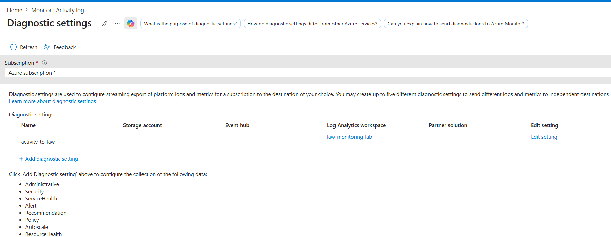
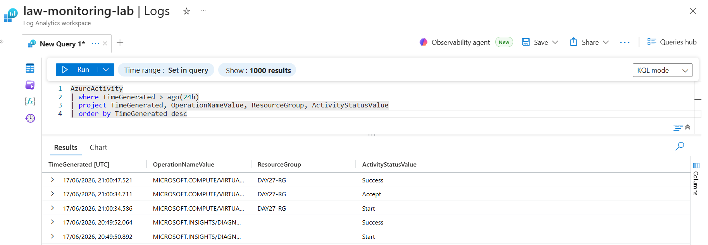
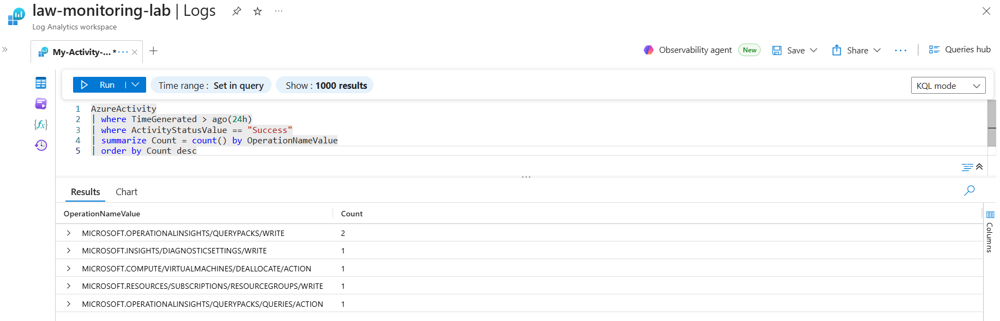
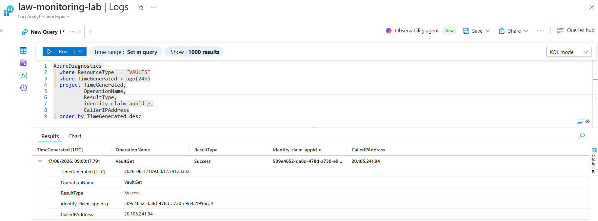
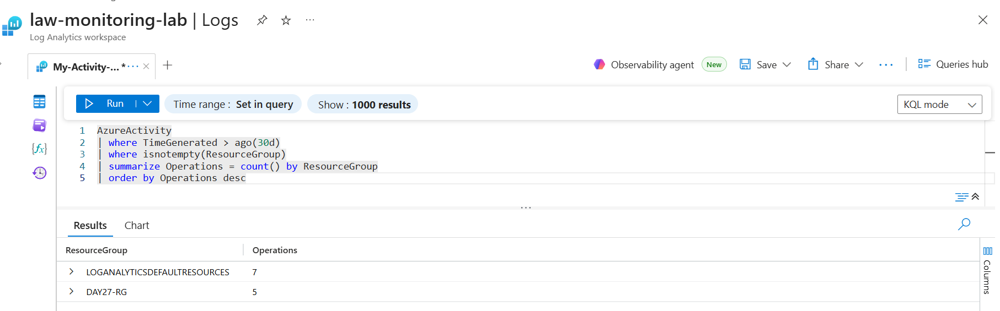
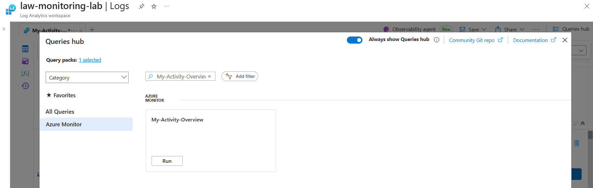
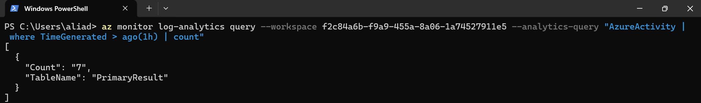

# Day 28 — Write Basic KQL Queries to Analyse Log Data

**Azure 100 Days of Cloud Challenge — Ali Aden**

## Overview

Today I used Kusto Query Language (KQL) within Azure Log Analytics to search, filter and analyse log data collected from Azure resources. I configured Azure Activity Log diagnostic settings, queried Azure Activity and Key Vault audit logs, saved reusable queries, and executed KQL queries using Azure CLI.

This challenge demonstrates how KQL enables cloud administrators and security teams to investigate events, monitor Azure environments, and gain operational insights from centralized log data.

---

## Tools Used

* Azure Portal
* Azure Monitor
* Log Analytics Workspace
* Azure Activity Logs
* Azure Key Vault
* Diagnostic Settings
* Kusto Query Language (KQL)
* Azure CLI (PowerShell)

---

## Steps Completed

### 1. Configured Activity Log Diagnostic Settings

Configured subscription-level Activity Log diagnostic settings to send logs into the existing Log Analytics Workspace.

Diagnostic Setting:

```text
activity-to-law
```

Destination:

```text
law-monitoring-lab
```

---

### 2. Queried Azure Activity Logs

Executed a KQL query to retrieve Azure Activity events generated within the last 24 hours.

This query displayed:

* Operation names
* Resource groups
* Activity status
* Event timestamps

---

### 3. Analysed Successful Operations

Used the `summarize` operator to count successful Azure operations and identify the most frequently performed actions across the subscription.

---

### 4. Queried Key Vault Audit Logs

Queried Key Vault audit events stored within the `AzureDiagnostics` table to identify:

* Key Vault operations
* Result status
* Calling application identity
* Source IP addresses

---

### 5. Summarised Resource Group Activity

Analysed Azure Activity logs to determine which resource groups generated the most activity over the previous 30 days.

---

### 6. Saved Reusable Queries

Saved frequently used KQL queries for future investigations and monitoring.

Saved query:

```text
My-Activity-Overview
```

---

### 7. Executed KQL Queries Using Azure CLI

Retrieved the Log Analytics Workspace ID and executed KQL queries directly from Azure CLI to validate query execution outside the Azure Portal.

---

## Architecture Diagram

```text
Azure Subscription / Key Vault / Resource Groups
                     │
                     ▼
          Activity Logs & Audit Logs
                     │
                     ▼
            Diagnostic Settings
                     │
                     ▼
        Log Analytics Workspace
           (law-monitoring-lab)
                     │
                     ▼
                KQL Queries
                     │
      ┌──────────────┼──────────────┐
      │              │              │
      ▼              ▼              ▼
   Filter         Aggregate      Sort
  (where)       (summarize)   (order by)
                     │
                     ▼
       Operational & Security Insights
                     │
             ┌───────┴───────┐
             ▼               ▼
        Saved Queries    Azure CLI
                          Validation
```

This architecture demonstrates how Azure resources send activity and audit logs through Diagnostic Settings into a centralized Log Analytics workspace. KQL queries are used to filter, aggregate, and analyze the data to generate operational and security insights. Queries can be saved for reuse and validated programmatically using Azure CLI.
---

## Before & After

### Before

* Activity Logs were not sent to Log Analytics
* Azure events could not be queried using KQL
* No centralized visibility into subscription activity
* Key Vault audit data was not actively analysed
* Queries had to be executed manually in the portal

### After

* Activity Logs connected to Log Analytics
* Azure Activity logs searchable using KQL
* Key Vault audit events analysed successfully
* Resource activity summarised across Azure
* Queries saved for future reuse
* KQL executed directly from Azure CLI

---

## Validation

### Activity Log Validation

Confirmed that subscription Activity Logs were successfully forwarded to:

```text
law-monitoring-lab
```

### Azure Activity Query Validation

Executed queries against the `AzureActivity` table and returned recent Azure events including:

* VM deallocation operations
* Diagnostic setting changes
* Resource group operations

### Key Vault Audit Validation

Successfully retrieved Key Vault audit events from:

```text
AzureDiagnostics
```

Including:

* `VaultGet`
* `Success`
* Application identity claims
* Caller IP addresses

### CLI Validation

Executed KQL queries using Azure CLI:

```powershell
az monitor log-analytics query --workspace <workspace-id> --analytics-query "AzureActivity | where TimeGenerated > ago(1h) | count"
```

Result:

```json
[
  {
    "Count": "7",
    "TableName": "PrimaryResult"
  }
]
```

---

## Skills Demonstrated

* Azure Monitor
* Log Analytics Workspace
* Kusto Query Language (KQL)
* Azure Activity Logs
* Key Vault Monitoring
* Diagnostic Settings
* Azure CLI
* Security Monitoring
* Operational Monitoring
* Log Analysis

---

## Troubleshooting

### AzureActivity Table Returned No Results

Initially, queries against the `AzureActivity` table returned no results.

Investigation revealed that subscription Activity Logs had not been configured to send data to Log Analytics.

Creating the `activity-to-law` diagnostic setting resolved the issue.

### Missing Identity Column

The original Key Vault query referenced:

```text
identity_claim_upn_s
```

However, this column was not available in the environment.

After inspecting available fields, the query was adapted to use:

```text
identity_claim_appid_g
```

This successfully exposed application identity information within Key Vault audit logs.

### PowerShell Command Errors

Azure CLI commands initially failed because Bash line continuation characters (`\`) were used in PowerShell.

The issue was resolved by running commands on a single line.

---

## Why This Matters

* Enables investigation of Azure activity and security events
* Provides centralized log analysis capabilities
* Supports troubleshooting and incident response
* Builds foundational skills for Microsoft Sentinel
* Enables proactive monitoring and security investigations
* Prepares for real-world SOC and cloud operations workflows

KQL is one of the most valuable skills for Azure administrators and security engineers because it transforms large volumes of logs into meaningful information.

---

## What I Learned

* How Activity Logs are sent to Log Analytics
* How to query Azure logs using KQL
* How to use `where` to filter log data
* How to use `project` to select columns
* How to use `summarize` to aggregate results
* How to investigate Key Vault audit events
* How to execute KQL queries using Azure CLI
* The importance of centralized logging and analysis

---

## Screenshots















---

## Commands Used

### Query Azure Activity Logs

```kusto
AzureActivity
| where TimeGenerated > ago(24h)
| project TimeGenerated, OperationNameValue, ResourceGroup, ActivityStatusValue
| order by TimeGenerated desc
```

### Summarise Successful Operations

```kusto
AzureActivity
| where TimeGenerated > ago(7d)
| where ActivityStatusValue == "Success"
| summarize Count = count() by OperationNameValue
| order by Count desc
```

### Query Key Vault Audit Logs

```kusto
AzureDiagnostics
| where ResourceType == "VAULTS"
| where TimeGenerated > ago(24h)
| project TimeGenerated, OperationName, ResultType, identity_claim_appid_g, CallerIPAddress
| order by TimeGenerated desc
```

### Summarise Resource Group Activity

```kusto
AzureActivity
| where TimeGenerated > ago(30d)
| where isnotempty(ResourceGroup)
| summarize Operations = count() by ResourceGroup
| order by Operations desc
```

### Retrieve Workspace ID

```powershell
az monitor log-analytics workspace show --resource-group Day21-RG --workspace-name law-monitoring-lab --query customerId --output tsv
```

### Execute KQL Using Azure CLI

```powershell
az monitor log-analytics query --workspace f2c84a6b-f9a9-455a-8a06-1a74527911e5 --analytics-query "AzureActivity | where TimeGenerated > ago(1h) | count"
```

---

## Key Takeaway

KQL is the foundation of Azure monitoring and security analysis. By configuring Activity Logs, querying Log Analytics, and analysing Key Vault audit events, I built practical skills used daily by cloud administrators, SOC analysts, and security engineers to investigate and monitor Azure environments.

