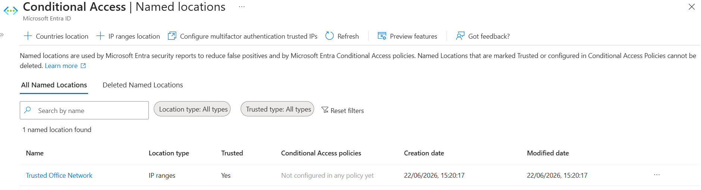
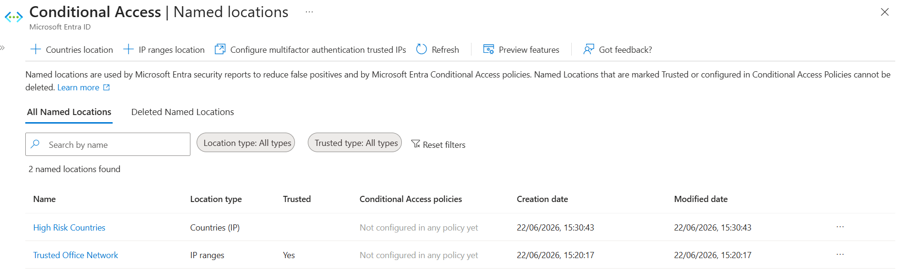
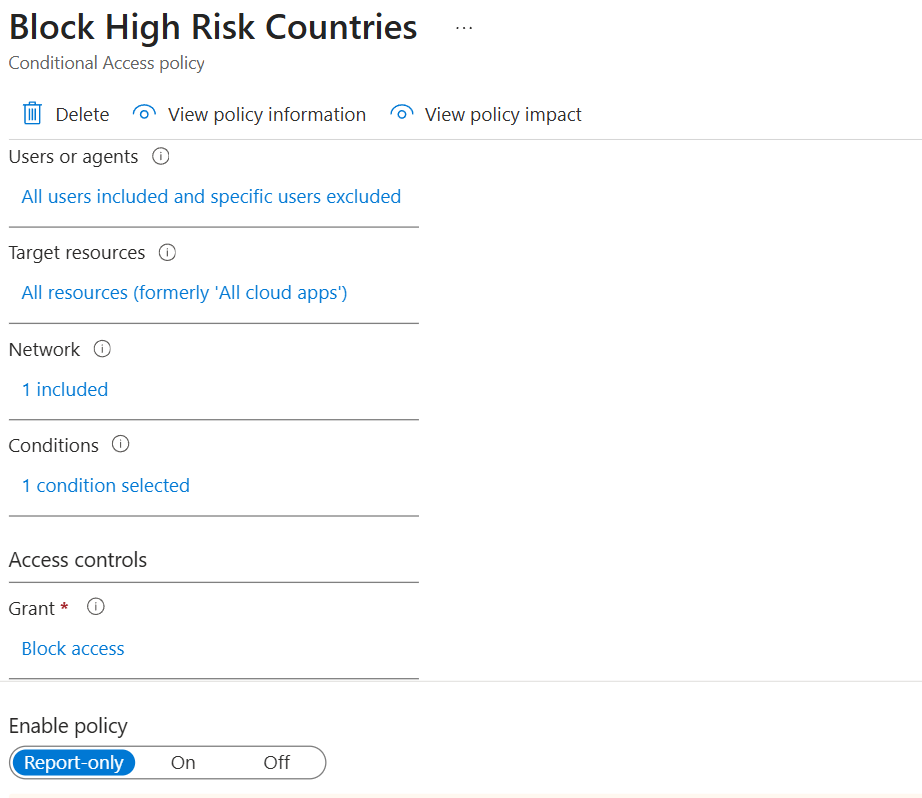
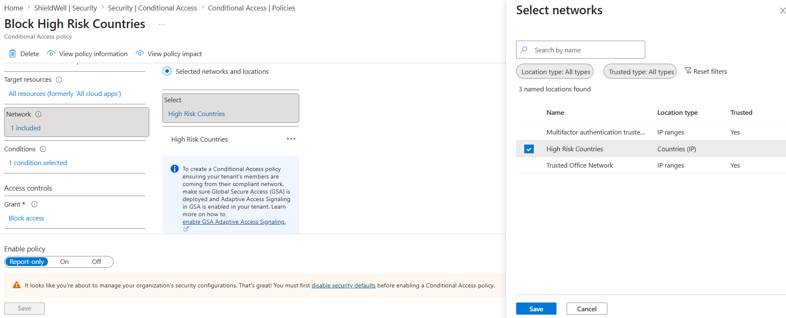
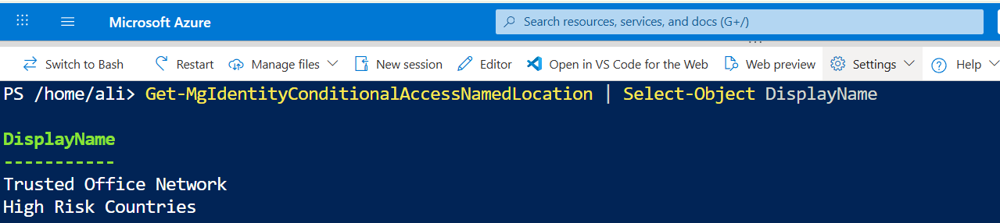
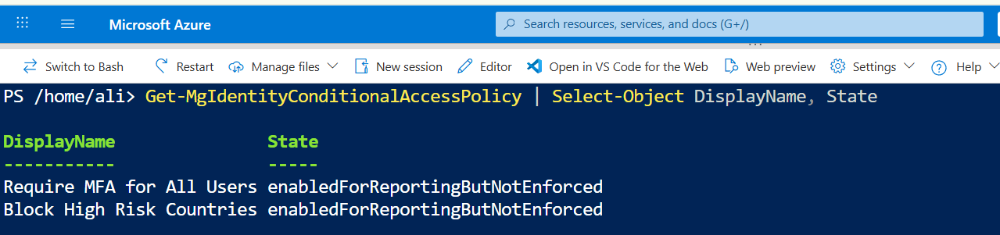

# Day 30 — Configure Named Locations and Location-Based Access Policies
### Azure 100 Days of Cloud Challenge — Ali Aden

## Overview

In this challenge, I configured Microsoft Entra Named Locations to represent trusted and untrusted sign-in locations and created a Conditional Access policy that applies location-based access controls.

I created a trusted IP-based location called **Trusted Office Network** and a country-based location called **High Risk Countries**. I then configured a Conditional Access policy to block access from the High Risk Countries location while keeping the policy in **Report-only** mode for safe testing and validation.

This challenge demonstrates how organizations use location-based Conditional Access policies to strengthen identity security and implement Zero Trust access controls.

---

## Technologies Used

- Microsoft Entra ID
- Conditional Access
- Named Locations
- Microsoft Graph PowerShell
- Azure Cloud Shell
- Microsoft Graph SDK

---

## Architecture Diagram

```text
                    Microsoft Entra ID
                 Conditional Access Engine
                              │
                              ▼
                    ┌─────────────────┐
                    │ Named Locations │
                    └────────┬────────┘
                             │
             ┌───────────────┴───────────────┐
             │                               │
             ▼                               ▼
   Trusted Office Network          High Risk Countries
      IP Range Location             Countries Location
        Trusted = Yes               Trusted = No
             │                               │
             └───────────────┬───────────────┘
                             │
                             ▼
              Conditional Access Policy
                Block High Risk Countries
                             │
                             ▼
                      Assignments
                  • All Users
                  • All Cloud Apps
                             │
                             ▼
                  Location Evaluation
                             │
                             ▼
                      Block Access
                             │
                             ▼
                     Report-Only Mode
                    (Not Enforced Yet)
                             │
                             ▼
              Microsoft Graph PowerShell
                       Validation
```

---

## Implementation Steps

### Step 1 — Create a Trusted Named Location

Navigated to:

```text
Microsoft Entra ID
  → Security
      → Conditional Access
          → Named Locations
```

Created a new IP-based named location:

```text
Trusted Office Network
```

Configuration:

```text
Location Type: IP ranges
IP Range: 5.150.66.18/32
Trusted Location: Yes
```

---

### Step 2 — Create a Country-Based Named Location

Created a second named location:

```text
High Risk Countries
```

Configuration:

```text
Location Type: Countries
Trusted Location: No
```

This location was used to represent countries from which sign-ins would be considered higher risk.

---

### Step 3 — Create a Conditional Access Policy

Created a Conditional Access policy named:

```text
Block High Risk Countries
```

Assignments:

```text
Users:
✓ All Users

Excluded:
✓ Administrative Account
```

Target Resources:

```text
✓ All Cloud Apps
```

Location Condition:

```text
Include:
✓ High Risk Countries
```

---

### Step 4 — Configure Access Controls

Configured the grant control:

```text
Block Access
```

This means any sign-in matching the location condition would be denied access when the policy is eventually enforced.

---

### Step 5 — Configure Report-Only Mode

Configured the policy state as:

```text
Report-only
```

This allows the policy to be evaluated without impacting users.

---

## Validation

### Validation 1 — Trusted Named Location

Verified the Trusted Office Network location was created successfully.

**Screenshot:**



---

### Validation 2 — Named Locations List

Verified both named locations exist.

Confirmed:

- Trusted Office Network
- High Risk Countries

**Screenshot:**



---

### Validation 3 — Conditional Access Policy

Verified the policy configuration including:

- All Users assignment
- All Cloud Apps assignment
- Block Access grant control
- Report-only mode

**Screenshot:**



---

### Validation 4 — Location Condition

Verified the policy targets the High Risk Countries named location.

Confirmed:

```text
High Risk Countries
```

is selected as the location condition.

**Screenshot:**



---

### Validation 5 — Microsoft Graph PowerShell Named Location Validation

Connected to Microsoft Graph and validated the configured named locations.

Command:

```powershell
Get-MgIdentityConditionalAccessNamedLocation |
Select-Object DisplayName
```

Output:

```text
Trusted Office Network
High Risk Countries
```

**Screenshot:**



---

### Validation 6 — Microsoft Graph PowerShell Policy Validation

Validated the Conditional Access policies.

Command:

```powershell
Get-MgIdentityConditionalAccessPolicy |
Select-Object DisplayName, State
```

Output:

```text
Require MFA for All Users      enabledForReportingButNotEnforced
Block High Risk Countries      enabledForReportingButNotEnforced
```

**Screenshot:**



---

## Security Benefits

This configuration provides:

- Location-based access control
- Reduced risk from suspicious sign-in locations
- Centralized policy enforcement
- Stronger identity security controls
- Improved Zero Trust security posture

---

## What I Learned

- How Named Locations are used in Microsoft Entra ID
- How to create trusted and untrusted locations
- How Conditional Access evaluates sign-in locations
- How to create location-based access policies
- Why Report-only mode should be used before enforcement
- How to validate Conditional Access configurations using Microsoft Graph PowerShell
- How location-based controls support Zero Trust security models

---

## Key Notes

- Trusted locations can be used to reduce authentication friction for known networks.
- High-risk or unexpected locations can be monitored, restricted, or blocked using Conditional Access policies.
- Report-only mode should always be used to assess policy impact before enforcement.
- Administrative or emergency access accounts should be excluded from restrictive policies to prevent accidental lockout.
- Microsoft Graph PowerShell provides a reliable method for validating Conditional Access configurations.

---
