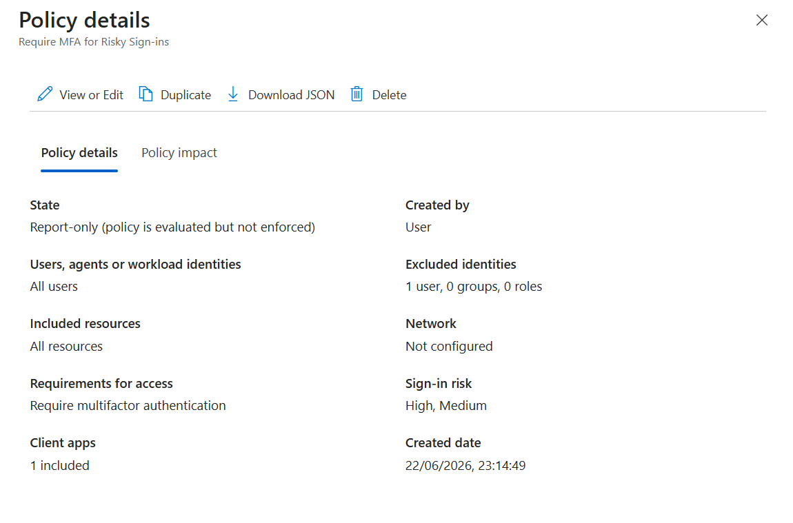
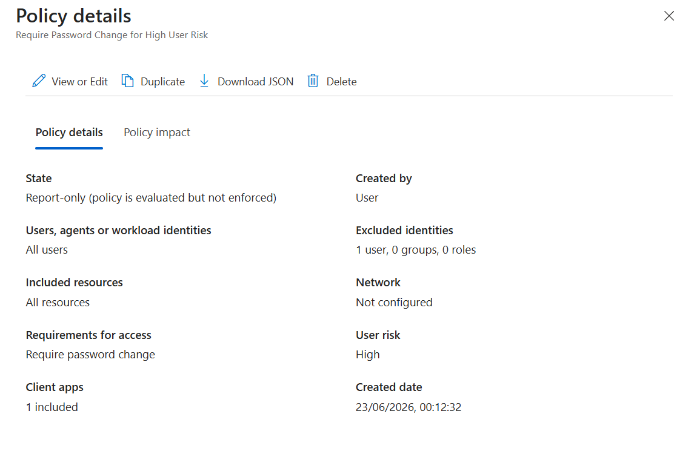
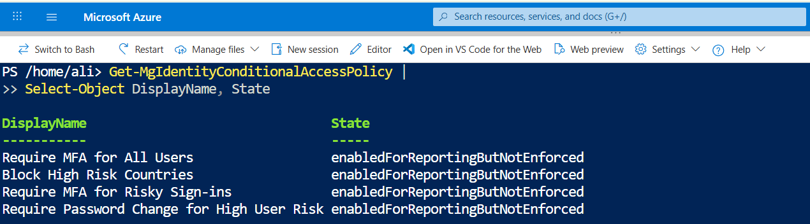

# Day 31 — Set Up Sign-In Risk Policies with Identity Protection

### Azure 100 Days of Cloud Challenge — Ali Aden

## Overview

In this challenge, I configured risk-based Conditional Access policies using Microsoft Entra ID Identity Protection to automatically respond to risky authentication activity.

I created a policy that requires Multi-Factor Authentication (MFA) for medium and high-risk sign-ins and a second policy that requires a password change for high-risk user accounts. Both policies were configured in Report-only mode to safely evaluate their impact before enforcement.

This challenge demonstrates how organizations use Microsoft Entra Identity Protection and Conditional Access together to detect and respond to potentially compromised accounts in real time.

---

## Technologies Used

* Microsoft Entra ID
* Identity Protection
* Conditional Access
* Microsoft Graph PowerShell
* Azure Cloud Shell
* Microsoft Graph SDK

---

## Architecture Diagram

```text
                 Microsoft Entra ID
                  Identity Protection
                           │
                           ▼
                   Risk Evaluation Engine
                           │
          ┌────────────────┴────────────────┐
          │                                 │
          ▼                                 ▼
     Sign-In Risk                      User Risk
   (Medium and High)                    (High)
          │                                 │
          ▼                                 ▼
 Conditional Access               Conditional Access
      Policy 1                         Policy 2
          │                                 │
          ▼                                 ▼
   Require MFA                  Require Password Change
          │                                 │
          └────────────────┬────────────────┘
                           │
                           ▼
                    Report-Only Mode
                   (Not Enforced Yet)
                           │
                           ▼
            Microsoft Graph PowerShell
                      Validation
```

---

## Implementation Steps

### Step 1 — Review Identity Protection

Navigated to:

```text
Microsoft Entra ID
  → Security
      → ID Protection
```

Reviewed the Identity Protection dashboard and available risk monitoring capabilities.

---

### Step 2 — Create a Sign-In Risk Policy

Created a Conditional Access policy named:

```text
Require MFA for Risky Sign-ins
```

Assignments:

```text
Users:
✓ All Users

Excluded:
✓ Administrative Account
```

Target Resources:

```text
✓ All Resources
```

Risk Condition:

```text
Sign-In Risk:
✓ Medium
✓ High
```

Grant Control:

```text
Require Multifactor Authentication
```

---

### Step 3 — Create a User Risk Policy

Created a Conditional Access policy named:

```text
Require Password Change for High User Risk
```

Assignments:

```text
Users:
✓ All Users

Excluded:
✓ Administrative Account
```

Target Resources:

```text
✓ All Resources
```

Risk Condition:

```text
User Risk:
✓ High
```

Grant Control:

```text
Require Password Change
```

---

### Step 4 — Configure Report-Only Mode

Configured both policies with the following state:

```text
Report-only
```

This allows policy evaluation without impacting users.

---

## Validation

### Validation 1 — Sign-In Risk Policy

Verified the Sign-In Risk policy configuration.

Confirmed:

* Medium and High sign-in risk levels
* Require MFA grant control
* All Users assignment
* Report-only mode

**Screenshot:**



---

### Validation 2 — User Risk Policy

Verified the User Risk policy configuration.

Confirmed:

* High user risk level
* Require Password Change grant control
* All Users assignment
* Report-only mode

**Screenshot:**



---

### Validation 3 — Microsoft Graph PowerShell Policy Validation

Validated the Conditional Access policies.

Command:

```powershell
Get-MgIdentityConditionalAccessPolicy |
Select-Object DisplayName, State
```

Output:

```text
Require MFA for All Users                  enabledForReportingButNotEnforced
Block High Risk Countries                  enabledForReportingButNotEnforced
Require MFA for Risky Sign-ins             enabledForReportingButNotEnforced
Require Password Change for High User Risk enabledForReportingButNotEnforced
```

**Screenshot:**



---

## Security Benefits

This configuration provides:

* Automated response to risky authentication activity
* Reduced risk of account compromise
* Stronger identity protection controls
* Continuous risk-based access evaluation
* Improved Zero Trust security posture

---

## What I Learned

* How Microsoft Entra ID Identity Protection evaluates risk
* The difference between Sign-In Risk and User Risk
* How to create risk-based Conditional Access policies
* How MFA can be used to remediate risky sign-ins
* How password changes can be used to remediate high-risk user accounts
* Why Report-only mode should be used before enforcement
* How to validate Conditional Access policies using Microsoft Graph PowerShell

---

## Key Notes

* Sign-In Risk measures the likelihood that a specific authentication attempt is suspicious.
* User Risk measures the likelihood that an account has been compromised.
* Modern risk-based protection is implemented through Conditional Access rather than legacy Identity Protection policy pages.
* Report-only mode should always be used to assess policy impact before enforcement.
* Administrative or emergency access accounts should be excluded from restrictive policies to prevent accidental lockout.
* Microsoft Graph PowerShell provides a reliable method for validating Conditional Access configurations.

---

