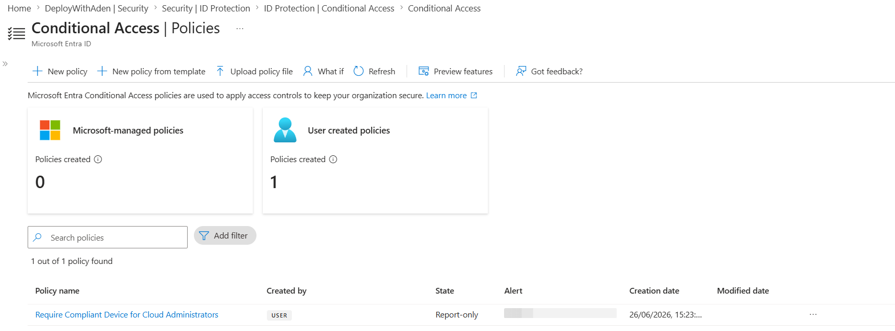
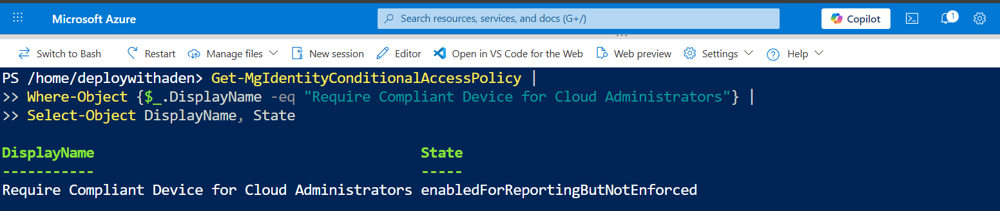
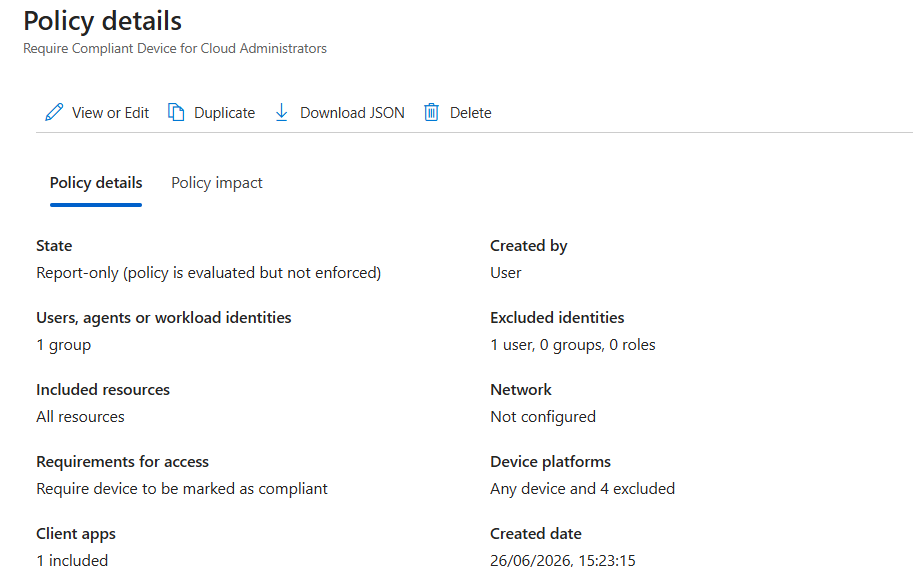
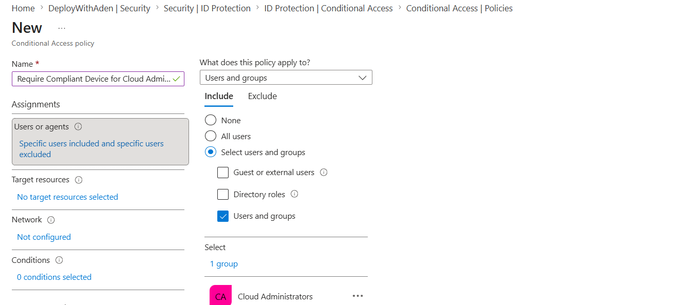
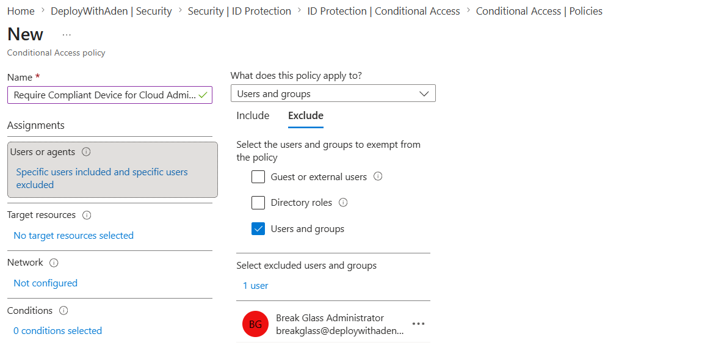
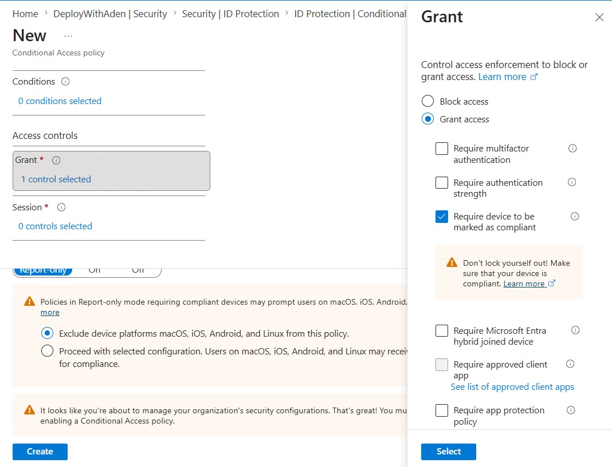
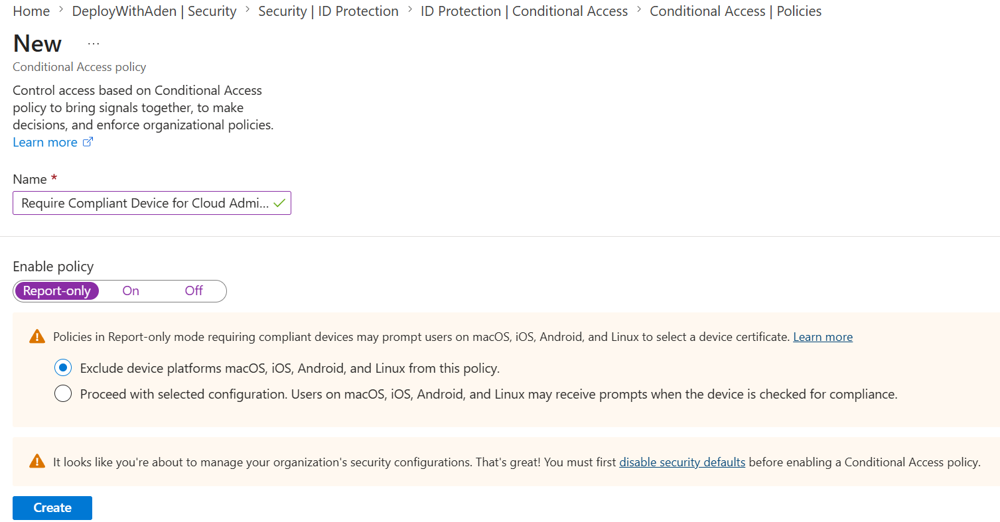

# Day 32 — Require Compliant Devices with Conditional Access

### Azure 100 Days of Cloud Challenge — Ali Aden

## Overview

In this challenge, I configured a Microsoft Entra ID Conditional Access policy to require Cloud Administrators to use compliant devices when accessing organizational resources.

Rather than assigning the policy directly to individual users, I followed security best practices by targeting a dedicated **Cloud Administrators** security group while excluding a **Break Glass Administrator** emergency access account to prevent accidental administrative lockout.

The policy was configured in **Report-only** mode to safely evaluate its impact before enforcement. This allows administrators to review policy behaviour and sign-in activity without interrupting legitimate access.

The configuration was validated using both the Microsoft Entra admin center and Microsoft Graph PowerShell.

---

## Technologies Used

* Microsoft Entra ID
* Microsoft Entra ID P2
* Conditional Access
* Security Groups
* Microsoft Graph PowerShell
* Azure Cloud Shell
* Microsoft Graph SDK

---

## Architecture Diagram

```text
                 Cloud Administrator
                         │
                         ▼
          Microsoft Entra ID Conditional Access
                         │
      ┌──────────────────┴──────────────────┐
      │                                     │
      ▼                                     ▼
 Included                         Excluded
Cloud Administrators      Break Glass Administrator
(Security Group)          (Emergency Account)
      │
      ▼
      Require Compliant Device Policy
                         │
                         ▼
               Target: All Resources
                         │
                         ▼
 Microsoft Intune Device Compliance Evaluation
                         │
      ┌──────────────────┴──────────────────┐
      │                                     │
      ▼                                     ▼
 Compliant Device                 Non-Compliant Device
      │                                     │
      ▼                                     ▼
 Access Allowed                  Would Be Blocked
 (Report-only logged)            (If policy enforced)
```

---

## Implementation Steps

### Step 1 — Create a Cloud Administrators Security Group

Created a dedicated security group to assign the Conditional Access policy instead of targeting individual administrator accounts.

Group:

```text
Cloud Administrators
```

---

### Step 2 — Create a Break Glass Administrator Account

Created an emergency administrator account that remains excluded from restrictive Conditional Access policies.

Purpose:

```text
Emergency administrative access
```

This account provides a recovery method if administrators become locked out.

---

### Step 3 — Create the Conditional Access Policy

Created a Conditional Access policy named:

```text
Require Compliant Device for Cloud Administrators
```

Assignments:

```text
Included:
✓ Cloud Administrators (Security Group)

Excluded:
✓ Break Glass Administrator
```

Target Resources:

```text
✓ All Resources
```

---

### Step 4 — Configure Grant Controls

Configured the following Grant control:

```text
Grant Access

✓ Require device to be marked as compliant
```

Conditions:

```text
None
```

---

### Step 5 — Configure Report-only Mode

Configured the policy state as:

```text
Report-only
```

This allows administrators to safely evaluate policy behaviour before enforcing access restrictions.

---

## Validation

### Validation 1 — Conditional Access Policy List

Verified the policy was successfully created.

Confirmed:

* Policy name
* Report-only mode
* User-created policy

**Screenshot:**



---

### Validation 2 — Microsoft Graph PowerShell Validation

Validated the Conditional Access policy.

Command:

```powershell
Get-MgIdentityConditionalAccessPolicy |
Where-Object {$_.DisplayName -eq "Require Compliant Device for Cloud Administrators"} |
Select-Object DisplayName, State
```

Output:

```text
DisplayName                                       State
-----------                                       -----
Require Compliant Device for Cloud Administrators enabledForReportingButNotEnforced
```

**Screenshot:**



---

### Validation 3 — Policy Overview

Verified the completed Conditional Access policy configuration.

Confirmed:

* Cloud Administrators included
* Break Glass Administrator excluded
* All Resources targeted
* Require device to be marked as compliant
* Report-only mode

**Screenshot:**



---

### Validation 4 — Policy Configuration During Creation

Verified each stage of the policy configuration during creation.

Confirmed:

* Included Cloud Administrators security group
* Excluded Break Glass Administrator account
* All Resources selected
* Require device to be marked as compliant
* Report-only mode configured

**Screenshots:**










---

## Security Benefits

This configuration provides:

* Device-based access control for privileged administrators
* Protection against unmanaged or non-compliant devices
* Safe policy testing using Report-only mode
* Emergency administrative access through a Break Glass account
* Security group-based policy assignment for simplified administration
* Improved Zero Trust security posture

---

## What I Learned

* How to configure Conditional Access policies in Microsoft Entra ID.
* Why security groups are preferred over assigning policies directly to individual users.
* The importance of maintaining a Break Glass Administrator account for emergency access.
* How device compliance integrates with Conditional Access.
* Why Report-only mode should be used before enabling policy enforcement.
* How to validate Conditional Access policies using Microsoft Graph PowerShell.
* How Conditional Access supports a Zero Trust security model.

---

## Key Notes

* Device compliance is evaluated by Microsoft Intune before Microsoft Entra ID makes an access decision.
* Break Glass accounts should always be excluded from restrictive Conditional Access policies.
* Assigning Conditional Access policies to security groups improves scalability and simplifies administration.
* Report-only mode should be used to safely evaluate policy impact before enforcing access controls.
* Microsoft Graph PowerShell provides a reliable method for validating Conditional Access policy configurations.
* This project demonstrates Conditional Access policy configuration and validation. Full enforcement testing requires an Intune-managed compliant device.

---
