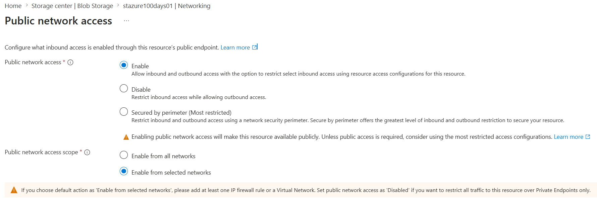
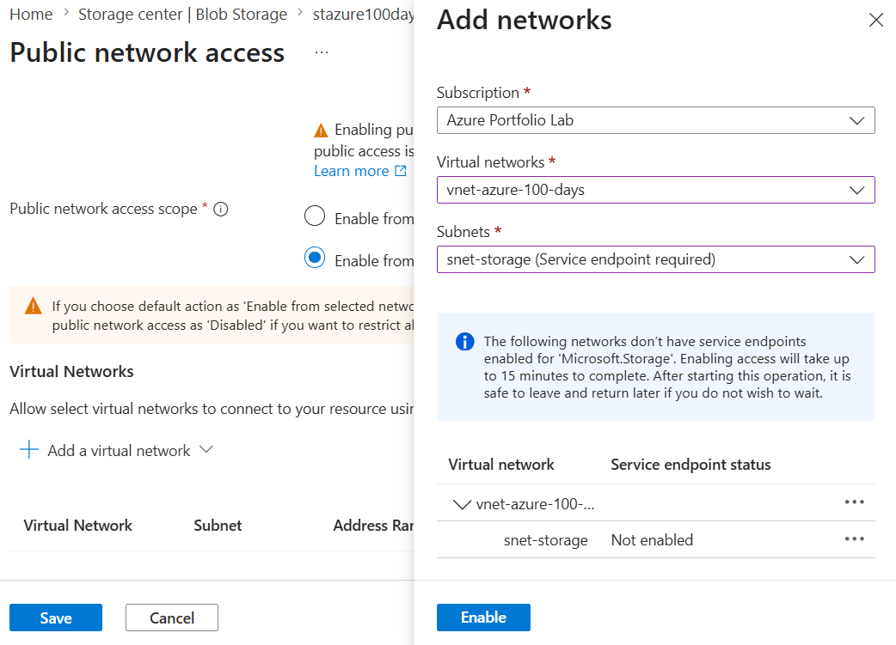
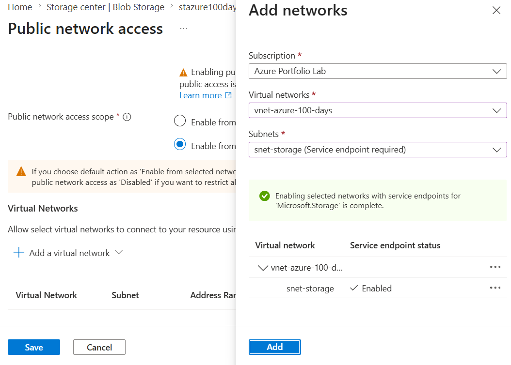
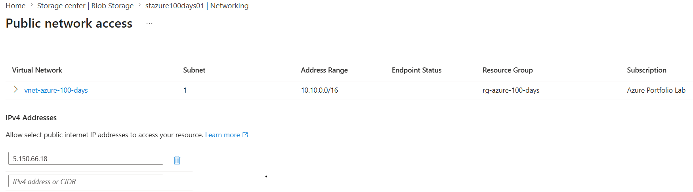
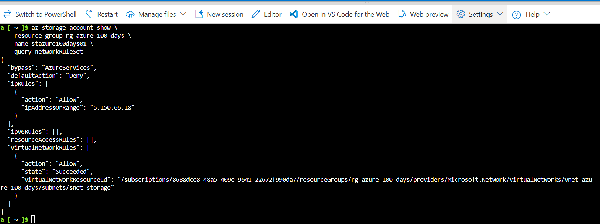

# Day 33 — Configure Storage Account Firewall Rules and Network Access

### Azure 100 Days of Cloud Challenge — Ali Aden

## Overview

In this challenge, I secured an Azure Storage Account by restricting network access using Storage Account firewall rules.

Rather than allowing connections from all public networks, I configured the Storage Account to accept traffic only from a trusted Virtual Network and my current public IP address. Because this Azure environment was newly provisioned, I first created a dedicated Virtual Network and enabled a Microsoft.Storage Service Endpoint before adding the Virtual Network Rule.

The configuration was validated using both the Azure portal and Azure CLI to confirm that the Storage Account only allows trusted network connections.

---

## Technologies Used

* Azure Storage Account
* Azure Virtual Network
* Storage Account Firewall
* Virtual Network Rules
* Microsoft.Storage Service Endpoint
* Azure CLI
* Azure Cloud Shell

---

## Architecture Diagram

```text
                    Azure Storage Account
                           │
                           ▼
              Public Network Access Enabled
                 (Selected Networks Only)
                           │
          ┌────────────────┴────────────────┐
          │                                 │
          ▼                                 ▼
 Virtual Network Rule                Client IP Rule
vnet-azure-100-days                 5.150.66.18
      │                                 │
      ▼                                 ▼
Microsoft.Storage                Administrator
 Service Endpoint                 Management PC
      │                                 │
      └────────────────┬────────────────┘
                       │
                       ▼
               Firewall Evaluation
                       │
        ┌──────────────┴──────────────┐
        │                             │
        ▼                             ▼
 Trusted Network               Untrusted Network
        │                             │
        ▼                             ▼
 Access Allowed                 Access Denied
```

---

## Implementation Steps

### Step 1 — Create a Resource Group

Created a dedicated Resource Group to contain all Azure resources used throughout this challenge.

Configuration:

```text
Resource Group:
rg-azure-100-days

Region:
Sweden Central
```

---

### Step 2 — Create a Storage Account

Created a General-purpose v2 Storage Account to secure with Storage Account firewall rules.

Configuration:

```text
Storage Account:
stazure100days01

Performance:
Standard

Redundancy:
Locally Redundant Storage (LRS)
```

---

### Step 3 — Create a Virtual Network

Because this was a newly provisioned Azure subscription, no Virtual Networks existed. I created a dedicated Virtual Network and subnet to configure a Storage Account Virtual Network Rule.

Configuration:

```text
Virtual Network:
vnet-azure-100-days

Address Space:
10.10.0.0/16

Subnet:
snet-storage
```

---

### Step 4 — Configure Storage Account Firewall

Changed the Storage Account networking configuration from allowing all public networks to allowing only selected networks.

Configuration:

```text
Public Network Access:
Enabled

Public Network Access Scope:
Selected Networks
```

---

### Step 5 — Configure Trusted Networks

Configured trusted network rules for the Storage Account.

Configuration:

```text
Virtual Network Rule:
vnet-azure-100-days
Subnet:
snet-storage

Firewall Rule:
5.150.66.18
```

During configuration, Azure required the **Microsoft.Storage Service Endpoint** to be enabled before the subnet could be added as a trusted Virtual Network.

---

## Validation

### Validation 1 — Public Network Access Configuration

Verified the Storage Account was configured to allow access only from selected networks.

Confirmed:

* Public network access enabled
* Public network access scope changed to **Selected networks**

**Screenshot:**



---

### Validation 2 — Microsoft.Storage Service Endpoint Configuration

Verified that Azure required the Microsoft.Storage Service Endpoint before allowing the subnet to be added as a trusted Virtual Network.

Confirmed:

* Service Endpoint initially required
* Microsoft.Storage Service Endpoint successfully enabled

**Screenshots:**





---

### Validation 3 — Storage Account Firewall Rules

Verified the completed Storage Account firewall configuration.

Confirmed:

* Virtual Network Rule configured
* Client IPv4 firewall rule configured
* Selected networks successfully applied

**Screenshot:**



---

### Validation 4 — Azure CLI Network Rule Validation

Validated the Storage Account network rule configuration using Azure CLI.

Command:

```bash
az storage account show \
  --resource-group rg-azure-100-days \
  --name stazure100days01 \
  --query networkRuleSet
```

Validation confirmed:

* Default action = Deny
* Virtual Network Rule successfully applied
* Client IP firewall rule configured
* Trusted Microsoft Services bypass enabled

**Screenshot:**



---

## Security Benefits

This configuration provides:

* Restricts Storage Account access to trusted networks only
* Reduces exposure to unauthorized public network traffic
* Adds defence in depth alongside Azure RBAC and SAS tokens
* Enables secure access from trusted Azure resources
* Allows secure administrative access using a trusted public IP
* Supports Zero Trust network security principles

---

## What I Learned

* How Storage Account firewall rules protect Azure Storage resources.
* The difference between allowing all networks and selected networks.
* How Virtual Network Rules control access to Azure Storage.
* Why Microsoft.Storage Service Endpoints are required for Virtual Network Rules.
* How firewall IP rules allow secure administrative access.
* How Azure evaluates Storage Account network access before authentication.
* How to validate Storage Account firewall rules using Azure CLI.

---

## Key Notes

* Storage Account firewall rules provide network-level protection before authentication occurs.
* Virtual Network Rules require the Microsoft.Storage Service Endpoint to be enabled on the subnet.
* Client IP firewall rules help prevent administrators from accidentally locking themselves out.
* Azure Storage evaluates network rules before Azure RBAC permissions or SAS tokens.
* The default firewall action of **Deny** ensures only explicitly trusted networks can connect.
* Azure CLI provides an effective method for validating Storage Account network security configurations.

---
