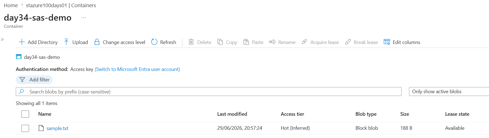
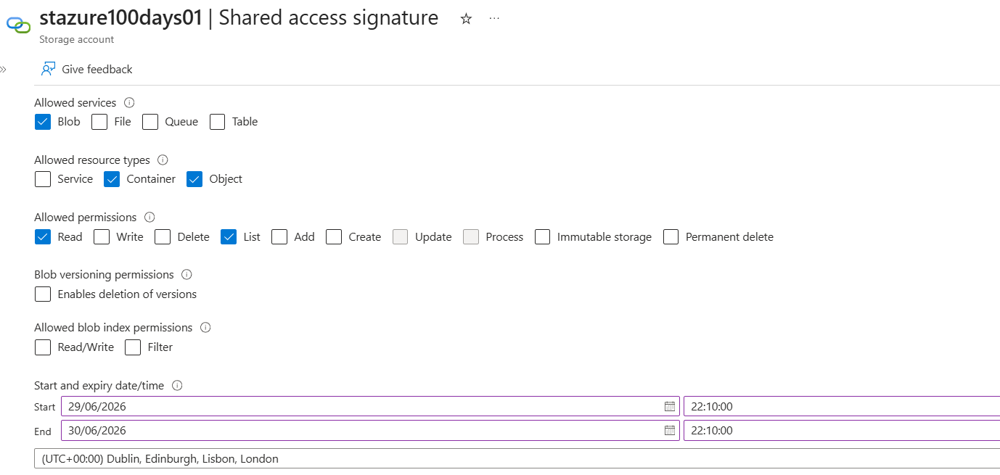
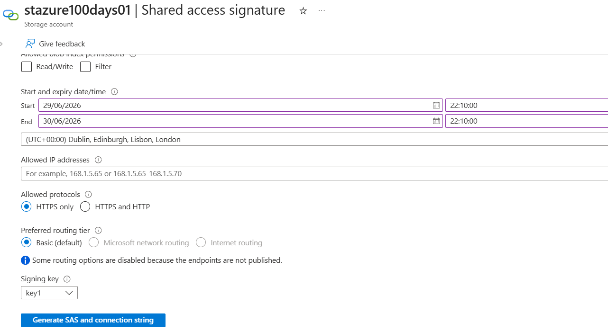
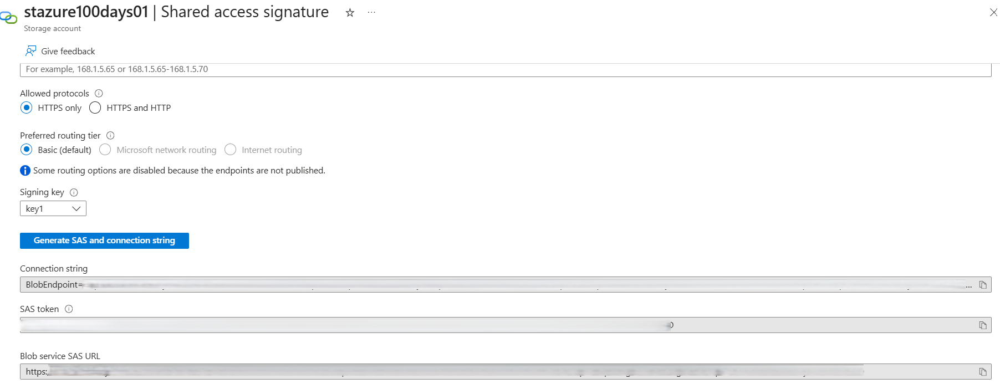
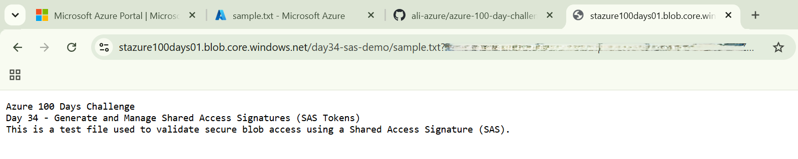
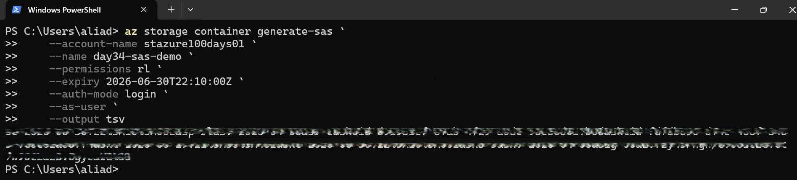

# Day 34 — Generate and Manage Shared Access Signatures (SAS Tokens)

### Azure 100 Days of Cloud Challenge — Ali Aden

## Overview

In this challenge, I learned how to securely grant temporary access to Azure Blob Storage using **Shared Access Signatures (SAS)**.

Rather than sharing storage account keys, I generated an **Account SAS** from the Azure Portal with least-privilege permissions, restricting access to Blob Storage resources for a limited time. I then validated the SAS by accessing a private blob through a web browser before generating a **User Delegation SAS** using Azure CLI and Microsoft Entra ID authentication.

This challenge demonstrates how SAS tokens provide secure, temporary access to Azure Storage resources while reducing the security risks associated with sharing storage account keys.

---

## Technologies Used

* Azure Storage Account
* Azure Blob Storage
* Blob Containers
* Shared Access Signatures (Account SAS)
* User Delegation SAS
* Microsoft Entra ID
* Azure Portal
* Azure CLI
* Windows PowerShell

---

## Architecture Diagram

```text
                    Azure Portal
                           │
                           ▼
              Generate Account SAS
                           │
                           ▼
                Azure Storage Account
                 stazure100days01
                           │
                           ▼
                 Blob Container
                  day34-sas-demo
                           │
                           ▼
                      sample.txt
                           ▲
                           │
                   HTTPS + SAS Token
                           │
          ┌────────────────┴────────────────┐
          │                                 │
          ▼                                 ▼
     Web Browser                 Azure CLI (PowerShell)
```

---

## Implementation Steps

### Step 1 — Create a Blob Container

Created a private Blob Container that would be used to securely store a test file for SAS validation.

Configuration:

```text
Container:
day34-sas-demo

Public Access:
Private (No anonymous access)
```

---

### Step 2 — Upload a Test Blob

Uploaded a simple text file to the container which would later be accessed using the generated SAS token.

Configuration:

```text
Blob Name:
sample.txt

Blob Type:
Block Blob
```

---

### Step 3 — Configure an Account SAS

Configured an Account Shared Access Signature from the Storage Account Shared access signature blade.

Configuration:

```text
Allowed Services:
Blob

Allowed Resource Types:
Container
Object

Allowed Permissions:
Read
List

Allowed Protocols:
HTTPS Only

Validity:
24 Hours

Signing Key:
Key1
```

The configuration followed the principle of **least privilege** by granting only the minimum permissions required.

---

### Step 4 — Generate the Account SAS

Generated the Account SAS from the Azure Portal.

The generated SAS included:

* Scoped permissions
* Allowed services
* Resource types
* Expiry time
* Cryptographic signature

For security reasons, the SAS token, connection string and Blob Service SAS URL were redacted before publishing this project.

---

### Step 5 — Validate Blob Access

Using the generated SAS URL, I successfully accessed the private blob directly from a web browser without exposing the Storage Account key.

This confirmed that the SAS token granted only the configured permissions within the specified validity period.

---

### Step 6 — Generate a User Delegation SAS Using Azure CLI

To understand both approaches to SAS generation, I also generated a **User Delegation SAS** using Azure CLI with Microsoft Entra ID authentication.

Command:

```powershell
az storage container generate-sas `
    --account-name stazure100days01 `
    --name day34-sas-demo `
    --permissions rl `
    --expiry 2026-06-30T22:10:00Z `
    --auth-mode login `
    --as-user `
    --output tsv
```

This demonstrated how Azure CLI can generate a SAS without using Storage Account keys.

---

## Validation

### Validation 1 — Blob Container and Test Blob

Verified that the private Blob Container was successfully created and that the test blob had been uploaded.

Confirmed:

* Private Blob Container created
* Test blob uploaded successfully
* Block Blob created

**Screenshot:**



---

### Validation 2 — Account SAS Configuration

Verified the Account SAS configuration before generation.

Confirmed:

* Blob service selected
* Container and Object resource types
* Read and List permissions
* HTTPS only
* 24-hour expiry

**Screenshots:**





---

### Validation 3 — Account SAS Generation

Verified that Azure successfully generated the Account SAS.

Confirmed:

* Connection string generated
* SAS token generated
* Blob Service SAS URL generated

Sensitive values were redacted before publication.

**Screenshot:**



---

### Validation 4 — Browser Validation

Validated that the generated SAS successfully granted temporary access to the private blob.

Confirmed:

* Blob accessible using the SAS URL
* Read permission successfully validated
* Storage Account keys were not required

**Screenshot:**



---

### Validation 5 — Azure CLI Validation

Generated a User Delegation SAS using Azure CLI and Microsoft Entra ID authentication.

Command:

```powershell
az storage container generate-sas `
    --account-name stazure100days01 `
    --name day34-sas-demo `
    --permissions rl `
    --expiry 2026-06-30T22:10:00Z `
    --auth-mode login `
    --as-user `
    --output tsv
```

Validation confirmed:

* Azure CLI authenticated successfully
* User Delegation SAS generated
* Microsoft Entra ID authentication used
* Storage Account key not required

**Screenshot:**



---

## Security Benefits

This implementation provides:

* Eliminates the need to share Storage Account keys.
* Grants temporary, time-limited access to Azure Storage.
* Applies the principle of least privilege through scoped permissions.
* Restricts access to specific services and resource types.
* Enforces encrypted HTTPS communication.
* Supports secure delegated access using Microsoft Entra ID.
* Reduces the impact of credential exposure through automatic SAS expiry.

---

## What I Learned

* How Account SAS provides delegated access to Azure Storage resources.
* The difference between Account SAS and User Delegation SAS.
* Why Microsoft recommends User Delegation SAS where supported.
* How to scope SAS permissions to specific resources.
* How SAS expiry limits the risk of credential exposure.
* Why Storage Account keys should never be shared.
* How to generate and validate SAS tokens using both Azure Portal and Azure CLI.

---

## Key Notes

* Shared Access Signatures provide temporary delegated access without exposing Storage Account keys.
* Account SAS is signed using the Storage Account key.
* User Delegation SAS is signed using Microsoft Entra ID credentials.
* Applying least-privilege permissions significantly reduces security risk.
* HTTPS-only access protects data in transit.
* All sensitive values including SAS tokens, connection strings and SAS URLs were redacted before publishing this project.
