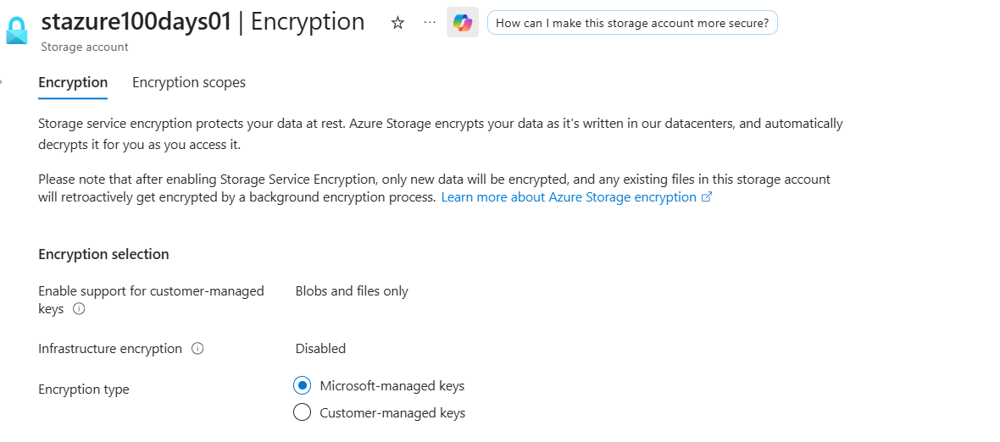
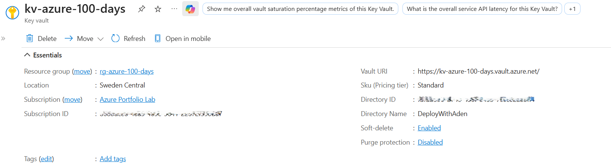
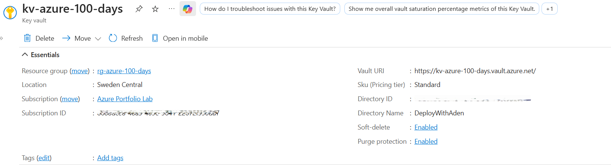
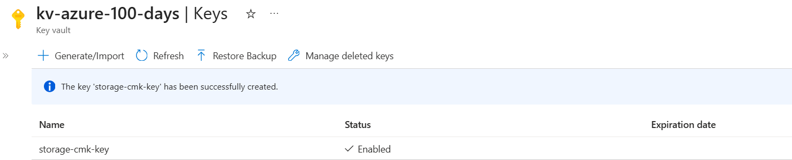
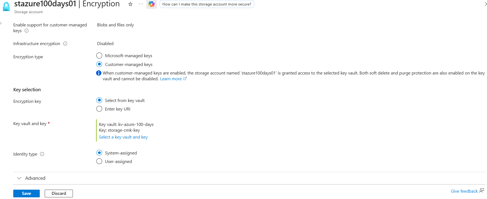
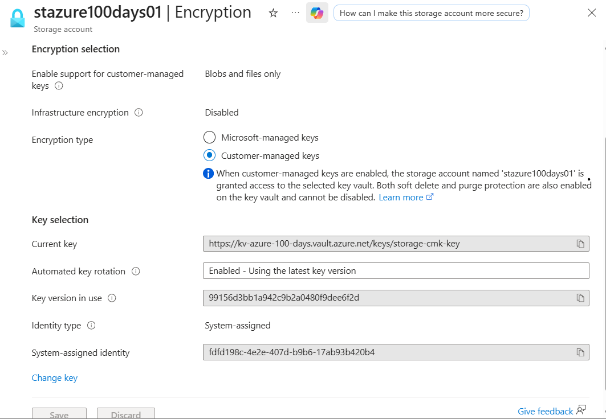
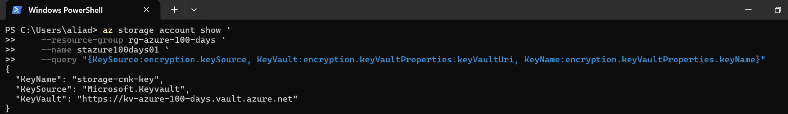

# Day 35 — Enable and Configure Storage Account Encryption

### 100 Days of Azure Cloud Challenge — Ali Aden

## Overview

In this project, I configured an Azure Storage Account to use **Customer-Managed Keys (CMKs)** stored in Azure Key Vault.

Rather than relying on the default Microsoft-managed encryption keys, I created an Azure Key Vault, generated a customer-managed RSA encryption key, enabled a system-assigned managed identity for the Storage Account, assigned the required Azure RBAC permissions, and configured the Storage Account to use the encryption key stored in Azure Key Vault.

This project demonstrates how Customer-Managed Keys provide organisations with greater control over encryption, key lifecycle management, auditing and compliance while ensuring that Azure Storage data remains encrypted at rest.

---

## Technologies Used

* Azure Storage Account
* Azure Key Vault
* Customer-Managed Keys (CMK)
* Microsoft-Managed Keys
* System-Assigned Managed Identity
* Azure RBAC
* Azure Portal
* Azure CLI
* Windows PowerShell

---

## Architecture Diagram

```text
                 Administrator
                       │
                       ▼
                Azure Portal
                       │
                       ▼
            Azure Storage Account
             stazure100days01
                       │
                       ▼
      System-Assigned Managed Identity
                       │
                       │  Azure RBAC
                       │  Key Vault Crypto
                       │  Service Encryption User
                       ▼
              Azure Key Vault
             kv-azure-100-days
                       │
                       ▼
             storage-cmk-key (RSA)
                       │
                       ▼
        Cryptographic Operations
                       │
                       ▼
      Storage Data Encrypted at Rest
```

---

## Implementation Steps

### Step 1 — Review Default Storage Encryption

Reviewed the existing Storage Account encryption configuration to confirm that encryption at rest was enabled using the default Microsoft-managed keys.

Configuration:

```text
Storage Account:
stazure100days01

Encryption Type:
Microsoft-managed keys
```

This established the baseline configuration before switching to Customer-Managed Keys.

---

### Step 2 — Create an Azure Key Vault

Created a new Azure Key Vault to securely store the customer-managed encryption key.

Configuration:

```text
Key Vault:
kv-azure-100-days

Region:
Sweden Central

Pricing Tier:
Standard
```

As part of the deployment, I also enabled:

* Soft Delete
* Purge Protection

to help protect encryption keys against accidental or malicious deletion.

---

### Step 3 — Generate a Customer-Managed Encryption Key

Generated a new RSA encryption key inside Azure Key Vault.

Configuration:

```text
Key Name:
storage-cmk-key

Key Type:
RSA

Key Size:
2048-bit

Status:
Enabled
```

This key is used by the Storage Account instead of the default Microsoft-managed encryption key.

---

### Step 4 — Configure Customer-Managed Keys

Updated the Storage Account encryption settings to use the customer-managed key stored in Azure Key Vault.

Configuration:

```text
Encryption Type:
Customer-managed keys

Key Vault:
kv-azure-100-days

Key:
storage-cmk-key

Identity:
System-assigned managed identity
```

The Storage Account automatically created a system-assigned managed identity to securely authenticate to Azure Key Vault.

---

### Step 5 — Configure Azure RBAC Permissions

Assigned the required Azure RBAC role to allow the Storage Account's managed identity to perform cryptographic operations using the customer-managed key.

Configuration:

```text
Role:
Key Vault Crypto Service Encryption User

Assigned To:
Storage Account System-assigned Managed Identity
```

After Azure RBAC permissions propagated, the Storage Account successfully switched from Microsoft-managed keys to Customer-Managed Keys.

---

### Step 6 — Validate the Encryption Configuration Using Azure CLI

Validated the completed encryption configuration using Azure CLI.

Command:

```powershell
az storage account show `
    --resource-group rg-azure-100-days `
    --name stazure100days01 `
    --query "{KeySource:encryption.keySource, KeyVault:encryption.keyVaultProperties.keyVaultUri, KeyName:encryption.keyVaultProperties.keyName}"
```

This confirmed that the Storage Account references the customer-managed encryption key stored in Azure Key Vault.

---

## Validation

### Validation 1 — Microsoft-Managed Keys

Verified that the Storage Account was initially configured to use Microsoft-managed encryption keys.

Confirmed:

* Encryption at rest enabled
* Microsoft-managed keys selected

**Screenshot:**



---

### Validation 2 — Azure Key Vault Deployment

Verified the successful deployment of Azure Key Vault.

Confirmed:

* Azure Key Vault created
* Standard pricing tier
* Soft Delete enabled

**Screenshot:**



---

### Validation 3 — Purge Protection

Verified that Purge Protection was enabled on Azure Key Vault.

Confirmed:

* Soft Delete enabled
* Purge Protection enabled

**Screenshot:**



---

### Validation 4 — Customer-Managed Encryption Key

Verified that the RSA encryption key was successfully created.

Confirmed:

* storage-cmk-key created
* RSA key enabled

**Screenshot:**



---

### Validation 5 — Customer-Managed Key Configuration

Verified the Storage Account configuration before applying the encryption changes.

Confirmed:

* Customer-managed keys selected
* Azure Key Vault selected
* System-assigned managed identity selected

**Screenshot:**



---

### Validation 6 — Customer-Managed Keys Enabled

Verified the completed Storage Account encryption configuration.

Confirmed:

* Customer-managed keys enabled
* Azure Key Vault configured
* storage-cmk-key selected
* System-assigned managed identity configured

**Screenshot:**



---

### Validation 7 — Azure CLI Validation

Validated the completed encryption configuration using Azure CLI.

Command:

```powershell
az storage account show `
    --resource-group rg-azure-100-days `
    --name stazure100days01 `
    --query "{KeySource:encryption.keySource, KeyVault:encryption.keyVaultProperties.keyVaultUri, KeyName:encryption.keyVaultProperties.keyName}"
```

Validation confirmed:

* Customer-managed keys configured
* Encryption source is Azure Key Vault
* storage-cmk-key referenced successfully

**Screenshot:**



---

## Security Benefits

This implementation provides:

* Eliminates reliance on Microsoft-managed encryption keys.
* Gives organisations full ownership of encryption keys.
* Supports centralised key lifecycle management through Azure Key Vault.
* Uses a system-assigned managed identity instead of stored credentials.
* Protects encryption keys with Soft Delete and Purge Protection.
* Supports regulatory and compliance requirements for customer-controlled encryption.
* Separates encrypted data from encryption key management for improved security.

---

## Key Notes

* Azure Storage is encrypted at rest by default using Microsoft-managed keys.
* Customer-Managed Keys allow organisations to control their own encryption keys using Azure Key Vault.
* System-assigned managed identities eliminate the need to store credentials when accessing Azure Key Vault.
* Azure RBAC authorises the Storage Account's managed identity to perform cryptographic operations using the customer-managed key.
* The encryption key never leaves Azure Key Vault; cryptographic operations are performed within the service.
* Soft Delete and Purge Protection help prevent accidental or malicious deletion of encryption keys.
* Azure CLI provides an effective method for validating Storage Account encryption settings.
