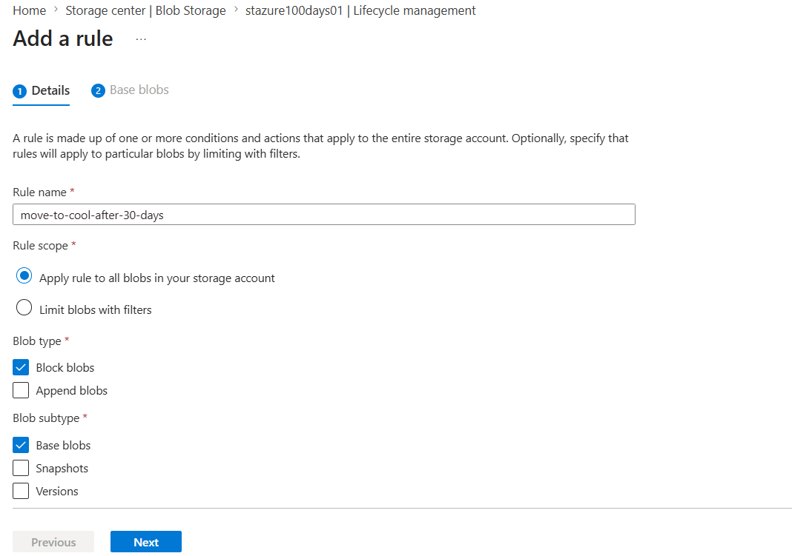
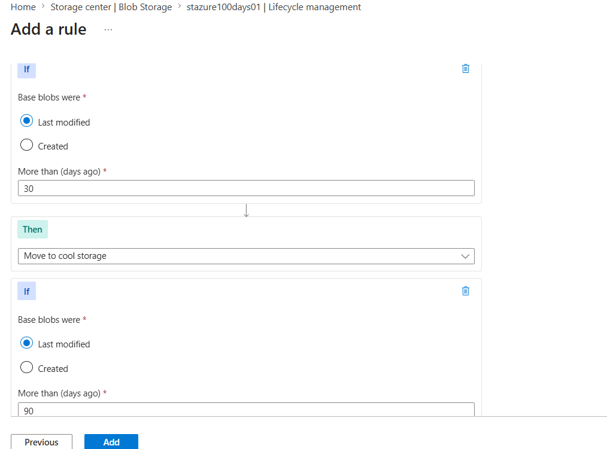
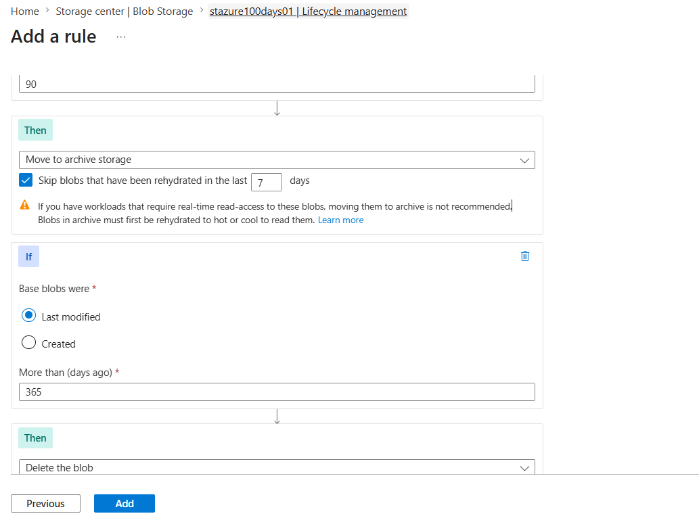
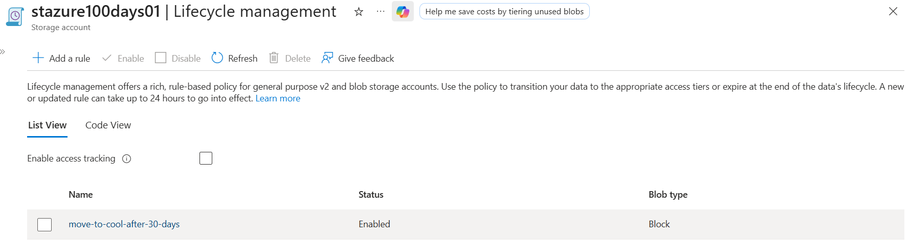
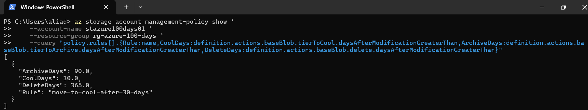

# Day 36 — Set Up Blob Lifecycle Management Policies

### Azure 100 Days of Cloud Challenge — Ali Aden

## Overview

In this project, I configured an Azure Blob Lifecycle Management Policy to automate Azure Storage cost optimisation.

Rather than manually moving or deleting ageing data, I implemented a lifecycle management rule that automatically transitions Block Blobs from the Hot access tier to the Cool tier after 30 days, moves them to the Archive tier after 90 days, and permanently deletes them after 365 days.

This project demonstrates how Azure Storage Lifecycle Management helps organisations reduce storage costs, automate data retention, and minimise administrative overhead through policy-based automation.

---

## Technologies Used

* Azure Storage Account
* Azure Blob Storage
* Lifecycle Management Policies
* Block Blobs
* Hot Access Tier
* Cool Access Tier
* Archive Access Tier
* Azure Portal
* Azure CLI
* Windows PowerShell

---

## Architecture Diagram

```text
                 Administrator
                       │
                       ▼
                Azure Portal
                       │
                       ▼
            Azure Storage Account
             stazure100days01
                       │
                       ▼
       Lifecycle Management Policy
      move-to-cool-after-30-days
                       │
          Applies to Block Blobs
                       │
         ┌─────────────┼─────────────┐
         │             │             │
         ▼             ▼             ▼
   After 30 Days  After 90 Days  After 365 Days
         │             │             │
         ▼             ▼             ▼
 Move to Cool Tier  Move to Archive  Delete Blob
                       │
                       ▼
             Azure CLI Validation
```

---

## Implementation Steps

### Step 1 — Create a Lifecycle Management Rule

Created a lifecycle management rule to automate blob lifecycle actions across the Storage Account.

Configuration:

```text
Rule Name:
move-to-cool-after-30-days

Rule Scope:
Apply rule to all blobs in your storage account

Blob Type:
Block blobs

Blob Subtype:
Base blobs
```

This rule applies to all Block Blobs stored within the Storage Account.

---

### Step 2 — Configure Blob Tiering

Configured lifecycle actions to automatically transition blobs between storage access tiers based on their last modified date.

Configuration:

```text
Condition:
Last Modified

After:
30 Days

Action:
Move to Cool Storage

Condition:
Last Modified

After:
90 Days

Action:
Move to Archive Storage
```

The Archive action was configured using the recommended default option to skip blobs that have been rehydrated within the last seven days.

---

### Step 3 — Configure Automatic Blob Deletion

Configured a final lifecycle action to automatically delete ageing blobs.

Configuration:

```text
Condition:
Last Modified

After:
365 Days

Action:
Delete Blob
```

This ensures obsolete data is automatically removed without manual intervention.

---

### Step 4 — Save the Lifecycle Management Policy

Saved and enabled the lifecycle management policy.

Configuration:

```text
Policy Status:
Enabled

Rule:
move-to-cool-after-30-days
```

Azure evaluates lifecycle management policies approximately once every 24 hours before applying matching actions.

---

### Step 5 — Validate the Lifecycle Management Policy Using Azure CLI

Validated the lifecycle management policy using Azure CLI.

Command:

```powershell
az storage account management-policy show `
    --account-name stazure100days01 `
    --resource-group rg-azure-100-days `
    --query "policy.rules[].{Rule:name,CoolDays:definition.actions.baseBlob.tierToCool.daysAfterModificationGreaterThan,ArchiveDays:definition.actions.baseBlob.tierToArchive.daysAfterModificationGreaterThan,DeleteDays:definition.actions.baseBlob.delete.daysAfterModificationGreaterThan}"
```

This confirmed that the lifecycle management policy was successfully configured with the expected storage tier transition and deletion thresholds.

---

## Validation

### Validation 1 — Lifecycle Rule Configuration

Verified the lifecycle management rule configuration.

Confirmed:

* Rule created successfully
* Applied to all blobs
* Block blobs selected
* Base blobs selected

**Screenshot:**



---

### Validation 2 — Blob Tiering Actions

Verified the lifecycle policy actions for transitioning blobs between storage tiers.

Confirmed:

* Move to Cool Storage after 30 days
* Move to Archive Storage after 90 days
* Last Modified condition configured

**Screenshot:**



---

### Validation 3 — Automatic Blob Deletion

Verified the lifecycle policy deletion action.

Confirmed:

* Delete blobs after 365 days
* Archive action configured
* Skip recently rehydrated blobs for seven days enabled

**Screenshot:**



---

### Validation 4 — Lifecycle Policy Created

Verified that the lifecycle management policy was successfully created and enabled.

Confirmed:

* Lifecycle management rule enabled
* Policy applied to Block Blobs
* Lifecycle management policy saved successfully

**Screenshot:**



---

### Validation 5 — Azure CLI Validation

Validated the lifecycle management policy using Azure CLI.

Command:

```powershell
az storage account management-policy show `
    --account-name stazure100days01 `
    --resource-group rg-azure-100-days `
    --query "policy.rules[].{Rule:name,CoolDays:definition.actions.baseBlob.tierToCool.daysAfterModificationGreaterThan,ArchiveDays:definition.actions.baseBlob.tierToArchive.daysAfterModificationGreaterThan,DeleteDays:definition.actions.baseBlob.delete.daysAfterModificationGreaterThan}"
```

Validation confirmed:

* Lifecycle management rule created successfully
* Blob transition to Cool after 30 days
* Blob transition to Archive after 90 days
* Blob deletion after 365 days

**Screenshot:**



---

## Security Benefits

This implementation provides:

* Automatically reduces Azure Storage costs by transitioning ageing blobs to lower-cost storage tiers.
* Eliminates manual lifecycle management through policy-based automation.
* Supports organisational data retention and cleanup requirements.
* Reduces unnecessary storage consumption by automatically deleting obsolete blobs.
* Minimises administrative overhead through automated storage lifecycle management.
* Encourages cost optimisation using Azure Storage best practices.

---

## Key Notes

* Azure Lifecycle Management Policies evaluate eligible blobs approximately once every 24 hours.
* Blob lifecycle rules can automatically transition data between the Hot, Cool and Archive access tiers.
* Archive Storage provides the lowest storage cost but requires rehydration before data can be accessed.
* The **"Skip blobs that have been rehydrated in the last 7 days"** option prevents recently restored blobs from being immediately archived again.
* Lifecycle Management Policies automate long-term storage optimisation while reducing administrative effort.
* Azure CLI provides an efficient way to validate lifecycle management policies and their configured actions.
