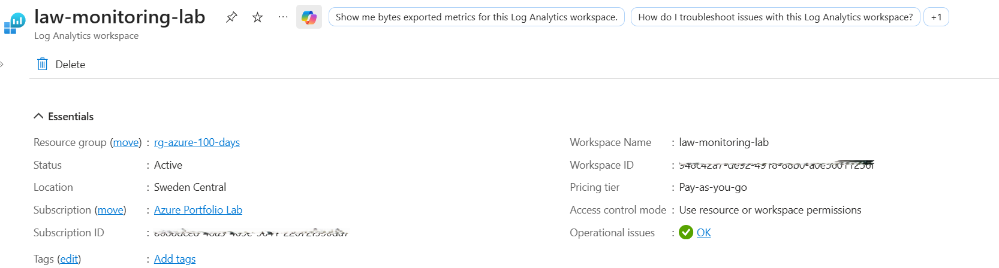
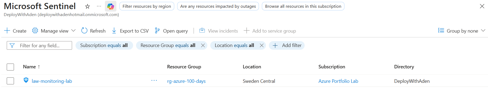
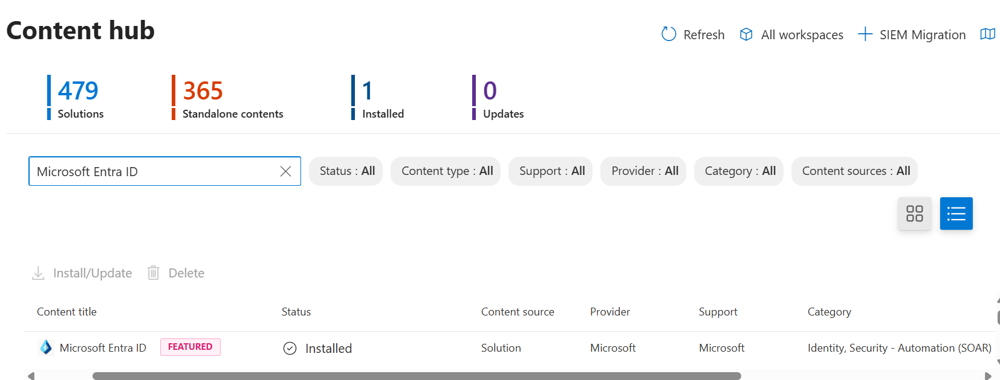
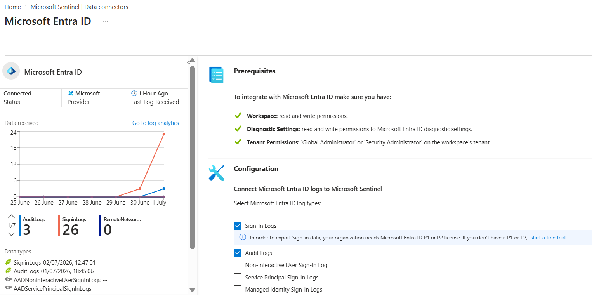
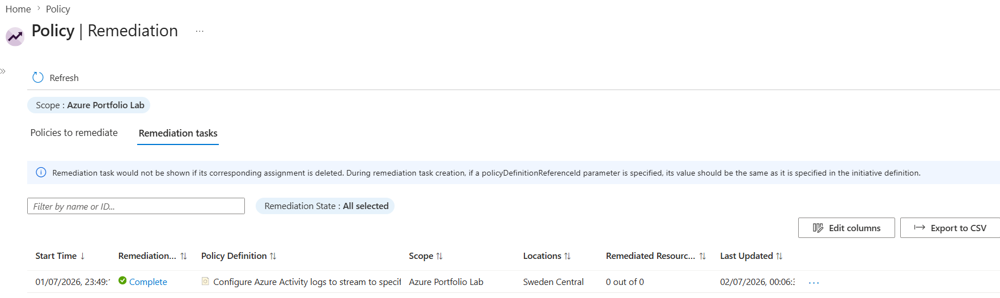
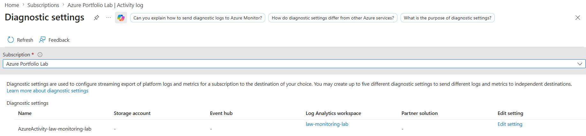
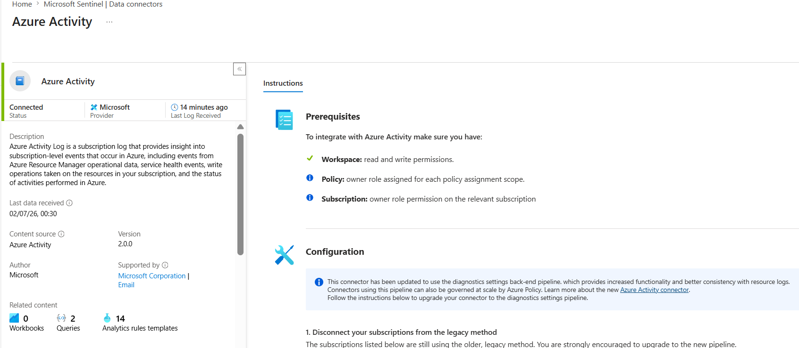
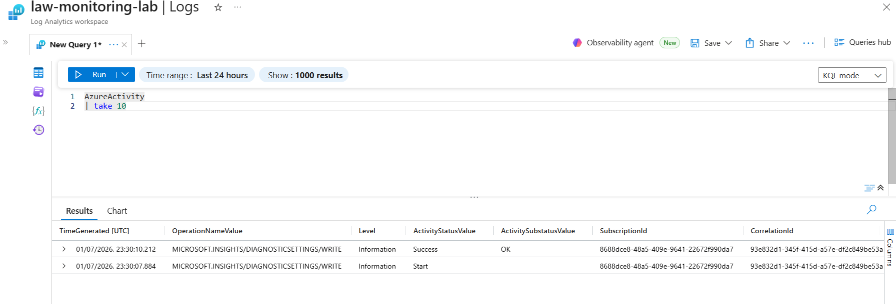
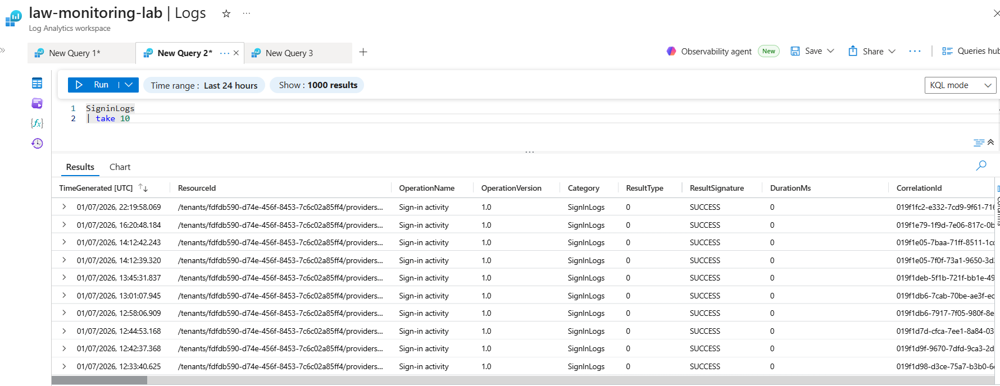

# Day 37 — Deploy Microsoft Sentinel and Connect Your First Data Source

### Azure 100 Days of Cloud Challenge — Ali Aden

## Overview

In this challenge, I deployed **Microsoft Sentinel** on top of an existing Log Analytics Workspace and configured my first security data sources to establish the foundation for centralized security monitoring.

I installed the **Microsoft Entra ID** solution from the Content Hub, connected the **Microsoft Entra ID** and **Azure Activity** data connectors, and configured Azure Policy remediation to deploy the required subscription-level diagnostic settings for Azure Activity Logs.

After enabling both data sources, I validated successful log ingestion by querying the **SigninLogs** and **AzureActivity** tables using Kusto Query Language (KQL).

This challenge demonstrates how Microsoft Sentinel collects and centralizes security telemetry from multiple Azure services, providing the foundation for threat detection, investigation, and incident response.

---

## Technologies Used

- Microsoft Sentinel
- Log Analytics Workspace
- Microsoft Entra ID
- Azure Activity Logs
- Azure Monitor Diagnostic Settings
- Azure Policy
- Azure RBAC
- System-Assigned Managed Identity
- Azure Portal
- Azure CLI
- Kusto Query Language (KQL)
- Windows PowerShell

---

## Architecture Diagram

```text
                         Azure Subscription
                        Azure Portfolio Lab
                                │
                                ▼
                       rg-azure-100-days
                                │
        ┌───────────────────────┼────────────────────────┐
        │                       │                        │
        ▼                       ▼                        ▼
Microsoft Entra ID        Azure Policy         Log Analytics Workspace
(Sign-in & Audit Logs)   (DeployIfNotExists)      law-monitoring-lab
        │                       │                        ▲
        │                       ▼                        │
        │         Diagnostic Settings                   │
        │       (Azure Activity Logs)                   │
        └───────────────────────┼────────────────────────┘
                                │
                                ▼
                    Microsoft Sentinel
             (Enabled on law-monitoring-lab)
                                │
                    ┌───────────┴───────────┐
                    ▼                       ▼
               SigninLogs             AzureActivity
```

---

## Implementation Steps

### Step 1 — Create a Log Analytics Workspace

Created a Log Analytics Workspace that would serve as the central repository for Microsoft Sentinel security telemetry.

Configuration:

```text
Workspace:
law-monitoring-lab

Region:
Sweden Central

Pricing Tier:
Pay-As-You-Go
```

This workspace stores all security logs collected by Microsoft Sentinel.

---

### Step 2 — Enable Microsoft Sentinel

Enabled Microsoft Sentinel on the existing Log Analytics Workspace.

Configuration:

```text
Workspace:
law-monitoring-lab

SIEM:
Microsoft Sentinel
```

Microsoft Sentinel was successfully deployed using the modern workspace-based architecture.

---

### Step 3 — Install the Microsoft Entra ID Solution

Installed the Microsoft Entra ID solution from the Sentinel Content Hub.

The solution automatically provides:

- Microsoft Entra ID data connector
- Analytics content
- Workbooks
- Hunting queries
- Detection rules

---

### Step 4 — Configure the Microsoft Entra ID Data Connector

Configured the Microsoft Entra ID connector to stream identity-related events into Microsoft Sentinel.

Enabled log categories:

```text
✔ Sign-in Logs

✔ Audit Logs
```

This allows Microsoft Sentinel to monitor authentication activity and identity changes across the tenant.

---

### Step 5 — Configure the Azure Activity Data Connector

Configured the Azure Activity connector to ingest subscription-level Activity Logs.

During deployment, Azure Policy was used to automate the creation of the required diagnostic settings.

Configuration included:

```text
Azure Policy Assignment

Azure Policy Remediation

Subscription Diagnostic Settings

Log Analytics Workspace:
law-monitoring-lab
```

After remediation completed successfully, Azure Activity Logs began flowing into Microsoft Sentinel.

---

### Step 6 — Validate Log Ingestion Using KQL

Validated successful data ingestion by querying both Microsoft Entra ID Sign-in Logs and Azure Activity Logs.

Queries:

```kusto
SigninLogs
| take 10
```

```kusto
AzureActivity
| take 10
```

Both queries returned successful results, confirming that Microsoft Sentinel was ingesting logs from both configured data sources.

---

### Step 7 — Attempt Azure CLI Validation

Attempted to validate configured data connectors using Azure CLI.

Command:

```powershell
az sentinel data-connector list `
    --resource-group rg-azure-100-days `
    --workspace-name law-monitoring-lab `
    --output json
```

The current Azure CLI Sentinel preview extension executed successfully but returned an empty result (`[]`) despite both connectors being operational within Microsoft Sentinel.

Validation was therefore completed using Microsoft Sentinel together with successful KQL queries.

---

## Validation

### Validation 1 — Log Analytics Workspace

Verified that the Log Analytics Workspace was successfully created.

Confirmed:

- Workspace deployed
- Sweden Central region
- Ready for Microsoft Sentinel

**Screenshot:**



---

### Validation 2 — Microsoft Sentinel Enabled

Verified that Microsoft Sentinel was successfully enabled.

Confirmed:

- Sentinel deployed
- Workspace connected

**Screenshot:**



---

### Validation 3 — Microsoft Entra ID Solution Installed

Verified that the Microsoft Entra ID solution was successfully installed.

Confirmed:

- Solution installed
- Content Hub deployment completed

**Screenshot:**



---

### Validation 4 — Microsoft Entra ID Connector

Verified that the Microsoft Entra ID connector was connected.

Confirmed:

- Sign-in Logs enabled
- Audit Logs enabled
- Connector connected

**Screenshot:**



---

### Validation 5 — Azure Policy Remediation

Verified that Azure Policy remediation completed successfully.

Confirmed:

- Remediation completed
- Subscription compliant

**Screenshot:**



---

### Validation 6 — Subscription Diagnostic Settings

Verified that the subscription diagnostic settings were configured.

Confirmed:

- Azure Activity diagnostic settings created
- Logs sent to Log Analytics Workspace

**Screenshot:**



---

### Validation 7 — Azure Activity Connector

Verified that the Azure Activity connector successfully connected.

Confirmed:

- Azure Activity connected
- Log ingestion active

**Screenshot:**



---

### Validation 8 — Azure Activity Log Validation

Validated successful Azure Activity log ingestion.

Query:

```kusto
AzureActivity
| take 10
```

Confirmed:

- Azure Activity events received
- Log ingestion operational

**Screenshot:**



---

### Validation 9 — Microsoft Entra ID Sign-in Logs

Validated successful Microsoft Entra ID log ingestion.

Query:

```kusto
SigninLogs
| take 10
```

Confirmed:

- Sign-in logs received
- Microsoft Entra ID connector operational

**Screenshot:**



---

## Security Benefits

This implementation provides:

- Centralized security monitoring using Microsoft Sentinel.
- Continuous collection of Microsoft Entra ID authentication logs.
- Subscription-wide Azure Activity monitoring.
- Automated log collection through Azure Policy and Diagnostic Settings.
- Centralized investigation using Kusto Query Language (KQL).
- Foundation for future analytics rules, incidents, hunting queries, and automated threat detection.
- Improved visibility across Azure resources and identity activity.

---

## Key Notes

- Microsoft Sentinel is a cloud-native SIEM built on top of Log Analytics Workspace.
- Microsoft Sentinel relies on data connectors to ingest security telemetry.
- Microsoft Entra ID connectors provide authentication and audit events.
- Azure Activity Logs capture subscription-level management operations.
- Azure Policy can automate deployment of required diagnostic settings.
- Successful KQL queries provide the most reliable confirmation that log ingestion is functioning correctly.
- Azure CLI preview extensions may not always reflect the latest Microsoft Sentinel connector architecture.
