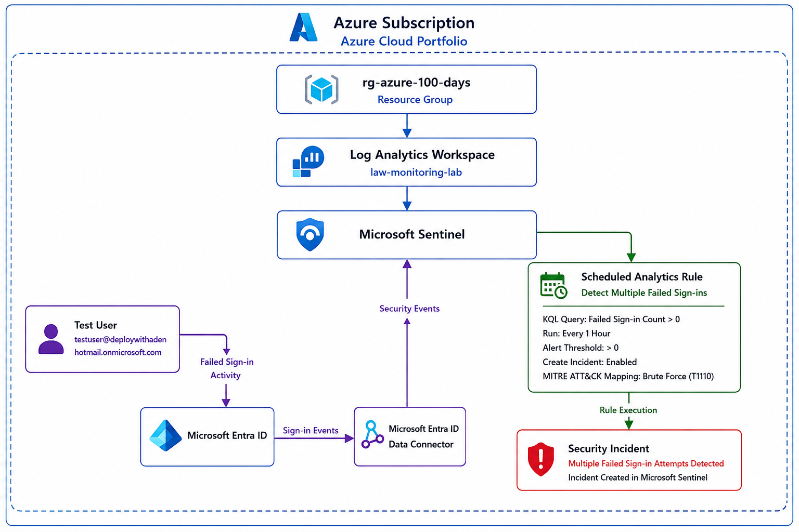
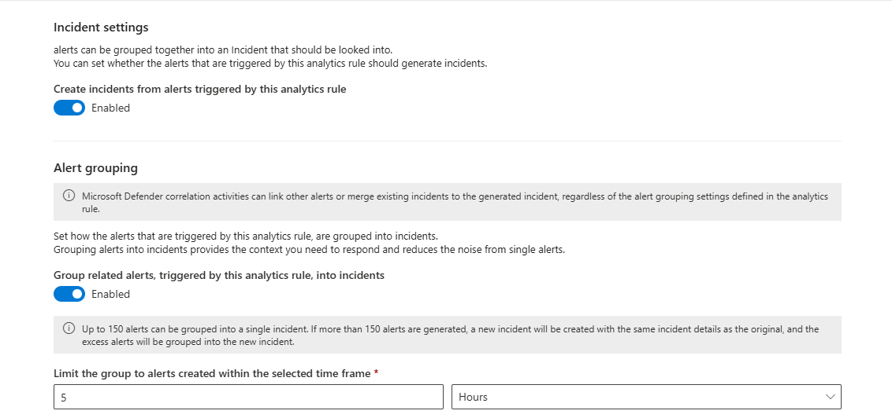
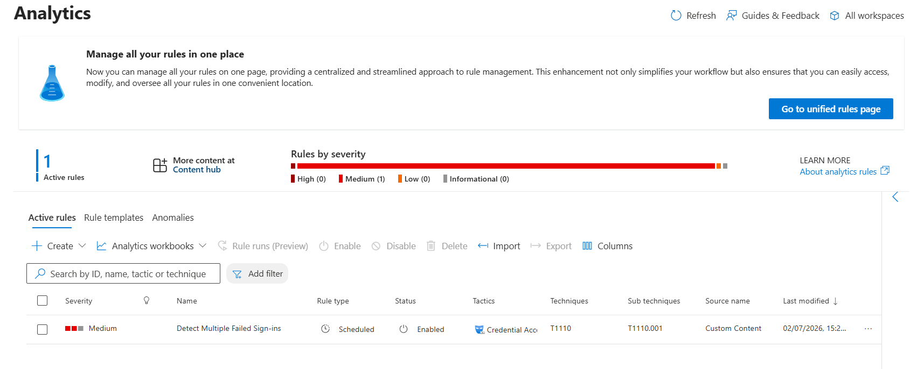
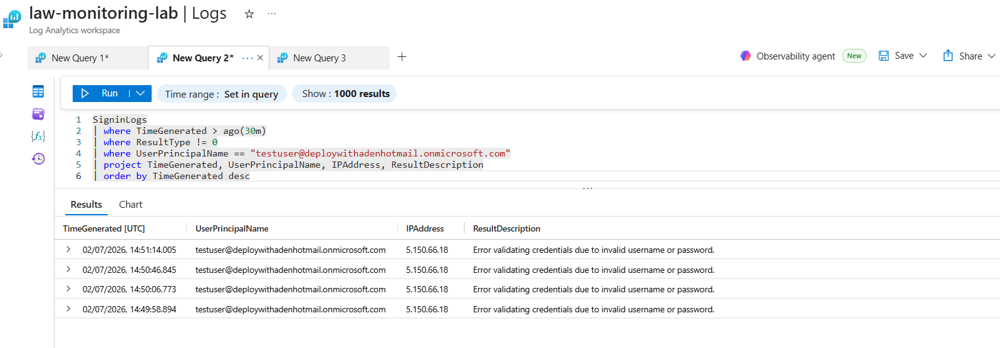
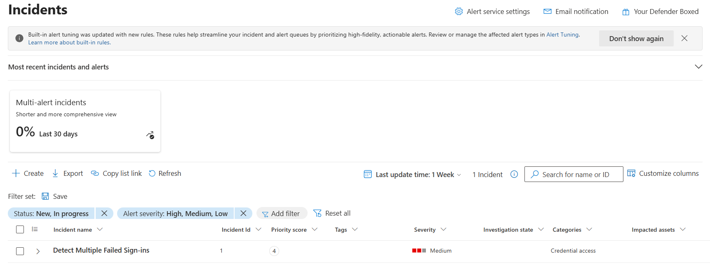

# Day 38 — Create a Sentinel Analytics Rule to Detect Suspicious Activity

### Azure 100 Days of Cloud Challenge — Ali Aden

## Overview

In this challenge, I created a **Scheduled Analytics Rule** in **Microsoft Sentinel** to automatically detect multiple failed Microsoft Entra ID sign-in attempts.

I configured a **Kusto Query Language (KQL)** query to identify users with three or more failed authentication attempts within one hour, scheduled the rule to execute hourly, configured automatic incident creation, and mapped the detection to the **MITRE ATT&CK** framework.

To validate the implementation, I generated multiple failed sign-in attempts using a dedicated test account, confirmed the events were successfully ingested into Microsoft Sentinel, and verified that the scheduled analytics rule automatically generated a security incident.

This challenge demonstrates how Microsoft Sentinel transforms collected security telemetry into actionable detections through analytics rules, enabling automated threat detection and incident creation.

---

## Technologies Used

- Microsoft Sentinel
- Log Analytics Workspace
- Microsoft Entra ID
- Microsoft Entra ID Data Connector
- Kusto Query Language (KQL)
- MITRE ATT&CK Framework
- Azure Monitor
- Azure Portal

---

## Architecture Diagram



---

## Implementation Steps

### Step 1 — Create a Scheduled Analytics Rule

Created a new **Scheduled Analytics Rule** within Microsoft Sentinel.

Configuration:

```text
Rule Name:
Detect Multiple Failed Sign-ins

Rule Type:
Scheduled

Severity:
Medium

Status:
Enabled
```

This rule continuously monitors Microsoft Entra ID authentication activity for suspicious sign-in behaviour.

---

### Step 2 — Configure the Detection Logic

Configured the analytics rule using the following KQL query.

Query:

```kusto
SigninLogs
| where ResultType != 0
| where TimeGenerated > ago(1h)
| summarize FailedAttempts = count() by UserPrincipalName, IPAddress
| where FailedAttempts >= 3
```

The query identifies users with three or more failed sign-in attempts from the same IP address within the previous hour.

---

### Step 3 — Configure Query Scheduling

Configured the analytics rule to execute automatically.

Configuration:

```text
Run Query:
Every 1 Hour

Lookup Data:
Previous 1 Hour

Alert Threshold:
Greater Than 0 Results

Event Grouping:
Group All Events Into A Single Alert
```

This configuration ensures Microsoft Sentinel continuously evaluates recent authentication activity.

---

### Step 4 — Configure Incident Settings

Configured Microsoft Sentinel to automatically create incidents whenever the analytics rule generates an alert.

Configuration:

```text
Create Incidents:
Enabled

Alert Grouping:
Enabled

Incident Correlation:
Enabled
```

This configuration allows related alerts to be grouped into a single security incident for investigation.

---

### Step 5 — Configure MITRE ATT&CK Mapping

Mapped the analytics rule to the MITRE ATT&CK framework.

Configuration:

```text
Tactic:
Credential Access

Technique:
Brute Force

Sub-technique:
Password Guessing (T1110.001)
```

This provides standardized classification for detected authentication attacks.

---

### Step 6 — Generate Failed Sign-in Activity

Generated multiple failed Microsoft Entra ID sign-in attempts using a dedicated test account by intentionally entering an incorrect password several times.

These authentication failures were successfully ingested into Microsoft Sentinel through the existing Microsoft Entra ID Data Connector.

---

### Step 7 — Validate Sign-in Events

Validated successful log ingestion by querying the **SigninLogs** table.

Query:

```kusto
SigninLogs
| where ResultType != 0
| where TimeGenerated > ago(30m)
| where UserPrincipalName == "testuser@deploywithadenhotmail.onmicrosoft.com"
| project TimeGenerated, UserPrincipalName, IPAddress, ResultDescription
| order by TimeGenerated desc
```

The query returned multiple failed authentication events, confirming that Microsoft Sentinel had successfully received the required security telemetry.

---

### Step 8 — Validate Security Incident Creation

After the scheduled analytics rule executed, Microsoft Sentinel automatically generated a security incident.

The generated incident confirmed that:

- The analytics rule executed successfully.
- Failed sign-in attempts matched the detection logic.
- A security alert was generated.
- Microsoft Sentinel automatically created an incident for investigation.

---

## Validation

### Validation 1 — Analytics Rule Configuration

Verified that the Scheduled Analytics Rule was successfully created.

Confirmed:

- Rule created
- Scheduled rule type
- Enabled

**Screenshot:**


---

### Validation 2 — General Rule Configuration

Verified the analytics rule configuration.

Confirmed:

- Rule name
- Medium severity
- MITRE ATT&CK mapping
- Rule enabled

**Screenshot:**


---

### Validation 3 — Detection Logic and Scheduling

Verified the configured KQL query and execution schedule.

Confirmed:

- Detection query configured
- Hourly execution schedule
- Alert threshold configured

**Screenshot:**


---

### Validation 4 — Incident Configuration

Verified automatic incident creation settings.

Confirmed:

- Incident creation enabled
- Alert grouping enabled
- Incident correlation enabled

**Screenshot:**



---

### Validation 5 — Analytics Rule Created

Verified that the analytics rule was successfully deployed.

Confirmed:

- Rule successfully created
- Available within Microsoft Sentinel

**Screenshot:**


---

### Validation 6 — Analytics Rule Enabled

Verified that the analytics rule was enabled.

Confirmed:

- Rule enabled
- Scheduled execution
- MITRE ATT&CK mapping displayed

**Screenshot:**



---

### Validation 7 — Failed Sign-in Activity

Validated successful ingestion of failed authentication events.

Query:

```kusto
SigninLogs
| where ResultType != 0
```

Confirmed:

- Failed sign-in events received
- Microsoft Entra ID Data Connector operational
- Analytics rule had matching events available

**Screenshot:**



---

### Validation 8 — Security Incident Generated

Verified that Microsoft Sentinel automatically generated a security incident after the scheduled analytics rule executed.

Confirmed:

- Security incident created
- Medium severity
- Credential Access detection
- Analytics rule successfully triggered

**Screenshot:**



---

## Security Benefits

This implementation provides:

- Automated detection of repeated failed Microsoft Entra ID sign-in attempts.
- Continuous monitoring using scheduled KQL queries.
- Automatic security alert generation without manual log review.
- Automatic incident creation for security investigation.
- Standardized threat classification using the MITRE ATT&CK framework.
- Improved visibility into suspicious authentication activity.
- A foundation for future automation, playbooks, and advanced threat detection within Microsoft Sentinel.

---

## Key Notes

- Microsoft Sentinel analytics rules continuously evaluate collected security data using scheduled KQL queries.
- Detection rules only generate alerts when the configured query returns matching results.
- MITRE ATT&CK mappings provide standardized classification for detected attack techniques.
- Automatic incident creation reduces manual effort and accelerates security investigations.
- Analytics rules execute according to their configured schedule, meaning detections may not occur immediately after events are generated.
- Validating analytics rules using controlled failed sign-in attempts is an effective way to test detections in a lab or portfolio environment before deploying similar logic in production.
