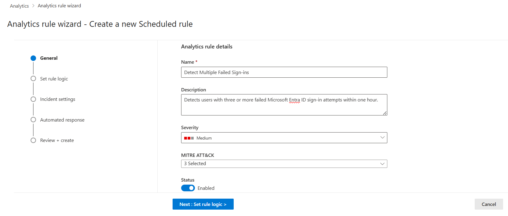
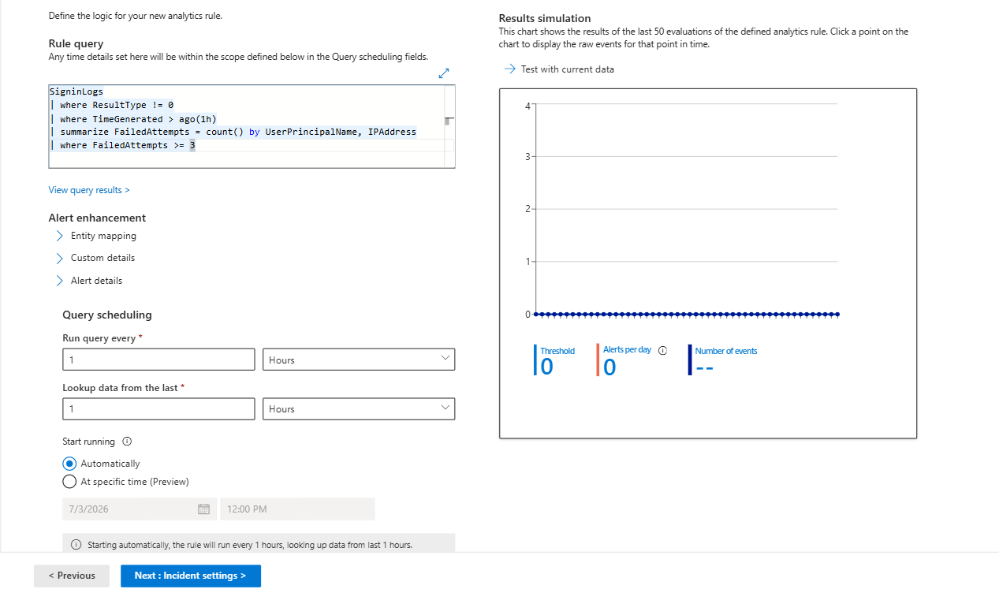
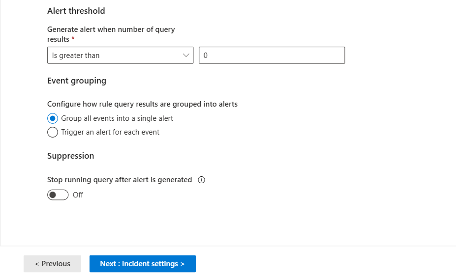
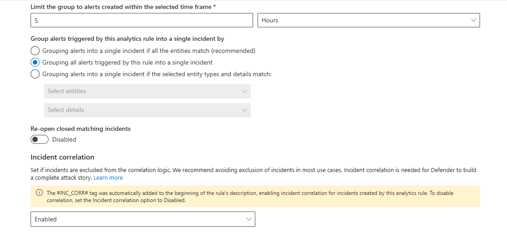

# Day 38 — Create a Microsoft Sentinel Analytics Rule to Detect Suspicious Activity

### Azure 100 Days of Cloud Challenge — Ali Aden

## Overview

In this challenge, I created a scheduled analytics rule in **Microsoft Sentinel** to automatically detect multiple failed Microsoft Entra ID sign-in attempts and generate a security incident for investigation.

I configured a custom Kusto Query Language (KQL) query to identify users with three or more failed sign-in attempts within one hour. The rule was scheduled to execute every hour, configured to automatically generate incidents, and mapped to the **MITRE ATT&CK Credential Access** tactic using the **Brute Force (Password Guessing)** technique.

To validate the implementation, I generated failed sign-in activity using a dedicated test account, confirmed that the events were ingested into Log Analytics, and verified that Microsoft Sentinel automatically created a security incident after the scheduled analytics rule executed.

This challenge demonstrates how Microsoft Sentinel transforms collected log data into actionable security detections through scheduled analytics rules and automated incident generation.

---

## Technologies Used

- Microsoft Sentinel
- Log Analytics Workspace
- Microsoft Entra ID
- Microsoft Sentinel Analytics Rules
- Microsoft Sentinel Incidents
- Kusto Query Language (KQL)
- MITRE ATT&CK Framework
- Azure Monitor Logs
- Azure Portal

---

## Architecture Diagram


---

## Implementation Steps

### Step 1 — Create a Scheduled Analytics Rule

Created a new scheduled analytics rule within Microsoft Sentinel.

Configuration:

```text
Rule Name:
Detect Multiple Failed Sign-ins

Severity:
Medium

Status:
Enabled
```

The rule was configured to detect suspicious authentication activity using Microsoft Entra ID sign-in logs.

---

### Step 2 — Configure the Detection Logic

Configured the analytics rule using a custom Kusto Query Language (KQL) query.

Query:

```kusto
SigninLogs
| where ResultType != 0
| where TimeGenerated > ago(1h)
| summarize FailedAttempts = count() by UserPrincipalName, IPAddress
| where FailedAttempts >= 3
```

The query identifies users with three or more failed sign-in attempts within the previous hour.

---

### Step 3 — Configure Query Scheduling and Alert Generation

Configured how frequently Microsoft Sentinel evaluates the detection query.

Configuration:

```text
Run Query Every:
1 Hour

Lookup Data:
Previous 1 Hour

Alert Threshold:
Greater than 0 Results

Event Grouping:
Group all events into a single alert

Suppression:
Disabled
```

This configuration ensures that any matching activity generates a security alert.

---

### Step 4 — Configure Incident Settings

Configured Microsoft Sentinel to automatically create incidents from generated alerts.

Configuration:

```text
Create Incidents:
Enabled

Alert Grouping:
Enabled

Grouping Window:
5 Hours
```

This allows related alerts generated by the rule to be consolidated into a single incident for investigation.

---

### Step 5 — Configure Alert Grouping and Incident Correlation

Configured how Microsoft Sentinel groups alerts and correlates incidents.

Configuration:

```text
Grouping Method:
Group all alerts into a single incident

Re-open Closed Incidents:
Disabled

Incident Correlation:
Enabled
```

This configuration reduces alert noise while preserving the relationship between related security events.

---

### Step 6 — Deploy the Analytics Rule

Reviewed the configuration and successfully deployed the scheduled analytics rule.

Deployment Result:

```text
Rule Status:
Enabled

Rule Type:
Scheduled

Detection:
Detect Multiple Failed Sign-ins
```

The rule became active and began running automatically according to the configured schedule.

---

### Step 7 — Generate Failed Sign-in Activity

Generated failed Microsoft Entra ID sign-in attempts using a dedicated test account.

Test Account:

```text
testuser@deploywithadenhotmail.onmicrosoft.com
```

Multiple incorrect passwords were intentionally entered to generate authentication failures that matched the analytics rule criteria.

---

### Step 8 — Validate Detection and Incident Generation

Validated the implementation after the scheduled analytics rule executed.

Validation included:

- Confirming failed sign-in events within Log Analytics.
- Verifying that the analytics rule detected the activity.
- Confirming that Microsoft Sentinel automatically generated a security incident.

This demonstrated the complete detection lifecycle from authentication event to security incident.

---

## Validation

### Validation 1 — General Rule Configuration

Verified the general configuration of the scheduled analytics rule before defining the detection logic.

Confirmed:

- Analytics rule named **Detect Multiple Failed Sign-ins**.
- Rule description configured.
- Severity set to **Medium**.
- MITRE ATT&CK mapping configured.
- Rule status set to **Enabled**.

**Screenshot:**



---

### Validation 2 — Rule Logic Configuration

Verified the detection logic and query scheduling for the scheduled analytics rule.

Confirmed:

- KQL detection query configured.
- Query scheduled to run every **1 hour**.
- Lookup period configured for the previous **1 hour**.
- Automatic execution enabled.
- Results simulation available for validation.

**Screenshot:**



---

### Validation 3 — Alert Threshold and Event Grouping

Verified the alert generation behaviour for the scheduled analytics rule.

Confirmed:

- Alert threshold configured to trigger when query results are greater than **0**.
- Events grouped into a single alert.
- Query suppression disabled.

**Screenshot:**



---

### Validation 4 — Incident Settings Configuration

Verified that Microsoft Sentinel was configured to automatically create incidents from analytics rule alerts.

Confirmed:

- Automatic incident creation enabled.
- Alert grouping into incidents enabled.
- Alert grouping time window configured to **5 hours**.

**Screenshot:**


---

### Validation 5 — Alert Grouping and Incident Correlation

Verified the incident grouping and correlation configuration for the scheduled analytics rule.

Confirmed:

- Alerts configured to be grouped into a single incident.
- Re-open closed matching incidents disabled.
- Incident correlation enabled.

**Screenshot:**



---

### Validation 6 — Analytics Rule Deployment

Verified that the scheduled analytics rule was successfully created and enabled in Microsoft Sentinel.

Confirmed:

- Scheduled analytics rule created successfully.
- Rule status set to **Enabled**.
- Rule visible in the **Analytics** blade.
- MITRE ATT&CK mapping applied.
- Detection rule ready for scheduled execution.

**Screenshot:**


---

### Validation 7 — Detection Query Validation

Validated that failed Microsoft Entra ID sign-in events matching the analytics rule were successfully recorded in Log Analytics.

Query:

```kusto
SigninLogs
| where TimeGenerated > ago(30m)
| where ResultType != 0
| where UserPrincipalName == "testuser@deploywithadenhotmail.onmicrosoft.com"
| project TimeGenerated, UserPrincipalName, IPAddress, ResultDescription
| order by TimeGenerated desc
```

Confirmed:

- Failed sign-in events successfully ingested.
- Detection query returned matching authentication failures.
- Test user activity available for analytics rule evaluation.

**Screenshot:**


---

### Validation 8 — Security Incident Generation

Verified that the scheduled analytics rule successfully detected the failed sign-in activity and automatically generated a Microsoft Sentinel security incident.

Confirmed:

- Scheduled analytics rule executed successfully.
- Failed sign-in activity triggered the detection rule.
- Microsoft Sentinel automatically created a security incident.
- Incident severity set to **Medium**.
- Incident categorised as **Credential Access**.

**Screenshot:**


---

## Security Benefits

This implementation provides:

- Automated detection of suspicious authentication activity using Microsoft Sentinel.
- Continuous monitoring of Microsoft Entra ID sign-in events through scheduled analytics rules.
- Automatic generation of security incidents for analyst investigation.
- Alignment with the MITRE ATT&CK framework for threat classification.
- Reduced manual monitoring through scheduled KQL query execution.
- Centralised investigation of authentication-based security events.
- A scalable detection foundation that can be extended with additional analytics rules and automation.

---

## Key Notes

- Microsoft Sentinel Analytics Rules transform log data into actionable security detections.
- Scheduled analytics rules use Kusto Query Language (KQL) to identify suspicious activity.
- The rule executes every hour and analyses the previous hour of sign-in activity.
- A threshold of three failed sign-in attempts was intentionally selected for this lab environment to simplify validation.
- Automatic incident creation allows Microsoft Sentinel to immediately surface suspicious activity for investigation.
- Mapping the rule to the MITRE ATT&CK framework improves threat classification and investigation context.
- Successful validation was demonstrated by generating failed sign-in attempts with a dedicated test account, confirming matching events in Log Analytics, and verifying automatic incident creation in Microsoft Sentinel.
