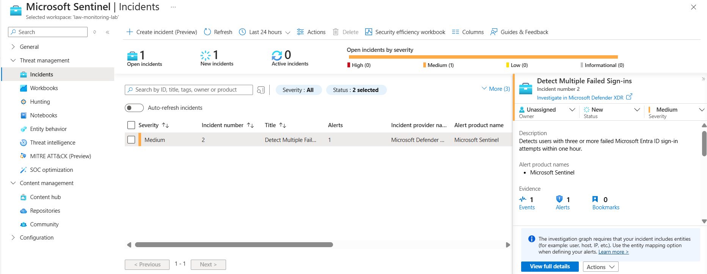
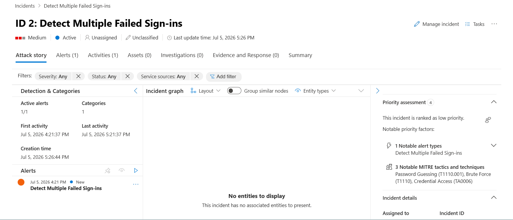
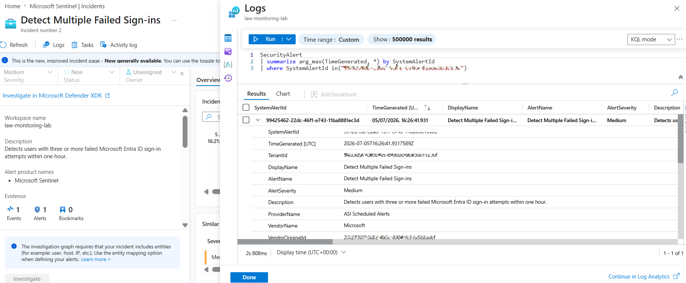
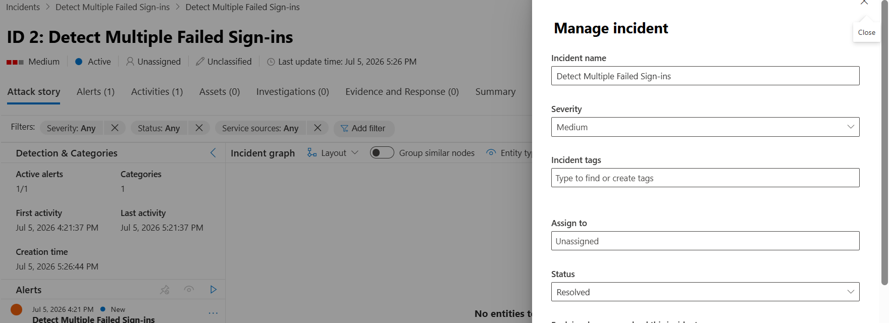
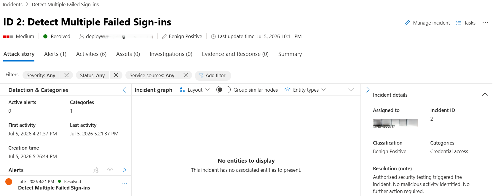

# Day 39 — Investigate and Manage Security Incidents in Microsoft Sentinel

### Azure 100 Days of Cloud Challenge — Ali Aden

## Overview

In this challenge, I investigated and managed a Microsoft Sentinel security incident generated by the scheduled analytics rule created during Day 38.

The investigation began by reviewing the incident overview, including its severity, timeline, associated alert and MITRE ATT&CK mappings. I then examined the underlying security alert and Kusto Query Language (KQL) query results to verify the activity that triggered the detection.

To complete the incident lifecycle, I assigned the incident for investigation, documented the resolution and applied the appropriate classification before resolving the incident within Microsoft Sentinel.

This challenge demonstrates how Microsoft Sentinel supports the complete incident management lifecycle, enabling security analysts to triage, investigate and resolve security incidents within a Security Operations Centre (SOC).

---

## Technologies Used

- Microsoft Sentinel
- Log Analytics Workspace
- Microsoft Entra ID
- Microsoft Sentinel Incidents
- Microsoft Sentinel Alerts
- Microsoft Sentinel Analytics Rules
- Kusto Query Language (KQL)
- MITRE ATT&CK Framework
- Azure Monitor Logs
- Azure Portal

---

## Architecture Diagram

```text
                    Azure Cloud Portfolio
────────────────────────────────────────────────────────────

                  Microsoft Entra ID
                         │
                         ▼
                    SigninLogs
                         │
                         ▼
              Log Analytics Workspace
                 law-monitoring-lab
                         │
                         ▼
                Microsoft Sentinel
                         │
                         ▼
             Scheduled Analytics Rule
        Detect Multiple Failed Sign-ins
                         │
                         ▼
                 Security Alert
                         │
                         ▼
                Security Incident
                         │
                         ▼
               Assigned Security Analyst
                         │
                         ▼
              Incident Investigation
                         │
                         ▼
                Incident Resolved
```

---

## Implementation Steps

### Step 1 — Review the Security Incident

Opened **Microsoft Sentinel → Incidents** and reviewed the incident generated by the scheduled analytics rule created during Day 38.

Configuration:

```text
Incident:
Detect Multiple Failed Sign-ins

Severity:
Medium

Status:
New
```

The incident confirmed that Microsoft Sentinel successfully detected the failed sign-in activity and automatically created a security incident for investigation.

---

### Step 2 — Review the Incident Overview

Opened the incident to review the available investigation information.

Configuration:

```text
Severity:
Medium

Status:
Active

Alert Count:
1

Investigation Graph:
No mapped entities
```

The overview provided access to the Attack Story, incident timeline and MITRE ATT&CK mapping. Although the investigation graph was available, no entities were displayed because entity mapping had not been configured within the analytics rule.

---

### Step 3 — Review the Underlying Security Alert

Opened the underlying security alert to examine the detection details.

Configuration:

```text
Alert:
Detect Multiple Failed Sign-ins

Severity:
Medium

Provider:
ASI Scheduled Alerts

Vendor:
Microsoft
```

Reviewing the associated KQL query and query results confirmed that the failed Microsoft Entra ID sign-in activity matched the detection logic configured during Day 38.

---

### Step 4 — Manage the Security Incident

Assigned the incident and completed the investigation workflow within Microsoft Sentinel.

Configuration:

```text
Assigned To:
deploywithaden@hotmail.com

Status:
Resolved

Classification:
Informational, expected activity

Classification Reason:
Security testing
```

Assigning the incident established ownership before completing the investigation. After reviewing the available evidence, the activity was identified as authorised security testing performed to validate the scheduled analytics rule.

---

### Step 5 — Resolve the Security Incident

Resolved the incident after completing the investigation.

Configuration:

```text
Final Status:
Resolved

Incident Classification:
Benign Positive
```

The investigation was completed by recording the resolution details and applying the final incident classification within Microsoft Sentinel.

---

## Validation

### Validation 1 — Security Incident Created

Verified that Microsoft Sentinel successfully generated the security incident from the scheduled analytics rule.

Confirmed:

- Incident created successfully
- Severity set to **Medium**
- Status set to **New**
- One alert generated

**Screenshot:**



---

### Validation 2 — Incident Overview

Verified the incident overview after opening the generated incident.

Confirmed:

- Incident opened successfully
- Status updated to **Active**
- MITRE ATT&CK mapping displayed
- Investigation graph available
- No mapped entities present

**Screenshot:**



---

### Validation 3 — Underlying Security Alert

Verified the underlying security alert generated by the scheduled analytics rule.

Confirmed:

- Alert details displayed
- KQL query available
- Query results returned successfully
- Alert severity set to **Medium**

**Screenshot:**



---

### Validation 4 — Incident Management

Verified the incident management configuration before resolving the incident.

Confirmed:

- Incident assigned to an owner
- Status updated to **Resolved**
- Resolution note entered
- Classification configured for security testing

**Screenshot:**



---

### Validation 5 — Incident Resolution

Verified that the investigation workflow was successfully completed.

Confirmed:

- Incident resolved successfully
- Owner assigned
- Resolution note recorded
- Final classification displayed
- Alert resolved

**Screenshot:**



---

## Security Benefits

This implementation provides:

- A structured workflow for investigating Microsoft Sentinel security incidents.
- Centralised incident management within Microsoft Sentinel.
- Improved analyst accountability through incident ownership.
- Consistent documentation of investigation findings and resolution outcomes.
- Standardised incident classification to support operational reporting and auditing.
- Improved visibility into alerts generated by scheduled analytics rules.
- A complete incident lifecycle from automated detection through to investigation and resolution.

---

## Key Notes

- Microsoft Sentinel automatically groups related security alerts into incidents for investigation.
- Assigning an incident establishes ownership and helps prevent duplicate investigations.
- Kusto Query Language (KQL) provides the evidence used to validate the activity that triggered a security alert.
- The investigation graph contained no mapped entities because entity mapping was not configured within the Day 38 analytics rule.
- The current Microsoft Sentinel experience uses **Resolved** as the final incident status instead of **Closed**.
- The incident resulted from authorised failed Microsoft Entra ID sign-in attempts performed to validate the scheduled analytics rule.
- Completing the investigation and applying the appropriate classification concluded the Microsoft Sentinel incident management lifecycle.
