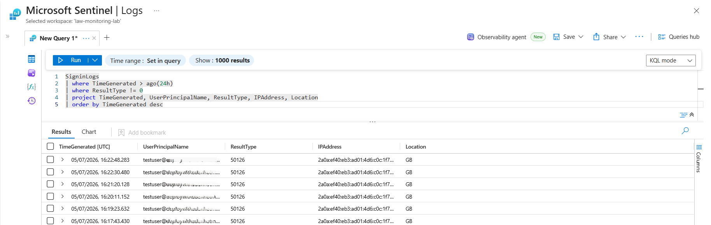
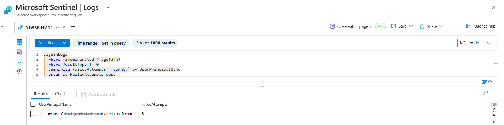
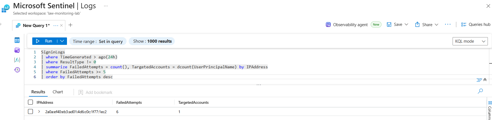
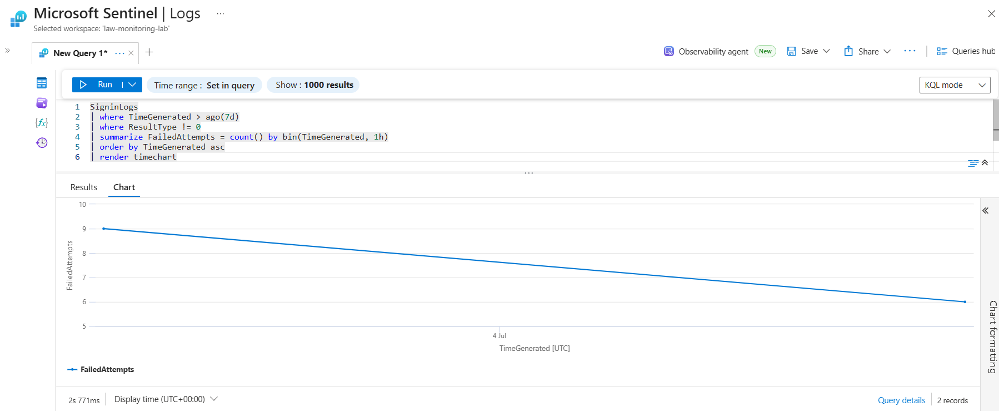
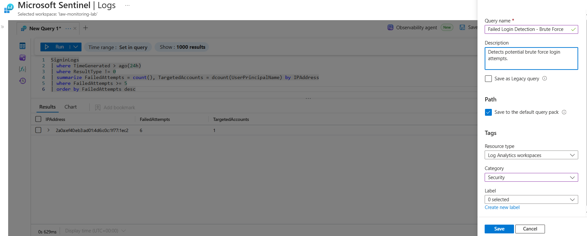

# Day 40 — Write KQL Detection Queries for Failed Login Attempts

### Azure 100 Days of Cloud Challenge — Ali Aden

## Overview

In this challenge, I developed a series of Kusto Query Language (KQL) detection queries to identify and analyse failed Microsoft Entra ID sign-in attempts using Microsoft Sentinel.

Starting with a basic failed sign-in filter, I progressively built more advanced queries to summarise failed login attempts by user, identify potential brute force activity originating from a single IP address, and visualise authentication failures over time using a timechart.

To complete the challenge, I saved the brute force detection query within the Log Analytics Workspace for future use, demonstrating how KQL can be used to create reusable security detections that support Security Operations Centre (SOC) investigations.

This challenge demonstrates how Microsoft Sentinel and KQL work together to transform raw authentication logs into actionable security insights that help detect suspicious authentication activity and support threat investigations.

---

## Technologies Used

- Microsoft Sentinel
- Log Analytics Workspace
- Microsoft Entra ID
- SigninLogs
- Kusto Query Language (KQL)
- Azure Monitor Logs
- Azure Portal

---

## Architecture Diagram

```text
                  Microsoft Entra ID
                 (Failed Sign-in Logs)
                           │
                           ▼
                     SigninLogs Table
                           │
                           ▼
                 Log Analytics Workspace
                  law-monitoring-lab
                           │
                           ▼
                  Microsoft Sentinel
                           │
        ┌──────────────────┼──────────────────┐
        │                  │                  │
        ▼                  ▼                  ▼
  Basic Failed      Failed Login       Brute Force
  Login Query       Summary            Detection
 (24 Hours)         by User            by IP Address
        │                  │                  │
        └──────────────────┼──────────────────┘
                           │
                           ▼
               Failed Login Timeline
                (render timechart)
                           │
                           ▼
             Saved KQL Detection Query
         "Failed Login Detection - Brute Force"
```

---

## Implementation Steps

### Step 1 — Create a Basic Failed Login Detection Query

Created a KQL query to retrieve failed Microsoft Entra ID sign-in attempts recorded during the previous 24 hours.

Query:

```kusto
SigninLogs
| where TimeGenerated > ago(24h)
| where ResultType != 0
| project TimeGenerated, UserPrincipalName, ResultType, IPAddress, Location
| order by TimeGenerated desc
```

This query returns individual failed authentication events together with the affected user account, originating IP address and geographic location.

---

### Step 2 — Summarise Failed Login Attempts by User

Created a second query to aggregate failed sign-in attempts by user account.

Query:

```kusto
SigninLogs
| where TimeGenerated > ago(24h)
| where ResultType != 0
| summarize FailedAttempts = count() by UserPrincipalName
| order by FailedAttempts desc
```

This query identifies which user accounts have experienced the highest number of failed authentication attempts during the selected period.

---

### Step 3 — Detect Potential Brute Force Activity by IP Address

Developed a detection query to identify IP addresses generating multiple failed authentication attempts.

Query:

```kusto
SigninLogs
| where TimeGenerated > ago(24h)
| where ResultType != 0
| summarize FailedAttempts = count(), TargetedAccounts = dcount(UserPrincipalName) by IPAddress
| where FailedAttempts >= 5
| order by FailedAttempts desc
```

This query highlights IP addresses responsible for repeated failed sign-in attempts and reports how many unique user accounts were targeted.

---

### Step 4 — Visualise Failed Login Activity Over Time

Created a time-based query to visualise failed authentication attempts across a seven-day period.

Query:

```kusto
SigninLogs
| where TimeGenerated > ago(7d)
| where ResultType != 0
| summarize FailedAttempts = count() by bin(TimeGenerated, 1h)
| order by TimeGenerated asc
| render timechart
```

The rendered timechart makes it easier to identify spikes or unusual trends in failed authentication activity.

---

### Step 5 — Save the Detection Query

Saved the brute force detection query within the Log Analytics Workspace for future investigations.

Configuration:

```text
Query Name:
Failed Login Detection - Brute Force

Category:
Security

Resource Type:
Log Analytics Workspaces
```

Saving commonly used KQL queries enables analysts to quickly reuse detection logic during future investigations.

---

## Validation

### Validation 1 — Failed Login Detection Query

Verified that the basic failed login query successfully returned failed Microsoft Entra ID authentication events.

Confirmed:

- Failed sign-in events returned
- User accounts identified
- Source IP addresses displayed

**Screenshot:**



---

### Validation 2 — Failed Login Summary by User

Verified that failed authentication attempts were successfully grouped by user account.

Confirmed:

- Failed attempts counted
- User accounts summarised
- Results ordered by highest activity

**Screenshot:**



---

### Validation 3 — Brute Force Detection by IP

Verified that the KQL query successfully identified IP addresses generating multiple failed sign-in attempts.

Confirmed:

- Failed attempts counted
- Targeted user accounts calculated
- Potential brute force activity identified

**Screenshot:**



---

### Validation 4 — Failed Login Timeline

Verified that failed authentication attempts were successfully visualised using a KQL timechart.

Confirmed:

- Seven-day query executed successfully
- Failed login activity displayed over time
- Timeline rendered as a chart

**Screenshot:**



---

### Validation 5 — Saved Detection Query

Verified that the brute force detection query was prepared and saved for future use.

Confirmed:

- Query named
- Security category selected
- Log Analytics Workspace configured

**Screenshot:**



---

## Security Benefits

This implementation provides:

- Rapid identification of failed Microsoft Entra ID authentication attempts.
- Improved visibility into user accounts experiencing repeated login failures.
- Detection of potential brute force attacks originating from a single IP address.
- Historical visualisation of authentication failures to identify suspicious trends.
- Reusable KQL detection queries for future investigations.
- Improved incident investigation using Microsoft Sentinel and Log Analytics.

---

## Key Notes

- Kusto Query Language (KQL) is the primary language used for searching and analysing Microsoft Sentinel log data.
- The SigninLogs table stores Microsoft Entra ID authentication events.
- A ResultType value of **0** represents a successful sign-in, while non-zero values represent failed authentication attempts.
- Aggregation functions such as **summarize** help identify patterns across large volumes of authentication data.
- Time-based visualisations created using **render timechart** simplify the identification of authentication spikes and anomalies.
- Saving frequently used KQL queries improves investigation efficiency by allowing analysts to quickly reuse detection logic.
