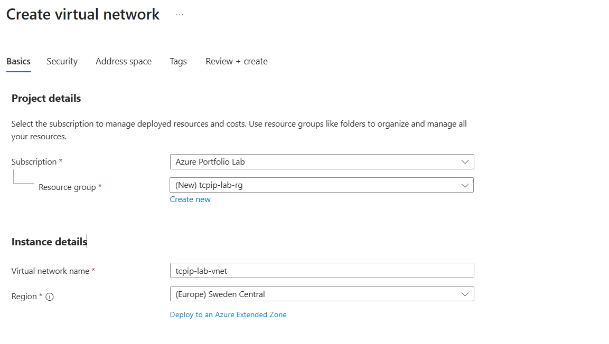
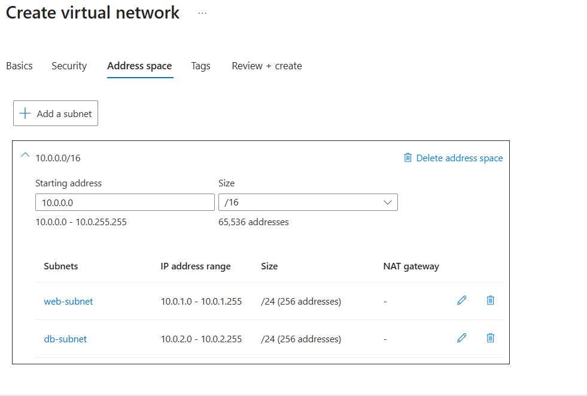
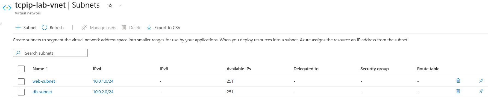
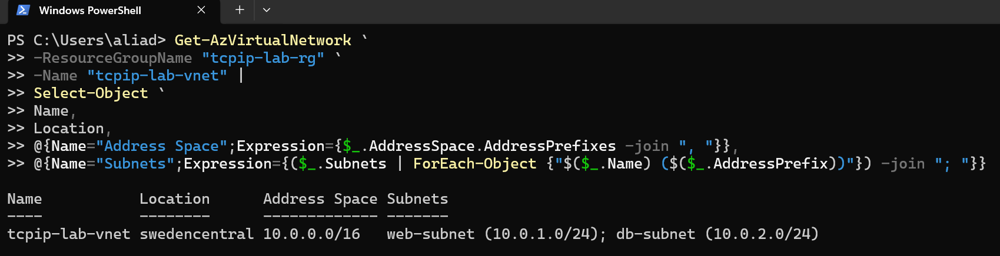

# Day 41 — TCP/IP Basics: Understanding IP Addresses and Subnetting in Azure

### Azure 100 Days of Cloud Challenge — Ali Aden

## Overview

In this challenge, I explored the fundamentals of Azure networking by learning how IP addresses and subnetting are used to organise resources within an Azure Virtual Network (VNet).

I created a Virtual Network with a custom IPv4 address space and manually divided it into two separate subnets using CIDR notation. Rather than using Azure's default subnet, I planned the network layout from scratch to better understand how address spaces are allocated and how subnets are created within a larger network.

To complete the challenge, I verified the deployment using both the Azure portal and Azure PowerShell, confirming that the Virtual Network, address space and subnet configuration matched the intended design.

This challenge demonstrates the importance of proper IP address planning in Azure and provides the networking foundation required before deploying resources such as Virtual Machines, Azure Bastion, Azure Firewall and other Azure networking services.

---

## Technologies Used

- Microsoft Azure Portal
- Azure Virtual Network (VNet)
- Azure Resource Group
- Azure PowerShell (Az Module)
- IPv4 Addressing
- CIDR Notation
- Azure Networking

---

## Architecture Diagram

```text
                              Azure Subscription
                           Azure Portfolio Lab
                                      │
                                      │
                          Resource Group
                           tcpip-lab-rg
                                      │
                                      │
                    +--------------------------------+
                    |       Virtual Network          |
                    |      tcpip-lab-vnet            |
                    |      10.0.0.0/16               |
                    +--------------------------------+
                         │                    │
                         │                    │
         +-------------------------+   +-------------------------+
         |      web-subnet         |   |       db-subnet         |
         |      10.0.1.0/24        |   |      10.0.2.0/24        |
         |   251 Available IPs     |   |   251 Available IPs     |
         +-------------------------+   +-------------------------+

                 Validation Performed
     ────────────────────────────────────────────
      Azure Portal ✔
      Azure PowerShell ✔
```

---

## Implementation Steps

### Step 1 — Create the Virtual Network

Created a new Resource Group named **tcpip-lab-rg** and configured a Virtual Network named **tcpip-lab-vnet** in the **Sweden Central** region.

This provides a dedicated private network where Azure resources can communicate securely using private IP addresses.

---

### Step 2 — Configure the Address Space and Subnets

Configured the Virtual Network with an IPv4 address space of **10.0.0.0/16** and created two custom subnets:

- **web-subnet** — `10.0.1.0/24`
- **db-subnet** — `10.0.2.0/24`

Using a `/16` address space allows the network to be expanded in the future, while separate `/24` subnets help organise workloads into individual network segments.

---

### Step 3 — Review the Subnet Configuration

After deployment, I reviewed the subnet configuration within the Virtual Network.

Azure confirmed that both subnets had been created successfully with their correct CIDR ranges and showed **251 available IP addresses** for each subnet after Azure reserved five IP addresses for platform services.

---

### Step 4 — Validate the Deployment with Azure PowerShell

Used Azure PowerShell to retrieve the Virtual Network configuration and verify the deployment.

The PowerShell output confirmed:

- Virtual Network name
- Deployment region
- IPv4 address space
- Both subnet names
- Correct subnet prefixes

This provided an additional validation outside of the Azure portal.

---

## Validation

### Validation 1 — Virtual Network Configuration

Verified that the Virtual Network was configured with the correct Resource Group, deployment region and Virtual Network name before deployment.

Confirmed:

- Resource Group created
- Virtual Network configured
- Sweden Central region selected

**Screenshot:**



---

### Validation 2 — Address Space and Subnet Configuration

Verified that the Virtual Network address space and custom subnets were configured correctly.

Confirmed:

- IPv4 address space configured as **10.0.0.0/16**
- **web-subnet** configured as **10.0.1.0/24**
- **db-subnet** configured as **10.0.2.0/24**
- No overlapping subnet ranges

**Screenshot:**



---

### Validation 3 — Subnet Deployment

Verified that both subnets were successfully deployed within the Virtual Network.

Confirmed:

- Both subnets created successfully
- Correct subnet address ranges displayed
- Azure reported **251 available IP addresses** for each subnet

**Screenshot:**



---

### Validation 4 — Azure PowerShell Validation

Verified the Virtual Network configuration using Azure PowerShell.

Confirmed:

- Virtual Network retrieved successfully
- Address space verified
- Both subnet names displayed
- Correct subnet prefixes returned

**Screenshot:**



---

## Key Notes

- Azure Virtual Networks provide private network connectivity for Azure resources using private IP address ranges.
- CIDR notation determines the size of an address space or subnet and defines how many IP addresses are available.
- Every subnet must be created from the Virtual Network address space, and subnet ranges cannot overlap.
- Azure automatically reserves five IP addresses in every subnet, leaving **251 usable IP addresses** in a `/24` subnet.
- Proper IP address planning simplifies future network expansion and helps avoid addressing conflicts as environments grow.
- Azure PowerShell provides a quick and reliable way to validate Azure networking resources without relying solely on the Azure portal.