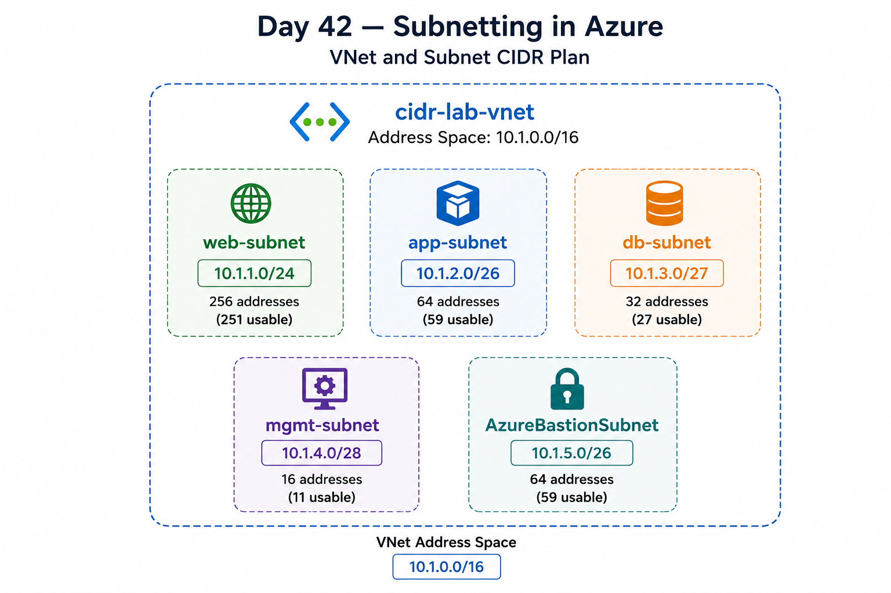
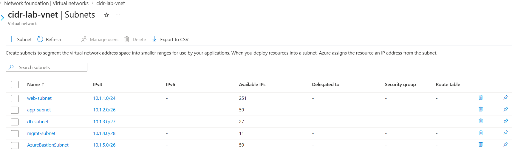
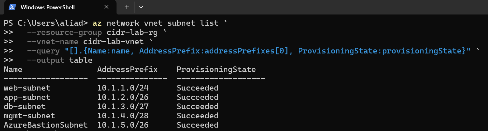
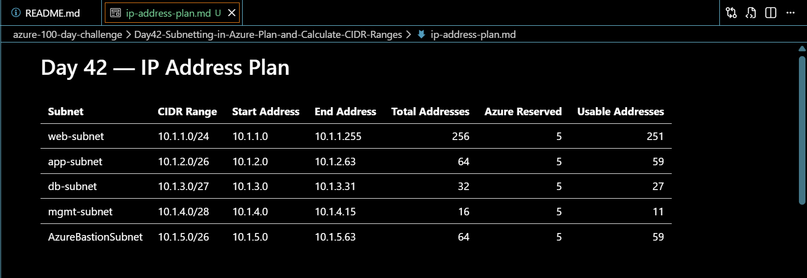

# Day 42 — Subnetting in Azure: Plan and Calculate CIDR Ranges

## Overview

For Day 42 of my Azure 100 Day Challenge, I focused on planning and calculating CIDR ranges for a multi-subnet Azure environment.

Before creating the network, I worked out how much address space each subnet needed based on the number of usable IP addresses required. I then selected the smallest suitable CIDR range for each requirement and made sure none of the subnet ranges overlapped.

After completing the IP plan, I deployed the virtual network and all five subnets in Azure. I then validated the configuration using both the Azure portal and Azure CLI.

This challenge helped me understand that subnetting is not just about choosing IP ranges. Good network design starts with planning the address space properly before deploying resources.

---

## Technologies Used

- Microsoft Azure
- Azure Virtual Network
- Azure Subnets
- CIDR notation
- IPv4 addressing
- Azure CLI
- PowerShell
- Visual Studio Code

---

## Architecture Diagram



The virtual network uses the address space `10.1.0.0/16` and is divided into five non-overlapping subnets.

```text
cidr-lab-vnet
10.1.0.0/16
│
├── web-subnet
│   └── 10.1.1.0/24
│       256 total addresses
│       251 usable
│
├── app-subnet
│   └── 10.1.2.0/26
│       64 total addresses
│       59 usable
│
├── db-subnet
│   └── 10.1.3.0/27
│       32 total addresses
│       27 usable
│
├── mgmt-subnet
│   └── 10.1.4.0/28
│       16 total addresses
│       11 usable
│
└── AzureBastionSubnet
    └── 10.1.5.0/26
        64 total addresses
        59 usable
```

---

## IP Address Plan

I started with the VNet address space:

```text
10.1.0.0/16
```

I then calculated the subnet size required for each workload.

| Subnet | CIDR Range | Start Address | End Address | Total Addresses | Azure Reserved | Usable Addresses |
|---|---|---|---|---:|---:|---:|
| web-subnet | 10.1.1.0/24 | 10.1.1.0 | 10.1.1.255 | 256 | 5 | 251 |
| app-subnet | 10.1.2.0/26 | 10.1.2.0 | 10.1.2.63 | 64 | 5 | 59 |
| db-subnet | 10.1.3.0/27 | 10.1.3.0 | 10.1.3.31 | 32 | 5 | 27 |
| mgmt-subnet | 10.1.4.0/28 | 10.1.4.0 | 10.1.4.15 | 16 | 5 | 11 |
| AzureBastionSubnet | 10.1.5.0/26 | 10.1.5.0 | 10.1.5.63 | 64 | 5 | 59 |

I also documented the complete IP plan separately so that the subnet calculations could be reviewed before deployment.

---

## Implementation

### 1. Planned the CIDR Ranges

Before creating anything in Azure, I calculated the subnet sizes based on the required number of usable IP addresses.

The requirements were:

- Web subnet — 200 usable IP addresses
- App subnet — 50 usable IP addresses
- Database subnet — 20 usable IP addresses
- Management subnet — 10 usable IP addresses
- Azure Bastion subnet — minimum `/26`

For each subnet, I selected the smallest CIDR range that met the requirement.

For example, the application subnet required 50 usable IP addresses. A `/26` provides 64 total addresses and 59 usable addresses after Azure reserves 5 addresses. A `/25` would also work, but it would provide more address space than required.

### 2. Created the Virtual Network

I created a virtual network with the following configuration:

```text
Virtual network: cidr-lab-vnet
Address space:   10.1.0.0/16
```

I then added all five planned subnets using the CIDR ranges I had calculated.

### 3. Created the Five Subnets

The following subnets were deployed:

```text
web-subnet           10.1.1.0/24
app-subnet           10.1.2.0/26
db-subnet            10.1.3.0/27
mgmt-subnet          10.1.4.0/28
AzureBastionSubnet   10.1.5.0/26
```

All five ranges fit within the `10.1.0.0/16` VNet address space without overlapping.

---

## Validation

### 1. Verified the Subnets in the Azure Portal

After deployment, I opened the subnet configuration for `cidr-lab-vnet` and confirmed that all five subnets were created with the correct CIDR ranges.



The Azure portal also showed the available IP addresses for each subnet after Azure's reserved addresses were taken into account.

---

### 2. Validated the Configuration with Azure CLI

I used Azure CLI from PowerShell to retrieve the deployed subnet configuration.

```powershell
az network vnet subnet list `
  --resource-group cidr-lab-rg `
  --vnet-name cidr-lab-vnet `
  --query "[].{Name:name, AddressPrefix:addressPrefixes[0], ProvisioningState:provisioningState}" `
  --output table
```

The command returned all five subnet names, their CIDR prefixes and a provisioning state of `Succeeded`.



---

### 3. Documented the IP Address Plan

I documented the complete IP address plan, including the start and end address of each subnet, total addresses, Azure-reserved addresses and usable addresses.



This gave me a clear record of the network design and confirmed that the subnet ranges did not overlap.

---

## Design Considerations

- **Non-overlapping address ranges** help prevent routing and connectivity problems.
- **Right-sized subnets** avoid allocating more address space than required.
- **Separate subnet ranges** provide a foundation for network segmentation.
- **Dedicated management and Bastion subnets** keep administrative services separate from application workloads.
- **Documenting the IP plan before deployment** makes the network design easier to review and maintain.

---

## Key Notes

- Azure reserves 5 IP addresses in every subnet.
- A `/24` contains 256 total addresses and 251 usable addresses in Azure.
- A `/26` contains 64 total addresses and 59 usable addresses.
- A `/27` contains 32 total addresses and 27 usable addresses.
- A `/28` contains 16 total addresses and 11 usable addresses.
- Subnet ranges within the same VNet must not overlap.
- I used the smallest CIDR range that met each subnet requirement.
- The subnet name `AzureBastionSubnet` is reserved for Azure Bastion.
