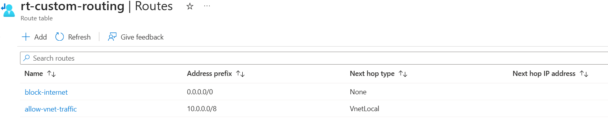
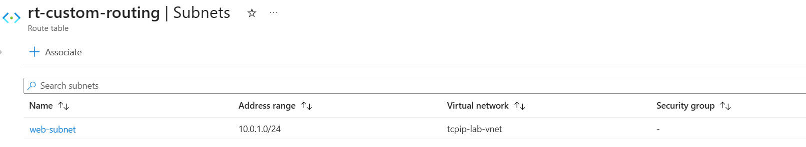
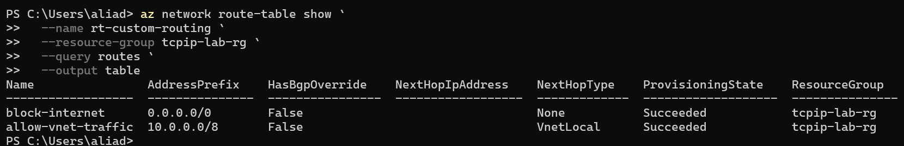
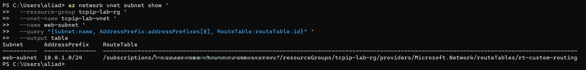

# Day 43 — Routing in Azure: Route Tables and User Defined Routes

### Azure 100 Days of Cloud Challenge — Ali Aden

## Overview

For Day 43, I configured custom routing in Azure using a Route Table and User Defined Routes (UDRs).

I created a route table called `rt-custom-routing` and added two custom routes to control traffic from the `web-subnet` in `tcpip-lab-vnet`. The first route sends traffic matching `0.0.0.0/0` to the `None` next hop, while the second provides a more specific route for the `10.0.0.0/8` address range using the `VnetLocal` next hop.

The route table was then associated with `web-subnet`, applying the custom routing configuration to that subnet.

---

## Technologies Used

- Microsoft Azure
- Azure Virtual Network
- Azure Route Tables
- User Defined Routes (UDRs)
- Azure CLI
- PowerShell

---

## Architecture

```text
                     tcpip-lab-vnet
                       10.0.0.0/16
                             │
                             │
                    ┌────────▼────────┐
                    │   web-subnet    │
                    │   10.0.1.0/24   │
                    └────────┬────────┘
                             │
                      Associated with
                             │
                    ┌────────▼─────────┐
                    │ rt-custom-routing│
                    └────────┬─────────┘
                             │
              ┌──────────────┴──────────────┐
              │                             │
     ┌────────▼─────────┐          ┌────────▼────────────┐
     │  block-internet  │          │ allow-vnet-traffic  │
     │    0.0.0.0/0     │          │     10.0.0.0/8      │
     │ Next Hop: None   │          │ Next Hop: VnetLocal │
     └────────┬─────────┘          └────────┬────────────┘
              │                             │
              ▼                             ▼
       Traffic dropped             VNet-local routing
```

---

## Route Configuration

| Route Name | Address Prefix | Next Hop Type | Purpose |
|---|---|---|---|
| `block-internet` | `0.0.0.0/0` | `None` | Drops traffic that matches the default route |
| `allow-vnet-traffic` | `10.0.0.0/8` | `VnetLocal` | Provides a more specific route for traffic matching the `10.0.0.0/8` address range |

Azure uses longest-prefix matching when selecting routes. Because `10.0.0.0/8` is more specific than `0.0.0.0/0`, traffic matching the `/8` route is evaluated against `allow-vnet-traffic`, while other traffic matching the default route is sent to the `None` next hop.

---

## Implementation

### 1. Created the Route Table

I created the following Route Table:

```text
Name:           rt-custom-routing
Resource Group: tcpip-lab-rg
Region:         Sweden Central
```

The Route Table was created in the same region as the existing `tcpip-lab-vnet`.

---

### 2. Created the Default Route

I added a custom route called `block-internet` with the following configuration:

```text
Address Prefix: 0.0.0.0/0
Next Hop Type:  None
```

The `0.0.0.0/0` prefix represents the default route. Using `None` as the next hop causes traffic matching this route to be dropped.

---

### 3. Created the VNet Traffic Route

I added a second custom route called `allow-vnet-traffic`:

```text
Address Prefix: 10.0.0.0/8
Next Hop Type:  VnetLocal
```

This route is more specific than the `0.0.0.0/0` default route and therefore takes priority for destinations that match the `10.0.0.0/8` prefix.

---

### 4. Associated the Route Table with the Subnet

I associated `rt-custom-routing` with:

```text
Virtual Network: tcpip-lab-vnet
Subnet:          web-subnet
Address Range:   10.0.1.0/24
```

Once associated, the custom routes in the Route Table apply to traffic leaving resources in `web-subnet`.

---

## Validation

### Custom Routes

I confirmed in the Azure portal that both User Defined Routes were created successfully.



The Route Table contains:

```text
block-internet       0.0.0.0/0    None
allow-vnet-traffic   10.0.0.0/8   VnetLocal
```

---

### Subnet Association

I confirmed that `rt-custom-routing` was associated with `web-subnet`.



The association shows:

```text
Subnet:          web-subnet
Address Range:   10.0.1.0/24
Virtual Network: tcpip-lab-vnet
```

---

### Azure CLI Route Validation

I used Azure CLI from PowerShell to verify the routes configured in the Route Table:

```powershell
az network route-table show `
  --name rt-custom-routing `
  --resource-group tcpip-lab-rg `
  --query routes `
  --output table
```



Both routes returned a provisioning state of `Succeeded`.

---

### Azure CLI Subnet Association Validation

I also verified that `web-subnet` was associated with `rt-custom-routing`:

```powershell
az network vnet subnet show `
  --resource-group tcpip-lab-rg `
  --vnet-name tcpip-lab-vnet `
  --name web-subnet `
  --query "{Subnet:name, AddressPrefix:addressPrefixes[0], RouteTable:routeTable.id}" `
  --output table
```



The output confirmed that `web-subnet` uses `rt-custom-routing`.

---

## Design Considerations

- Route tables only affect the subnets they are associated with.
- More specific address prefixes take priority over broader routes.
- A `0.0.0.0/0` route with a `None` next hop can disrupt outbound connectivity if applied incorrectly.
- In production, default routes are commonly used to direct traffic through an Azure Firewall or Network Virtual Appliance.

---

## Key Notes

This configuration was created as a routing lab to demonstrate how Azure Route Tables and User Defined Routes can control traffic from a subnet.

The `block-internet` route is intentionally configured with the `None` next hop for this exercise. In a production environment, a `0.0.0.0/0` route may instead point to a security appliance such as an Azure Firewall or Network Virtual Appliance, depending on the network design.

Before associating a Route Table with a production subnet, the routes should be reviewed carefully to avoid unintentionally disrupting connectivity.