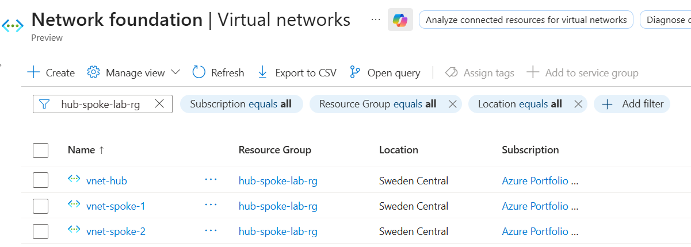
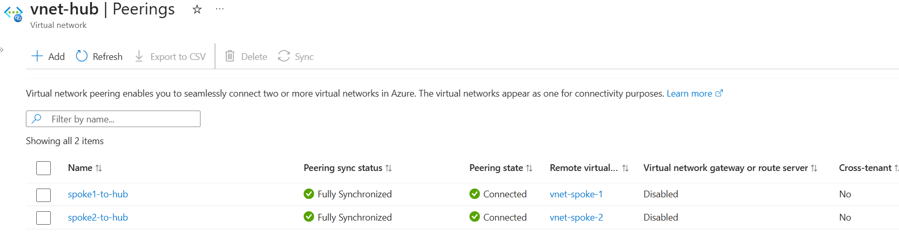
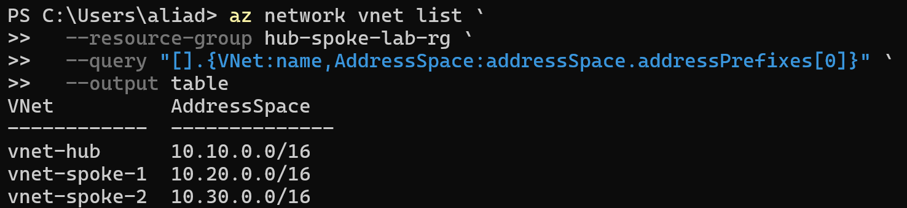

# Day 44 — Azure Network Topology: Hub and Spoke Architecture Design

### Azure 100 Days of Cloud Challenge — Ali Aden

## Overview

For Day 44, I designed and deployed a Hub and Spoke network topology in Azure.

I created one Hub Virtual Network and two Spoke Virtual Networks using separate, non-overlapping address spaces before connecting them using Azure VNet Peering. The Hub acts as the central network while each Spoke represents an isolated workload network.

I chose a Hub and Spoke design because it provides a central network for shared services while allowing different workloads to remain in separate virtual networks. This project focuses on building the network topology and validating the VNet peering configuration. Azure Firewall and centralised traffic routing will be added in the next project.

---

## Technologies Used

- Microsoft Azure
- Azure Virtual Network (VNet)
- Azure VNet Peering
- Azure CLI
- PowerShell

---

## Architecture Diagram

```text
                           vnet-hub
                        10.10.0.0/16
                    ┌──────────────────┐
                    │   snet-shared    │
                    │   10.10.1.0/24   │
                    └────────┬─────────┘
                             │
                  Azure VNet Peering
               ┌─────────────┴─────────────┐
               │                           │
               │                           │
      ┌────────▼────────┐         ┌────────▼────────┐
      │  vnet-spoke-1   │         │  vnet-spoke-2   │
      │ 10.20.0.0/16    │         │ 10.30.0.0/16    │
      │                 │         │                 │
      │snet-workload-1  │         │snet-workload-2  │
      │ 10.20.1.0/24    │         │ 10.30.1.0/24    │
      └─────────────────┘         └─────────────────┘
```

---

## Hub and Spoke Topology

| Virtual Network | Address Space | Subnet | Address Range |
|---|---|---|---|
| `vnet-hub` | `10.10.0.0/16` | `snet-shared` | `10.10.1.0/24` |
| `vnet-spoke-1` | `10.20.0.0/16` | `snet-workload-1` | `10.20.1.0/24` |
| `vnet-spoke-2` | `10.30.0.0/16` | `snet-workload-2` | `10.30.1.0/24` |

---

## Implementation

### 1. Created the Hub Virtual Network

I created the Hub Virtual Network with the following configuration:

```text
Name:            vnet-hub
Resource Group:  hub-spoke-lab-rg
Region:          Sweden Central
Address Space:   10.10.0.0/16
```

I also created the shared subnet:

```text
Name:            snet-shared
Address Range:   10.10.1.0/24
```

The Hub VNet will act as the central network for shared services as this architecture is expanded in later projects.

---

### 2. Created the Spoke Virtual Networks

I deployed two workload VNets using separate CIDR ranges.

**vnet-spoke-1**

```text
Address Space:   10.20.0.0/16
Subnet:          snet-workload-1
Address Range:   10.20.1.0/24
```

**vnet-spoke-2**

```text
Address Space:   10.30.0.0/16
Subnet:          snet-workload-2
Address Range:   10.30.1.0/24
```

Using separate address spaces ensures there are no overlapping networks and allows the environment to scale without requiring IP address changes later.

---

### 3. Configured Hub and Spoke VNet Peering

After deploying the VNets, I created VNet Peerings between the Hub and each Spoke network.

The following peerings were configured:

```text
vnet-hub      ↔      vnet-spoke-1

vnet-hub      ↔      vnet-spoke-2
```

Azure automatically created the return peerings using the new peering experience, resulting in a bidirectional connection between the Hub and each Spoke.

Once the configuration completed, all peerings showed a **Connected** status.

---

## Validation

### Virtual Networks

I confirmed that all three Virtual Networks were successfully deployed in the Azure portal.



The deployment includes:

```text
vnet-hub
vnet-spoke-1
vnet-spoke-2
```

Each Virtual Network was created within the `hub-spoke-lab-rg` resource group in the Sweden Central region.

---

### Hub VNet Peerings

I confirmed that the Hub Virtual Network was successfully peered with both Spoke Virtual Networks.



The Hub contains two active peerings:

```text
spoke1-to-hub    Connected
spoke2-to-hub    Connected
```

Both peerings reached a **Connected** state after deployment.

---

### Azure CLI VNet Validation

I used Azure CLI from PowerShell to verify that all three Virtual Networks were created with the correct address spaces.

```powershell
az network vnet list `
  --resource-group hub-spoke-lab-rg `
  --query "[].{VNet:name,AddressSpace:addressSpace.addressPrefixes[0]}" `
  --output table
```



The output confirmed the following address spaces:

```text
vnet-hub      10.10.0.0/16
vnet-spoke-1  10.20.0.0/16
vnet-spoke-2  10.30.0.0/16
```

I also used Azure CLI to verify the VNet peering configuration.

### Validate Hub Peerings

```powershell
az network vnet peering list `
  --resource-group hub-spoke-lab-rg `
  --vnet-name vnet-hub `
  --output table
```

The output confirmed that both peerings were connected.

### Validate Spoke 1 Peering

```powershell
az network vnet peering list `
  --resource-group hub-spoke-lab-rg `
  --vnet-name vnet-spoke-1 `
  --output table
```

The output confirmed that the return peering from `vnet-spoke-1` to `vnet-hub` was also connected.

---

## Design Considerations

- Hub and Spoke is designed to separate shared infrastructure from workload networks while keeping administration centralised.

- Each Virtual Network uses a separate CIDR range to prevent overlapping address spaces and simplify future expansion.

- Azure VNet Peering is **non-transitive**. Although both Spoke VNets are connected to the Hub, they cannot communicate directly with each other without additional routing through a Network Virtual Appliance or Azure Firewall.

- This project focuses on the network topology only. Azure Firewall, User Defined Routes (UDRs) and centralised traffic routing will be implemented in the next stage of the lab.

---

## Key Notes

This project focused on building the foundation of a Hub and Spoke network architecture rather than implementing a complete enterprise network.

The Hub Virtual Network acts as the central network, while each Spoke provides an isolated environment for individual workloads. This approach makes it easier to scale the environment as additional applications or business units are added.

Although the Hub is connected to both Spokes, Azure VNet Peering does not provide transitive routing by default. Traffic cannot flow directly between the Spoke VNets unless additional routing and network security services are introduced.

The next project builds on this topology by deploying Azure Firewall into the Hub Virtual Network and using User Defined Routes (UDRs) to direct traffic through the firewall for centralised inspection and control.