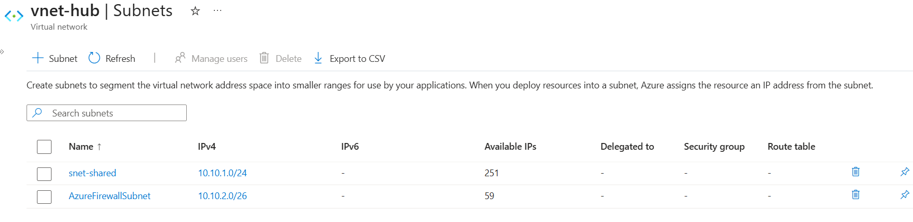
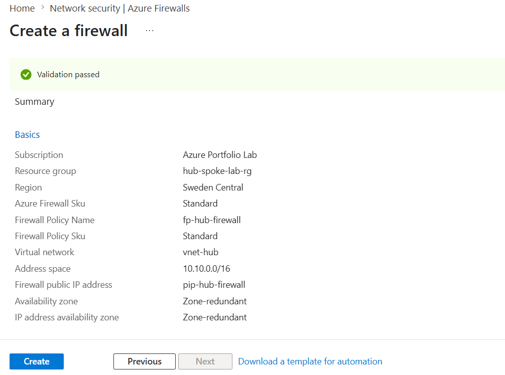
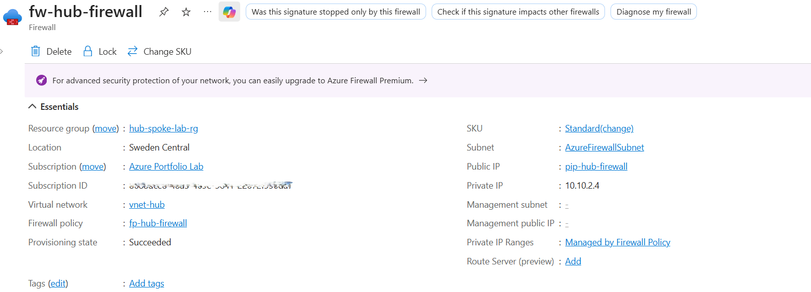
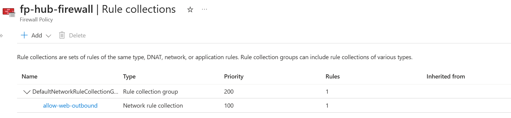
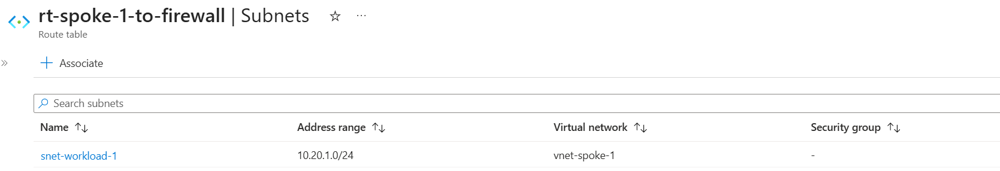
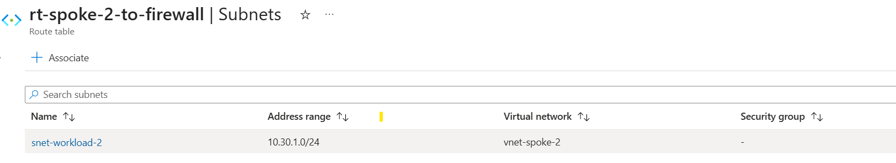
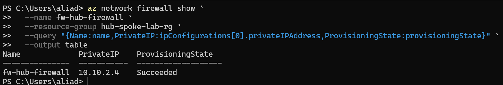
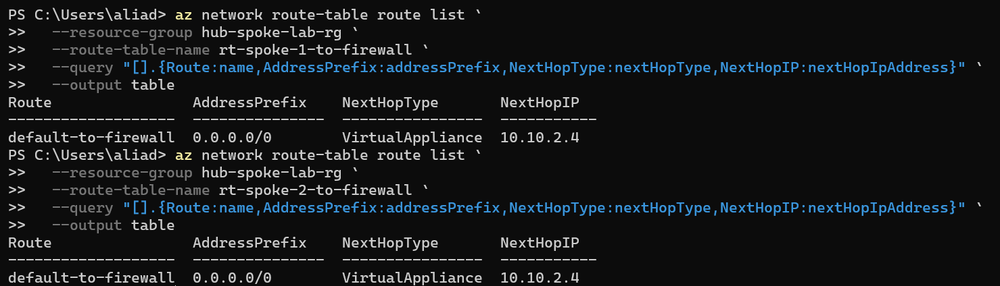

# Day 45 — Deploy and Configure Azure Firewall

### Azure 100 Days of Cloud Challenge — Ali Aden

## Overview

For Day 45, I secured my existing Hub and Spoke network by deploying Azure Firewall into the Hub Virtual Network and configuring centralised traffic inspection.

I created an Azure Firewall called `fw-hub-firewall` inside the dedicated `AzureFirewallSubnet` within `vnet-hub` and associated it with a Firewall Policy named `fp-hub-firewall`. I then created a Network Rule Collection allowing outbound web traffic from both Spoke Virtual Networks.

To direct traffic through the Firewall, I created separate User Defined Route (UDR) tables for each Spoke Virtual Network and configured a default route (`0.0.0.0/0`) using the Firewall's private IP address (`10.10.2.4`) as the Virtual Appliance next hop.

Finally, I validated the Firewall deployment, route tables and routing configuration using Azure CLI to confirm that both Spoke Virtual Networks now send internet-bound traffic through the central Azure Firewall.

---

## Technologies Used

- Microsoft Azure
- Azure Virtual Network
- Azure Firewall
- Azure Firewall Policy
- Azure Firewall Network Rule Collections
- Azure Route Tables
- User Defined Routes (UDRs)
- Azure CLI
- PowerShell

---

## Architecture

```text
                              Internet
                                  │
                                  │
                          Public IP Address
                          pip-hub-firewall
                                  │
                                  ▼
                    +---------------------------+
                    |     Azure Firewall        |
                    |     fw-hub-firewall       |
                    |     Private IP            |
                    |       10.10.2.4           |
                    +-------------+-------------+
                                  │
                     Network Rule Collection
                     allow-web-outbound
                                  │
                    +-------------+-------------+
                    |                           |
          +---------▼---------+       +---------▼---------+
          |      vnet-hub     |       |   Firewall Policy |
          |    10.10.0.0/16   |       |  fp-hub-firewall  |
          +---------+---------+       +-------------------+
                    │
        -------------------------------
        │                             │
        ▼                             ▼
+------------------+         +------------------+
|   vnet-spoke-1   |         |   vnet-spoke-2   |
|    10.20.0.0/16  |         |    10.30.0.0/16  |
+--------+---------+         +--------+---------+
         │                            │
         │                            │
 Route Table                   Route Table
rt-spoke-1-to-firewall    rt-spoke-2-to-firewall
         │                            │
         └──────────────┬─────────────┘
                        │
             Default Route (0.0.0.0/0)
             Next Hop: Virtual Appliance
                  Firewall IP: 10.10.2.4
```

---

## Azure Firewall Configuration

| Component | Configuration |
|---|---|
| Firewall Name | `fw-hub-firewall` |
| Firewall Policy | `fp-hub-firewall` |
| SKU | Standard |
| Resource Group | `hub-spoke-lab-rg` |
| Region | Sweden Central |
| Virtual Network | `vnet-hub` |
| Firewall Subnet | `AzureFirewallSubnet` |
| Private IP | `10.10.2.4` |
| Public IP | `pip-hub-firewall` |

---

## Implementation

### 1. Created the Azure Firewall Subnet

I added a dedicated subnet named `AzureFirewallSubnet` to `vnet-hub`.

```text
Virtual Network: vnet-hub
Subnet Name:     AzureFirewallSubnet
Address Range:   10.10.2.0/26
```

Azure Firewall requires this subnet name and address range before deployment.

---

### 2. Deployed Azure Firewall

I deployed Azure Firewall using the Standard SKU and associated it with my existing Hub Virtual Network.

```text
Firewall Name:   fw-hub-firewall
Firewall Policy: fp-hub-firewall
Public IP:       pip-hub-firewall
Private IP:      10.10.2.4
```

The Firewall was deployed successfully and attached to `AzureFirewallSubnet`.

---

### 3. Created a Network Rule Collection

To allow outbound web traffic from both Spoke Virtual Networks, I created the following Network Rule Collection.

```text
Rule Collection:
allow-web-outbound

Priority:
100

Action:
Allow
```

The rule allows outbound TCP traffic on ports 80 and 443 from:

```text
10.20.0.0/16
10.30.0.0/16
```

using IP-based network rules.

---

### 4. Created Route Tables for Both Spoke Virtual Networks

To ensure internet-bound traffic passes through Azure Firewall, I created separate Route Tables for each Spoke Virtual Network.

#### Spoke 1

```text
Route Table:
rt-spoke-1-to-firewall

Associated Subnet:
snet-workload-1
```

#### Spoke 2

```text
Route Table:
rt-spoke-2-to-firewall

Associated Subnet:
snet-workload-2
```

Both Route Tables contain the same User Defined Route (UDR).

```text
Route Name:        default-to-firewall
Destination:       0.0.0.0/0
Next Hop Type:     Virtual Appliance
Next Hop Address:  10.10.2.4
```

This configuration ensures that internet-bound traffic from both Spoke Virtual Networks is forwarded to Azure Firewall before leaving the Azure environment.

---

## Validation

### Azure Firewall Subnet

I confirmed that the dedicated Azure Firewall subnet was successfully created inside the Hub Virtual Network.



The subnet configuration shows:

```text
AzureFirewallSubnet
10.10.2.0/26
```

---

### Firewall Deployment Validation

I validated the Firewall deployment before creating the resource.



Azure confirmed:

```text
Validation Passed
Firewall SKU: Standard
Virtual Network: vnet-hub
Firewall Policy: fp-hub-firewall
```

---

### Azure Firewall Overview

After deployment, I verified the Firewall configuration from the Azure portal.



The overview confirms:

```text
Firewall:
fw-hub-firewall

Private IP:
10.10.2.4

Provisioning State:
Succeeded
```

---

### Network Rule Collection

I confirmed that the outbound Network Rule Collection was created successfully.



The policy contains:

```text
Rule Collection:
allow-web-outbound

Priority:
100

Action:
Allow
```

---

### Route Table Associations

I verified that each Route Table was associated with the correct workload subnet.

#### Spoke 1



```text
Route Table:
rt-spoke-1-to-firewall

Subnet:
snet-workload-1
```

---

#### Spoke 2



```text
Route Table:
rt-spoke-2-to-firewall

Subnet:
snet-workload-2
```

---

### Azure CLI Firewall Validation

I used Azure CLI to confirm that the Firewall was successfully deployed.

```powershell
az network firewall show `
  --name fw-hub-firewall `
  --resource-group hub-spoke-lab-rg `
  --query "{Name:name,PrivateIP:ipConfigurations[0].privateIPAddress,ProvisioningState:provisioningState}" `
  --output table
```



The command confirmed:

```text
Firewall:
fw-hub-firewall

Private IP:
10.10.2.4

Provisioning State:
Succeeded
```

---

### Azure CLI Route Validation

I also validated both Route Tables using Azure CLI.

```powershell
az network route-table route list `
  --resource-group hub-spoke-lab-rg `
  --route-table-name rt-spoke-1-to-firewall `
  --query "[].{Route:name,AddressPrefix:addressPrefix,NextHopType:nextHopType,NextHopIP:nextHopIpAddress}" `
  --output table
```

```powershell
az network route-table route list `
  --resource-group hub-spoke-lab-rg `
  --route-table-name rt-spoke-2-to-firewall `
  --query "[].{Route:name,AddressPrefix:addressPrefix,NextHopType:nextHopType,NextHopIP:nextHopIpAddress}" `
  --output table
```



Both commands confirmed:

```text
Route:
default-to-firewall

Destination:
0.0.0.0/0

Next Hop Type:
VirtualAppliance

Next Hop IP:
10.10.2.4
```

---

## Design Considerations

- Azure Firewall was deployed into the dedicated `AzureFirewallSubnet`, which is required for Azure Firewall deployments.
- Separate Route Tables were used for each Spoke Virtual Network to simplify management and future expansion.
- A default route (`0.0.0.0/0`) was configured to direct internet-bound traffic through Azure Firewall using the Virtual Appliance next hop.
- Firewall Policies separate security configuration from the Firewall resource, making policies easier to reuse and manage.
- In a production environment, additional Network Rules, Application Rules and Threat Intelligence filtering would normally be implemented to provide more granular control over network traffic.

---

## Key Notes

This project extends the Hub and Spoke architecture created in Day 44 by introducing Azure Firewall as the central security control for outbound traffic.

Rather than allowing each Spoke Virtual Network to send traffic directly to the internet, both workload subnets now use User Defined Routes (UDRs) to forward internet-bound traffic (`0.0.0.0/0`) to Azure Firewall (`10.10.2.4`) for inspection.

Azure Firewall is a paid Azure service charged on an hourly basis. After completing the deployment, validating the configuration and documenting the implementation, the Firewall can be removed to avoid unnecessary costs while preserving the documentation and architecture.