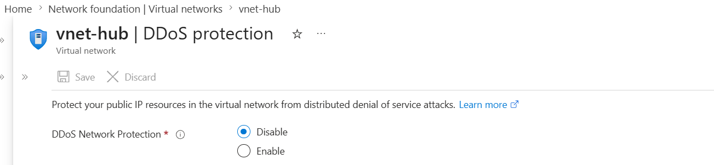
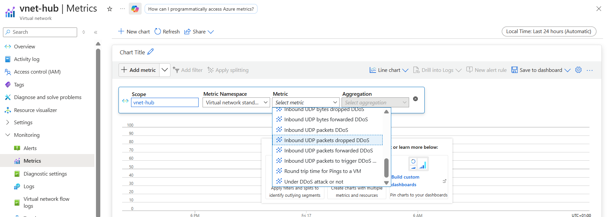
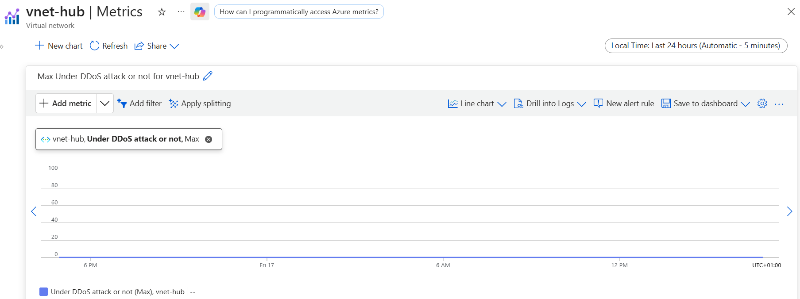
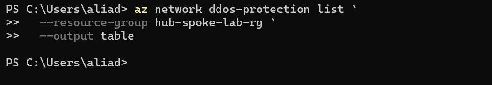
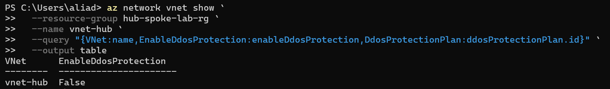

# Day 46 — Protect Your Resources with Azure DDoS Protection

### Azure 100 Days of Cloud Challenge — Ali Aden

## Overview

In this project, I explored how Azure protects internet-facing resources from Distributed Denial of Service (DDoS) attacks. Instead of deploying Azure DDoS Network Protection, I reviewed how it integrates with a virtual network, investigated the monitoring capabilities available in Azure Monitor, and validated the configuration using Azure CLI.

I also reviewed the current pricing of Azure DDoS Network Protection. As it is an enterprise-grade service with a significant monthly cost, I decided not to deploy it in this lab. Instead, I focused on understanding the differences between the free and premium protection tiers and documenting when an organisation would justify using the paid service.

---

## Technologies Used

- Microsoft Azure Portal
- Azure Virtual Network (VNet)
- Azure DDoS Protection
- Azure Monitor Metrics
- Azure CLI
- PowerShell

---

## Architecture Diagram

```text
                    Internet
                         │
                         ▼
          Azure Global Network
                         │
         DDoS Infrastructure Protection
      (Automatically enabled by Azure)
                         │
            Monitors network traffic
                         │
                         ▼
                 Public IP Resources
                         │
                         ▼
                    Hub Virtual Network
                    (vnet-hub)
                         │
         DDoS Network Protection
              (Not Enabled)
                         │
                         ▼
          Azure Monitor & Azure CLI
               Validation & Monitoring
```

---

## Implementation Steps

### 1. Reviewed DDoS Protection Settings

I opened the DDoS Protection settings for my existing Hub Virtual Network (`vnet-hub`) to review the current configuration.

The virtual network was using Azure's default protection with **DDoS Network Protection disabled**, which is the expected configuration for this lab.

**Screenshot**



---

### 2. Investigated Available Monitoring Metrics

Next, I explored the Metrics blade for the virtual network to understand what Azure exposes for DDoS monitoring.

I found several DDoS-related metrics, including:

- Under DDoS attack or not
- Inbound UDP packets DDoS
- Inbound UDP packets dropped DDoS
- Inbound UDP bytes dropped DDoS
- Inbound UDP packets forwarded DDoS

This demonstrated that Azure provides DDoS monitoring metrics that can be reviewed even though premium DDoS Network Protection was not enabled.

**Screenshot**



---

### 3. Validated Monitoring Results

I selected the **Under DDoS attack or not** metric to review activity over the previous 24 hours.

No DDoS events were recorded during the selected time period, which is the expected result in a normal lab environment without an active attack.

**Screenshot**



---

### 4. Validated Configuration with Azure CLI

To confirm the portal configuration, I used Azure CLI to inspect my environment.

First, I verified that there were no Azure DDoS Protection Plans deployed within my resource group.

```powershell
az network ddos-protection list `
  --resource-group hub-spoke-lab-rg `
  --output table
```

The command returned no results, confirming that no premium DDoS Protection Plan had been created.

**Screenshot**



Next, I checked the virtual network configuration.

```powershell
az network vnet show `
  --resource-group hub-spoke-lab-rg `
  --name vnet-hub `
  --query "{VNet:name,EnableDdosProtection:enableDdosProtection,DdosProtectionPlan:ddosProtectionPlan.id}" `
  --output table
```

The output confirmed that:

- The virtual network was **vnet-hub**
- **EnableDdosProtection** was **False**
- No DDoS Protection Plan was associated with the virtual network

**Screenshot**



---

## Validation

I successfully verified that:

- Azure DDoS Network Protection was not enabled on my Hub Virtual Network.
- Azure Monitor exposes DDoS-related metrics that can be used to monitor network activity.
- No DDoS events were recorded during the selected time period.
- No Azure DDoS Protection Plan existed within the resource group.
- Azure CLI confirmed that the virtual network was using the default configuration without premium DDoS protection.

---

## Cost Considerations

Before deploying Azure DDoS Network Protection, I reviewed the current Azure pricing.

At the time of this project, the service had a fixed monthly cost of approximately **$2,944 USD** for a single protection plan.

Because this is an enterprise-grade security service, I decided not to deploy it during this lab. Instead, I focused on understanding how the service works, validating the existing configuration, and identifying the types of organisations that would benefit from the premium protection.

This approach reflects how cloud engineers balance technical requirements with operational cost.

---

## Security Benefits

- Provides baseline protection against common volumetric DDoS attacks.
- Helps detect abnormal network traffic.
- Supports monitoring through Azure Monitor.
- Premium protection adds automatic mitigation, attack analytics and enhanced telemetry.
- Helps organisations improve the resilience of public-facing applications.

---

## Key Notes

- Azure provides Infrastructure Protection automatically for all Azure customers.
- DDoS Network Protection is enabled at the Virtual Network level.
- Premium DDoS protection is typically used for business-critical internet-facing services.
- Azure Monitor can be used to investigate DDoS-related metrics.
- Azure CLI provides a quick way to validate DDoS configuration without relying solely on the Azure Portal.
- Understanding the cost-versus-risk trade-off is an important part of designing secure Azure environments.