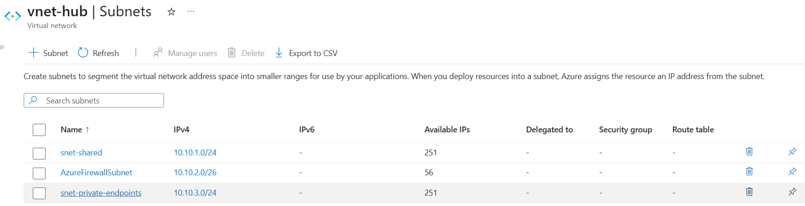
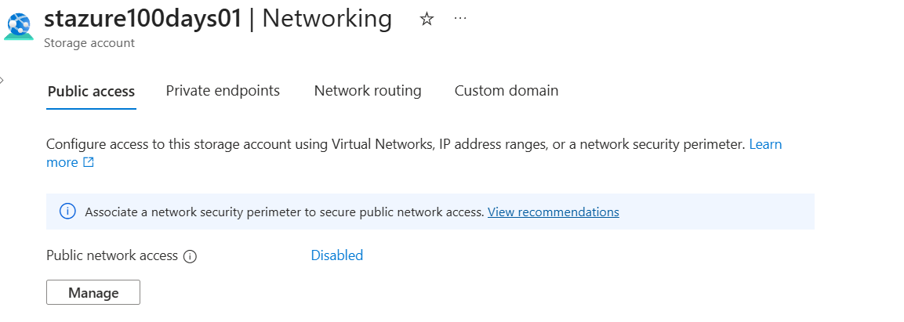
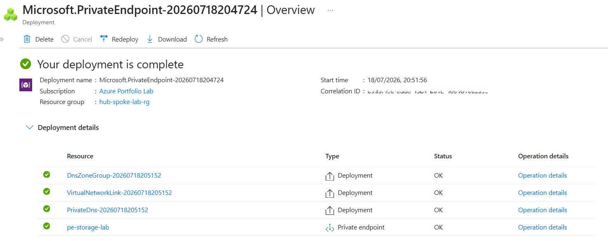
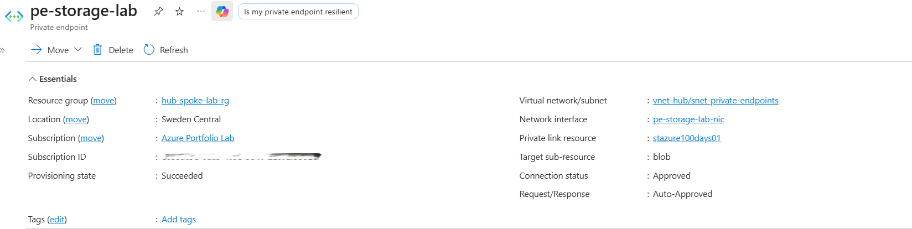
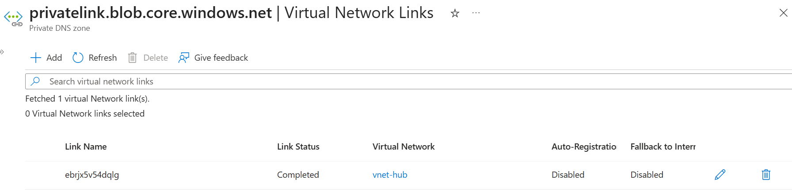
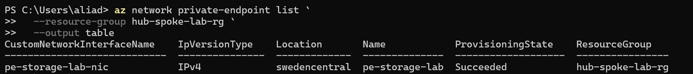
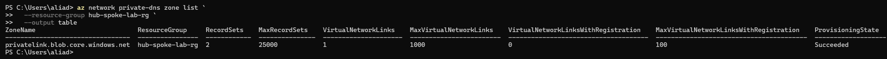
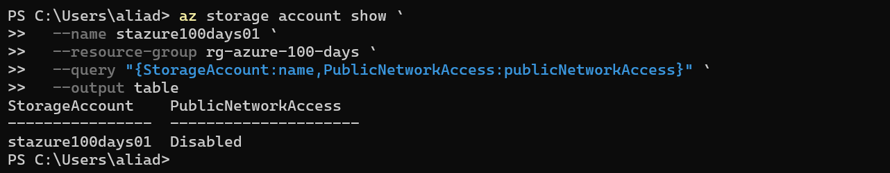

# Day 47 — Configure Private Endpoints for Azure Services

### Azure 100 Days of Cloud Challenge — Ali Aden

## Overview

For Day 47, I secured an Azure Storage Account by removing its public internet exposure and configuring a Private Endpoint for private connectivity.

Using Azure Private Link, I created a Private Endpoint named `pe-storage-lab` within my existing Hub Virtual Network (`vnet-hub`). This assigned a private IP address to the Storage Account connection, allowing traffic to remain on Microsoft's private backbone network instead of traversing the public internet.

To complete the implementation, I disabled public network access on the Storage Account, configured Private DNS integration, and validated the deployment using both the Azure portal and Azure CLI.

This approach is commonly used in enterprise Azure environments to protect services such as Azure Storage, Key Vault and Azure SQL Database by ensuring they are accessible only through trusted private network connectivity.

---

## Technologies Used

- Microsoft Azure Portal
- Azure Storage Account
- Azure Private Endpoint
- Azure Private Link
- Azure Private DNS Zone
- Azure Virtual Network (VNet)
- Azure CLI
- PowerShell

---

## Architecture Diagram

```text
                         Microsoft Azure
                                │
                                │
                     Public Network Access
                           Disabled
                                │
                     Public Internet Blocked
                                ✕
                                │

                 +----------------------------------+
                 |           vnet-hub              |
                 |         10.10.0.0/16            |
                 |                                 |
                 |  +---------------------------+  |
                 |  | snet-private-endpoints    |  |
                 |  |      10.10.3.0/24         |  |
                 |  |                           |  |
                 |  |   pe-storage-lab          |  |
                 |  +-------------+-------------+  |
                 +----------------|----------------+
                                  │
                           Azure Private Link
                                  │
                                  ▼
                   +-------------------------------+
                   |      stazure100days01         |
                   |        Blob Storage           |
                   |  Public Network: Disabled     |
                   +-------------------------------+
                                  │
                                  ▼
          Private DNS Zone: privatelink.blob.core.windows.net
```

---

## Azure Private Endpoint Configuration

| Component | Configuration |
|---|---|
| Storage Account | `stazure100days01` |
| Private Endpoint | `pe-storage-lab` |
| Resource Group (Private Endpoint) | `hub-spoke-lab-rg` |
| Resource Group (Storage Account) | `rg-azure-100-days` |
| Virtual Network | `vnet-hub` |
| Subnet | `snet-private-endpoints` |
| Target Sub-resource | `blob` |
| Private DNS Zone | `privatelink.blob.core.windows.net` |
| Public Network Access | Disabled |

---

## Implementation

### 1. Created a Dedicated Private Endpoint Subnet

I added a dedicated subnet named `snet-private-endpoints` to my existing Hub Virtual Network.

```text
Virtual Network: vnet-hub
Subnet Name:     snet-private-endpoints
Address Range:   10.10.3.0/24
```

Using a dedicated subnet keeps Private Endpoints separate from workload resources and provides a cleaner network design as additional private services are introduced.

---

### 2. Disabled Public Network Access

I configured the Storage Account to disable all public network access.

```text
Storage Account:
stazure100days01

Public Network Access:
Disabled
```

With public access disabled, the Storage Account can no longer be accessed directly over the public internet.

---

### 3. Created the Private Endpoint

I deployed a Private Endpoint named `pe-storage-lab` and connected it to the Blob service of the existing Storage Account.

```text
Private Endpoint:
pe-storage-lab

Target Resource:
stazure100days01

Sub-resource:
blob
```

Azure automatically created the required network interface and established the Private Link connection.

---

### 4. Configured Private DNS Integration

During deployment, Azure automatically created the Private DNS Zone:

```text
privatelink.blob.core.windows.net
```

The DNS zone was linked to `vnet-hub`, allowing resources within the virtual network to resolve the Storage Account hostname to the Private Endpoint without requiring application changes.

---

## Validation

### Private Endpoint Subnet

I confirmed that the dedicated subnet was successfully created within `vnet-hub`.



The subnet configuration includes:

```text
snet-private-endpoints
10.10.3.0/24
```

---

### Public Network Access

I verified that public network access was disabled for the Storage Account.



The Storage Account now accepts private connectivity only.

---

### Private Endpoint Deployment

I confirmed that the Private Endpoint deployment completed successfully.



Azure successfully created:

- Private Endpoint
- Private DNS Zone
- Virtual Network Link
- DNS Zone Group

---

### Private Endpoint Status

I verified that the Private Endpoint was successfully connected.



The configuration shows:

```text
Provisioning State:
Succeeded

Connection Status:
Approved

Target Sub-resource:
blob
```

---

### Private DNS Zone

I confirmed that the Private DNS Zone was linked to the Hub Virtual Network.



The Virtual Network Link shows:

```text
Virtual Network:
vnet-hub

Status:
Completed
```

---

### Azure CLI Private Endpoint Validation

I validated the Private Endpoint using Azure CLI.

```powershell
az network private-endpoint list `
  --resource-group hub-spoke-lab-rg `
  --output table
```



The output confirmed that `pe-storage-lab` was successfully deployed.

---

### Azure CLI Private DNS Validation

I verified that the Private DNS Zone was successfully created.

```powershell
az network private-dns zone list `
  --resource-group hub-spoke-lab-rg `
  --output table
```



The output confirmed that the Private DNS Zone was provisioned successfully.

---

### Azure CLI Storage Account Validation

Finally, I confirmed that public network access was disabled on the Storage Account.

```powershell
az storage account show `
  --name stazure100days01 `
  --resource-group rg-azure-100-days `
  --query "{StorageAccount:name,PublicNetworkAccess:publicNetworkAccess}" `
  --output table
```



The output confirmed:

```text
Storage Account:
stazure100days01

Public Network Access:
Disabled
```

---

## Design Considerations

- Private Endpoints eliminate the need to expose Azure services to the public internet.
- Using a dedicated subnet simplifies management as additional Private Endpoints are deployed.
- Private DNS integration allows applications to continue using the Storage Account's standard hostname while automatically resolving it to the private endpoint.
- Disabling public network access reduces the attack surface and ensures traffic is restricted to authorised private networks.
- Azure Private Link keeps traffic on Microsoft's private backbone network without requiring VPN or ExpressRoute connectivity.

---

## Key Notes

This project extends the Hub and Spoke environment created in previous challenges by introducing private connectivity to Azure Storage using Azure Private Link.

Rather than relying on firewall rules to restrict public access, the Storage Account now accepts connections only through the Private Endpoint deployed within `vnet-hub`. Azure automatically manages name resolution through the Private DNS Zone, allowing resources inside the virtual network to connect using the Storage Account's existing hostname while keeping traffic on the Microsoft backbone network.

This implementation reflects a common enterprise security pattern for protecting Azure platform services by removing unnecessary public exposure while maintaining secure private access from trusted Azure networks.