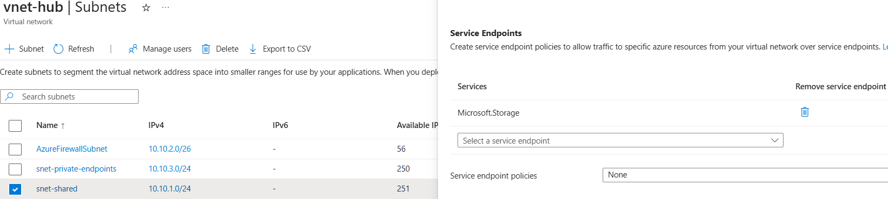
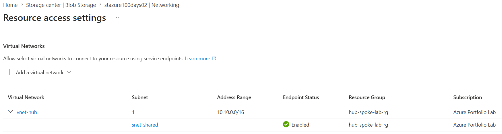
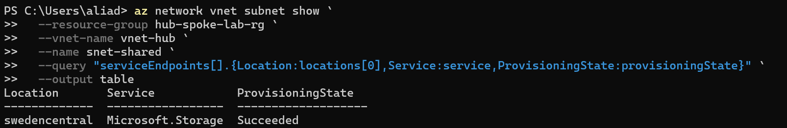
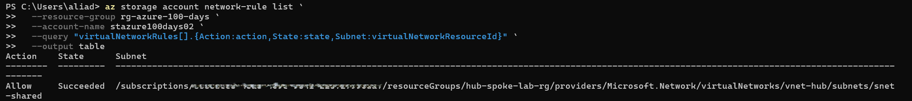

# Day 48 — Configure Service Endpoints for Azure Storage

### Azure 100 Days of Cloud Challenge — Ali Aden

## Overview

For Day 48, I configured an Azure Service Endpoint to secure access to an Azure Storage Account using Virtual Network rules.

Rather than exposing the Storage Account to all network traffic, I enabled the **Microsoft.Storage** Service Endpoint on my existing `snet-shared` subnet within `vnet-hub` and configured the Storage Account to allow connections only from that authorised subnet.

Unlike the Private Endpoint implementation completed in Day 47, the Storage Account in this project continues to use its public endpoint. Access is controlled by extending the identity of the subnet to Azure Storage, allowing the Storage Account to recognise trusted traffic originating from my virtual network.

The deployment was validated using both the Azure portal and Azure CLI to confirm that the Service Endpoint and Virtual Network Rule were configured successfully.

---

## Technologies Used

- Microsoft Azure Portal
- Azure Storage Account
- Azure Virtual Network (VNet)
- Azure Service Endpoints
- Azure Storage Firewall
- Azure CLI
- PowerShell

---

## Architecture Diagram

```text
                     Microsoft Azure

                     Public Internet
                            │
                            ▼

               +-----------------------------+
               |      Storage Account        |
               |     stazure100days02        |
               |      Public Endpoint        |
               |                             |
               | Allowed Virtual Network:    |
               | vnet-hub → snet-shared      |
               +-------------▲---------------+
                             │
                             │
                Microsoft Azure Backbone
                             │
                             │
       +-----------------------------------------+
       |               vnet-hub                  |
       |             10.10.0.0/16                |
       |                                         |
       |  +-----------------------------------+  |
       |  |         snet-shared               |  |
       |  |         10.10.1.0/24              |  |
       |  |                                   |  |
       |  | Service Endpoint                  |  |
       |  | Microsoft.Storage                 |  |
       |  +-----------------------------------+  |
       +-----------------------------------------+
```

---

## Service Endpoint Configuration

| Component | Configuration |
|---|---|
| Storage Account | `stazure100days02` |
| Resource Group (Storage) | `rg-azure-100-days` |
| Virtual Network | `vnet-hub` |
| Resource Group (Network) | `hub-spoke-lab-rg` |
| Subnet | `snet-shared` |
| Service Endpoint | `Microsoft.Storage` |
| Public Network Access | Enabled from selected virtual networks |
| Virtual Network Rule | `vnet-hub` → `snet-shared` |

---

## Implementation

### 1. Created a Storage Account

I created a dedicated Storage Account named `stazure100days02` to demonstrate Azure Service Endpoints without modifying the Private Endpoint implementation completed in Day 47.

This allowed both projects to remain independent while demonstrating two different methods of securing Azure Storage.

---

### 2. Enabled the Microsoft.Storage Service Endpoint

I enabled the **Microsoft.Storage** Service Endpoint on the existing `snet-shared` subnet within `vnet-hub`.

This extends the subnet's identity to Azure Storage, allowing the service to recognise requests originating from the authorised subnet.

---

### 3. Configured a Virtual Network Rule

I configured the Storage Account firewall to allow access only from `vnet-hub` using the `snet-shared` subnet.

Public network access remains enabled, however only traffic originating from the authorised subnet is permitted to connect.

---

## Validation

### Service Endpoint Configuration

I verified that the **Microsoft.Storage** Service Endpoint was successfully enabled on `snet-shared`.



The subnet now advertises its identity to Azure Storage, allowing the Storage Account to recognise trusted traffic from the virtual network.

---

### Storage Account Network Rule

I confirmed that the Storage Account allows connections only from the authorised Virtual Network and subnet.



The configuration shows:

```text
Virtual Network
vnet-hub

Subnet
snet-shared

Endpoint Status
Enabled
```

---

### Azure CLI Service Endpoint Validation

I validated the Service Endpoint using Azure CLI.

```powershell
az network vnet subnet show `
  --resource-group hub-spoke-lab-rg `
  --vnet-name vnet-hub `
  --name snet-shared `
  --query "serviceEndpoints[].{Location:locations[0],Service:service,ProvisioningState:provisioningState}" `
  --output table
```



The output confirmed:

```text
Location:             swedencentral
Service:              Microsoft.Storage
Provisioning State:   Succeeded
```

---

### Azure CLI Storage Account Network Rule Validation

I validated the Storage Account Virtual Network Rule using Azure CLI.

```powershell
az storage account network-rule list `
  --resource-group rg-azure-100-days `
  --account-name stazure100days02 `
  --query "virtualNetworkRules[].{Action:action,State:state,Subnet:virtualNetworkResourceId}" `
  --output table
```



The output confirmed:

```text
Action: Allow

State: Succeeded

Subnet:
vnet-hub/snet-shared
```

---

## Service Endpoint vs Private Endpoint

| Feature | Service Endpoint | Private Endpoint |
|---|---|---|
| Public Endpoint | Yes | No |
| Private IP Address | No | Yes |
| Public Network Access | Enabled | Disabled |
| Uses Microsoft Azure Backbone | Yes | Yes |
| Access Control | Virtual Network Rule | Private IP Connectivity |
| Additional Cost | No | Yes |
| Best Use Case | Restrict access to trusted subnets | Protect sensitive production workloads |

---

## Design Considerations

- Service Endpoints provide a simple and cost-effective method of restricting Azure services to trusted Virtual Network subnets.
- The Storage Account continues to use its public endpoint while allowing access only from authorised Virtual Networks.
- Unlike Private Endpoints, no private IP address is assigned to the Storage Account.
- Service Endpoints are well suited for internal workloads where subnet-based access control is sufficient.
- For highly sensitive services such as Key Vault or production Storage Accounts containing confidential data, Private Endpoints provide stronger isolation by removing public exposure completely.

---

## Key Notes

This project demonstrates how Azure Service Endpoints extend the identity of a subnet to Azure services, allowing access to be controlled through Virtual Network Rules without requiring a Private Endpoint.

Unlike the previous project where the Storage Account was accessed through a private IP address, this implementation retains the public endpoint while restricting access to `vnet-hub` and `snet-shared`. This highlights the architectural differences between Service Endpoints and Private Endpoints and demonstrates when each approach is appropriate within an Azure environment.