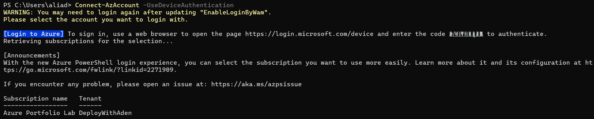
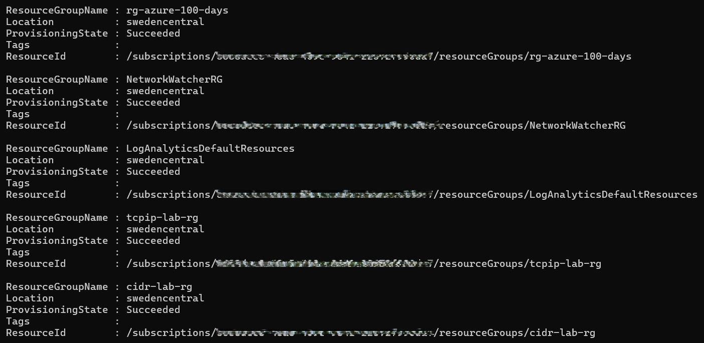
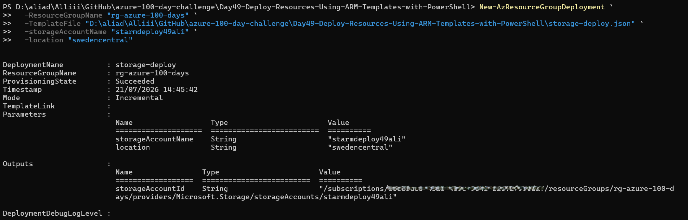
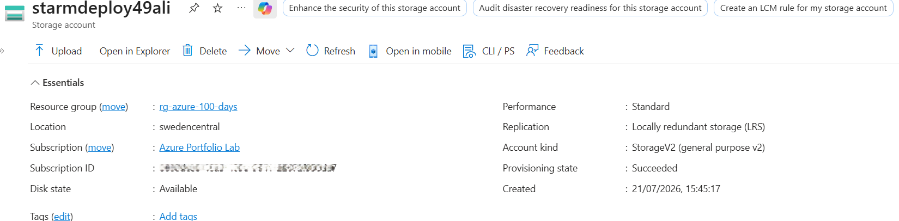
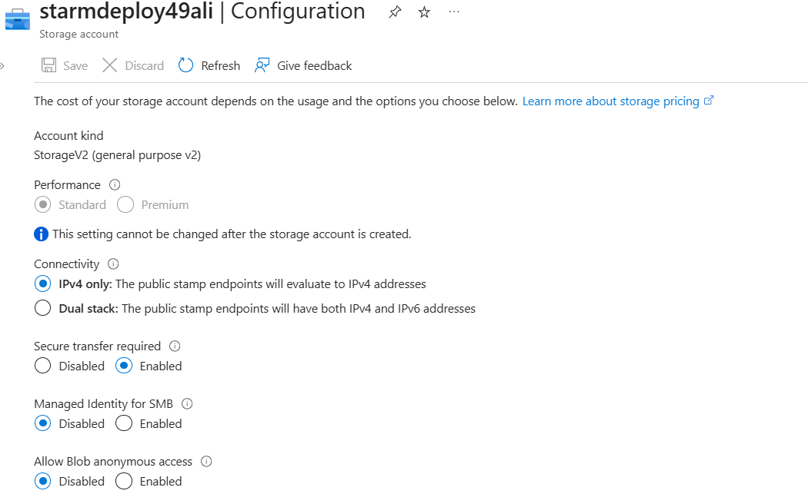
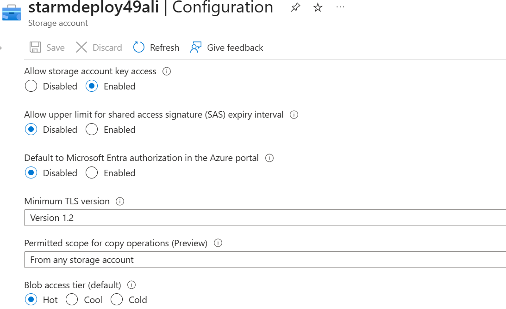

# Day 49 — Deploy Resources Using ARM Templates with PowerShell

### Azure 100 Days of Cloud Challenge — Ali Aden

## Overview

For Day 49, I deployed Azure infrastructure using an Azure Resource Manager (ARM) template instead of creating resources manually through the Azure Portal.

I created an ARM template in JSON to deploy an Azure Storage Account with predefined security settings, including HTTPS-only traffic, TLS 1.2 as the minimum supported protocol and public blob access disabled. Defining these settings within the template ensures that every deployment follows the same configuration without requiring manual changes after deployment.

To deploy the template, I used Azure PowerShell and the `New-AzResourceGroupDeployment` cmdlet. Azure Resource Manager validated the template, processed the deployment and provisioned the Storage Account within my existing Resource Group.

After the deployment completed successfully, I validated the Storage Account in the Azure Portal to confirm that the deployed resource matched the ARM template. I also reran the deployment using the same parameters to demonstrate ARM template idempotency, where repeated deployments apply the desired configuration without creating duplicate resources.

Infrastructure as Code is widely used across Azure environments because it provides a consistent, repeatable and version-controlled method of deploying infrastructure, making it easier to manage resources across development, testing and production environments.

---

## Technologies Used

- Microsoft Azure Portal
- Azure Resource Manager (ARM)
- ARM Templates (JSON)
- Azure PowerShell (Az Module)
- Azure Storage Account
- Visual Studio Code
- PowerShell
- Git & GitHub

---

## ASCII Architecture

```text
                  Local Computer
               (Visual Studio Code)
                        │
                        │
         storage-deploy.json (ARM Template)
                        │
                        ▼
         Azure PowerShell (Az Module)
     New-AzResourceGroupDeployment
                        │
                        ▼
      Azure Resource Manager (ARM)
                        │
         Validates ARM Template
         Resolves Parameters
        Creates Azure Resources
                        │
                        ▼
     Resource Group: rg-azure-100-days
                        │
                        ▼
        +-----------------------------+
        | Storage Account             |
        | starmdeploy49ali            |
        |-----------------------------|
        | HTTPS Only Enabled          |
        | Minimum TLS Version 1.2     |
        | Blob Public Access Disabled |
        +-----------------------------+
```

---

## ARM Template Configuration

| Component | Configuration |
|---|---|
| ARM Template | `storage-deploy.json` |
| Deployment Method | Azure PowerShell |
| PowerShell Cmdlet | `New-AzResourceGroupDeployment` |
| Resource Group | `rg-azure-100-days` |
| Storage Account | `starmdeploy49ali` |
| Resource Type | `Microsoft.Storage/storageAccounts` |
| Region | `Sweden Central` |
| SKU | `Standard_LRS` |
| Account Kind | `StorageV2` |
| Secure Transfer Required | Enabled |
| Minimum TLS Version | `TLS 1.2` |
| Blob Public Access | Disabled |
| Deployment Mode | Incremental |

---

## Implementation

### 1. Created the ARM Template

I created an ARM template named `storage-deploy.json` using Visual Studio Code. The template defines an Azure Storage Account and includes parameters for the Storage Account name and deployment location, making the template reusable for future deployments.

The template also includes several security configurations during deployment rather than applying them manually afterwards.

```text
Storage Account Kind:
StorageV2

SKU:
Standard_LRS

Secure Transfer:
Enabled

Minimum TLS Version:
TLS 1.2

Blob Public Access:
Disabled
```

By defining these settings within the template, Azure Resource Manager automatically applies the required configuration each time the template is deployed.

---

### 2. Connected to Azure Using PowerShell

Before deploying the template, I authenticated to my Azure subscription using Azure PowerShell.

```powershell
Connect-AzAccount -UseDeviceAuthentication
```

After signing in, Azure PowerShell established a connection to my Azure subscription, allowing PowerShell to communicate securely with Azure Resource Manager.

Using Azure PowerShell provides an efficient way to deploy and manage Azure resources without relying on the Azure Portal.

---

### 3. Verified the Target Resource Group

Before starting the deployment, I confirmed that the Resource Group already existed.

```text
Resource Group:
rg-azure-100-days
```

Deploying resources into an existing Resource Group keeps related Azure resources organised and allows multiple projects to be managed within the same environment.

---

### 4. Deployed the ARM Template

With the template complete and the Resource Group confirmed, I deployed the ARM template using Azure PowerShell.

```powershell
New-AzResourceGroupDeployment `
    -ResourceGroupName "rg-azure-100-days" `
    -TemplateFile ".\storage-deploy.json" `
    -storageAccountName "starmdeploy49ali" `
    -location "swedencentral"
```

Azure Resource Manager first validated the template before provisioning the Storage Account using the parameters provided during deployment.

The deployment completed successfully with a provisioning state of:

```text
Succeeded
```

---

### 5. Validated the Deployed Resource

After the deployment completed, I opened the Azure Portal to verify that the Storage Account had been created successfully.

I confirmed that the resource had been deployed into the correct Resource Group and region and that Azure had provisioned the Storage Account without any deployment errors.

---

### 6. Verified the Storage Account Configuration

I reviewed the Storage Account configuration within the Azure Portal to confirm that the settings defined in the ARM template had been applied correctly.

The deployed configuration included:

```text
Storage Account:
starmdeploy49ali

Secure Transfer:
Enabled

Minimum TLS Version:
TLS 1.2

Blob Public Access:
Disabled
```

Validating these settings confirmed that Azure Resource Manager had successfully applied the security configuration during deployment rather than requiring additional manual changes afterwards.

---

### 7. Confirmed ARM Template Idempotency

To verify the deployment behaviour, I ran the same ARM template a second time using the same deployment parameters.

Azure Resource Manager compared the existing resource with the desired configuration defined in the template and completed the deployment without creating another Storage Account.

This demonstrates one of the key benefits of Infrastructure as Code, where templates can be deployed repeatedly while maintaining the desired state of existing resources.

## Validation

### Azure PowerShell Authentication

I confirmed that Azure PowerShell successfully authenticated to my Azure subscription before starting the deployment.



The successful sign-in established an authenticated PowerShell session, allowing Azure PowerShell to communicate securely with Azure Resource Manager for the deployment.

---

### Resource Group Verification

Before deploying the ARM template, I verified that the target Resource Group already existed.



The output confirmed:

```text
Resource Group:
rg-azure-100-days

Location:
Sweden Central
```

This ensured that the ARM template would deploy the Storage Account into the correct Azure environment.

---

### ARM Template Deployment

I deployed the ARM template using Azure PowerShell.

```powershell
New-AzResourceGroupDeployment `
    -ResourceGroupName "rg-azure-100-days" `
    -TemplateFile ".\storage-deploy.json" `
    -storageAccountName "starmdeploy49ali" `
    -location "swedencentral"
```



The deployment completed successfully with:

```text
Provisioning State:
Succeeded
```

This confirmed that Azure Resource Manager successfully validated the template and provisioned the Storage Account without any deployment errors.

---

### Storage Account Overview

After the deployment completed, I verified the newly created Storage Account in the Azure Portal.



The overview page confirmed:

```text
Storage Account:
starmdeploy49ali

Resource Group:
rg-azure-100-days

Region:
Sweden Central

Status:
Succeeded
```

This verified that the ARM template successfully created the Storage Account in the intended Azure Resource Group.

---

### Storage Account Security Configuration

I reviewed the Storage Account configuration to confirm that the security settings defined within the ARM template had been applied successfully.



The configuration confirmed:

```text
Performance:
Standard

Redundancy:
Locally-redundant storage (LRS)

Secure Transfer Required:
Enabled

Allow Blob Anonymous Access:
Disabled
```

These settings matched the values configured within the ARM template.

---

### Minimum TLS Version

Finally, I verified the minimum TLS version configured for the Storage Account.



The configuration showed:

```text
Minimum TLS Version:
Version 1.2
```

This confirmed that Azure Resource Manager applied the required encryption protocol during deployment, ensuring the Storage Account only accepts connections using TLS 1.2 or later.

---

## Key Notes

This project introduced Infrastructure as Code by deploying Azure resources through an ARM template instead of creating them manually in the Azure Portal.

Using Azure PowerShell together with Azure Resource Manager demonstrated how Azure resources can be deployed consistently from a reusable JSON template. Rather than configuring the Storage Account after deployment, the required security settings were defined within the template and applied automatically during provisioning.

I also confirmed the idempotent behaviour of ARM templates by running the deployment a second time. Azure Resource Manager compared the existing infrastructure with the template and completed the deployment without creating duplicate resources.

Although this project deployed a single Storage Account, the same approach can be used to deploy complete Azure environments, making Infrastructure as Code an essential skill for Azure administrators and cloud engineers.