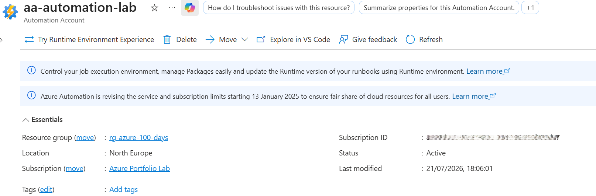
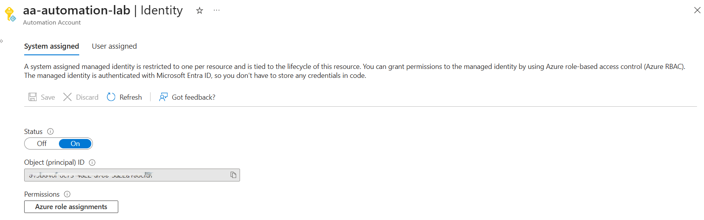
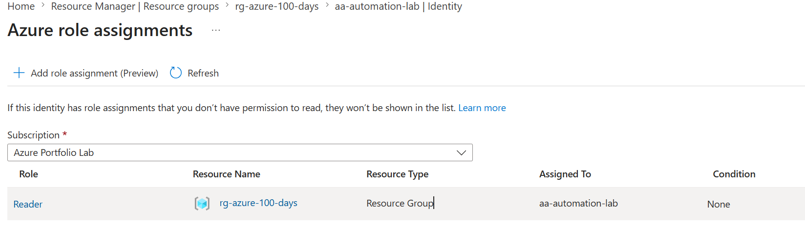
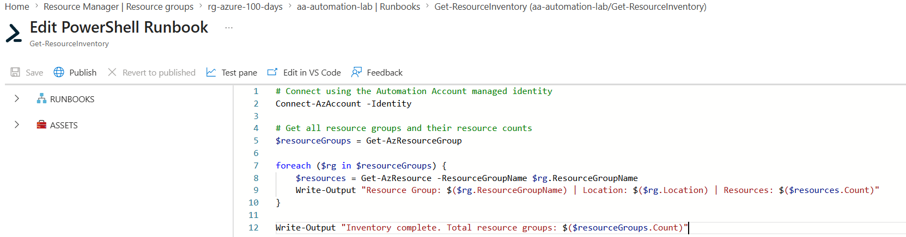
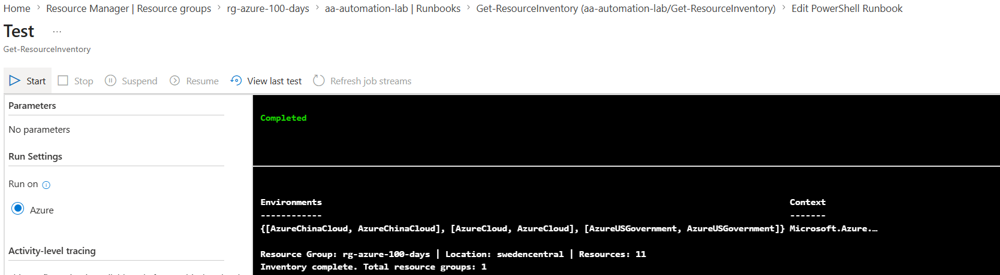
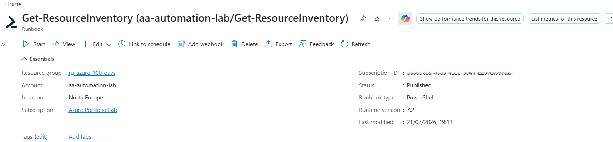
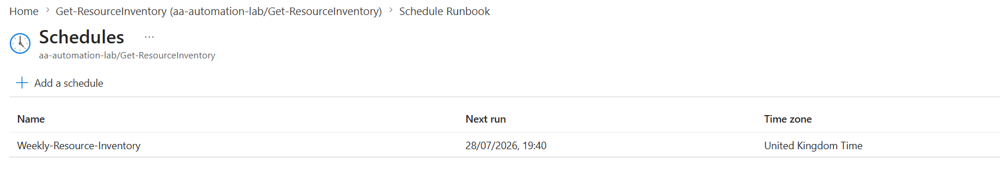
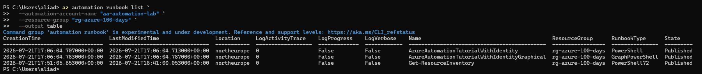

# Day 50 — Create and Run an Azure Automation Runbook

### Azure 100 Days of Cloud Challenge — Ali Aden

## Overview

For Day 50, I automated an Azure management task by creating an Azure Automation Account and building a PowerShell runbook that generates an inventory of Azure resources.

I deployed an Automation Account named `aa-automation-lab` with a System Assigned Managed Identity and granted it Reader access to my existing Resource Group (`rg-azure-100-days`) using Azure Role-Based Access Control (RBAC). This allowed the runbook to securely authenticate to Azure without storing usernames, passwords or service principal credentials.

Inside the Automation Account, I created a PowerShell runbook named `Get-ResourceInventory`. The runbook authenticates using the managed identity, retrieves the available Resource Groups, counts the resources within each group and outputs the inventory results.

After validating the runbook in the Test pane, I published it and linked it to a weekly schedule so the inventory can run automatically without manual intervention. Finally, I validated the deployment using Azure CLI to confirm that the runbook was successfully published.

Azure Automation is widely used in enterprise environments to automate repetitive administrative tasks such as resource inventory, compliance reporting, virtual machine scheduling and operational maintenance, reducing manual effort while improving consistency and reliability.

---

## Technologies Used

- Microsoft Azure Portal
- Azure Automation Account
- Azure Automation Runbooks
- System Assigned Managed Identity
- Azure Role-Based Access Control (RBAC)
- Azure Resource Manager (ARM)
- Azure PowerShell (Az Module)
- Azure CLI
- PowerShell 7.2

---

## ASCII Architecture

```text
                    Microsoft Azure
                           │
                           ▼
              +----------------------------+
              |     Automation Account     |
              |    aa-automation-lab       |
              |   North Europe Region      |
              +-------------+--------------+
                            │
                            ▼
          System Assigned Managed Identity
                            │
                 Reader Role Assignment
                            │
                            ▼
                  Azure Resource Manager
                            │
                            ▼
              +----------------------------+
              |        PowerShell          |
              |          Runbook           |
              |  Get-ResourceInventory     |
              +-------------+--------------+
                            │
                            ▼
              Enumerates Azure Resources
                            │
                            ▼
                 Resource Group Inventory
              rg-azure-100-days (11 Resources)
                            │
                            ▼
                  Job Output (Completed)
                            │
                            ▼
                Weekly Automation Schedule
```

---

## Azure Automation Configuration

| Component | Configuration |
|---|---|
| Automation Account | `aa-automation-lab` |
| Resource Group | `rg-azure-100-days` |
| Region | `North Europe` |
| Managed Identity | System Assigned |
| RBAC Role | Reader |
| RBAC Scope | `rg-azure-100-days` |
| Runbook | `Get-ResourceInventory` |
| Runbook Type | PowerShell |
| Runtime Version | 7.2 |
| Schedule | Weekly-Resource-Inventory |
| Authentication | Managed Identity |

---

## Implementation

### 1. Created the Azure Automation Account

I deployed an Azure Automation Account named `aa-automation-lab` within my existing Resource Group.

```text
Automation Account:
aa-automation-lab

Resource Group:
rg-azure-100-days

Region:
North Europe
```

The Automation Account provides a central location for managing runbooks, schedules, identities and automation assets.

> **Note:** The Automation Account was deployed in **North Europe** because Azure Free Trial subscriptions do not currently support Azure Automation in Sweden Central.

---

### Automation Account Deployment

I confirmed that the Automation Account was successfully deployed.



The overview confirms:

- Automation Account created
- Resource Group assigned
- Region configured
- Resource status is Active

---

### 2. Enabled the System Assigned Managed Identity

To allow the runbook to authenticate securely to Azure, I enabled the System Assigned Managed Identity for the Automation Account.

Unlike traditional authentication methods, Managed Identities remove the need to store usernames, passwords or service principal secrets inside scripts.



The configuration confirms:

```text
Managed Identity:
System Assigned

Status:
On
```

---

### 3. Assigned Azure RBAC Permissions

After enabling the managed identity, I granted it the **Reader** role on my existing Resource Group.

```text
Role:
Reader

Scope:
rg-azure-100-days
```

I assigned the role at the Resource Group level rather than the Subscription level by following the principle of least privilege. The runbook only needs permission to read resources within this lab environment.



The role assignment confirms:

- Reader role
- Resource Group scope
- Automation Account managed identity

---

### 4. Created the PowerShell Runbook

Inside the Automation Account, I created a PowerShell runbook named `Get-ResourceInventory`.

The runbook authenticates using the Automation Account's managed identity before retrieving all available Resource Groups and counting the Azure resources contained within each group.

```powershell
Connect-AzAccount -Identity
```

The script then performs an inventory of the Azure resources and writes the results to the output stream.



The runbook was successfully saved and prepared for testing before publication.

---

## Validation

### Automation Account Deployment

I verified that the Azure Automation Account was successfully deployed.


The overview confirms:

```text
Automation Account:
aa-automation-lab

Status:
Active

Region:
North Europe
```

---

### Managed Identity

I confirmed that the System Assigned Managed Identity was enabled for the Automation Account.


The configuration shows:

```text
Managed Identity:
System Assigned

Status:
On
```

This allows the runbook to securely authenticate to Azure without storing credentials inside the script.

---

### Reader Role Assignment

I verified that the Automation Account managed identity was assigned the Reader role on the Resource Group.


The role assignment confirms:

```text
Role:
Reader

Scope:
rg-azure-100-days
```

This provides the runbook with permission to read Azure resources while following the principle of least privilege.

---

### Runbook Test

Before publishing the runbook, I executed it using the Azure Automation Test pane.



The output confirmed:

```text
Status:
Completed

Resource Group:
rg-azure-100-days

Inventory complete.
```

The runbook successfully authenticated using the managed identity and generated an inventory of the Azure resources within the Resource Group.

---

### Published Runbook

After successfully testing the script, I published the runbook to make it available for scheduled execution.



The runbook configuration confirms:

```text
Runbook:
Get-ResourceInventory

Runbook Type:
PowerShell

Runtime Version:
7.2

Status:
Published
```

---

### Weekly Schedule

I linked the runbook to a recurring weekly schedule so it can execute automatically without manual intervention.



The schedule confirms:

```text
Schedule:
Weekly-Resource-Inventory

Recurrence:
Weekly

Time Zone:
United Kingdom Time
```

This allows Azure Automation to run the inventory on a recurring basis.

---

### Azure CLI Validation

Finally, I validated the deployment using Azure CLI.

```powershell
az automation runbook list `
  --automation-account-name "aa-automation-lab" `
  --resource-group "rg-azure-100-days" `
  --output table
```



The output confirmed that the runbook was successfully published.

```text
Runbook:
Get-ResourceInventory

Runbook Type:
PowerShell72

State:
Published
```

This confirmed that the Automation Account, runbook and published state were successfully recognised by Azure CLI.

---

## Key Notes

This project introduced Azure Automation by replacing a manual management task with an automated PowerShell runbook.

Rather than running a PowerShell script manually whenever a resource inventory was needed, the runbook was stored within an Azure Automation Account, authenticated using a System Assigned Managed Identity and configured to execute automatically on a recurring weekly schedule.

Using a Managed Identity removed the need to store credentials inside the script, while Azure Role-Based Access Control (RBAC) ensured the runbook had only the permissions required to perform the inventory task. This follows Microsoft's recommended approach for securely authenticating Azure Automation runbooks.

After validating the runbook in the Test pane, I published it and confirmed its deployment using Azure CLI. This demonstrated the complete automation lifecycle, from creating the Automation Account and configuring permissions to testing, publishing and scheduling the runbook for unattended execution.

Although this project focused on generating a simple Azure resource inventory, the same approach can be used to automate many operational tasks such as virtual machine scheduling, compliance reporting, resource tagging, environment maintenance and routine administrative activities across Azure environments.
