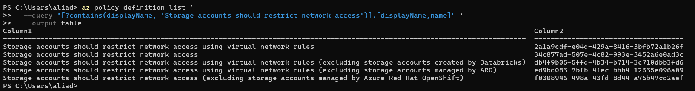
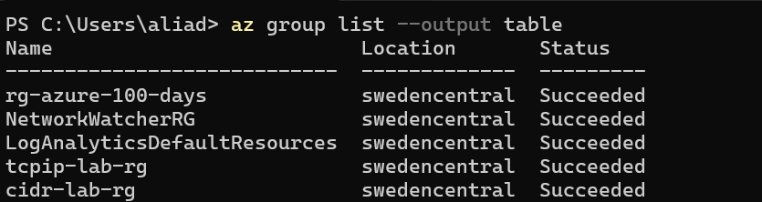
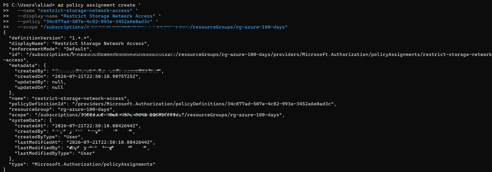
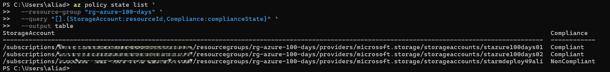
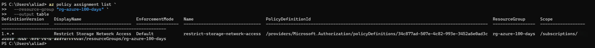

# Day 51 — Script Azure Policy Assignments with Azure CLI

### Azure 100 Days of Cloud Challenge — Ali Aden

## Overview

For Day 51, I automated Azure governance by assigning a built-in Azure Policy using Azure CLI instead of configuring it through the Azure Portal.

I started by searching the available built-in policy definitions before selecting **Storage accounts should restrict network access**. I then assigned the policy to my existing Resource Group (`rg-azure-100-days`) using Azure CLI. This allows Azure Policy to evaluate Storage Accounts within the Resource Group and report whether they comply with the configured governance requirements.

After creating the policy assignment, I triggered a manual policy compliance scan and reviewed the compliance results. Azure successfully identified two compliant Storage Accounts and one non-compliant Storage Account, confirming that the policy assignment was working correctly.

Azure Policy is commonly used in enterprise environments to enforce organisational standards, monitor compliance and help administrators identify resources that don't meet security or governance requirements without manually checking every resource.

---

## Technologies Used

- Microsoft Azure
- Azure Policy
- Azure CLI
- Windows PowerShell
- Azure Resource Groups
- Azure Storage Accounts
- Azure Policy Compliance

---

## Architecture Diagram

```text
+----------------------------------------------------------------------------------+
|            Day 51 - Script Azure Policy Assignments with Azure CLI              |
+----------------------------------------------------------------------------------+

                      +---------------------------+
                      |   Local PowerShell        |
                      |      Azure CLI            |
                      +------------+--------------+
                                   |
                                   | az policy assignment create
                                   v
+------------------------------------------------------------------------------+
|                                 Microsoft Azure                              |
|                                                                              |
|  +-----------------------------------------------------------------------+   |
|  | Built-in Azure Policy                                                 |   |
|  | Storage accounts should restrict network access                       |   |
|  +----------------------------+------------------------------------------+   |
|                               |                                              |
|                               | Assigned to                                  |
|                               v                                              |
|                    +------------------------------+                          |
|                    | Resource Group               |                          |
|                    | rg-azure-100-days            |                          |
|                    +--------------+---------------+                          |
|                                   |                                          |
|          +------------------------+------------------------+                 |
|          |                        |                        |                 |
|          v                        v                        v                 |
| +--------------------+  +--------------------+  +------------------------+  |
| | stazure100days01   |  | stazure100days02   |  | starmdeploy49ali       |  |
| |   ✅ Compliant      |  |   ✅ Compliant      |  |   ❌ Non-Compliant     |  |
| +--------------------+  +--------------------+  +------------------------+  |
|                                                                              |
|                    +------------------------------+                          |
|                    | Azure Policy Evaluation      |                          |
|                    | az policy state list         |                          |
|                    +--------------+---------------+                          |
+-----------------------------------|------------------------------------------+
                                    |
                                    v
                      +------------------------------+
                      | Compliance Results           |
                      | • 2 Compliant                |
                      | • 1 Non-Compliant            |
                      +------------------------------+
```

---

## Azure Policy Configuration

| Component | Configuration |
|---|---|
| Policy | Storage accounts should restrict network access |
| Policy Type | Built-in |
| Policy Assignment | `restrict-storage-network-access` |
| Resource Group | `rg-azure-100-days` |
| Scope | Resource Group |
| Deployment Method | Azure CLI |
| Enforcement Mode | Default |
| Compliance Evaluation | Azure Policy |

---

## Implementation

### 1. Selected the Built-in Azure Policy

I searched the available Azure Policy definitions using Azure CLI and selected the built-in policy **Storage accounts should restrict network access**.

```text
Policy:
Storage accounts should restrict network access

Policy Type:
Built-in
```

The selected policy audits Storage Accounts that allow unrestricted public network access.

### Built-in Policy



The output confirms:

- Built-in Azure Policy located
- Policy name identified
- Policy ready for assignment

---

### 2. Verified the Resource Group

Before assigning the policy, I confirmed that my existing Resource Group was available and in a healthy state.

```text
Resource Group:
rg-azure-100-days

Region:
Sweden Central

Status:
Succeeded
```

### Resource Group Validation



The Resource Group was successfully located and ready to receive the policy assignment.

---

### 3. Assigned the Azure Policy

After confirming the Resource Group, I assigned the built-in Azure Policy using Azure CLI.

This created a policy assignment that applies the policy to every supported resource inside the Resource Group.

### Policy Assignment



The assignment confirms:

```text
Policy Assignment:
restrict-storage-network-access

Enforcement Mode:
Default

Scope:
rg-azure-100-days
```

---

### 4. Evaluated Policy Compliance

After assigning the policy, I triggered a policy evaluation and reviewed the compliance results.

Azure evaluated each Storage Account inside the Resource Group and reported whether it complied with the policy requirements.

### Compliance Results



The evaluation confirms:

```text
Compliant:
2 Storage Accounts

Non-Compliant:
1 Storage Account
```

This confirmed that Azure Policy was successfully evaluating resources against the assigned governance policy.

---

### 5. Verified the Policy Assignment

Finally, I listed the Azure Policy assignments using Azure CLI to confirm that the policy had been successfully deployed.

### Azure CLI Validation



The output confirms:

```text
Policy Assignment:
restrict-storage-network-access

Enforcement Mode:
Default

Scope:
rg-azure-100-days
```

This confirmed that the policy assignment was successfully created and applied to the Resource Group.

---

## Validation

### Built-in Policy

I confirmed that the required built-in Azure Policy was available before creating the assignment.


The policy definition was successfully identified and ready for use.

---

### Resource Group

I verified that the Resource Group existed and was available before assigning the policy.


The Resource Group was successfully located and ready for deployment.

---

### Policy Assignment

I confirmed that Azure CLI successfully created the policy assignment.


The assignment was successfully created with the correct scope and enforcement mode.

---

### Compliance Evaluation

I reviewed the compliance results after Azure Policy evaluated the Storage Accounts.


Azure correctly identified compliant and non-compliant Storage Accounts based on the assigned policy.

---

### Azure CLI Validation

Finally, I listed the Azure Policy assignments to verify the deployment.


The output confirmed that the policy assignment remained active and scoped to the correct Resource Group.

---

## Key Notes

This project introduced Azure Policy automation using Azure CLI instead of the Azure Portal.

Rather than assigning policies manually through the Azure interface, I used Azure CLI to locate a built-in policy, create the policy assignment and verify the deployment. This approach makes policy management repeatable and easier to automate, especially when managing multiple environments.

After triggering a compliance evaluation, Azure Policy successfully identified both compliant and non-compliant Storage Accounts within the Resource Group. This demonstrated how Azure Policy can continuously monitor resources against governance requirements and highlight configuration issues that may need attention.

Although this project focused on a single built-in policy, the same approach can be used to automate policy assignments across subscriptions, management groups and larger Azure environments, helping organisations maintain consistent governance and compliance at scale.
