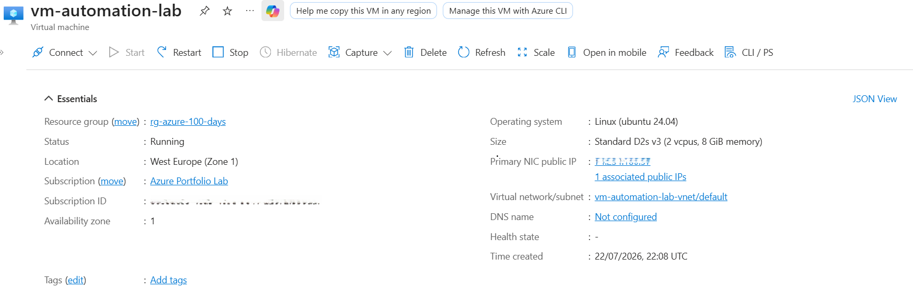
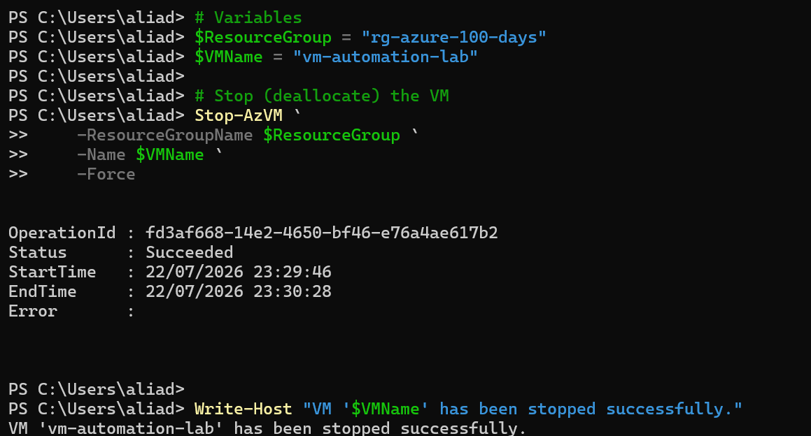
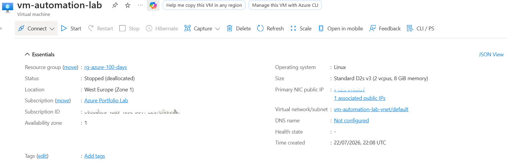
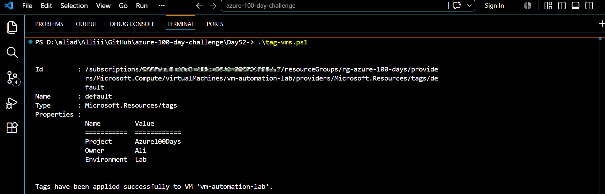
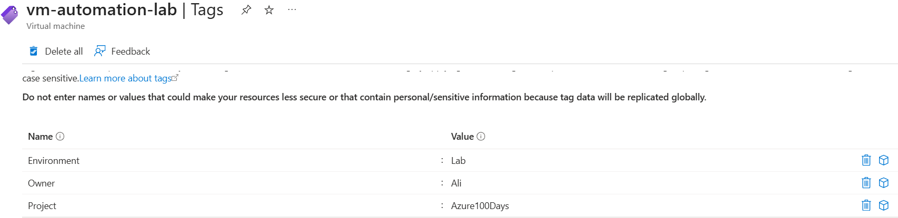

# Day 52 — Automate VM Management Tasks with PowerShell

### Azure 100 Days of Cloud Challenge — Ali Aden

## Overview

For Day 52, I used Azure PowerShell to automate common Azure Virtual Machine management tasks instead of carrying them out manually through the Azure Portal.

I started by creating a PowerShell script to stop my existing Azure Virtual Machine (`vm-automation-lab`). After confirming that the virtual machine had been successfully deallocated, I created a second PowerShell script to apply resource tags automatically.

The script added three tags to the virtual machine: **Environment**, **Project** and **Owner**. Once the script finished running, I verified the results in both PowerShell and the Azure Portal to make sure the tags had been successfully applied.

This project demonstrates how Azure PowerShell can automate routine administration tasks, helping make Azure resource management more efficient and repeatable.

---

## Technologies Used

- Microsoft Azure
- Azure Virtual Machines
- Azure PowerShell (Az Module)
- Windows PowerShell
- Azure Resource Tags
- Azure Portal

---

## Architecture Diagram

```text
+----------------------------------------------------------------------------------+
|         Day 52 - Automate VM Management Tasks with PowerShell                    |
+----------------------------------------------------------------------------------+

                     +---------------------------+
                     |     Local Computer        |
                     |    Windows PowerShell     |
                     +------------+--------------+
                                  |
                                  | Connect-AzAccount
                                  |
                                  v
+----------------------------------------------------------------------------------+
|                               Microsoft Azure                                    |
|                                                                                  |
|  +--------------------------------------------------------------------------+    |
|  | Resource Group                                                           |    |
|  | rg-azure-100-days                                                        |    |
|  +------------------------------------+-------------------------------------+    |
|                                       |                                          |
|                                       |                                          |
|                                       v                                          |
|                     +--------------------------------------+                     |
|                     | Azure Virtual Machine               |                     |
|                     | vm-automation-lab                   |                     |
|                     | Ubuntu 24.04 LTS                    |                     |
|                     +----------------+---------------------+                     |
|                                      |                                           |
|          +---------------------------+---------------------------+               |
|          |                                                       |               |
|          v                                                       v               |
| +--------------------------+                     +-----------------------------+  |
| | Stop-AzVM                |                     | Update-AzTag               |  |
| | Deallocate VM            |                     | Merge Resource Tags        |  |
| +-------------+------------+                     +-------------+--------------+  |
|               |                                                |                 |
|               v                                                v                 |
|     VM Status: Stopped (Deallocated)              Environment = Lab             |
|                                                   Project = Azure100Days        |
|                                                   Owner = Ali                   |
+-------------------------------+--------------------------------+-----------------+
                                |                                |
                                | Verify                         | Verify
                                v                                v
                     +-----------------------------------------------+
                     | Azure Portal                                  |
                     | • VM Deallocated                              |
                     | • Resource Tags Successfully Applied          |
                     +-----------------------------------------------+
```

---

## Azure Configuration

| Component | Configuration |
|---|---|
| Resource Group | `rg-azure-100-days` |
| Virtual Machine | `vm-automation-lab` |
| Operating System | Ubuntu 24.04 LTS |
| Region | West Europe |
| VM Size | Standard_D2s_v3 |
| Deployment Method | Azure PowerShell |
| Tags Applied | Environment, Project, Owner |

---

## Implementation

### 1. Verified the Virtual Machine

Before running any scripts, I confirmed that my Azure Virtual Machine was running and ready to be managed.

### Virtual Machine Overview



This confirmed:

- The virtual machine was running.
- The correct Resource Group was selected.
- The environment was ready for automation.

---

### 2. Stopped the Virtual Machine

I created and executed a PowerShell script to stop the virtual machine.

Using PowerShell allowed me to automate the task instead of manually stopping the virtual machine through the Azure Portal.

### PowerShell Script Execution



The output confirms:

```text
Virtual Machine:
vm-automation-lab

Operation:
Stop-AzVM

Status:
Completed Successfully
```

---

### 3. Verified the Virtual Machine Status

After running the script, I checked the Azure Portal to confirm that the virtual machine had entered the **Stopped (deallocated)** state.

### Azure Portal Validation



This confirmed that the PowerShell script successfully stopped and deallocated the virtual machine.

---

### 4. Applied Resource Tags

Next, I created a PowerShell script to automatically apply resource tags to the virtual machine.

The script retrieved the virtual machine and used the **Merge** operation to add new tags without removing any existing ones.

### PowerShell Tagging Script



The script successfully applied the following tags:

```text
Environment = Lab

Project = Azure100Days

Owner = Ali
```

---

### 5. Verified the Resource Tags

Finally, I checked the Azure Portal to confirm that the tags had been successfully applied.

### Azure Portal Validation



The portal confirmed that all three tags had been added to the virtual machine.

---

## Validation

### Virtual Machine Ready

Before running any automation, I confirmed that the virtual machine was available.


The virtual machine was running and ready to be managed.

---

### Stop VM Script

I executed the PowerShell script to stop the virtual machine.


The command completed successfully without any errors.

---

### Virtual Machine Deallocated

I confirmed the result in the Azure Portal.


The virtual machine successfully entered the **Stopped (deallocated)** state.

---

### Resource Tag Automation

I ran the PowerShell script to apply resource tags.


The script successfully applied all required tags.

---

### Azure Portal Verification

Finally, I confirmed the tags in the Azure Portal.


The Azure Portal showed that the **Environment**, **Project** and **Owner** tags had all been successfully applied.

---

## Key Notes

This project introduced Azure Virtual Machine automation using Azure PowerShell instead of relying on the Azure Portal for routine management tasks.

I created one PowerShell script to stop an Azure Virtual Machine and another to apply resource tags automatically. After running both scripts, I verified the results in PowerShell and the Azure Portal to confirm that the virtual machine had been deallocated and the tags had been successfully applied.

Although this project focused on a single virtual machine, the same approach can be used to automate common administration tasks across larger Azure environments. Using PowerShell helps reduce manual effort, improves consistency and provides a solid foundation for managing Azure resources through scripting.
