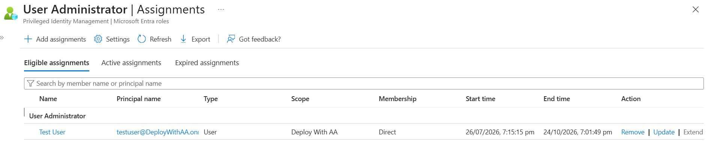
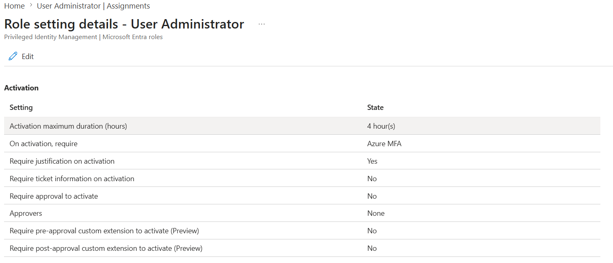
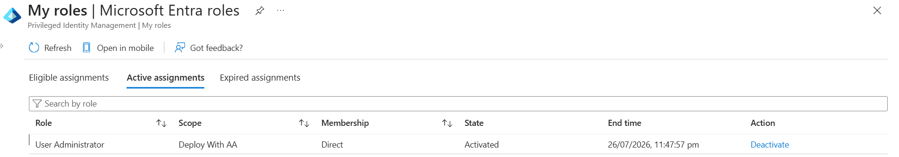
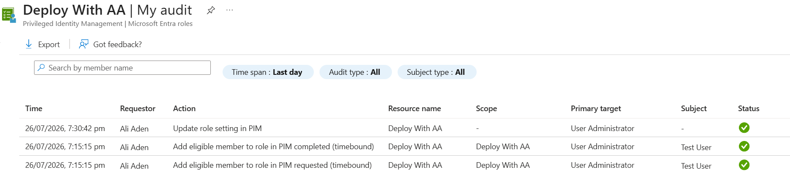
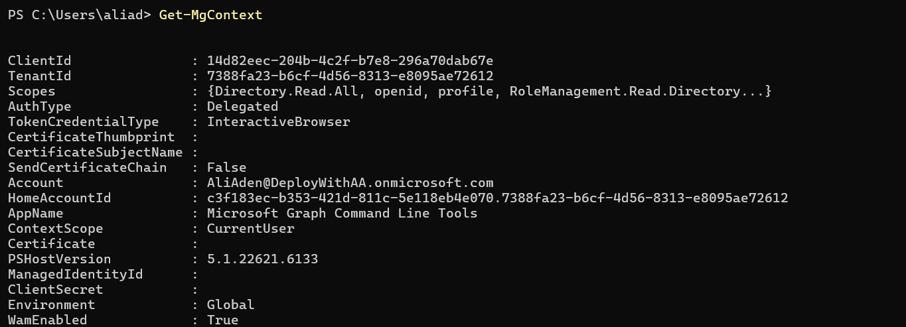
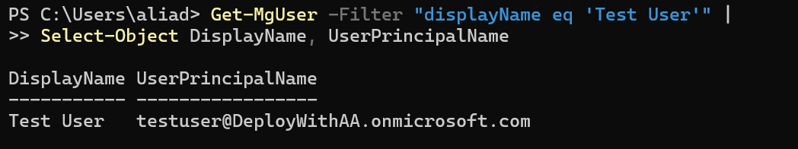
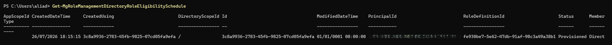

# Day 53 — Configure Microsoft Entra Privileged Identity Management (PIM)

### Azure 100 Days of Cloud Challenge — Ali Aden

## Overview

For Day 53, I configured Microsoft Entra Privileged Identity Management (PIM) to replace permanent administrator access with Just-in-Time (JIT) access.

Instead of giving a user permanent administrator permissions, I created an **Eligible** assignment for the **User Administrator** role. This means the user only receives administrator permissions when they request them and meet the activation requirements.

I configured the role to require Azure Multi-Factor Authentication (MFA), a business justification and a maximum activation time of four hours. I then signed in as the test user, activated the role and confirmed that it became active for the approved time period.

Finally, I reviewed the audit logs and used Microsoft Graph PowerShell to validate that everything had been configured correctly.

This project helped me understand how PIM improves security by reducing permanent privileged access while still allowing administrators to carry out their work when needed.

---

## Technologies Used

- Microsoft Azure
- Microsoft Entra ID
- Microsoft Entra ID P2
- Microsoft Entra Privileged Identity Management (PIM)
- Identity Governance
- Microsoft Graph PowerShell
- Windows PowerShell
- Azure Portal

---

## Architecture Diagram

```text
                           Microsoft Entra ID Tenant
                    (DeployWithAA.onmicrosoft.com)
                                     │
                                     │
                 ┌───────────────────▼───────────────────┐
                 │  Privileged Identity Management (PIM) │
                 │     Identity Governance Service       │
                 └───────────────────┬───────────────────┘
                                     │
                ┌────────────────────┼────────────────────┐
                │                    │                    │
                ▼                    ▼                    ▼
     Eligible Role Assignment   PIM Role Settings   PIM Audit & Activity Logs
     User Administrator Role    • Azure MFA         • Role Assignments
     Eligible (90 Days)         • Justification     • Role Activations
                                • Max 4 Hours       • Policy Changes
                │
                ▼
        Test User (Member)
                │
                ▼
     Just-In-Time Role Activation
                │
        MFA + Business Justification
                │
                ▼
     User Administrator (Active)
        Temporary Access
                │
        Automatic Expiry
                │
                ▼
      Eligible Assignment Restored

═══════════════════════════════════════════════════════════════════════

           Microsoft Graph PowerShell Validation

      Get-MgContext
            │
            ▼
   Validate Graph Connection

      Get-MgUser
            │
            ▼
   Validate Test User

Get-MgRoleManagementDirectoryRoleEligibilitySchedule
            │
            ▼
Validate Eligible Role Assignment
```

---

## Azure Configuration

| Component | Configuration |
|---|---|
| Identity Platform | Microsoft Entra ID |
| Licence | Microsoft Entra ID P2 Trial |
| Privileged Role | User Administrator |
| Assignment Type | Eligible |
| Assignment Duration | 90 Days |
| Maximum Activation | 4 Hours |
| Azure MFA | Required |
| Business Justification | Required |
| Approval Required | No |
| Validation Method | Microsoft Graph PowerShell |

---

# Implementation

## 1. Created an Eligible Role Assignment

I started by creating a test user in Microsoft Entra ID.

Instead of assigning the **User Administrator** role permanently, I assigned it as an **Eligible** role for 90 days. This means the user has to activate the role before they can use any administrator permissions.

---

## 2. Configured the PIM Role Settings

Next, I configured the activation settings for the **User Administrator** role.

I required:

- Azure Multi-Factor Authentication (MFA)
- A business justification
- A maximum activation period of four hours

These settings help make sure administrator access is only available when it is genuinely needed.

---

## 3. Activated the Role

After configuring PIM, I signed in as the test user and activated the eligible role.

During activation I:

- Completed Azure MFA
- Entered a business justification
- Requested the role activation

Once the request was approved, the **User Administrator** role became active for four hours before automatically expiring.

---

## 4. Reviewed the Audit Logs

Once the activation was complete, I reviewed the PIM audit logs.

The logs recorded the role assignment, policy configuration and activation activity, giving me a clear audit trail of the privileged access.

---

## 5. Validated the Configuration with Microsoft Graph PowerShell

To finish the project, I connected to Microsoft Graph PowerShell.

I used PowerShell to:

- Confirm the Graph connection
- Verify that the test user existed
- Validate the PIM eligible assignment

This gave me confidence that the configuration was working correctly from both the Azure Portal and PowerShell.

---

# Validation

## Eligible Role Assignment

The Azure Portal confirms that the **Test User** has been assigned the **User Administrator** role as an **Eligible** assignment.



The assignment was configured for 90 days instead of giving the user permanent administrator permissions.

---

## PIM Role Settings

I configured the activation policy for the **User Administrator** role.



The role requires Azure MFA, a business justification and limits activation to four hours.

---

## Activated Role

After signing in as the test user, I activated the eligible role through Privileged Identity Management.



The role became active for the configured activation period, confirming that Just-in-Time access was working correctly.

---

## Audit History

I reviewed the PIM audit logs after completing the configuration.



The audit history recorded the role assignment and policy changes, providing an audit trail for privileged access.

---

## Microsoft Graph Connection

I connected to Microsoft Graph PowerShell using my administrator account.



This confirmed that I was connected to the correct Microsoft Entra tenant.

---

## Test User Validation

Next, I verified that the test user existed using Microsoft Graph PowerShell.



The output confirmed that the test user had been created successfully.

---

## PIM Validation

Finally, I queried Microsoft Graph to validate the PIM eligible assignment.



The PowerShell output confirmed that the eligible role assignment had been created successfully.

---

# Key Notes

This project gave me hands-on experience with Microsoft Entra Privileged Identity Management and showed me how organisations can reduce the risks of permanent administrator accounts.

Instead of assigning administrator permissions permanently, I configured the **User Administrator** role as an **Eligible** assignment. The user had to complete Azure MFA, provide a business justification and activate the role before receiving administrator permissions.

I also validated the configuration using Microsoft Graph PowerShell, which reinforced the importance of verifying Azure resources through both the Azure Portal and automation tools.

This project also reinforced why PIM is an important part of Microsoft's Zero Trust security model, as it helps ensure privileged access is only available when it's needed, fully audited and automatically removed when no longer required.

---

# Skills Demonstrated

- Microsoft Entra ID administration
- Privileged Identity Management (PIM)
- Identity Governance
- Just-in-Time (JIT) administration
- Role-Based Access Control (RBAC)
- Zero Trust security principles
- Multi-Factor Authentication (MFA)
- Microsoft Graph PowerShell
- Azure Portal administration
- Identity security validation

---

# Project Outcome

By the end of this project I successfully:

- Configured Microsoft Entra Privileged Identity Management (PIM)
- Created an Eligible assignment for the User Administrator role
- Configured Just-in-Time (JIT) administrator access
- Required Azure MFA and business justification during role activation
- Activated the eligible role as the test user
- Reviewed the PIM audit history to verify privileged activities
- Connected to Microsoft Graph PowerShell
- Validated the Microsoft Entra tenant connection
- Verified the test user using Microsoft Graph
- Confirmed the PIM eligible assignment through PowerShell validation

This project gave me practical experience implementing Microsoft's Zero Trust approach to privileged access management. Instead of relying on permanent administrator accounts, I configured secure, temporary access that is fully audited and automatically expires when no longer needed.