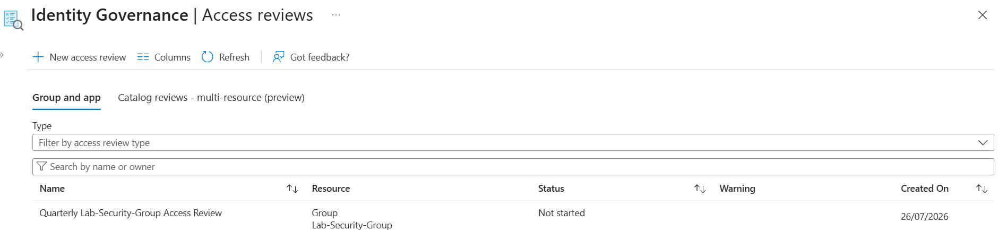
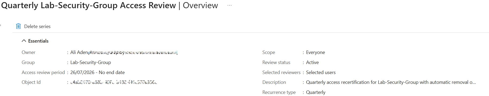
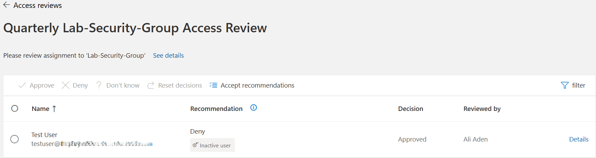
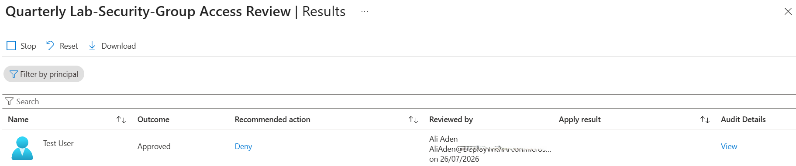
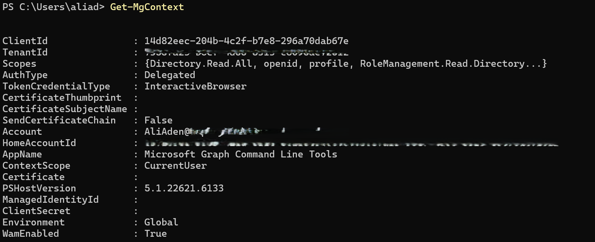
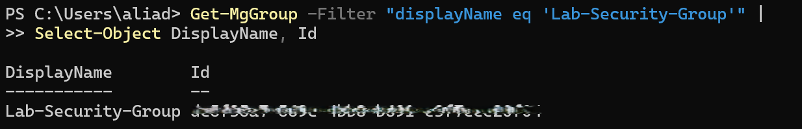
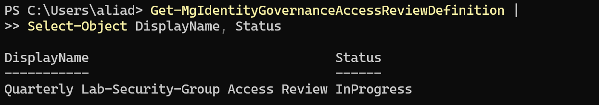

# Day 54 — Set Up and Run an Access Review in Microsoft Entra ID

### Azure 100 Days of Cloud Challenge — Ali Aden

## Overview

For Day 54, I implemented a recurring Access Review using Microsoft Entra Identity Governance to regularly review membership of a security group.

I created a quarterly Access Review for **Lab-Security-Group**, assigned myself as the reviewer and configured the review to run for 14 days every quarter. I also enabled automatic application of review results, required reviewers to provide a justification for their decisions and configured Microsoft Entra to remove access automatically if no review decision was submitted.

After creating the review, I completed it through the **My Access** reviewer portal by approving continued access for the test user. Finally, I validated the configuration using Microsoft Graph PowerShell to confirm that both the security group and the Access Review were successfully created.

This project demonstrates how Microsoft Entra Identity Governance helps organisations regularly recertify user access, reduce unnecessary permissions and maintain an auditable record of access decisions.

---

## Technologies Used

- Microsoft Azure
- Microsoft Entra ID
- Microsoft Entra Identity Governance
- Access Reviews
- Microsoft Graph PowerShell
- Windows PowerShell
- Azure Portal

---

## Architecture Diagram

```text
+--------------------------------------------------------------------------------------+
|            Day 54 - Set Up and Run an Access Review in Microsoft Entra ID            |
+--------------------------------------------------------------------------------------+

                           +--------------------------------+
                           |     Microsoft Entra ID         |
                           |      Identity Governance       |
                           +---------------+----------------+
                                           |
                                           |
                                           v
                    +-------------------------------------------+
                    |        Access Review Definition           |
                    | Quarterly Lab-Security-Group Review       |
                    | Recurs Quarterly (14-Day Review Period)   |
                    +----------------+--------------------------+
                                     |
                                     |
                                     v
+--------------------------------------------------------------------------------------+
|                              Access Review Configuration                             |
|                                                                                      |
|  Resource:              Lab-Security-Group                                           |
|  Reviewer:              Ali Aden (Selected User)                                     |
|  Review Frequency:      Quarterly                                                    |
|  Review Duration:       14 Days                                                      |
|  Auto Apply Results:    Enabled                                                      |
|  If No Response:        Remove Access                                                |
|  Justification:         Required                                                     |
|  Email Notifications:   Enabled                                                      |
|  Reminders:             Enabled                                                      |
+------------------------------------+-------------------------------------------------+
                                     |
                                     |
                                     v
                     +--------------------------------------+
                     |       Quarterly Access Review        |
                     |                                      |
                     | Resource: Lab-Security-Group         |
                     | User: Test User                      |
                     | Recommendation: Deny                 |
                     | (Inactive User)                      |
                     +----------------+---------------------+
                                      |
                                      |
                                      | Reviewer Decision
                                      v
                     +--------------------------------------+
                     |        Access Review Decision        |
                     |                                      |
                     | Decision: Approved                  |
                     | Reviewed By: Ali Aden               |
                     +----------------+---------------------+
                                      |
                                      |
                                      v
                     +--------------------------------------+
                     |  Review Results & Audit History      |
                     |                                      |
                     | Review Decision Recorded             |
                     | Audit History Available              |
                     | Review Status: In Progress           |
                     +----------------+---------------------+
                                      |
                                      |
                                      v
+--------------------------------------------------------------------------------------+
|                    Microsoft Graph PowerShell Validation                             |
|                                                                                      |
|  Get-MgContext                               Verify Graph Connection                 |
|            │                                                                         |
|            ▼                                                                         |
|  Get-MgGroup                             Verify Lab-Security-Group Exists            |
|            │                                                                         |
|            ▼                                                                         |
|  Get-MgIdentityGovernanceAccessReviewDefinition                                      |
|                                       Verify Access Review Definition                |
|                                       Status: InProgress                             |
+--------------------------------------------------------------------------------------+
```

---

## Azure Configuration

| Component | Configuration |
|---|---|
| Microsoft Entra Service | Identity Governance |
| Review Type | Teams + Groups |
| Group Reviewed | `Lab-Security-Group` |
| Reviewer | Selected User (Ali Aden) |
| Review Frequency | Quarterly |
| Review Duration | 14 Days |
| Auto Apply Results | Enabled |
| No Response Action | Remove Access |
| Justification Required | Enabled |
| Email Notifications | Enabled |
| Validation Method | Microsoft Graph PowerShell |

---

## Implementation

### 1. Created the Access Review

I created a new Access Review within Microsoft Entra Identity Governance and selected **Lab-Security-Group** as the resource to review.

The review was configured to evaluate every member of the security group rather than only guest users.

---

### 2. Configured the Review Settings

I configured the review to run every quarter with a review period of 14 days.

To automate the review process, I enabled **Auto apply results**, required reviewers to provide a justification and configured Microsoft Entra to remove access automatically if reviewers did not respond before the review period ended.

---

### 3. Completed the Access Review

After the review became active, I opened the **My Access** reviewer portal and completed the assigned review.

Microsoft Entra recommended denying access because the test account had not recently signed in. After reviewing the recommendation, I approved continued membership as the account was still required for the lab environment.

This demonstrates that reviewer decisions are based on business requirements rather than relying solely on automated recommendations.

---

### 4. Reviewed the Results

After submitting my decision, I verified that the review results were successfully recorded.

The results showed the review decision, reviewer information and Microsoft's recommendation, providing an auditable record of the completed review.

---

### 5. Validated Using Microsoft Graph PowerShell

Finally, I connected to Microsoft Graph PowerShell and validated the deployment.

I confirmed:

- The Microsoft Graph connection was successful.
- The **Lab-Security-Group** existed.
- The Access Review definition existed.
- The review status was **InProgress**, confirming the review was active during its 14-day review period.

---

## Validation

### Access Review Created



The Access Review was successfully created for **Lab-Security-Group**.

---

### Access Review Overview



The review configuration shows a quarterly recurrence, selected reviewer and active review status.

---

### Access Review Approved



The reviewer approved continued access after evaluating Microsoft's recommendation.

---

### Access Review Results



The completed review decision was successfully recorded in Microsoft Entra Identity Governance.

---

### Microsoft Graph Connection



PowerShell confirmed a successful Microsoft Graph connection to the Microsoft Entra tenant.

---

### Verify Lab-Security-Group



Microsoft Graph confirmed that **Lab-Security-Group** exists.

---

### Verify Access Review Definition



Microsoft Graph confirmed that the Access Review exists and is currently **InProgress**.

---

## Key Notes

- Access Reviews help organisations regularly validate whether users should continue to have access to groups, applications or privileged roles.
- Microsoft Entra can automatically remove access when review decisions are denied or when reviewers fail to respond.
- Recommendations generated by Microsoft Entra assist reviewers but do not replace human decision-making.
- Every review creates an audit history that supports compliance and security investigations.
- Microsoft Graph PowerShell provides an additional method of validating Identity Governance configurations outside of the Azure Portal.

---

## Skills Demonstrated

- Microsoft Entra Identity Governance
- Access Reviews
- Identity and Access Management (IAM)
- Role-Based Access Control (RBAC)
- Least Privilege
- Access Recertification
- Microsoft Graph PowerShell
- Azure Administration
- Security Governance
- PowerShell Validation
- Technical Documentation

---

## Project Outcome

In this project, I implemented a recurring Access Review using Microsoft Entra Identity Governance to review security group membership on a quarterly basis.

I configured reviewer assignments, automatic application of review results and automated removal of access when reviewers do not respond. I then completed the review through the My Access portal and validated the deployment using Microsoft Graph PowerShell.

This project demonstrates how Microsoft Entra Identity Governance helps organisations maintain least privilege, regularly review user access and provide an auditable record of access decisions.