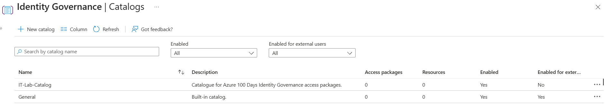
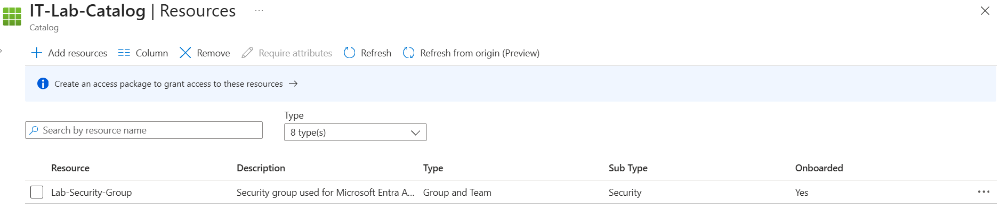
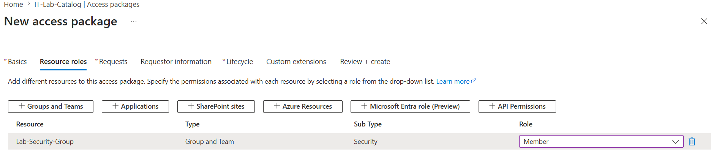
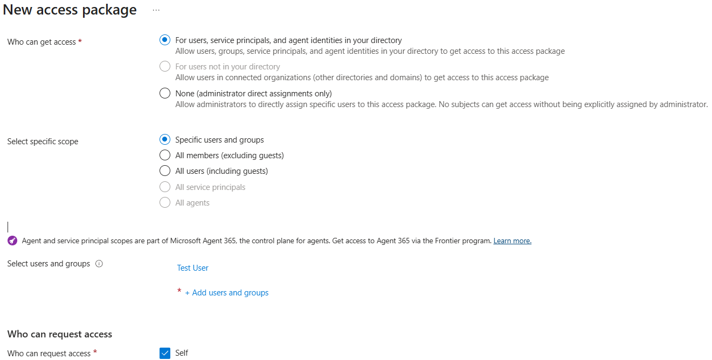
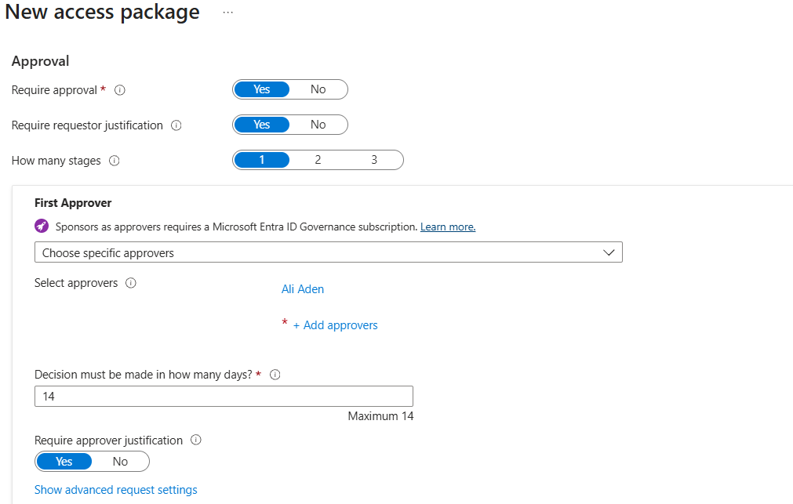
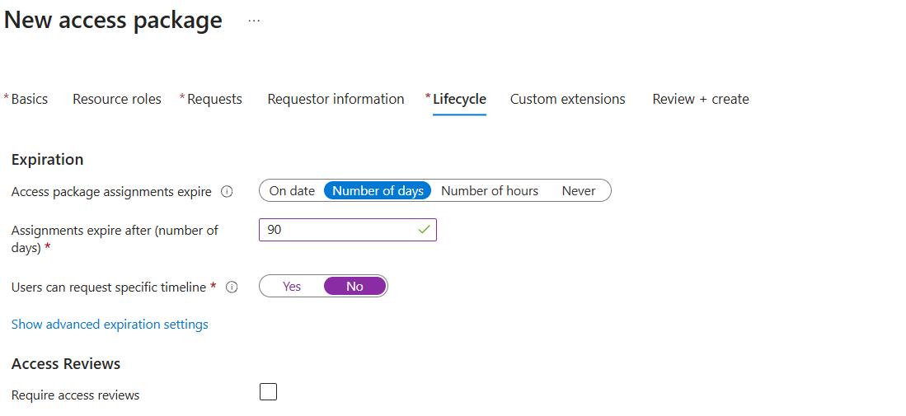
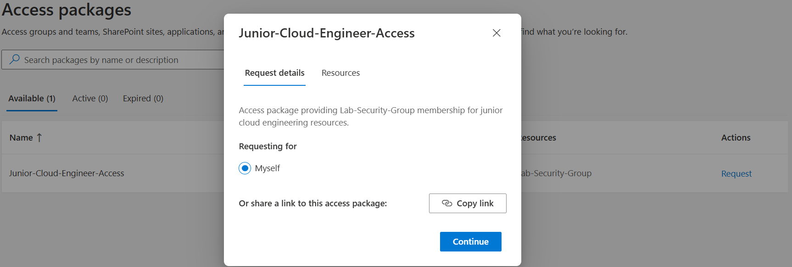
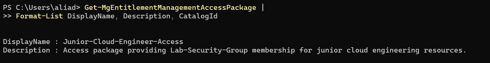

# Day 55 — Configure Entitlement Management and Access Packages

### Azure 100 Days of Cloud Challenge — Ali Aden

---

## Overview

For Day 55, I configured Microsoft Entra Identity Governance to provide controlled, self-service access to Azure resources using Entitlement Management.

I created a catalogue to organise resources, added an existing security group, and built an Access Package that allows authorised users to request access through the My Access portal. The package was configured with an approval workflow, required requestor justification and a 90-day access assignment to ensure access is granted for a limited period.

To validate the deployment, I submitted an access request using a test user account, approved the request as the designated approver and verified the Access Package using Microsoft Graph PowerShell.

This project demonstrates how Microsoft Entra Identity Governance can automate access requests while maintaining approval workflows and time-limited access assignments.

---

## Technologies Used

- Microsoft Azure
- Microsoft Entra ID
- Microsoft Entra Identity Governance
- Entitlement Management
- Access Packages
- Microsoft Graph PowerShell
- Windows PowerShell
- Azure Portal
- My Access Portal

---

## Architecture Diagram

### ASCII Architecture

```text
+-----------------------------------------------------------------------------------+
|                   Microsoft Entra ID - Identity Governance                        |
+-----------------------------------------------------------------------------------+
                                      |
                                      v
                         +---------------------------+
                         |      IT-Lab-Catalog       |
                         +---------------------------+
                                      |
                                      v
                         +---------------------------+
                         | Junior-Cloud-Engineer-    |
                         |      Access Package       |
                         +---------------------------+
                                      |
                    +-----------------+-----------------+
                    |                                   |
                    v                                   v
        +--------------------------+        +--------------------------+
        | Request Policy           |        | Resource Role            |
        | Self-Service Request     |        | Lab-Security-Group       |
        | Approval Required        |        | Member                   |
        | Justification Required   |        +--------------------------+
        +--------------------------+
                    |
                    v
        +--------------------------+
        | Test User                |
        | Requests Access via      |
        | My Access Portal         |
        +--------------------------+
                    |
                    v
        +--------------------------+
        | Ali Aden                 |
        | Reviews & Approves       |
        | Access Request           |
        +--------------------------+
                    |
                    v
        +--------------------------+
        | Test User Added as       |
        | Member of                |
        | Lab-Security-Group       |
        | (90-Day Assignment)      |
        +--------------------------+
                    |
                    v
        +--------------------------+
        | Microsoft Graph          |
        | PowerShell Validation    |
        +--------------------------+
```

---

## Azure Configuration

| Component | Configuration |
|------------|---------------|
| Identity Governance Service | Entitlement Management |
| Catalogue | IT-Lab-Catalog |
| Access Package | Junior-Cloud-Engineer-Access |
| Resource | Lab-Security-Group |
| Resource Role | Member |
| Request Policy | Self-Service |
| Request Scope | Test User |
| Approval Required | Yes |
| Requestor Justification | Required |
| Approver | Ali Aden |
| Assignment Duration | 90 Days |
| Validation | Microsoft Graph PowerShell |

---

## Implementation

### 1. Created the Entitlement Management Catalogue

I created a new catalogue named **IT-Lab-Catalog** within Microsoft Entra Identity Governance to organise resources that can be included in Access Packages.

---

### 2. Added Resources to the Catalogue

I added **Lab-Security-Group** as a catalogue resource, making it available for inclusion in Access Packages.

---

### 3. Created the Access Package

I created an Access Package named **Junior-Cloud-Engineer-Access** and assigned the **Member** role for the Lab-Security-Group.

This allows approved users to become members of the security group through a single access request.

---

### 4. Configured the Request and Approval Policies

I configured the Access Package to allow self-service requests from the designated test user.

To control access, I required approval, requestor justification and approver justification before access could be granted. I assigned myself as the approver and configured a 14-day approval window.

---

### 5. Configured the Assignment Lifecycle

I configured access assignments to expire automatically after **90 days**.

This ensures access is temporary and reduces the risk of users retaining permissions longer than necessary.

---

### 6. Tested the Access Package

Using the Test User account, I signed in to the My Access portal and confirmed that the Access Package was available.

I submitted an access request and approved it as the designated approver, completing the end-to-end Entitlement Management workflow.

---

### 7. Validated Using Microsoft Graph PowerShell

Finally, I used Microsoft Graph PowerShell to confirm that the Access Package had been successfully created and was available within Microsoft Entra Identity Governance.

---

## Validation

### IT-Lab-Catalog Created



The Entitlement Management catalogue was successfully created and enabled.

---

### Catalogue Resource Added



Lab-Security-Group was successfully added to the catalogue as an available resource.

---

### Access Package Resource Role



The Access Package grants the **Member** role for Lab-Security-Group.

---

### Request Policy



The Access Package was configured for self-service requests by the designated test user.

---

### Approval Policy



Approval, requestor justification and approver justification were configured to control access requests.

---

### Assignment Lifecycle



Assignments were configured to expire automatically after 90 days.

---

### My Access Portal



The Test User successfully located the Access Package in the My Access portal and was able to request access.

---

### Microsoft Graph PowerShell Validation



Microsoft Graph PowerShell confirmed that the Access Package exists within Microsoft Entra Identity Governance.

---

## Key Notes

- Entitlement Management simplifies access provisioning by allowing users to request predefined bundles of access instead of individual resources.
- Access Packages can contain groups, applications and SharePoint resources within a single request.
- Approval workflows help ensure access is granted only after review by authorised approvers.
- Time-limited assignments automatically remove access after the configured duration, supporting the principle of least privilege.
- Microsoft Graph PowerShell provides an additional method of validating Entitlement Management resources outside of the Azure portal.

---

## Skills Demonstrated

- Microsoft Entra Identity Governance
- Entitlement Management
- Access Packages
- Identity and Access Management (IAM)
- Self-Service Access Requests
- Approval Workflows
- Least Privilege
- Role-Based Access Control (RBAC)
- Microsoft Graph PowerShell
- Azure Administration
- Security Governance
- Technical Documentation

---

## Project Outcome

In this project, I implemented a complete Entitlement Management solution using Microsoft Entra Identity Governance.

I created a catalogue, configured an Access Package, defined request and approval policies, applied a 90-day assignment lifecycle and successfully completed the end-to-end access request workflow using the My Access portal.

The deployment was validated using Microsoft Graph PowerShell, demonstrating how Microsoft Entra Identity Governance provides controlled, auditable and time-limited access to organisational resources.